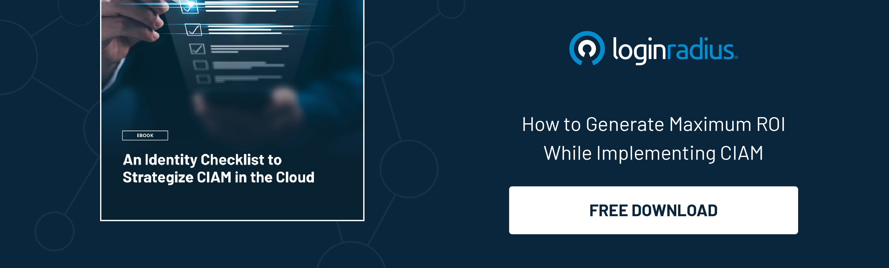

## Introduction

Organizations increasingly focus on customer identity and access management (CIAM) strategies to safeguard user data and enhance user experiences in the modern digital landscape. 

However, before embarking on the journey of crafting an effective CIAM strategy, there are several crucial actions that your security team must undertake. 

This blog will explore seven essential steps that lay the foundation for a successful CIAM strategy, ensuring robust security and [seamless user experiences](https://www.loginradius.com/blog/growth/power-of-login-box-for-seamless-user-experience/).

## Why a Robust CIAM Strategy is Crucial For Your Security Team?

In the current landscape, the right Customer Identity and Access Management (CIAM) strategy is paramount, particularly from a security perspective. 

Cybersecurity threats constantly evolve, with hackers targeting user identities and sensitive data. A robust CIAM strategy is a defense mechanism, safeguarding against unauthorized access and data breaches. 

Organizations can fortify their security posture by implementing comprehensive security measures such as [multi-factor authentication](https://www.loginradius.com/multi-factor-authentication/), regular risk assessments, and compliance with data protection regulations. 

A well-designed CIAM strategy protects user data and privacy and instills confidence in customers, fostering trust and long-term relationships. Neglecting the importance of a CIAM strategy is necessary to ensure organizations are protected from security breaches, financial losses, and reputational damage. 

Therefore, investing in a comprehensive CIAM strategy is essential to proactively address security challenges and ensure the integrity of user identities and data in today's ever-evolving threat landscape.

Now, look at some essential actions every security head must emphasize before crafting a robust CIAM strategy. 

## Creating A CIAM Strategy? 7 Tips For Your Security Team

### 1. Assess current security infrastructure

The first step is to conduct a comprehensive evaluation of your organization's existing security infrastructure. Identify strengths, weaknesses, and potential vulnerabilities in your current systems. This assessment will provide valuable insights into areas that require improvement and guide the development of a resilient CIAM strategy.

### 2. Define clear goals and objectives

Defining your organization's goals and objectives is fundamental to developing an effective CIAM strategy. Determine the specific outcomes you wish to achieve, such as enhancing user authentication, securing personal data, or streamlining access management processes. These defined goals will serve as guiding principles throughout the strategy development process.

### 3. Understand user profiles and behavior

To design a CIAM strategy that meets user expectations, it is essential to have a deep understanding of your user base. Analyze user profiles, behaviors, preferences, and demographics to understand their needs and expectations. 

This knowledge will enable you to tailor your CIAM strategy to deliver personalized experiences while ensuring data privacy and security.

### 4. Conduct a risk assessment

[Identifying potential risks](https://www.loginradius.com/blog/identity/risk-management-with-holistic-apis/) and threats is critical to crafting a robust CIAM strategy. Perform a thorough risk assessment to understand the vulnerabilities that could compromise your users' data or system integrity. This assessment will help you prioritize security measures and allocate resources to mitigate risks.

### 5. Implement multi-factor authentication (MFA)

Strengthening user authentication is crucial in a CIAM strategy. Implementing multifactor authentication adds an extra layer of security by requiring users to provide multiple verification forms. This could include combinations of passwords, biometrics, tokens, or one-time passwords. MFA significantly reduces the risk of unauthorized access and enhances overall security.

### 6. Ensure compliance with regulations

Compliance with data protection regulations is non-negotiable in today's digital landscape. Before crafting your CIAM strategy, thoroughly familiarize yourself with relevant laws such as the [General Data Protection Regulation](https://www.loginradius.com/gdpr-and-privacy/) (GDPR) or the California Consumer Privacy Act (CCPA). 

Ensure your strategy aligns with these regulations, giving users greater control over their data and establishing trust.

### 7. Establish ongoing monitoring and evaluation

Creating a CIAM strategy is not a one-time task but an ongoing process. Establish continuous monitoring and evaluation mechanisms to detect and respond to emerging threats or changing user needs. Regularly review and update your CIAM strategy to ensure its effectiveness and alignment with evolving security requirements.

## Easing the Burden: How LoginRadius CIAM Alleviates the Stress of Developing a CIAM Strategy?

Developing a robust [customer identity and access management](https://www.loginradius.com/blog/identity/customer-identity-and-access-management/) strategy can be daunting for organizations. However, LoginRadius CIAM comes to the rescue by alleviating the stress and challenges associated with CIAM strategy development. 

With its comprehensive suite of tools and solutions, LoginRadius CIAM simplifies the implementation process, providing organizations with the necessary resources and support to craft an effective CIAM strategy. 

LoginRadius CIAM eliminates the need for complex and time-consuming integration efforts by seamlessly integrating with existing systems and applications. The platform offers advanced features that streamline user authentication, identity management, and data protection, ensuring a secure and seamless user experience. 

With LoginRadius CIAM, organizations can confidently navigate the complexities of CIAM strategy development, knowing they have a trusted partner to ease the burden and help them achieve CIAM excellence.

## To Conclude 

Creatig a CIAM strategy requires careful planning and execution. Following these seven essential actions, your security team can lay a strong foundation for a robust CIAM strategy that prioritizes data security, user experience, and regulatory compliance. 

