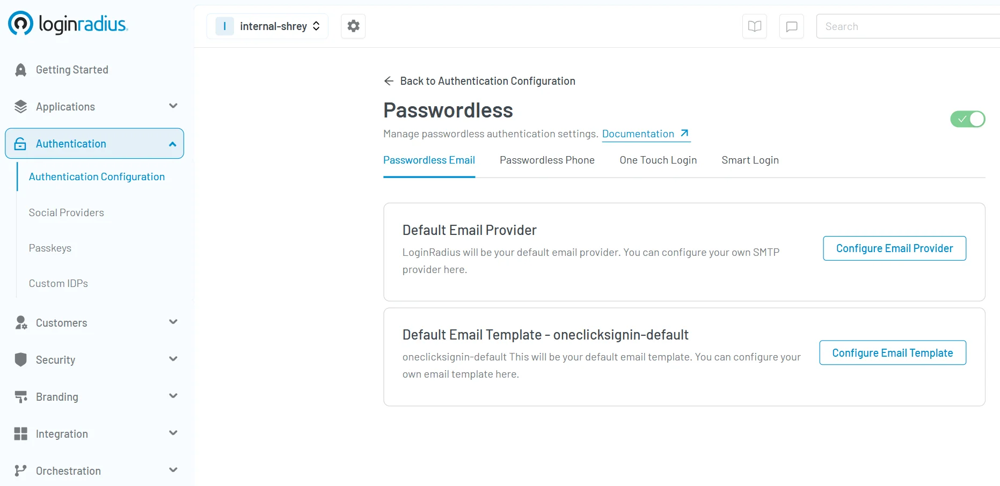
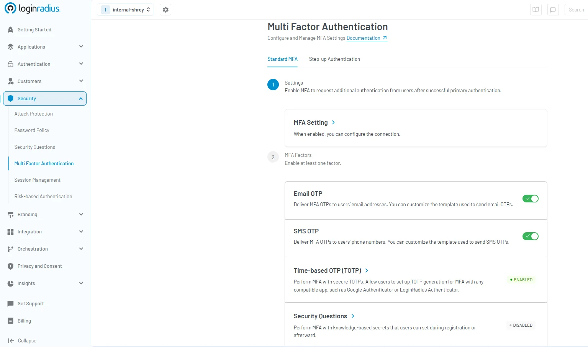
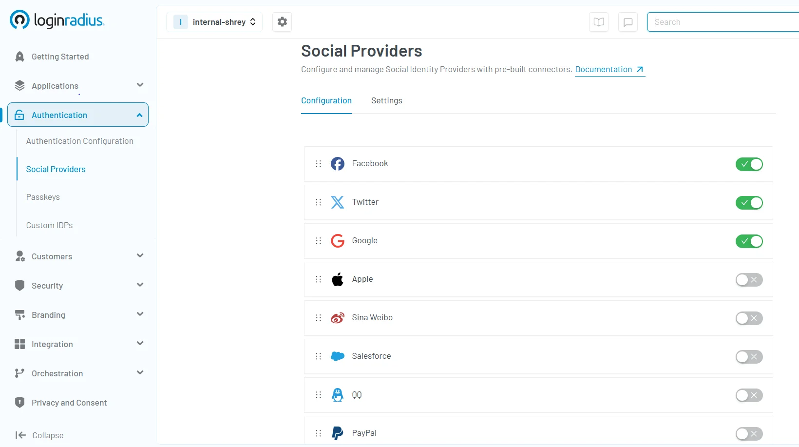
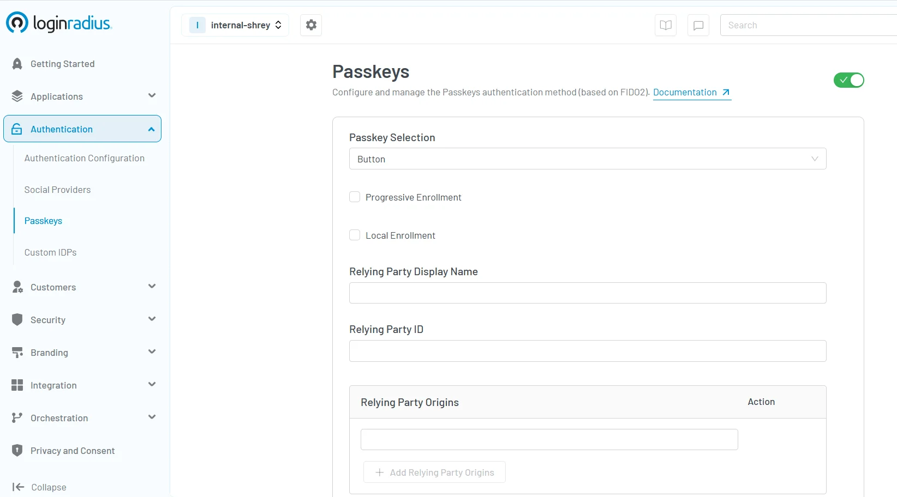
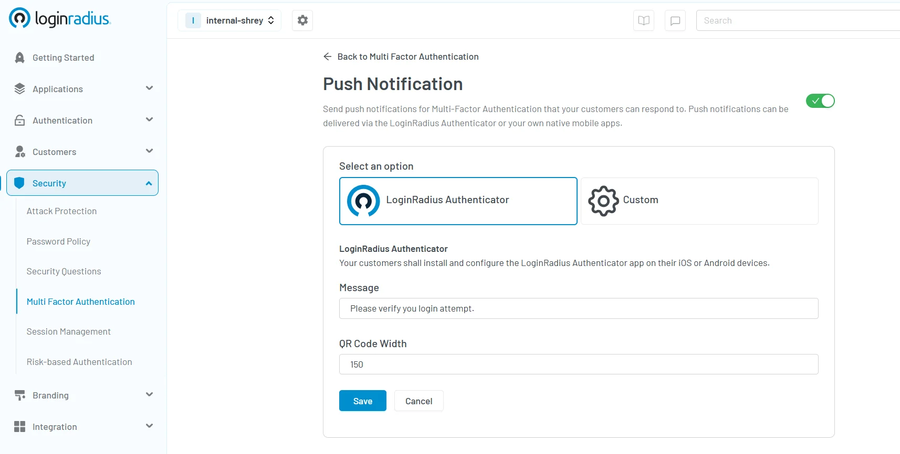
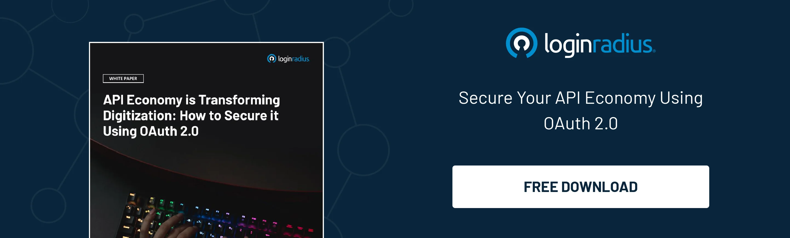

---
title: "Top 9 User Authentication Methods to Stay Secure in 2025 "
date: "2025-04-11"
coverImage: "top-authentication-methods.webp"
tags: ["Authentication","Data Privacy","Passwordless","MFA"]
author: "Kundan Singh"
description: "Discover the top authentication methods shaping digital security in 2025. From passwordless login and adaptive MFA to biometrics and secure passkeys, learn how to protect your digital identities effectively. Strengthen security and enhance user experience with future-ready authentication strategies."
metatitle: "9 User Authentication Methods to Stay Secure in 2025"
metadescription: "Discover 9 secure authentication methods for 2025. Learn how to protect access using advanced authentication techniques and protocols."
---

## Introduction 

In today’s hyper-connected world, cyber threats don’t just knock—they break in. From social engineering and deepfakes to threat groups like Scattered Spider, the risks targeting user identities are more advanced than ever. These evolving challenges—explored in our recent breakdown of[ CISO’s top cybersecurity concerns for 2025](https://www.loginradius.com/blog/identity/cisos-top-cybersecurity-threats-from-scattered-spider-to-deepfakes/)—highlight just how critical robust authentication has become.

With remote work, cloud ecosystems, and hybrid infrastructures dominating the digital landscape, the need for strong, adaptive authentication methods has become critical—not optional.

As we’ve stepped into 2025, safeguarding access isn’t just about protection—it’s about building trust, ensuring compliance, and staying resilient in the face of next-gen attacks.

In this blog, we’ll break down what user authentication really means, why it’s essential, the top user authentication methods you need to know, and how to quickly implement them in your apps with LoginRadius.

## What Is User Authentication?

[Authentication](https://www.loginradius.com/blog/identity/what-is-authentication/) or user authentication is the process of verifying the identity of a user attempting to access a system. It ensures that only authorized individuals gain access to sensitive data and resources.

Traditionally, this was done using passwords. However, in 2025, user authentication techniques have become much more sophisticated, using a combination of factors such as biometrics, tokens, and behavioral data.

Modern methods for authentication go beyond the basics (passwords), using a layered approach to defend against evolving threats and ensuring minimal disruption to the user experience.

## Why Is User Authentication Important?

As cyberattacks grow more advanced, the need for secure authentication methods has never been greater. Breaches caused by weak or stolen credentials are among the most common.

Strong authentication methods protect organizations from unauthorized access, data breaches, and reputational harm. They also support compliance with regulations like GDPR and HIPAA.

Furthermore, implementing advanced authentication methods increases customer confidence, promotes brand trust, and supports seamless digital experiences.

## 9 User Authentication Methods to Stay Secure in 2025 and Beyond

Here are nine proven user authentication methods that every business should consider in 2025:

### 1. Passwordless Authentication

This method eliminates the need for traditional passwords by using other identifiers such as biometrics, one-touch login, or one-time passcodes (phone/email) sent to trusted devices.

Passwordless systems are a part of advanced authentication methods, improving security while reducing friction for users. 

Here’s how you can [configure passwordless authentication](https://console.loginradius.com/authentication/authentication-configuration) in the LoginRadius Dashboard with ease:

### 2. Multi-Factor Authentication (MFA)

[Multi-Factor Authentication (MFA) ](https://www.loginradius.com/blog/identity/what-is-multi-factor-authentication/)is a security process that requires users to verify their identity using two or more independent factors—like a password, a device, or a biometric. It significantly reduces the risk of unauthorized access by adding extra layers of protection beyond just a password.

MFA requires users to provide two or more verification factors:

* Something you know (password or PIN) 

* Something you have (smartphone or token) 

* Something you are (biometric data) 

This layered approach combines different types of authentication to reduce the risk of credential compromise. Moreover, businesses these days rely on a more advanced form of MFA i.e. adaptive authentication. Adaptive authentication automatically adjusts the level of security by adding additional authentication factor if anything suspicious related to login is detected (we’ll learn in detail below).  Here’s how you can[ configure MFA ](https://console.loginradius.com/security/multi-factor-authentication)in the LoginRadius Dashboard with ease:

### 3. Biometric Authentication

Using unique biological traits like fingerprints, facial recognition, or retina scans, biometrics are a reliable form of identity verification.

Biometric-based authentication mechanisms are harder to replicate and ideal for mobile apps and enterprise environments alike.

To quickly configure biometric authentication, you can read our insightful [developer docs](https://www.loginradius.com/docs/deployment/sdk/mobile-sdk-libraries/android-library/) here.

### 4. Token-Based Authentication

Tokens, either hardware or software-based, provide time-sensitive codes for login. They are used widely in financial services and internal enterprise tools.

These tokens strengthen methods for authentication by introducing an external factor that attackers cannot easily access.

Here’s how to [configure token-based authentication](https://www.loginradius.com/docs/user-management/data-management/about-loginradius-tokens/) for your applications. 

### 5. Social Login

[Social login](https://www.loginradius.com/blog/identity/what-is-social-login/) allows users to sign in using credentials from platforms like Google, Apple, LinkedIn, or other social channels. It simplifies access and reduces password fatigue.

This method leverages existing network authentication systems from trusted providers, creating a secure and fast user experience. For instance, a user can sign in or sign up for a platform just by using their existing Facebook or Google account. 

Here’s how you can [configure Social Login ](https://console.loginradius.com/authentication/social-providers)in the LoginRadius Dashboard with ease:

### 6. Risk-Based / Adaptive Authentication

[Adaptive authentication ](https://www.loginradius.com/blog/identity/risk-based-authentication)evaluates login context—such as location, device, and user behavior—to dynamically apply stricter verification when needed.

This smart approach is gaining traction as one of the most effective secure authentication methods for enterprises.

If you wish to add risk-based authentication to your application, here’s our [developer docs ](https://www.loginradius.com/docs/security/user-security/risk-based-auth/)offering complete implementation guide. 

### 7. Certificate-Based Authentication

Digital certificates are used to verify identity, particularly for device and network authentication. This method is widely adopted in enterprise VPNs and machine-to-machine communications.

It supports various authentication methods in zero trust environments, providing encrypted and scalable protection.

Here’s a [quick guide ](https://www.loginradius.com/docs/support-resources/saml-miscellaneous/certificate/)for implementing certificate-based authentication for your applications. 

### 8. Passkeys

[Passkeys ](https://www.loginradius.com/blog/identity/what-is-passkey-authentication/)are cryptographic keys that replace traditional passwords. Stored securely on a device, passkeys use biometric or device-based verification to authenticate users across devices and platforms.

As a form of advanced authentication methods, passkeys eliminate phishing risks and simplify login experiences, making them a future-proof option for modern applications.

Here’s how you can [configure passkey ](https://console.loginradius.com/authentication/passkeys)authentication in the LoginRadius dashboard with ease:

### 9. Push-Notification MFA

[Push-notification MFA](https://www.loginradius.com/blog/identity/push-notification-authentication/) sends a prompt to a registered device asking the user to approve or deny the login attempt. It provides a quicker and more secure alternative to SMS-based one-time passcodes.

This method strengthens secure authentication methods by reducing the reliance on manually entered codes and enhancing protection against phishing and social engineering attacks.

Here’s how you can [configure Push-Notification MFA](https://console.loginradius.com/security/multi-factor-authentication) in the LoginRadius Dashboard with ease:

## Authentication Method Protocols

Behind these authentication mechanisms are standard protocols that ensure consistency, security, and interoperability. These protocols act as the backbone of any modern authentication system, helping different systems communicate securely and efficiently while protecting user identity data.

Here are some of the most widely used protocols in 2025:

* **OpenID Connect (OIDC)**:[ OpenID Connect](https://www.loginradius.com/blog/identity/what-is-openid-connect/) is built on top of OAuth 2.0, OIDC adds identity verification, enabling applications to confirm who the user is. It provides an identity layer for SSO and federated login systems, making it one of the most popular user authentication methods in web and mobile apps. 

* **SAML (Security Assertion Markup Language)**: [SAML](https://www.loginradius.com/blog/identity/saml-sso/) is an XML-based markup language for creating, requesting, and exchanging security assertions between applications. In addition, SAML enables the cross-domain single sign-on (web-based), which helps reduce the administrative overhead of distributing multiple authentication tokens to the user.

* **FIDO2/WebAuthn**: FIDO2/WebAuthn is a modern protocol supporting passwordless and biometric authentication.

* **OAuth 2.0**: [Oauth 2.0 i](https://www.loginradius.com/blog/engineering/what-is-oauth2-0/)s a widely adopted authorization framework that allows applications to access user resources without exposing credentials. It is foundational for token-based methods for authentication and supports delegated access.

Understanding these protocols helps ensure that your user authentication techniques are both secure and scalable.

## Conclusion

In 2025, relying solely on passwords is no longer a viable strategy. Businesses must adopt different types of authentication that align with the evolving threat landscape and user expectations. Whether you're deploying various authentication methods for consumers or employees, the goal is the same: protect access without compromising usability.

By combining multiple authentication methods, leveraging contextual data, and using industry-backed protocols, organizations can offer both convenience and robust protection.

Need expert help implementing modern authentication mechanisms? [Contact LoginRadius](https://www.loginradius.com/contact-us) to secure your platform with the right mix of security and user experience.

## FAQs

### 1. What is the most commonly used form of authentication?

**A.** Password-based login remains the most widely used form, although it is being rapidly replaced by advanced authentication methods like MFA and biometrics for improved security.

### 2. What is the difference between authentication and authorization?

**A.** Authentication verifies identity, while authorization determines what a user can do after logging in. In short: authentication asks "Who are you?", authorization asks "What can you access?"

### 3. How are users authenticated to the network?

**A.** Users are authenticated to the network through network authentication protocols such as RADIUS, LDAP, and certificate-based systems. These systems ensure secure access control.

### 4. How do servers authenticate?

**A.** Servers authenticate by verifying credentials through established authentication mechanisms like digital certificates or token-based systems. This process ensures secure communication and user validation.

### 5. What process authenticates clients to a network?

**A.** The process that authenticates clients to a network typically involves validating credentials using protocols like RADIUS or EAP. This ensures that only authorized users can connect securely.

