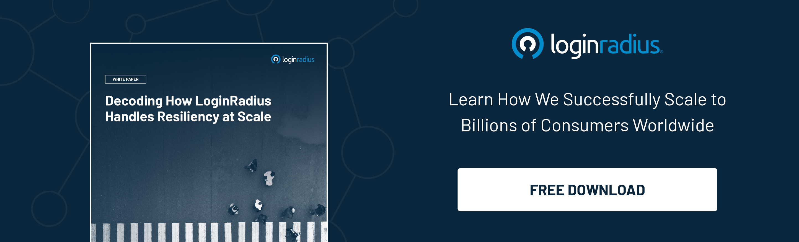

---
title: "Planning a Digital Makeover For Your Business? LoginRadius CIAM Can Help!"
date: "2022-05-27"
coverImage: "business-ciam.jpg"
tags: ["ciam", "user experience", "sso", "compliance"]
author: "Rakesh Soni"
description: "Incorporating a CIAM solution could be the best way to overcome security and challenges related to customer experience. Learn how LoginRadius can help businesses navigate their digital transformation journey and scale growth."
metatitle: "Why is LoginRadius the Best Choice for Your CIAM Needs?"
metadescription: "With LoginRadius CIAM, enterprises can ensure a perfect symphony of security, user experience, and compliance. Read this blog to know more."
---

## Introduction

When we talk about the digital transformation of a business, enterprises focus more on incorporating the latest technologies in terms of hardware and software updates but don’t emphasize the security of their systems, which isn’t a good decision overall. 

Since businesses focus on delivering a rich consumer experience to their customers and employees, security is often overlooked, and enterprises incorporate security at a fundamental level. 

Many would argue that [balancing security with user experience](https://www.loginradius.com/blog/identity/balancing-security-cx/) is quite challenging and would choose user experience every time. 

So, what’s the secret ingredient of creating a perfect symphony of user experience without compromising security?

Incorporating a [CIAM solution](https://www.loginradius.com/blog/identity/customer-identity-and-access-management/#:~:text=CIAM%20enables%20businesses%20to%20enable,3.)  (customer identity and access management) could be the best way! 

But when it comes to choosing a reliable and cutting-edge CIAM solution, businesses may find it very challenging to finalize the one that stands ahead of the competition. 

Here’s where they need a new-age cloud-based CIAM solution like LoginRadius that helps navigate the digital transformation journey. 

Let’s dig deeper into this and understand how LoginRadius CIAM helps businesses stay ahead of their competition. 

## Rich User Experience Backed with Robust Security - The Key to Success in 2022 and Beyond

To keep pace with the ever-growing digital world, enterprises need to create a perfect harmony of a great user experience and robust security.

This can be achieved by leveraging a consumer identity and access management (CIAM) solution like [LoginRadius](https://www.loginradius.com/).

The cutting-edge technology coupled with a great user experience from the beginning when your consumers first interact with your brand helps build consumer trust that guarantees conversion.

Moreover, the best-in-class security that comes with the LoginRadius Identity Platform lets you assure your consumers of how vigilant you are about data privacy and security.

## Deliver Rich and Secure Consumer Interaction with LoginRadius CIAM 

LoginRadius CIAM paves the path for delivering a rich experience to your consumers in terms of security and personalization. Let’s learn how:

* **Design the ideal consumer journey.**

From the first step of onboarding to the thousandth login, create a welcoming and intelligent process to foster great consumer relationships.

* **Deliver a high-performance experience.**

Never turn a consumer away because your login service is down. LoginRadius has unmatched uptime, and we can handle 150K logins per second—that’s 20x more than our competitors.

* **Unify the login process with single sign-on.**

Easily connect your websites, mobile apps, and third-party services so that consumers can interact with you everywhere using a single identity.

* **Protect consumer accounts.**

Make passwords harder to crack with rigorous password policies and [LoginRadius’ Multi-Factor Authentication](https://www.loginradius.com/multi-factor-authentication/). Use hashing and encryption to protect account credentials and data in transit and rest.

* **Safeguard sensitive data.**

Our modern cloud infrastructure is protected to the highest industry standards. LoginRadius maintains all major security compliances for our application and data storage.

## Why is LoginRadius CIAM Ahead of its Competitors? 

In a technologically-driven interconnected world where every second counts, LoginRadius CIAM guarantees unparalleled uptime of 99.99% every month. The cloud-based identity provider manages 180K logins per second, 20 times more than its major competitors offering similar services. 

Apart from delivering the industry's best consumer experience, the following are a few ways the platform excels compared to its global competitors.

* **Auto Scalable infrastructure:** The platform offers an auto-scalable infrastructure to handle surges during daily and seasonal peak loads. It automatically accommodates data storage, account creation, consumer authentication, new applications, etc.
* **Scalability:** LoginRadius ensures that it accommodates your consumer base. It can autoscale and handle hundreds of applications. There are no limitations to the number of users. Also, the LoginRadius Cloud Directory scales automatically to handle incremental data.
* **Global Compliance:** The LoginRadius platform also complies with major global compliances like the GDPR, CCPA, etc. You can keep track of your consumers, manage preferences, and customize the kind of consent consumers want. 
* **Security Certifications:** LoginRadius is compliant with international regulatory bodies like AICPA SOC 2, ISAE 3000, Cloud Security Alliance, Privacy Shield, etc.

Seems the right fit for your organization? You can register for a free personalized demo below. 

## In Conclusion 

The CIAM landscape has offered endless opportunities to businesses striving for growth by leveraging the perfect symphony of user experience and security. 

When choosing the industry leader in the CIAM landscape, LoginRadius CIAM delivers out-of-the-box solutions to diverse consumers that help them craft rich, secure, and personalized experiences. 

Whether it’s the overall performance or the peak load capacity, LoginRadius is helping global enterprises, including Fortune 500 companies, revamp their consumer journeys. 

