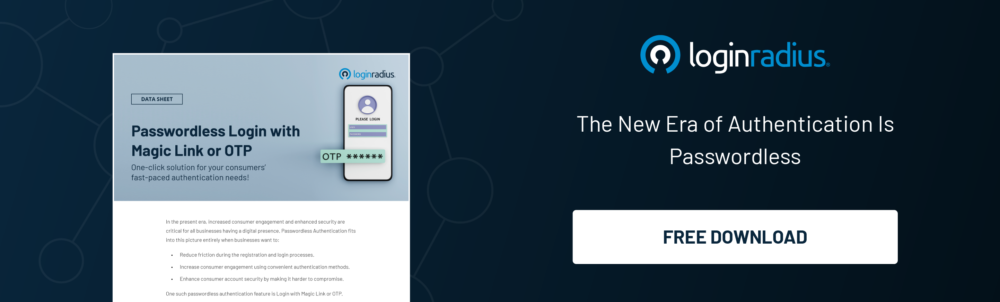
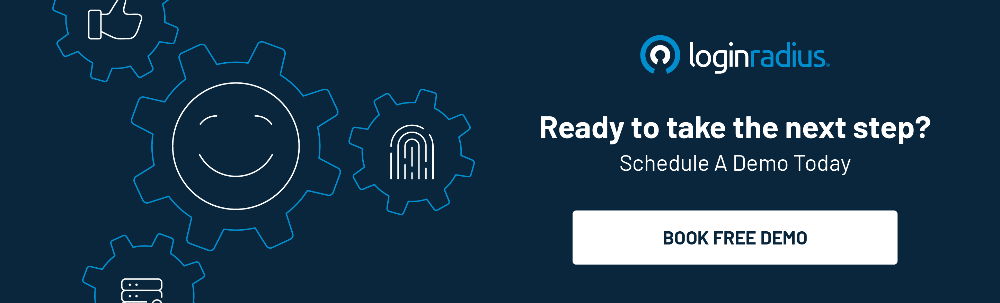

## Introduction 

With true passwordless authentication, organizations have achieved the mark of 'no friction' and 'no password fatigue.' Today, people seek convenient, less time-consuming methods, and this process is a crucial solution to tedious traditional login procedures. 

True passwordless authentication implements various approaches, which we will discuss in this article, along with the details of how it works, what the benefits are, and what all cyber threats are prevented from implementing the steps. 

But before diving into the details, let us first understand true passwordless authentication. 

## True Passwordless Authentication & Its Growing Importance in Today’s Digital Era

As we advance with the evolution of security, true passwordless authentication is an emerging technological requirement in businesses striving for growth. 

Today, people are more inclined towards data security, and this awareness is a challenge to organizations. It is their responsibility to manage identities and ensure maximum safety.

With the integration of this technology, many organizations have been able to prevent potential data breaches and safeguard sensitive information.

True passwordless authentication helps users verify their identity and access applications, accounts, and systems without entering a password or username. This process is implemented to simplify the login method for users. 

They don't have to remember complex passwords whenever they want to log in or repeatedly go through a tedious form-filling process. It is usually done through one-time codes, security tokens, or biometrics and is more secure than the usual password-entering method. 

With the help of true passwordless authentication, organizations can ensure enhanced data privacy. This unique technique is a full-fledged security system.

## How Is True Passwordless Authentication Different From Passwordless Authentication?

In passwordless authentication, users do not need to remember or enter a password to access their accounts. Rather, other authentication factors are used to establish identity. These factors can include biometrics, one-time codes, or hardware tokens.

In true passwordless authentication, the user does not rely on any shared detail or a temporary SMS code. Instead, the user's identity is confirmed using unique factors, like cryptographic keys securely stored on their device.

## How True Passwordless Authentication Works?

Passwordless authentication implements various approaches that help in the user identification process, including:

### Multi-Factor Authentication: 
True passwordless authentication is an approach within the realm of multi-factor authentication (MFA) that enhances security and user convenience. Unlike traditional methods that rely on passwords, true passwordless authentication eliminates the need for users to remember complex codes, thus mitigating the risks associated with weak passwords and credential theft. 

Instead, it leverages a combination of diverse factors for verification, such as something the user possesses (like a smartphone), something inherent to the user (like biometric data), and something the user knows (like a PIN). This multifaceted approach ensures a higher level of security by requiring multiple forms of validation before granting access. For instance, a user might receive a push notification on their registered smartphone, prompting them to confirm their identity with a [fingerprint or facial scan.](https://www.loginradius.com/blog/identity/what-is-mob-biometric-authentication/)

### Public/Private Key Cryptography: 
True passwordless authentication depends on asymmetric encryption. This means users have a unique combination of public and private cryptographic keys. The public key is freely shared, while the private key is safely stored on the user's device only. And when they attempt to access the system, they are asked to enter the private key. This process confirms the user's identity, allowing them to access the system. 

### Signature Verification Process: 
The server receives the signed challenge and verifies it with the user's public key. If the signature is accurate, it confirms that the user has the private key associated with the account. These methods enhance identity confirmation processes and help organizations create a safer digital environment for their customers, partners, and employees. 

## Advantages of True Passwordless Authentication 

True passwordless authentication is an innovative technology for organizations. Every day, much data is exchanged between servers and users, which requires utmost security. A foolproof solution to this risk of a security breach is the techniques involved in **true passwordless authentication.** Here, we have mentioned several advantages of this method:

### Better Security Measures: 
True passwordless authentication eradicates the risk of password-related susceptibilities, like password reuse, easy-to-guess passwords, and phishing attacks targeting credentials. This process improves data security since attackers cannot decode or steal users' passwords.

### Reduced Credential Theft: 
With true passwordless methods, there are no[ credentials to steal or crack](https://www.loginradius.com/blog/identity/prevent-credential-stuffing-attacks/), as users don't have passwords to enter into a system or application. This helps eliminate the risk of security breaches and unauthorized access caused due to compromised passwords.

### No More Password-Related Friction: 
Remembering passwords can be difficult. And this leads to user deviation. But with true passwordless authentication, this hassle is resolved, leading to an enhanced user experience.

### No Need to Reset Passwords: 
There is no need to reset passwords because there are no passwords you need to enter. This increases user engagement and improves efficiency. 

### Potent Authentication Factors: 
True passwordless authentication relies on robust security factors like biometrics (fingerprint, face recognition) and hardware tokens, which make it more challenging for hackers to gain unauthorized access.

### Phishing Mitigation: 
Traditional password-based approaches are sensitive to phishing attacks where users are deceived into disclosing their login credentials. True passwordless authentication methods like hardware tokens or secure links sent to authorized devices eliminate the risk of such malicious activities.

## True Passwordless Authentication: Preventing Security Threats Faced by Organizations

### Attacks through password decoding: 
True passwordless authentication eradicates the risk of attacks through password decoding, like brute force attacks, dictionary attacks, and password spraying. So, when there are no passwords to assume or decode, attackers cannot gain unauthorized access to a system.

### Keyloggers and Keystroke Technique: 
Keyloggers, malware, or other methods that record users' keystroke details can easily capture traditional passwords. Passwordless authentication, especially biometric methods and hardware tokens, dodges the need for typing in passwords, causing keyloggers to be ineffective.

### Identity Theft: 
With correctly guessed passwords, an attacker can access users' credentials and easily take over their account and identity. Hence, passwordless authentication integrated with [multi-factor authentication](https://www.loginradius.com/multi-factor-authentication/) significantly reduces the chances of account takeover or identity theft, as attackers would require access to the user's biometrics or physical token, which would not be possible. 

### Phishing Attacks: 
These attacks trick users into disclosing their passwords on fraudulent websites or through misleading emails. Passwordless authentication is resistant to such phishing activities because there are no passwords for users to enter, making it challenging for attackers to trick them into providing their login details.

## Conclusion 

With cybersecurity becoming the business center in the ever-expanding modern digital world, companies can’t overlook the importance of a reliable authentication security mechanism. 

True passwordless authentication has revolutionized how businesses secure customer identities and deliver a flawless user experience. 

With a reliable CIAM offering true passwordless authentication, like LoginRadius, businesses can create a perfect harmony of great user experience and security. 

