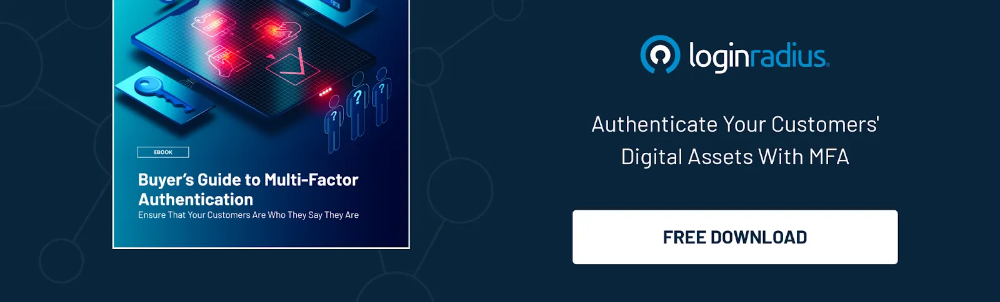

## Introduction

Cybersecurity threats are evolving, making it crucial for businesses and individuals to strengthen authentication security. One of the most effective ways is through Multi-Factor Authentication (MFA). This security mechanism requires users to verify their identity using multiple authentication methods before accessing your app, an account, or a system.

Let’s explore the types of Multi Factor Authentication and how MFA works with some examples and how to choose the right combination of authentication methods for your needs.

## What Is Multi Factor Authentication?

[Multi Factor Authentication (MFA)](https://www.loginradius.com/blog/identity/what-is-multi-factor-authentication/) is a security process that requires users to provide two or more authentication factor types to verify their identity. Unlike passwords alone, MFA adds extra security layers, making it much harder for hackers to gain unauthorized access.

Common authentication factor types used in MFA include:

-   Something you know (passwords, PINs, or security questions)
    
-   Something you have (smartphones, security keys, or smart cards)
    
-   Something you are (biometrics like fingerprints, facial recognition, or retina scans)
    

By combining these factors, MFA strengthens authentication security and reduces the risks of credential theft and unauthorized access. Businesses rely on MFA to ensure compliance, mitigate risks, and enhance user trust.

Today, multi factor auth options are widely implemented across industries to secure user accounts and sensitive data.

## How Multi Factor Authentication Works

MFA works by requiring users to verify their identity through multiple steps. Here’s a typical authentication flow:

-   The user enters their credentials (username and password) on a login page.
    
-   MFA prompts an additional authentication step (e.g., a code sent to a mobile device, a biometric scan, or a security question).
    
-   The user verifies their identity using the second factor.
    
-   Access is granted only if all authentication factors are successfully validated.
    

This layered approach makes it significantly harder for attackers to compromise accounts, even if they have stolen passwords.

Businesses that use different types of Multi-Factor Authentication gain extra security and flexibility. This lets users log in in ways that work best for them.

## Types of Multi Factor Authentication

There are several MFA types that organizations and individuals can implement based on their security requirements. Below are the most common types of MFA used today:

### 1. Email Codes

Users receive a one-time passcode (OTP) via email, which they must enter to complete authentication. While widely used, it can be vulnerable to phishing attacks if not combined with additional security measures.

### 2. Text and Call One-Time Passwords (OTPs)

A temporary password is sent via SMS or voice call, which expires after use. Although convenient, SIM swap attacks can compromise this method. OTP authentication works best when combined with another authentication method. Here’s how you can quickly configure OTP authentication.

### 3. Biometric Verification

This includes fingerprint scanning, facial recognition, retina scans, or voice authentication. Biometric authentication is highly secure and convenient but requires devices with biometric sensors.

### 4. Authenticator Apps

Authenticator apps like LoginRadius Authenticator, Google Authenticator, etc. provide higher security than SMS-based OTPs since they are not vulnerable to SIM swap attacks.

### 5. Passkeys

Passkeys replace passwords by using cryptographic keys for enhanced security. It offers enhanced security by using a device that signs a challenge using a stored private key and verifies the user’s identity. This makes logins seamless, phishing-resistant, and highly secure.

[Learn more about passkeys](https://www.loginradius.com/products/passkeys) and how to integrate them into your apps.

### 5. Magic Links

Instead of entering a password, users receive a one-time login link via email. Clicking the link verifies their identity and grants access. This is often used for frictionless authentication but requires secure email access.

### 6. Social Login

Users authenticate using third-party providers like Google, Facebook, Apple, or LinkedIn instead of creating a separate account. [Social login](https://www.loginradius.com/products/social-login) simplifies authentication but may raise privacy concerns depending on data-sharing policies.

### 7. Soft Token Software Development Kits (SDKs)

SDKs enable applications to integrate software-based authentication tokens within their apps, enhancing security for mobile and web applications.

### 8. Smartcards and Cryptographic Hardware Tokens

These are physical authentication devices that store cryptographic keys, such as YubiKeys or CAC cards. They provide robust security but require users to carry a physical token.

### 9. Security Questions

Users answer pre-set security questions to verify their identity. While easy to implement, this method is less secure as attackers can often guess or find answers through social engineering.

### 10. Adaptive Authentication

Adaptive authentication is a security method that adjusts authentication requirements based on risk factors like location, device, and user behavior. It enhances security by applying stricter verification only when needed, ensuring both protection and convenience. Read the documentation on [implementing adaptive MFA](https://www.loginradius.com/docs/security/customer-security/risk-based-auth/) for your apps.

## Real-life MFA Authentication Examples

Here are some real-world multi factor authentication examples used across industries:

-   ### Banking & Finance
    

Customers log in using passwords and confirm transactions via OTP or biometric authentication on their smartphones.

-   ### Enterprise Security
    

Employees use smartcards or authenticator apps to access internal systems securely.

-   ### E-Commerce Platforms
    

Online stores offer passwordless login via magic links or enforce adaptive authentication when detecting unusual purchases.

-   ### Cloud Services
    

Platforms like AWS and Google Cloud require hardware security keys (FIDO2) for admin access.

-   ### Social Media Accounts
    

Users enable two-factor authentication (2FA) with SMS or authenticator apps to protect their accounts from unauthorized access.

-   ### Healthcare Portals
    

Patients verify their identity using biometrics or security questions to access medical records securely.

-   ### Online Gaming Platforms
    

Gamers secure their accounts using authenticator apps or SMS-based MFA to prevent hacking.

-   ### E-learning Platforms
    

E-learning platforms need to authenticate students and staff members securely. Students and staff members can authenticate themselves securely through MFA to view and update their profiles.

  

See how one of [our clients- SafeBridge, leveled up security](https://www.loginradius.com/resource/case-study-page-safebridge/) with LoginRadius MFA.

## How to Choose the Best MFA Methods

Selecting the appropriate MFA authentication method for your business needs depends on various factors:

-   **Security Level Needed** – High-risk industries (banking, healthcare) may require biometric authentication or hardware tokens.
-   **User Convenience** – Organizations should balance security with ease of use (e.g., authenticator apps are more user-friendly than smartcards).
-   **Compliance Requirements** – Regulations like GDPR, HIPAA, and SOC 2 may mandate certain MFA implementations.
-   **Integration Capabilities** – Businesses should opt for multi factor authentication options that integrate seamlessly with existing IT infrastructure.
-   **Scalability** – Companies with a large workforce should implement adaptive authentication to streamline security without adding friction.
    

If you want a detailed guide on MFA best practices, download this insightful guide:

  

## Final Thoughts

Choosing the right MFA type depends on security needs, compliance requirements, and user convenience. By implementing strong MFA methods, organizations can significantly reduce the risk of cyberattacks while ensuring seamless user authentication.

The different types of Multi Factor Authentication available today offer businesses and individuals a range of security options to protect digital assets.

Looking to enhance security with the best MFA options? Start by choosing the right authentication methods today! To book a demo and learn more about LoginRadius MFA, [contact us](https://www.loginradius.com/contact-us?utm_source=blog&utm_medium=web&utm_campaign=types-of-mfa).

## FAQs

**1.  How to turn on Multi Factor Authentication?**

Go to Security or Account Settings in your [LoginRadius dashboard](https://www.loginradius.com/docs/security/customer-security/multi-factor-authentication/overview/), choose an MFA method (SMS OTP, authenticator app, or biometrics), and follow the setup instructions.

**2.  What are the factors of Multi Factor Authentication?**

MFA uses three factors: Something you know (passwords), something you have (security key), and something you are (biometrics).

**3.  What are the benefits of MFA?**

MFA enhances security, prevents unauthorized access, reduces phishing risks, and ensures compliance with security standards like GDPR and SOC 2.

**4.  What is Adaptive Multi Factor Authentication?**

Adaptive MFA analyzes risk factors like location and device type to apply extra security only when needed, balancing security and user experience.