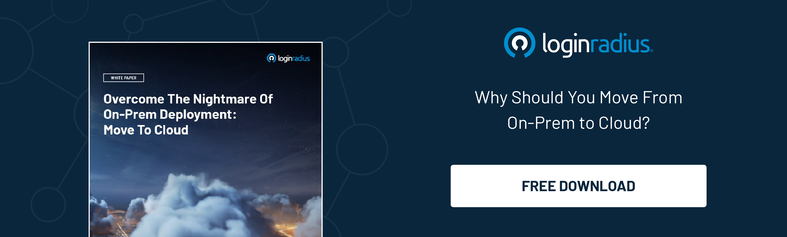

## Introduction

In the rapidly evolving digital landscape, where data breaches and cyber threats are rising, organizations must prioritize secure access to their resources while safeguarding sensitive information. 

[Identity Access Management](https://www.loginradius.com/blog/identity/what-is-iam/) (IAM) plays a crucial role in establishing effective security measures. However, when it comes to implementing IAM solutions, organizations often face a pivotal decision: whether to choose an on-premise or cloud-based approach. 

Let’s explore the key differences between IAM on-premise and IAM in the cloud, shedding light on their advantages, considerations, and implications for modern organizations.

## What is IAM On-Premise? A Detailed Overview 

IAM on-premise refers to implementing identity and access management solutions within an organization's infrastructure. It involves deploying hardware, software, and dedicated servers on-site to manage user identities, access privileges, and authentication.

### Key Features and Considerations

#### Complete Control

With on-premise IAM, organizations have full control over their infrastructure, allowing them to customize and fine-tune security policies based on specific requirements and [compliance regulations](https://www.loginradius.com/compliances/).

#### Data Sovereignty

On-premise solutions ensure that sensitive data remains within the organization's physical boundaries, offering more control over data sovereignty and meeting specific regulatory compliance requirements.

#### Legacy Integration

For organizations with existing legacy systems or unique requirements, on-premise IAM allows for seamless integration with their current infrastructure, minimizing disruptions and compatibility issues.

#### Resource Intensive

Implementing and maintaining on-premise IAM solutions require significant upfront investments in hardware, software licenses, infrastructure, and dedicated IT personnel.

#### Scalability Challenges

Scaling an on-premise IAM solution can be complex and time-consuming, requiring additional hardware procurement and infrastructure setup.

## What is IAM in the Cloud? A Detailed Overview 

IAM in the cloud involves leveraging cloud-based services and platforms to manage user identities, access controls, and [authentication mechanisms](https://www.loginradius.com/authentication/). It offers a more flexible and scalable approach to identity and access management.

### Key Features and Considerations

#### Scalability and Agility

Cloud-based IAM solutions offer unlimited scalability, allowing organizations to easily accommodate growth and fluctuations in user numbers without additional hardware or infrastructure upgrades.

#### Cost Efficiency

Cloud-based IAM solutions eliminate the need for upfront infrastructure investments, reducing hardware and maintenance costs. Organizations can pay for the resources and services they use, optimizing cost-efficiency.

#### Rapid Deployment

Cloud-based IAM solutions can be deployed quickly, allowing organizations to implement robust identity management systems without the delays associated with setting up on-premise infrastructure.

#### High Availability and Redundancy

Cloud providers typically offer built-in redundancy and high availability, ensuring that IAM services remain accessible even during hardware failures or disasters.

#### Security and Compliance 

Cloud providers adhere to stringent security protocols and compliance standards, often providing extensive security features and regular updates to safeguard customer data.

## How to Choose the Right Approach?

While both on-premise and cloud-based IAM solutions offer unique advantages, choosing the right approach depends on several factors, including:

1. **Control Requirements:** On-premise IAM may be the preferred choice if your organization requires maximum control over data and infrastructure.
2. **Scalability and Cost:** If [scalability](https://www.loginradius.com/scalability/), rapid deployment, and cost efficiency are priorities, cloud-based IAM can offer significant benefits.
3. **Compliance Considerations:** Evaluate specific regulatory requirements and determine whether your organization's industry or geographic location necessitates on-premise data storage.
4. **Legacy Systems:** Consider the integration complexity with existing legacy systems and the potential need for customizations when deciding between on-premise and cloud-based IAM.

## Final thoughts 

Identity Access Management is critical to an organization's overall security strategy. Choosing on-premise or cloud-based IAM depends on your organization's unique requirements, preferences, and considerations. 

Understanding the differences and evaluating factors such as control, scalability, cost, compliance, and legacy systems will help you make an informed decision to protect your valuable data and resources effectively.

