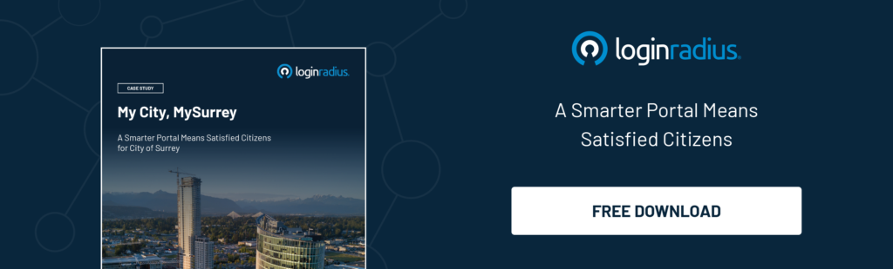

With population growth and municipal services expanding, cities need to get creative on how to provide services to all citizens without compromising the quality of service. A single platform is needed where all services are centralized and customer experience is taken into account. Below, we’ll look at some examples and best practices for municipalities to follow. 

As digital transformation transforms everyday life and interactions, cities are looking for ways to offer their services through online platforms. Cities are becoming “smarter” not to jump onto the technology bandwagon but in order to increase citizen engagement and serve them better. 

Residents are accustomed to 24/7, anywhere access to consumer products and services, and this expectation has bled over into government and municipal services. That’s why utility companies are also adapting their business models to work with new digital technology.

[The LoginRadius Citizen Identity Platform](https://www.loginradius.com/registration-and-authentication/) helps cities overcome these obstacles in three ways: 

1. Centralizing online services: Cities need one unified self-service portal so that their constituents have a seamless, efficient experience as they access the services they need. The LoginRadius Identity Platform enables cities to centralize their customer-facing digital applications into one portal.  
      
    This single locus of access delivers a connected experience across multiple touchpoints and channels. LoginRadius has supported applications such as Account Summary, Customer Profile, Permit Applications and Bill Payment.   
    
2. Helping maintain one digital identity across all customer service: What good is a centralized portal if citizens have to create multiple identities for individual web and mobile applications? Operating in this way creates identity silos that prevent a thorough view of the customer’s journey and preferences, which means the customer experience can’t be optimized for each individual.  
      
    Without a seamless user experience, engagement rates drop. But with [LoginRadius Single Sign-on (SSO),](https://www.loginradius.com/single-sign-on/) cities and companies can allow customers to access all applications within their platform with a single set of unified credentials, rather than having to separately register and log in to each service.   
    
3. Integrating with third-party applications: Many public sector organizations have a hard time using customer data to improve the digital experience. The LoginRadius Identity Platform offers prebuilt integrations with over 150 third-party applications such as CRM, email marketing tools, online communities, payment systems and more.  
      
    This enables organizations to use that customer data to better understand their customers, offer more useful information and deliver that information more directly.

The City of Surrey offers a great real-world example of what our Identity Platform can do. This bustling city in Metro Vancouver, British Columbia welcomes approximately 1,500 new residents per month – all in need of municipal services. The City was not able to expand its physical offices or add staff, so the solution was to move all services online.

We’ve created a case study to show you how the LoginRadius Identity Platform helped the City of Surrey transform its online services and unlock its future as a smart city.

