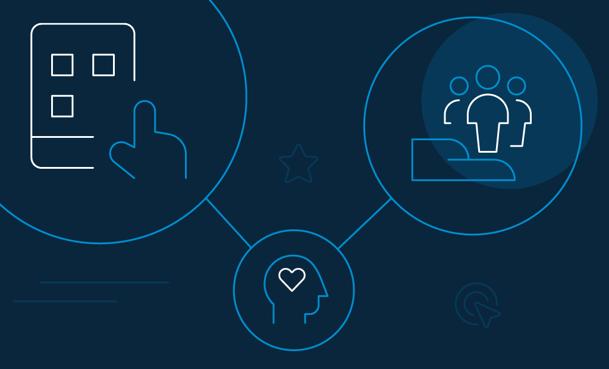
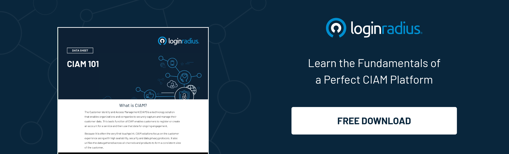

Onboarding is the process of helping new users understand and experience how your product is intending to help them in achieving their goals. In general, you confirm to your consumers that your product is the best solution to their problem, which inspired them to find your product.

Meanwhile, the onboarding process is your user's first impression about your application and, if correctly designed, it can be successfully adopted. 

When the user launches your app for the first time, the onboarding process reinforces your application's value and offers instructions that focus on potential features and benefits. 

## 5 Ways How User Onboarding Can Upgrade Your Application

1. All consumers are different; if you are analyzing your consumer through the same script, you might be missing some information about their needs, which might lead to missed opportunities throughout or after the onboarding process.

2. The onboarding process cannot be explained in one minute. It should be clear and precise. If you cannot explain the process within a minute, then you cannot expect your consumer to follow the whole process.

3. If you do not have an internal transition process, you cannot ask your consumer to trust the process to onboard correctly and manage them efficiently. The consumer should know that whatever is discussed and agreed upon during the sales process is documented. The consumer success team has already been briefed and should pick up and start the onboarding process.

4. Onboarding involves people, products, and processes. It is more likely that any one of these components will evolve within the year. They might evolve simultaneously or independently. However, the main criteria is they might change if you do not upgrade your onboarding process according to their convenience. It's time you start incorporating these developments according to the changes.

5. You need to know the time frame that it takes to onboard your consumer. So, if you don't know it yet, consider it as a warning sign. If you have a clear number, it is easy to measure whether your process is working or not and gauge where you need to make alterations.

## What Are the Primary Elements of an Ideal User Onboarding Process

The onboarding process should be a mix of inspiration, education, timely and actionable insights. Each product is unique, and how you are going to handle the onboarding will help you to know about your users, their needs, and how your product is going to stay with them.

So, here are the different [user onboarding tools](https://www.loginradius.com/blog/fuel/2021/01/user-onboarding-tools/) and resources that you can use to revamp your application. 

*   Personalized welcome.

A greeting is one of the best ways to interact with new users during offline engagements; the same applies to online ones. Welcome your consumer by offering bonus materials such as additional integration, e-books, which will help them get started. 

Also, you can personalize the welcome message by using the consumer's name or their company. It can act as a lovely gesture and will show users that you value their business. 

*   Demonstrate the product.

You can demonstrate key functions and explain to users how they can accomplish a particular task. If you do not highlight your product's purpose, then the user might fail to see the benefit of your product. 

Besides, consumers' success depends on using the product correctly; if they find it difficult, they might be frustrated with your product.

*   Set specific goals.

One of the major steps is setting specific goals for active users. Once you send your goals, create logical steps to reach the desired outcome of your product. 

Also, adding a checklist within the app can help your consumers stay on track and motivated.

*   Offer consumer service.

You should know that offering [exceptional consumer service](https://www.loginradius.com/customer-experience-solutions/) is imperative for a business to succeed. If your consumer service is good, your consumer will come back to you for more. You can also add a live chat feature or add phone assistance and email assistance to your application. 

*   Produce quality content.

Add more value to your application by producing quality content that will help consumers solve their problems. When you provide advice that greatly benefits them, you can become your client’s trusted advisor. And with added trust comes the prospect of earning more sales.

*   The Aha! moment.

This happens when your customer truly appreciates the value of your software. Complex [sign-up forms](/blog/growth/sign-up-tips-conversion-rate/) and painful login processes can create a tough barrier between the new user and the ‘Aha Moment.’ 

The main goal of onboarding is to show new users the key features and guide users towards the ‘Aha Moment,’ which is called the moment of delight, where the value of the product becomes instantly clear.

*   In-app messaging and ‘empty states’.

One of the most powerful tools for engaging users completely is by using the in-app message function. These touchpoints are highly effective when introducing new updates and features or conveying some important information to your users. 

Empty space is how your product or app looks when you first use it before it is filled with useful content. The empty state design should prompt the user to fill content or add sample content illustrating the app’s value, thereby helping the user feel more confident to take the next step.

*   Set up automated alerts.

If you are looking for people who have not completed the onboarding process, you can use alerts to remind them to finish it. You can also set up automated alerts that will push people to complete it.

*   Onboard your current users to new features.

The onboarding process is not just for new users but for current users to receive updates and on new features.

*   Offer multiple channels of communication.

To increase user interaction and retention, use multiple channels for communication. You can also use outside channels like text messages, live chat, and automated email sequences to aid the onboarding process along with in-app messaging.

## How LoginRadius Helps Businesses to Enhance a Great User Onboarding Experience

Data breaches can cost companies loss of revenue and fines. To earn your consumers' trust and protect your brand, you need to take up advanced data security measures to keep the threats at bay. 

LoginRadius protects the identity of customers through multi-level security systems with [99.99% availability](https://www.loginradius.com/press/loginradius-is-the-only-identity-platform-to-deliver-100-system-availability-in-2018/). To help businesses deliver a dedicated consumer experience and win customer trust, the platform offers the following: 

*   **Design an ideal consumer journey**. From the first step of onboarding to the thousandth login, the [CIAM platform](https://www.loginradius.com/blog/identity/2019/06/customer-identity-and-access-management/) creates a welcoming and intelligent process.
*   **Offer localization**. Businesses can customize their forms, email messages, and texts for the worldwide market according to the local language. 
*   **Tailor-make interfaces**. Businesses can choose their custom fields and design their own registration, login, and forgotten password forms. 
*   **Use an email workflow that actually works**. LoginRadius provides customizable templates and sequences to get into the consumers' inbox and manage the login process. 
*   **Unify the login process with single sign-on**. Businesses can connect their websites, mobile apps, and third-party dependencies so consumers can interact with [a single identity](https://www.loginradius.com/blog/identity/2019/05/what-is-single-sign-on/).

LoginRadius's identity platform can streamline the login process and also protect customer accounts by complying with global data privacy regulations during the onboarding process.

## Conclusion

You know by now how user onboarding software can revamp your application. But, onboarding is not an easy process or just about offering new users a warm welcome. There's more to it. And that includes helping [new users experience the value of your product](https://www.loginradius.com/blog/fuel/2019/11/improve-customer-experience-ecommerce/) and retaining current users. 

It takes time to build an onboarding process and a lot of work to update it. You cannot change everything immediately, but you can make small changes over a period of time to smoothen the onboarding process.

