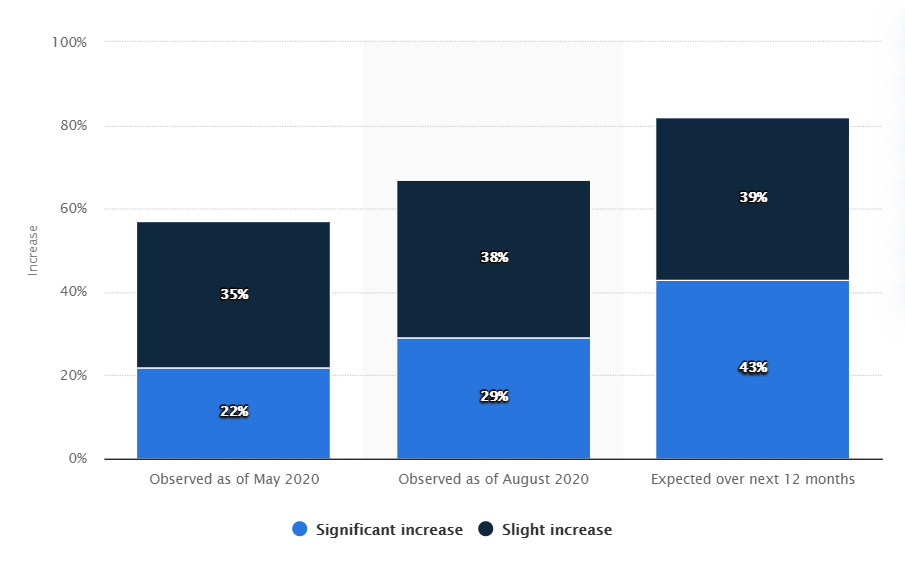

It’s true to say that a majority of enterprises believe that user provisioning is the backbone of a secure IT infrastructure.

Despite this, there are endless instances of user data being exploited or misused by cybercriminals by utilizing certain loopholes in the overall user provisioning mechanism.

Above all, the global pandemic also contributed to the sudden upsurge in the number of attacks as the majority of the global population was online.

Here are the stats depicting the global increase in identity theft risk since the coronavirus outbreak in 2020.

**Image Source**: [Statista](https://www.statista.com/statistics/1175657/increase-identity-theft-coronavirus-outbreak/)

It’s crucial for online businesses that are collecting user information and storing the same over the cloud to ensure data safety best practices are in place to safeguard clients’ identity and privacy.

In this blog, we’re going to go through a few of the most common mistakes organizations make that could eventually lead to data and privacy vulnerabilities.

**# 1 Mistake: Long List of Privileged Users**

While most of the online platforms consider access management to define permission to a certain group of users to access particular resources or information, many enterprises aren’t aware of unauthorized access distribution.  

Having too many privileged users within a network could be the worst thing for an organization when it comes to data and privacy concerns.

Businesses need to understand the[ importance of access management](https://www.loginradius.com/blog/start-with-identity/2021/01/what-is-iam/) that can prevent a data breach and protect sensitive data from being exposed.

Moreover, experts believe that keeping a track of permissions and data access requests could help in building a robust and secure ecosystem.  

**#2 Mistake: Lack of Multi-Factor Authentication (MFA)**

Multi-factor Authentication (MFA) is an essential component of current identity and access management. MFA adds more layers to the existing security that ensures a secure environment for both the company and users.

While unauthorized professionals are exploring new ways to gain access to user profiles, MFA can be the real game-changer.

Since cyber attackers can quickly bypass a single layer of security, MFA is undoubtedly the need of the hour for businesses that need to secure user identities in the ever-expanding digital world.

**#3 Mistake: Missing SSL (Secure Sockets Layer) Certificate**

SSL Certificates enhance the overall security of data sent over the internet in an organization. These certificates are the protocol that provides authentication, encryption, and decryption of data with adequate security.

Enterprises that don’t use SSL security are prone to malicious attacks and are always on the verge of compromising sensitive information related to organization and user identities as well.

It’s strongly recommended to rely on SSL when it comes to securing a web application or a website that collects, stores, and manages user data.

**#4 Mistake: No Risk-based Authentication (RBA)**

For those who aren’t aware of RBA in 2021, it’s a secure authentication process that automatically adds another layer of security whenever there’s a suspicious activity from a user’s profile.

Let’s understand this with a quick example.

Suppose a user’s account is accessed by an unauthorized professional from a remote location, which is far away from the actual current location. Or the account is accessed multiple times from different IPs of different countries within a couple of minutes or hours.

Here’s where the RBA mechanism kicks in. The user needs to verify its identity through an authentication process involving a verification email or OTP (one-time-password) and the same is informed to the admin through an alert.

Enterprises that haven’t yet leveraged risk-based authentication need to strictly put their best foot forward to add this crucial layer of security to their network for enhanced user data security.

Here’s a quick[ guide on implementing Risk-Based Authentication](https://www.loginradius.com/docs/api/v2/admin-console/platform-security/risk-based-auth/) on your site with LoginRadius’ consumer identity and access management platform.

**#5 Mistake: Underestimating Progressive Profiling**

Brands that aren’t relying on progressive profiling in 2021 would surely end up hanging back when compared to their competitors.

Progressive profiling helps businesses in choosing which data they wish to gather through various stages of a customer’s journey.

This process not only improves user experience but eventually helps enterprises to drive more revenues as the customers continue to share information and as they increase interaction with your brand.

Organizations can set rules that suit their business requirements and [win consumers’ trust](https://www.loginradius.com/blog/start-with-identity/2019/10/digital-identity-management/) that further boosts business revenues.

## Conclusion

In a world where competitors are just a click away, online businesses collecting user data must emphasize user experience and security through the aforementioned aspects.

Correct user provisioning is the key to customer success and when brands learn its importance, it provides them a competitive edge.

