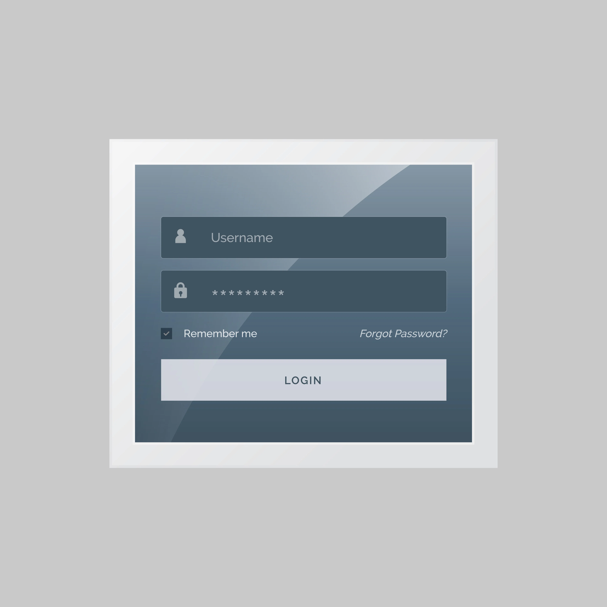
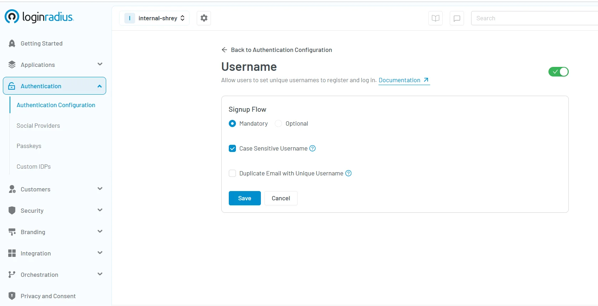
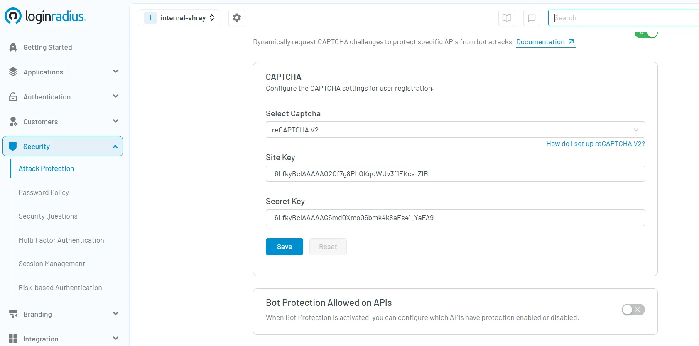
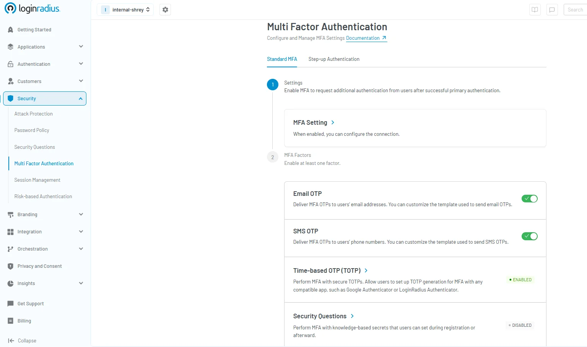
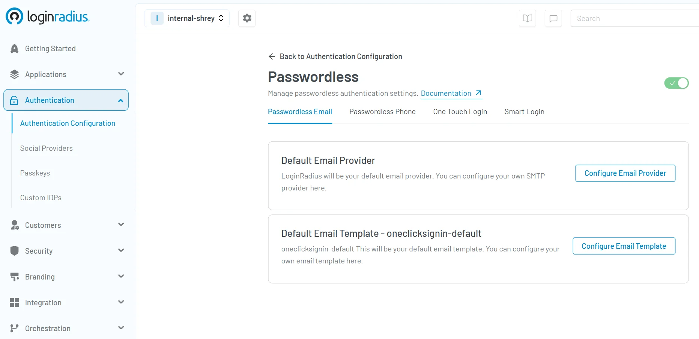

## Introduction

In the modern digital ecosystem, security and convenience walk a fine line. From financial transactions to personal data storage and enterprise operations, verifying digital identity is critical. Username and password authentication is still the most recognizable and widely used method for confirming user identity.

But despite its familiarity, is it still the best method? How do businesses secure it effectively, and what’s replacing it in modern security frameworks?

This guide offers a detailed breakdown of how username and password authentication works, how to implement it properly, common pitfalls, and why organizations are shifting toward passwordless systems. Whether you’re a developer, product manager, or security leader, this content is for you.

## What is Username and Password Authentication?

Username and password authentication is the most traditional and widely used method of [user authentication](https://www.loginradius.com/blog/identity/what-is-authentication/) in the digital landscape.

It relies on a straightforward principle: a user must prove their identity by entering two specific credentials—a username, which is a unique identifier such as an email address, mobile number, or employee ID; and a password, which is a private, secret string known only to the user.

Once these credentials are entered, the system performs a validation check. It securely compares the input with a stored version of the login username and password combination— [typically a hashed and salted](https://www.loginradius.com/blog/identity/what-is-salt/) representation saved in the authentication database. 

If the match is successful, the user is granted access to the application or system. This process may also generate a username password authentication token, allowing the system to recognize the user during their session.

## Why is Username and Password Authentication so Common?

Username and password authentication has remained a dominant login approach for several reasons, including:

* **Low Barrier to Entry**: It doesn’t require any additional hardware or complex software installations. Users only need to remember their credentials. 

* **Universal Compatibility**: Almost every digital service, from personal apps to enterprise platforms, supports sign in username and password as the default login mechanism. 

* **Cost-Effective**: For developers and businesses, implementing password authentication is relatively inexpensive and easy to deploy. 

### **Real-World Examples**

* **Gmail or Outlook**: Users enter their login user password credentials to check emails. 

* **Online Banking**: Customers authenticate using a login username and password, often followed by an OTP for additional verification. 

* **Enterprise Systems**: Employees sign into portals with a corporate ID and password, often tied to multi-factor authentication (MFA) to strengthen user password management. A great example is [Harry Rosen](https://www.loginradius.com/resource/case-study-page-harry-rosen/), which implemented LoginRadius to secure internal and customer access using robust username and password authentication and MFA—ensuring both security and a seamless experience across platforms. 

This simplicity, however, comes with challenges—which is why modern systems often explore hybrid and [passwordless authentication](https://www.loginradius.com/blog/identity/what-is-passwordless-login/) approaches for stronger security.

## How to Implement Password Authentication

Implementing a secure password authentication system goes far beyond simply checking if the username and password match. In today’s threat-heavy digital environment, businesses must adopt comprehensive practices to ensure that user credentials are protected during every phase of the login cycle—from registration to logout.

At its core, username and password authentication works by validating a unique user identity (username) and a secret key (password). But the real security comes from how those credentials are processed, stored, and managed over time. 

A properly implemented user authentication flow prevents unauthorized access, supports compliance with global security standards, and enhances user trust. Let’s quickly understand what needs to be done: 

### 1. User Registration Process

When users sign up, you must enforce strict rules around creating username and password combinations. This includes:

* Enforcing password complexity (uppercase, lowercase, symbols, and numbers) 

* Real-time strength validation indicators 

* Blocking common passwords and dictionary words 

* Enabling CAPTCHA and rate-limiting to block bots and brute-force attempts 

Most importantly, passwords should never be stored in plaintext. Instead, they should be [hashed using secure algorithms](https://www.loginradius.com/docs/security/user-security/password-management/cryptographic-hashing-algorithms/?q=hashing) like bcrypt or Argon2, with a unique salt applied to each hash to prevent rainbow table attacks.

### 2. Login Authentication Flow

During login, the system compares the entered password—hashed in real time—with the stored hash. 

If verified, the system generates a username password authentication token (such as JWT) to represent the session. This token is essential for accessing authorized resources securely and managing session continuity across platforms.

### 3. Session Management

Secure session management is vital. Implement:

* HttpOnly and Secure cookie flags 

* Idle session timeouts 

* Token expiration 

* Re-authentication prompts for high-risk actions (like password changes) 

### 4. Password Recovery and Logout

Robust systems provide secure recovery flows, using short-lived tokens sent via email or SMS. Logout mechanisms should immediately revoke the session and delete associated tokens on all devices.

## The LoginRadius Advantage

LoginRadius offers a plug-and-play [implementation of username authentication](https://console.loginradius.com/authentication/authentication-configuration) through its Standard Login feature. 

With built-in support for secure password storage, brute-force protection, risk-based authentication, and user password management, LoginRadius ensures your authentication flow is secure, scalable, and compliant out-of-the-box.

You can explore the full documentation here: [LoginRadius Standard Username Login](https://www.loginradius.com/docs/authentication/standard-login/username-login/?q=password+authentication)

## Benefits of Username and Password Authentication

While modern alternatives like biometrics and passwordless login are gaining traction, username and password authentication continue to play a foundational role in digital identity management. Its longevity and adaptability have allowed it to remain a preferred user authentication method across a variety of industries, from education and healthcare to banking and enterprise IT.

Here’s why this method remains highly relevant today:

### 1. Universality and User Familiarity

One of the biggest strengths of username and password authentication is its simplicity and familiarity. It’s a universally understood concept, requiring no user education or training. Whether someone is signing in to an online course, accessing their email, or logging into a mobile app, the login username and password flow is instantly recognized. This ease of use significantly lowers the barrier to entry and boosts user adoption rates.

From teenagers to elderly users, almost everyone has used a sign in username and password at some point. This makes it ideal for consumer-facing applications where the user base spans various technical skill levels.

### 2. Cost-Efficiency and Scalability

Unlike more complex solutions like biometric scanners or hardware-based tokens, password authentication requires no additional hardware. This makes it a highly cost-effective option for startups, SMEs, and large-scale enterprises.

The scalability of this method also stands out. Whether you’re managing 100 users or 10 million, username password authentication systems can handle the load efficiently with the right infrastructure in place. 

Cloud-based identity platforms like LoginRadius ensure that scaling your authentication environment doesn’t compromise performance or security. In fact, LoginRadius is purpose-built to handle both, offering seamless scalability while maintaining the highest standards of data protection—[learn how LoginRadius handles scalability and security here](https://www.loginradius.com/blog/identity/handling-scalability-security-loginradius/).

### 3. Foundational Security Layer

While not infallible on its own, login user password authentication serves as an essential first layer in multi-layered security frameworks. It is often combined with additional safeguards such as Multi-Factor Authentication (MFA), CAPTCHA challenges, and device recognition for improved threat resistance. Here’s how easy it is to implement captcha in the LoginRadius console:

When combined with modern user password management best practices—like [hashed and salted storage](https://www.loginradius.com/blog/engineering/encryption-and-hashing/), session tokenization, and behavioral monitoring—it forms a secure, user-friendly authentication strategy.

### 4. Flexibility and Integration

Another major benefit is its adaptability across platforms and technologies. Whether your application is mobile, web-based, or embedded within enterprise systems, username and password authentication can be seamlessly integrated via SDKs, APIs, or third-party identity providers.

A great example of this in action is how [A+E Networks implemented LoginRadius](https://www.loginradius.com/resource/a-plus-e-networks/) to streamline identity access across its global media properties. By integrating flexible user authentication mechanisms—including username password authentication—they improved engagement and ensured a seamless, secure experience for millions of users.

### 5. Policy Enforcement and Admin Controls

From a governance standpoint, administrators can define granular password policies—enforcing rules like password expiration, complexity requirements, and historical checks. They can monitor failed login attempts, detect unusual patterns, and set up alerts for potential security incidents.

This level of control makes user authentication more predictable and manageable for security teams, especially in regulated industries like healthcare (HIPAA), finance (PCI DSS), and education (FERPA).

Additionally, [user preference](https://www.loginradius.com/consent-preference-management/) can’t be overlooked. Some users—due to privacy concerns, comfort with familiar methods, or lack of access to compatible biometric devices—may still opt for traditional username and password authentication.

Furthermore, regulatory compliance in certain jurisdictions or industries may still require or reference password-based controls as part of accepted security frameworks. Until global standards evolve more uniformly toward passwordless and biometric models, username-password authentication remains a necessary component of many compliance strategies.

Lastly, legacy system compatibility is a practical factor. Many enterprise applications and infrastructure components still depend on username and password authentication, making it critical for organizations undergoing gradual digital transformation.

## Challenges of Password Authentication

While username and password authentication continues to serve as a default login mechanism across countless applications, it comes with inherent security, usability, and compliance challenges. As cyberattacks become more sophisticated and user expectations for convenience increase, the weaknesses in password authentication systems have become more pronounced.

Here’s a closer look at the major pain points associated with password-based login methods:

### 1. Human Error: The Weakest Link in Security

The biggest vulnerability in any user authentication system is human error. Weak or reused passwords like “password” and “123456” remain common, and many users store their login user password data insecurely. 

To address this, developers must implement strong user password management tools—like real-time strength meters and policy enforcement. [Explore best practices for password security and compliance](https://www.loginradius.com/blog/engineering/password-security-best-practices-compliance/) to build more resilient systems.

### 2. Credential Breaches: A Gateway for Attackers

One of the most dangerous risks in username password authentication is credential reuse. When attackers gain access to one set of credentials from a data breach, they often use automated bots to perform credential stuffing—trying those same login username and password pairs on other services.

This type of attack has become increasingly common, fueled by massive dumps of stolen data available on the dark web. Even if your platform itself has never been breached, it’s vulnerable if users recycle credentials compromised elsewhere.

Attackers can execute thousands of login attempts per minute, exploiting this method with ease if no safeguards are in place. That's why technologies like rate limiting, IP blacklisting, and CAPTCHA are critical defenses.

To understand more about how these threats operate and how to prevent them, refer to our detailed post: [Common Vulnerabilities in Password-Based Login](https://www.loginradius.com/blog/identity/common-vulnerabilities-password-based-login/)

### 3. Phishing Attacks: Deception is Easier Than You Think

Another severe risk is phishing—where users are tricked into entering their sign in username and password into fraudulent websites that mimic real login pages. Phishing has evolved beyond generic email scams; today, attackers use personalized messages (spear phishing), cloned sites, and even fake domain certificates to deceive users. 

Even security-aware users can fall victim, especially if an attacker spoofs a trusted domain or compromises a legitimate site temporarily.

While Multi-Factor Authentication (MFA) provides an additional layer of security, not all forms of MFA are phishing-resistant. For example, OTPs sent via SMS can still be intercepted or used in real-time by a man-in-the-middle attacker.

Organizations should encourage phishing-resistant methods such as device-based authentication (passkeys), WebAuthn, or biometric verification to close this loophole.

### 4. User Friction and High Recovery Costs

Password fatigue is real. With users managing dozens—or even hundreds—of accounts, remembering complex passwords becomes an overwhelming task. This often leads to password reuse or insecure storage methods, as discussed earlier.

From a business standpoint, forgotten passwords are a costly problem. Each password reset request could translate into a support ticket, customer frustration, or even abandoned sessions. Delayed access also negatively impacts engagement and conversion rates. 

A smoother experience can be achieved through smarter user authentication practices—such as providing intuitive recovery workflows, enforcing fewer but stronger credentials, and offering secure backup options (email, SMS, or authenticator apps).

LoginRadius’s CIAM platform helps businesses reduce this friction through secure, user-friendly authentication and recovery flows. Learn more about these improvements in our post on [Best Practices for Username and Password Authentication](https://www.loginradius.com/blog/identity/best-practices-username-password-authentication/)

### 5. Compliance Risks and Regulatory Liability

In sectors like healthcare, finance, and education, the risks of mismanaging username and password authentication go beyond technical consequences—they result in legal and financial exposure.

Frameworks such as [GDPR](https://www.loginradius.com/compliance-list/gdpr-compliant/), [CCPA](https://www.loginradius.com/compliance-list/ccpa/), and [PCI DSS](https://www.loginradius.com/compliance-list/pci-dss-compliant/) mandate secure user password management practices. This includes everything from password hashing and storage policies to incident response and user consent tracking. 

Failing to comply not only results in penalties and lawsuits but can severely damage your brand’s reputation. For example, storing passwords in plaintext, failing to secure recovery processes, or not logging login attempts could all be violations under multiple international standards.

To maintain compliance and reduce liability, businesses must continuously assess and improve their password authentication practices—ideally supported by a flexible, policy-driven identity platform like [LoginRadius](www.loginradius.com).

Despite its convenience and universal appeal, password authentication alone is no longer sufficient in the face of modern security threats. Without strong infrastructure and forward-thinking strategies, it becomes a liability rather than a safeguard. For long-term success, businesses should invest in hybrid and passwordless systems that elevate both user experience and security posture.

## Best Example of Robust Username and Password Authentication

To understand how username and password authentication can be both secure and user-friendly, let’s explore a real-world enterprise-level use case: the Single Sign-On (SSO) Portal for a global organization.

This scenario highlights a robust implementation of login username and password systems, demonstrating how thoughtful design, security policies, and modern best practices work together to create a reliable user authentication experience.

### Use Case: Enterprise SSO Portal

Large enterprises often manage multiple applications, platforms, and internal systems. To simplify access and enhance productivity, these organizations implement a single [sign-on (SSO)](https://www.loginradius.com/single-sign-on/) portal where users authenticate once to gain access to multiple authorized services. 

In a well-structured username password authentication setup for such a portal, the system may include: 

* **Unique Usernames**: Users sign in with identifiers tied to their employee ID or verified corporate email address, ensuring account traceability. 

* **Strong Password Requirements**: The system enforces password complexity rules—minimum of 12 characters, including uppercase, lowercase, numbers, and symbols. Passwords must be changed periodically, and password history is tracked to avoid reuse. 

* **Token-Based Session Management**: Upon successful authentication, a username password authentication token, like a [JWT](https://www.loginradius.com/blog/engineering/guide-to-jwt/), is issued. This token enables session continuity across systems while maintaining user state securely.  

* **Session Expiry Controls**: Tokens expire after 15 minutes of inactivity or when you log out, minimizing the risk of unauthorized access from idle sessions. 

* **Adaptive Multi-Factor Authentication**: Based on risk signals like location, device fingerprint, or time of access, the system may trigger an additional verification step through [adaptive MFA](https://www.loginradius.com/blog/identity/adaptive-authentication/), such as OTP or [push notification](https://www.loginradius.com/blog/identity/push-notification-authentication/) to a registered device. 

* **Centralized Monitoring and Reporting**: Every login attempt is logged in a central dashboard. Anomalies—like repeated failed logins or unusual locations—trigger alerts for the IT security team.

Here’s how quickly you can setup SSO through various integrations in the LoginRadius dashboard: 

If you need more understanding of how SSO can help your business, see how one of our clients, Tiroler Tageszeitung (TT), powered a seamless login journey with LoginRadius' SSO—one login, multiple web properties, zero hassle! [See how TT transformed user access](https://www.loginradius.com/resource/case-study-page-tiroler-tageszeitung/).

### Additional Layers of Security and Usability

This implementation goes beyond basic sign in username and password workflows. It’s designed to strike a balance between user authentication convenience and enterprise-grade security, supported by:

* **Account Lockout Thresholds**: After a certain number of failed login attempts, the system temporarily locks the account or requires additional verification to prevent brute-force attacks. 

* **Granular Access Control**: Based on job role, department, or project, users can access only specific applications—reducing exposure to sensitive data. 

* **Audit Trail for Compliance**: Every login event is recorded, enabling auditability for standards like SOC2, HIPAA, and GDPR. 

### Why This Model Works

**Balances Usability and Control:** Employees can access multiple tools with a single authentication point, reducing password fatigue while ensuring high security standards.

**Adheres to Compliance Standards:** Regulations require secure user password management, robust logging, and granular access. This model fulfills all key checkpoints.

**Scales Across Teams Globally:** With cloud-based infrastructure and tokenized sessions, this setup easily supports thousands of employees in different geographies and time zones.

A secure username and password authentication system like this ensures that enterprises maintain operational efficiency without compromising on cybersecurity. When paired with solutions like LoginRadius, businesses can customize these capabilities further—integrating SSO, MFA, adaptive authentication, and real-time monitoring for a seamless yet secure user experience.

## Best Practices for Password Storage and Transmission

Implementing username and password authentication is only half the battle; securing how those credentials are stored and transmitted is just as critical. Mishandling password data—whether in transit, at rest, or during reset flows—can lead to massive breaches, compliance violations, and irreparable damage to user trust.

Below are essential best practices that organizations should adopt to safeguard login username and password credentials throughout the authentication lifecycle.

### 1. Hash, Don’t Encrypt Passwords

One of the most fundamental principles of secure user password management is to never store passwords in a retrievable format. Instead of encryption (which is reversible), passwords must be hashed—a one-way function that generates a unique output for every input.

Secure hashing algorithms like bcrypt, Argon2, or PBKDF2 are ideal because they include computational delay features, which slow down brute-force attacks. These algorithms are designed specifically for password storage and make it extremely costly for attackers to guess passwords even if they gain access to the hashed database.

Avoid outdated algorithms like MD5 or SHA-1, which are susceptible to collision attacks and can be cracked within seconds.

### 2. Always Salt Hashes

Salting means adding a unique, random string (the salt) to each password before hashing it. This ensures that two users with the same password won’t have identical hashes in the database.

Salting effectively defeats rainbow table attacks, where attackers use precomputed hash databases to guess passwords. A strong username password authentication system uses a unique salt for every user and stores that salt alongside the hashed password securely.

For example, even if two users choose “P@ssw0rd!” as their password, with different salts, the resulting hashes will differ significantly.

### 3. Enforce HTTPS for All Password Transmissions

Never allow passwords—or username password authentication tokens—to be transmitted over insecure channels. Always use HTTPS powered by Transport Layer Security (TLS) to encrypt traffic between the client and the server.

Allowing users to enter login user password credentials on a non-HTTPS page opens them up to man-in-the-middle (MITM) attacks, where an attacker intercepts credentials during transmission.

All login pages, APIs, and password reset flows must be served over HTTPS, and HTTP requests should be redirected to secure versions automatically.

### 4. Avoid Plaintext Storage at All Costs

Under no circumstances should passwords be stored in plaintext—this includes internal systems, logging for debugging purposes, or temporary cache files. If your database is ever compromised, plaintext passwords are instant gold for attackers.

Even storing encrypted passwords (where the encryption key is accessible) is not secure enough. The proper method is always salted hashing, with stringent access controls and database monitoring in place.

Many of the worst data breaches in history were due to plaintext storage of user credentials—violating both technical and regulatory standards.

### 5. Use Multi-Factor Authentication (MFA)

[Multi-Factor Authentication (MFA)](https://www.loginradius.com/blog/identity/what-is-multi-factor-authentication) significantly strengthens username and password authentication systems by requiring users to verify their identity with a second factor—something they have (OTP, security key) or something they are (biometrics).

By integrating MFA, you add a critical layer of defense against credential theft, phishing, and brute-force attacks. Even if a user’s login username and password are compromised, the attacker cannot proceed without the second factor.

LoginRadius provides built-in MFA capabilities that are easy to deploy across web and mobile apps, making it simple to upgrade your security posture. Here’s how you can choose and deploy your desired MFA factor in the LoginRadius dashboard:

### 6. Implement Secure Password Reset Flows

Password recovery processes are frequent attack targets. A weak reset process can completely bypass your user authentication mechanisms. Here are critical safeguards for secure resets:

* **Short-lived reset tokens**: Generated links or codes should expire quickly (ideally within 15–30 minutes). 

* **Single-use only**: Tokens should be valid for one session and then automatically invalidated. 

* **Verified channels**: Reset links or OTPs should only be sent to pre-verified email addresses or mobile numbers. 

* **Behavioral checks**: Monitor for anomalies like multiple reset requests from different geographies or devices. 

Users should also receive notifications about reset attempts, whether successful or not.

### 7. Monitor and Audit All Authentication Activity

Securing username and password authentication isn’t just about implementation—it’s also about ongoing vigilance. Maintain logs of login attempts, failed authentications, and password changes.

Deploy anomaly detection systems that flag unusual behaviors, such as:

* Login attempts from multiple locations in quick succession 

* Repeated failed logins for the same account 

* Abnormal login times or IP addresses 

Pairing this intelligence with automated risk scoring helps determine when to prompt for additional authentication or temporarily lock an account.

## What is Passwordless Authentication?

[Passwordless authentication](https://www.loginradius.com/blog/growth/passwordless-authentication-customer-retention/)eliminates passwords altogether. Instead, users prove identity through something they have or are:

* **[Magic links](https://www.loginradius.com/blog/identity/passwordless-magic-links/)** sent via email
* **[OTP codes](https://www.loginradius.com/blog/identity/what-is-otp-authentication/)** over SMS or authenticator apps
* **[Passkeys](https://www.loginradius.com/blog/identity/what-is-passkey-authentication/)** - cryptographic device-based credentials
* **[Biometrics](https://www.loginradius.com/blog/identity/biometric-authentication-mobile-apps/)** - fingerprint, facial recognition

This approach enhances user experience and minimizes security flaws related to poor user password management. Need to add passwordless authentication to your apps? Here’s detailed [developer docs](https://www.loginradius.com/docs/authentication/passwordless/passwordless-login) to help you quickly implement passwordless authentication.

## What are the Benefits of Passwordless Authentication?

As cybersecurity threats grow more sophisticated and users demand faster, more intuitive digital experiences, passwordless authentication offers a compelling solution. By eliminating the password—the weakest link in most user authentication systems—organizations can strengthen their security posture, enhance user satisfaction, and reduce operational burdens.

Here are the key business and technical advantages of moving to a passwordless model:

### 1. Improved Security

One of the primary benefits of passwordless authentication is that it removes passwords from the equation altogether. Without passwords, there's no risk of weak credentials, reuse across multiple platforms, or exposure through phishing or keylogging.

By replacing the traditional login username and password model with secure alternatives like [passkeys](https://www.loginradius.com/products/passkeys), biometrics, or OTPs, businesses can effectively block common attack vectors like credential stuffing, brute-force attempts, and phishing scams. In essence, attackers can’t steal what doesn’t exist.

This not only protects your users but significantly reduces the risk of a data breach—and the reputational and financial damage that comes with it.

### 2. Frictionless User Experience (UX)

From a user’s perspective, passwordless login is faster, easier, and more intuitive. There's no need to remember complex credentials or go through time-consuming password resets. Instead, users can log in with a fingerprint, click a magic link, or enter a quick OTP.

This frictionless experience is especially critical for mobile-first environments, where typing complex passwords on small screens can be cumbersome. By reducing login barriers, businesses can increase engagement, decrease drop-offs, and improve overall user satisfaction.

### 3. Cost Savings

Password resets are one of the most common reasons users contact support—and each reset can cost a business between $15 and $70, depending on the organization. Multiply that by thousands of users, and the impact on IT resources becomes significant.

By eliminating passwords, organizations can drastically reduce support tickets related to login issues, freeing up IT teams to focus on more strategic initiatives. It also reduces the need for password storage infrastructure, monitoring, and security audits.

### 4. Stronger Compliance Posture

Passwordless authentication helps minimize the storage and transmission of sensitive user data—particularly passwords, which are considered high-risk assets under data protection laws. By reducing your system’s exposure to credential-related vulnerabilities, you also reduce the risk of violating compliance frameworks such as GDPR, HIPAA, and PCI DSS.

Furthermore, passwordless systems typically come with built-in logging, risk analysis, and audit trails—making it easier for businesses to demonstrate regulatory compliance during security assessments or audits.

## Ways to Add Passwordless Authentication to Your Apps

* **Passwordless Login with Email** 
[Passwordless login via email ](https://www.loginradius.com/docs/api/v2/customer-identity-api/passwordless-login/passwordless-login-by-email/)users receive a secure login link via email—one click grants verified access with no password required.

* **Passwordless Login with OTP (SMS)**
With [passwordless login via OTP](https://www.loginradius.com/docs/api/v2/customer-identity-api/passwordless-login/passwordless-login-by-phone/),  time-sensitive one-time code is sent to the user’s phone, offering a simple and fast way to log in securely.

* **Passwordless Login with Passkeys**
[Passkeys](https://www.loginradius.com/docs/authentication/passkeys/) use public-private key cryptography, often paired with biometrics like Face ID or fingerprint, making them phishing-resistant.

* **Passwordless Login with Magic Links**
[Magic links](https://www.loginradius.com/blog/identity/passwordless-magic-links/) are unique links that are emailed to the user, allowing instant access without typing a code—ideal for quick or one-time sessions. 

## Is Passwordless Authentication Secure? 

Yes—passwordless authentication is highly secure when implemented correctly. It relies on secure token handling, short-lived session tokens, trusted device verification, and robust multi-step account recovery processes. These elements reduce common attack vectors like credential theft and phishing.

When combined with [LoginRadius risk-based authentication](https://www.loginradius.com/blog/identity/risk-based-authentication/), which dynamically evaluates user behavior, device context, and location, passwordless authentication becomes even more resilient. This layered approach not only surpasses the security of traditional login user password systems but also ensures a seamless user experience without compromising on risk management.

## Why LoginRadius Passwordless Authentication is a Game-Changer for Your Business

As user expectations shift toward faster, frictionless experiences—and security threats become more complex—modern businesses are reevaluating how they manage authentication. Passwordless authentication has emerged as the gold standard for both user convenience and security. And with LoginRadius, adopting it is not only seamless—it’s transformative.

### What Makes LoginRadius Stand Out?

LoginRadius offers a robust, enterprise-grade passwordless authentication solution that simplifies deployment without sacrificing control. Whether you're a startup or a Fortune 500 company, you get access to:

* **Pre-Built Passwordless Workflows**: Easily enable authentication through One-Time Passwords (OTP), biometric verification, device-bound passkeys, and magic links—all configurable to your business needs. 

* **Granular Access Controls**: Implement fine-tuned permissions and security policies based on user roles, behavior, location, or device—without relying on static passwords. 

* **Flexible Integration**: Use our comprehensive SDKs and APIs to embed passwordless authentication into mobile apps, SPAs, enterprise platforms, and customer portals with ease. 

* **Global-Ready Compliance**: Stay compliant with international regulations such as GDPR, HIPAA, and SOC2, with built-in logging, data residency controls, and risk management features

## Summary

While new authentication methods continue to evolve, username and password authentication still plays a key role in digital security. That said, modern threats and user demands call for stronger password policies, MFA, and seamless, secure alternatives like passwordless authentication.

With LoginRadius, you can support legacy systems while confidently transitioning to scalable, future-ready identity solutions. [Contact us](https://www.loginradius.com/contact-us?utm_source=blog&utm_medium=web&utm_campaign=username-and-password-authentication) to secure your authentication with cutting-edge authentication solutions.

## FAQs

### 1. What is an example of password authentication?

**A.** A user logging into their banking app with a login username and password, followed by a verification code.

### 2. What are three types of authentication?
**A.** Types of authentication - 
1. **Knowledge** (passwords)
2. **Possession** (phone, token)
3. **Inherence** (fingerprint, face)

### 3. Why is the use of username and password important?

**A.** Because it offers a simple, globally accepted method of user authentication. When secured well, it forms the basis of layered defense strategies.

