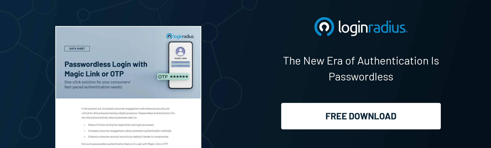
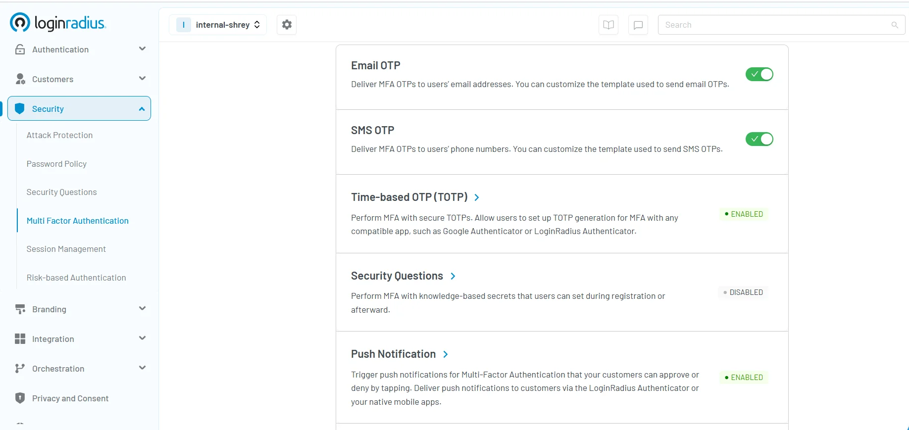

## OTP Authentication: Secure Every Interaction, Prevent Every Breach

OTP authentication (One-Time Password authentication) is a security mechanism that generates a unique, temporary code for every login or transaction. Unlike static passwords, an OTP is valid only once and for a short duration, adding an extra layer of protection against unauthorized access. 

So, how does OTP work? OTPs are typically generated using either time-based or event-based algorithms. After a user enters their username and password, the system sends or requests an OTP—often via SMS, email, or an authenticator app. The user then inputs the code to complete the login. 

This approach is a core part of [MFA (multi-factor authentication)](https://www.loginradius.com/blog/identity/what-is-multi-factor-authentication/), helping to reduce reliance on single-password systems.

Think about the last time you tried logging into your bank account or accessed a new app from an unfamiliar device. You probably got a code texted or emailed to you, right? That’s OTP in action. 

These one-time codes pop up during sensitive moments—like online banking, unlocking secure files, or logging in from new places. They're designed to add a quick checkpoint, making sure it is really *you*. And because each code is used only once, OTP authentication is a powerful way to shut the door on replay attacks and keep intruders out.

Let’s dig deeper into this and understand the aspects associated with OTPs and how you can quickly add OTP authentication to your applications. 

## Understanding TOTP vs HOTP – What’s the Difference?

When it comes to generating one-time passwords, there are two widely used standards: HOTP and TOTP. Understanding how they work—and how they differ—is essential to implementing the right kind of OTP authentication for your application or service.

HOTP (Hash-Based One-Time Password) and TOTP (Time-Based One-Time Password) are both algorithms used to generate OTP codes, but they rely on different triggers. HOTP generates a new code every time a specific event occurs (like a login attempt), while TOTP generates codes that change automatically over fixed time intervals (usually every 30 seconds).

Knowing the difference between these two can help you balance user experience, security needs, and technical constraints. For example, if your users are often offline, HOTP might make more sense. But if you're prioritizing higher security and real-time verification, TOTP is the better choice.

### What is HOTP (Hash-Based One-Time Password)?

HOTP (Hash-based One-Time Password) generates OTPs based on a counter. Every time a user requests an OTP, the counter increases, and a new OTP code is generated. It does not expire with time but only changes with each authentication event. 

What is HOTP best for? Offline use cases, where synchronization with time may not be feasible. It’s stateless but prone to replay attacks if not implemented carefully.

### What is TOTP (Time-Based One-Time Password)?

[TOTP (Time-Based One-Time Password)](https://www.loginradius.com/blog/identity/one-time-passwords-security-benefits/) is a time-sensitive version of HOTP. It generates OTPs based on the current timestamp, typically valid for 30 seconds.

So, what does TOTP mean in practice? It’s the most common form of OTP in apps like Google Authenticator and Microsoft Authenticator.

What is TOTP authentication good for? It provides higher security than HOTP since the OTP code expires quickly, reducing the risk of interception.

## HOTP vs TOTP – What is the Difference?

<table>
  <tr>
   <td><strong>Feature</strong>
   </td>
   <td><strong>HOTP</strong>
   </td>
   <td><strong>TOTP</strong>
   </td>
  </tr>
  <tr>
   <td>Based On
   </td>
   <td>Counter
   </td>
   <td>Time
   </td>
  </tr>
  <tr>
   <td>Validity
   </td>
   <td>Until used
   </td>
   <td>Typically 30 seconds
   </td>
  </tr>
  <tr>
   <td>Use Case
   </td>
   <td>Offline apps
   </td>
   <td>Online authentication
   </td>
  </tr>
  <tr>
   <td>Risk
   </td>
   <td>Replay attack
   </td>
   <td>Time desync
   </td>
  </tr>
  <tr>
   <td>Implementation
   </td>
   <td>Simpler
   </td>
   <td>Requires time sync
   </td>
  </tr>
</table>

The TOTP vs HOTP debate centers on security vs. flexibility. TOTP is more secure due to its time constraint, while HOTP can be used without relying on time synchronization.

OTP vs TOTP may seem similar, but OTP is a broader category, while TOTP is a specific implementation under it. The choice depends on the use case, environment, and required security level.

## What are the Advantages and Disadvantages of OTP?

### Advantages of One-Time Passwords

* **Enhanced Security:** OTPs significantly improve OTP security by reducing the risk of password reuse and phishing attacks.
* **Adaptability:** OTPs can be delivered through multiple channels—SMS, email, or authenticator apps.
* **Compliance-Friendly:** OTPs support regulatory requirements like [GDPR and CCPA](https://www.loginradius.com/blog/identity/ccpa-vs-gdpr-the-compliance-war/) for secure customer authentication.
* **Integration with MFA:** **OTP MFA** setups add a second layer of identity verification, especially in CIAM solutions.

### Disadvantages of One-Time Passwords

* **Delivery Delays:** SMS or email-based OTPs can be delayed or intercepted.
* **Device Dependency:** Users may lose access to OTPs if their device is lost or offline.
* **Phishing Risks:** Attackers may trick users into revealing OTPs via social engineering.
* **User Friction:** Entering OTP codes repeatedly may reduce user experience if not implemented efficiently.

Despite some limitations, the benefits of OTP authentication typically outweigh the drawbacks when implemented securely.

## Is OTP Authentication Secure?

Yes, OTP authentication is generally secure—especially when compared to static passwords. However, its security depends on implementation.

* OTP security can be compromised if codes are sent over unsecured channels like SMS.
* Authenticator apps using TOTP are far more secure as the OTP code is generated on the user’s device.
* Phishing-resistant methods like biometric or [adaptive authentication](https://www.loginradius.com/products/adaptive-mfa) methods are also emerging as enhancements to OTP MFA systems.

Moreover, adding a secret key and encrypting it can improve the resilience of OTP systems. So, what is the secret key in OTP? It's a shared key used to generate the OTP code, stored securely on both client and server.

## How to Add OTP Authentication to Your App Using LoginRadius CIAM

LoginRadius provides a robust API-based approach to set up OTP verification that complies with modern security standards.

Implementing OTP authentication with LoginRadius CIAM is simple and flexible, supporting multiple OTP types, including Email-based OTP, SMS-based OTP, and TOTP (Time-Based One-Time Password). Here’s how you can quickly set up the same: 

For SMS and email OTPs, developers can utilize the[ LoginRadius Phone Authentication API](https://www.loginradius.com/docs/api/v2/customer-identity-api/phone-authentication/overview/) to trigger, resend, and validate OTP codes. The API automatically handles the generation and expiration of OTPs, ensuring secure and time-bound authentication flows.

To integrate TOTP-based login (using apps like Google Authenticator), LoginRadius allows applications to register and verify TOTP tokens as part of multi-factor authentication (OTP MFA). This adds strong protection against phishing and man-in-the-middle attacks.

Whether you're implementing OTP authentication for mobile, web, or hybrid platforms, LoginRadius simplifies the process with comprehensive [documentation and SDKs](https://www.loginradius.com/docs/api/v2/customer-identity-api/phone-authentication/overview/). 

## The Future of Authentication

The rise of passwordless technologies and biometrics is shifting how we view identity verification. Still, OTP authentication continues to play a critical role in modern CIAM solutions.

Trends shaping the future:

* **FIDO2/WebAuthn:** Moving toward device-based, phishing-resistant authentication.
* **Adaptive Authentication:** Analyzing behavior to determine if OTP MFA is necessary.
* **Biometrics:** Replacing or complementing OTP with facial recognition or fingerprints.

However, in transitional or hybrid environments, OTP verification remains a reliable method that blends convenience with security. It’s also familiar to users, making adoption easier across industries.

## Don’t Compromise—Enhance Security with OTP Authentication, Simplified by LoginRadius

OTP authentication strikes the right balance between usability and security. Whether you're using SMS, email, or app-based codes like HOTP and TOTP, one-time passwords serve as a solid line of defense against credential theft, unauthorized access, and replay attacks.

And when it comes to implementing OTP the right way, LoginRadius makes it seamless. From phone and email verification to advanced TOTP integration, you can deliver frictionless yet secure login experiences tailored to your audience.

Ready to enhance your authentication strategy with LoginRadius? [Book a free trial](https://accounts.loginradius.com/auth.aspx?return_url=https://console.loginradius.com/login&action=register) and see it in action.

## FAQs

**1. What is OTP authentication?**

**A.** OTP authentication is a security method where users receive a unique, single-use OTP code for login or transactions, enhancing password security.

**2. How does an OTP login reduce effort?**

**A.** OTP login simplifies authentication by skipping password memorization and instead using a short code sent to a known device or app.

**3. What are the different types of OTP?**

**A.** The two main types are **HOTP (Hash-Based)** and **TOTP (Time-Based)**. TOTP is more secure due to its time-bound nature.

**4. What is the secret key in OTP?**

**A.** The secret key is a shared value between client and server, used in algorithms like TOTP or HOTP to generate OTP codes securely.

