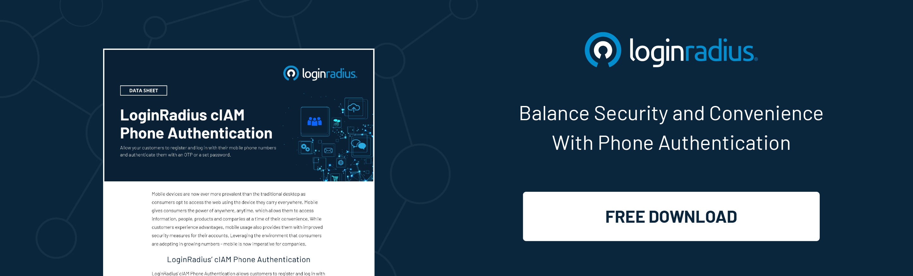

## Introduction

Have you heard of phone login lately? We will get to it soon. 

With all the business going online in this digital era, there is probably a possibility that there is not even a single person on this planet who enjoys filling out registration forms. 

Today, a single consumer interacts with various apps/websites, which require them to log in or register before allowing them to use their services. There are relatively high chances of forgetting the username and the associated password while trying to log in.

In this type of process, consumers may become frustrated and completely give up the sign-up process as it asks for a lot of information. Ultimately, businesses end up with lower consumer growth rates.

But if the sign-up and login process is done right, it can trigger the retention of lots of new consumers. If done in an improper method, it may backfire and can have the exact opposite effect. 

So now the question is, what is the right process? How do we tame this beast? 

We tame it by following the best consumer experience practices and using the right analysis and optimization techniques.

You might think that we can also implement a social login method like GitHub, Facebook, Google, etc., to skip traditional registration/login. 

Yes, you are right, we can do that! But there is a slight problem that sometimes consumers do not want their data to be shared with app developers. 

This is where **Phone Login** comes to the rescue.

## Introduction to Phone Login

In the fast-paced digital landscape, the convenience and security of consumer interactions are paramount. Phone Login emerges as a powerful tool designed to streamline the often cumbersome processes of registration and login. As consumers juggle multiple apps and websites, each requiring their own set of credentials, the need for a more straightforward solution becomes evident. Phone Login steps in to simplify this process, allowing users to swiftly register or access their accounts using nothing but their mobile phones.

Gone are the days of lengthy registration forms and forgotten passwords. With Phone Login, users input their phone number, receive a one-time password (OTP) on their mobile device, and gain instant access. This not only improves the user experience but also significantly reduces friction in the onboarding process for businesses.

## Crucial Considerations in Phone Login Implementation

### Abuse Scenario Vigilance

One crucial consideration in Phone Login implementation is being vigilant against abuse scenarios. The login endpoint could be vulnerable to attacks where repeated requests are sent with similar phone numbers, potentially slowing down the login page. To mitigate this risk, implementing checks on the frequency of requests from a single phone number can help maintain the system's integrity.

### Handling Phone Number Alterations

Another important aspect to consider is how to handle scenarios where a user alters their phone number. To address this, a verification process can be implemented where the new number is verified before updating it in the user's account. This ensures that user information remains accurate and secure, preventing unauthorized access.

### Session Management and Security

Effective session management is essential for [security and user convenience](https://www.loginradius.com/blog/identity/security-ux-can-coexist/). Generated tokens play a vital role in this aspect, allowing for the expiration of sessions and the logging out of idle accounts. When a user enters the OTP received on their phone, the backend system verifies the token to ensure a secure login process.

### Telephony API Integration

To send OTPs to users' phones, integration with a telephony API is necessary. This API enables the system to send SMS messages with the OTP code for user verification. Choosing a reliable telephony API provider, such as LoginRadius, ensures the seamless delivery of OTPs to users, enhancing the overall user experience.

### Consumer Data Privacy

Lastly, ensuring consumer data privacy is paramount. Phone Login should comply with data protection regulations to safeguard user information. This includes securely storing phone numbers, encrypting sensitive data, and obtaining user consent for using their phone numbers for verification purposes.

## What is Phone Login

Phone Login is a compelling and handy feature designed to enhance consumer experience and ease the process of login and registration.

It is the process of registering or accessing a user's account by using a phone number. The user enters their phone number as username and receives a one-time password (OTP) on their mobile phone, entering which they can log in.

It eliminates the hassle of filling lengthy registration forms and creating new passwords and usernames, thereby allowing users to quickly login or register just by using their mobile phones.

## Why Should Businesses Use Phone Login

As mentioned earlier, [phone login simplifies the login and registrations process](https://www.loginradius.com/resource/loginradius-ciam-phone-authentication/). By using this feature, app developers and business owners can show their consumers that they understand what annoys them— and that they value their time. A rich consumer experience has always been seen providing a more significant consumer growth rate.

This feature makes it easy for your consumers to register and log in within seconds using their phone numbers. To sign-in, they have to enter their phone number and the code they received (usually a one-time password ). 

And it should not be tough to understand that consumers will always tend to move in a comfortable and less time-consuming path.

## Benefits of Phone Login for Businesses

[Phone Login](https://www.loginradius.com/phone-login/) becomes extremely useful for those businesses which rely heavily on consumer's phone numbers. For example, food delivery companies, cabs, and more. Other than these the following are a few benefits that will help any business.

- Easy and hassle-free registration for consumers as it skips the filling of lengthy forms.

- Consumers can register and login directly with their phone numbers.

- It avoids spam consumer registration on your website.

- It saves consumers time. A lot of it. By skipping traditional registration form filling.

- Consumers can also login without remembering their user ID and Password.

- Verify consumer mobile number by SMS OTP.

- All verified consumers are genuine, and hence it prevents fake orders.

- Order processing is fast because consumer identity is already verified by Phone Number and One-time password (OTP).

- As order processing is quick, the consumer trusts the merchant.

- Consumers can be notified quickly through mobile, even if they do not have internet or email access, and notifications are always read.

- Merchants shall reach consumers with their promotions and offers quickly through phone number

Looking at the above benefits, business owners can easily enhance their business strategies and ultimately increase their consumer growth. You've got everything you need to communicate with your end-users in the most concrete and straightforward method.

## How to Implement Phone Login

Now that you have read all the advantages of using a phone login and you are planning to implement it for your business, too, your first question will be, "How can I implement this thing on my website." Right ??

Don't worry, we've got you covered.

 
This whole implementation is divided into two parts. 
The user submits the phone number to the website's backend via GUI and obtains a token.
Users submit the obtained token in a web field, where it is verified. Upon successful verification, the user is logged into the website.

Let's start with the first scenario where the user submits the phone number to the App backend through GUI. After submitting the number, they land on a new page which asks for a token. The application backend verifies the input number and combines it with extra information such as IP address, geographical location, and device information.

This wholesome mixture of information is now submitted to the User service, which generates a token, and then they associate it with these requests. 

Here is an important aspect that you need to keep in mind: **The generation of a token**.

See, this generated token will help us in many ways, and they are essential as well. These tokens can be used to expire the ongoing sessions or logging out of an idle account. And many more things like this, which increases the security of your user's account.

Now our next challenge is how do we send OTP to the consumers. This will be done by your User Service, which will call a telephony API and will send the OTP to the consumers' phone number as an SMS. Many companies provide this functionality, and LoginRadius is one of them.

On receiving the One-time password in SMS, the user will now enter the OTP in the form. Once again, the application backend comes into action and verifies the token which was sent by User Service.

If the token is exactly the same as what was sent, the user is logged into the account. Simple!

## What Things to Take Care of While Implementing Phone Login

Now that you know how to implement phone login, you must be excited to implement it for your website too. But there are a few things we need to keep in mind while implementing this feature.

- Be careful and vigilant about the multiple abuse scenarios where the login endpoint can get attacked by a code that keeps sending a request with a similar phone number. This can slow down your login page. To handle this, you can implement a check on how many times a consumer (phone number) can send requests.

- Another case is to consider the scenario if a consumer alters the phone number. You can use a similar method of first verifying the number and then updating it in the consumer’s account to handle this.
  

## Conclusion

In this article, we talked about applying a simple approach of using Phone Login on the websites and how it will enhance the businesses. This feature removes the consumer's mental load to remember each password created on different websites. Finally, before implementing any functionality on your website, analyze and consider the pros and cons from every possible angle. 

Cheers!

