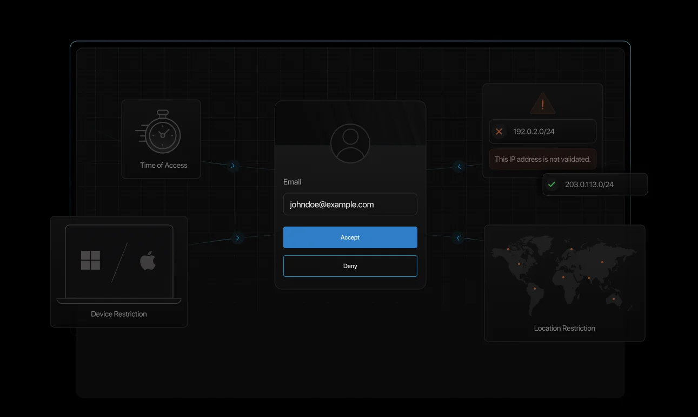

## Introduction

From unlocking your smartphone to signing in to enterprise cloud tools, authentication has become a key part of our digital lives. It’s the gatekeeper—deciding whether someone should be allowed access to a particular application, platform, or service. 

As cyber threats continue to evolve, it's more important than ever for developers, businesses, and everyday users to grasp the intricacies of authentication, understand how it works, and appreciate its significance in maintaining digital security.

But authentication isn’t just about typing in a password or logging in. It’s about safeguarding digital identities and ensuring systems and data remain accessible only to the right individuals under the right conditions. 

With the rise of zero-trust security models, [identity-first strategies](https://www.loginradius.com/blog/identity/decoding-ethics-identity-first-security/), and privacy-by-design approaches, authentication is at the very heart of modern digital security.

In this insightful guide, we’ll walk through what authentication means, explore different types and methods, and show how forward-thinking businesses are using modern authentication protocols to keep users secure and compliant.

## What is Authentication and How Does User Authentication Work?

Authentication is the process of confirming that someone (or something) is genuinely who they claim to be. The word comes from the Greek "authentikos", which means real or genuine. 

When we talk about a digital environment, authentication acts as a foundational security layer—preventing unauthorized access to systems, apps, and data. This role of authentication provides a sense of security and protection in the digital world.

In a nutshell, authentication checks whether the credentials provided—like a password, fingerprint, or digital token—match what’s stored in the system. It happens before authorization and is a critical part of digital safety to ensure only the authorized person/machine has access to the resources/platforms. 

## What Does Authentication Mean in a Digital Context?

In today’s modern digital landscape, authentication ensures that only legitimate users and systems can access sensitive resources. It’s a core part of building trust, stopping fraud, and staying compliant with privacy regulations like [GDPR, HIPAA, and CCPA](https://www.loginradius.com/blog/identity/stay-compliant-with-data-privacy-laws-2023/). This role of authentication reassures us and instills confidence in the digital systems we use.

From a user perspective, good authentication means a secure but seamless login experience. For businesses, it’s about protecting data, avoiding breaches, and maintaining a trustworthy brand.

Looking to deliver both security and user experience? Explore how the LoginRadius authentication platform simplifies authentication and registration for modern apps: 

## How Does User Authentication Work?

Here’s how a typical authentication process works:

1. **Credentials Submission:** A user provides an identifier (username or email) along with an authenticator, like a password, fingerprint, or one-time passcode (OTP).

2. **Validation Check:** The system compares this information against stored credentials.

3. **Token or Session Creation:** If the credentials match, the system starts a user session or generates an authentication token (e.g., a JSON Web Token or JWT).

4. **Access Granted:** Once authenticated, the user gains access to the appropriate system or service.

## The Evolution of Authentication

### 1. The Password Era (1960s)

Authentication began with passwords in the 1960s, first implemented in the [Compatible Time-Sharing System](https://en.wikipedia.org/wiki/Compatible_Time-Sharing_System) (CTSS) at MIT—one of the earliest operating systems to offer password authentication. While passwords were simple and easy to implement, their security weaknesses soon became apparent, especially as systems moved online.

### 2. Session-Based Authentication (1990s)

With the rise of dynamic websites in the 1990s, session-based authentication became common. When users log in, servers generate a unique session ID, typically stored in browser cookies ([MDN Web Docs](https://developer.mozilla.org/en-US/docs/Web/HTTP/Cookies)). While effective for traditional web applications, session-based methods struggled with scalability and weren’t ideal for mobile or API-driven systems.

### 3. Token-Based Authentication (Early 2010s)

The growth of mobile apps, single-page applications (SPAs), and cloud-based services highlighted the need for stateless and scalable authentication. This led to the popularity of OAuth 2.0, standardized by the IETF in 2012 (RFC 6749), and JSON Web Tokens (JWTs), which allowed clients to carry identity information securely without relying on session storage.

### 4. Multi-Factor Authentication (MFA) Adoption (Mid-2010s)

As cyberattacks and credential theft grew more prevalent, MFA moved from optional to essential. The [NIST Digital Identity Guidelines](https://pages.nist.gov/800-63-3/sp800-63b.html) (SP 800-63B), released in 2017, emphasized MFA as a best practice for modern authentication. MFA enhances security by combining multiple identity proofs, such as something you know, have, or are.

### 5. Adaptive and Passwordless Authentication (Late 2010s–Present)

To balance security with user experience, organizations began adopting adaptive authentication, which evaluates login context: like location, device, or behavior—to apply the right level of verification. 

Simultaneously, passwordless authentication gained traction, driven by innovations like Microsoft’s 2019 push toward eliminating passwords. These approaches aim to reduce friction while maintaining robust protection.

## What are the Different Types of Authentication Factors?

Authentication has evolved far beyond the simple password. As digital threats grow more sophisticated, relying on a single method of verification just isn’t enough. 

That’s why modern systems turn to a multi-layered approach built on four key types of authentication factors, each offering a unique layer of protection:

### Knowledge Factors – Something You Know

Knowledge factors, the most commonly used type of authentication, involve users proving their identity by entering information only they’re supposed to know. While simple and easy to implement, they are also the most vulnerable—passwords can be guessed, stolen, or leaked, hence the need for additional security measures.

To boost security, knowledge factors should be combined with other types—this is where MFA becomes essential. For example, passwords, PINs, answers to security questions, etc. 

### Possession Factors – Something You Have

These methods rely on a physical item that the user owns. That could be a mobile device receiving a one-time code or a hardware token used to verify access. Even if someone knows your password, they still need your device to complete the login.

Possession-based authentication is a key pillar of MFA and is widely adopted across both personal and enterprise systems. Examples include smartphones, OTP tokens, smart cards, and authenticator apps, including Google authenticator codes, etc. 

### Inherence Factors – Something You Are

These factors use a person’s unique biological traits to confirm identity. Biometric methods offer high security and a frictionless user experience since there’s nothing to remember or carry for identity authentication. They’re common in smartphones, banking apps, and high-security environments.

However, because biometric data is permanent and unique, businesses must ensure this data is stored and handled securely—for example, fingerprints, facial recognition, and iris scans.

### Behavioral Factors – Something You Do

Behavioral authentication is all about how a user interacts with their device. These subtle patterns—like typing rhythm, mouse movement, or swipe gestures—are difficult to mimic and can help detect fraud in real time. 

Often used in adaptive authentication, behavioral factors allow the system to respond dynamically based on user behavior, adding a hidden yet powerful layer of security without disrupting the user experience.

Combining behavioral signals with other user authentication methods strengthens identity authentication and reduces the risk of unauthorized access. 

Want to see how adaptive authentication uses these signals to defend against evolving digital threats? Download our eBook on navigating the digital apocalypse with smarter authentication: 

## Types of Authentication

As digital security grows more advanced, so do the methods of verifying users. Choosing the right type of authentication depends on your security needs and the user experience you want to provide. Here's a closer look:

### Single-Factor Authentication (SFA)

Single-factor authentication is the most basic form—usually just a password or PIN. It’s simple and fast, but not very secure. It might work for low-risk accounts but isn't ideal for anything sensitive. 

### Two-Factor Authentication (2FA)

2FA is an authentication type that adds an extra layer by combining two different authentication factors. Typically, it’s something you know (password) and something you have (OTP on a phone). Even if someone gets your password, they can’t log in without the second factor. 

Need a quick comparison between single-factor authentication, two factor authentication, and multi factor authentication?[ Read this blog. ](https://www.loginradius.com/blog/identity/1fa-vs-2fa-vs-mfa/)

### OTP Authentication

[One-time passwords (OTPs)](https://www.loginradius.com/blog/identity/what-is-OTP-authentication) are temporary codes sent to users via SMS, email, or an app. They’re valid for a short period and can’t be reused. OTPs are common in 2FA setups and are great for preventing password reuse or simple phishing attacks.

### Multi-Factor Authentication (MFA)

MFA requires two or more factors before granting access—like a password, a fingerprint, and a token. It’s one of the most secure ways to authenticate users and is now considered a best practice for businesses.

Explore more about [what is Multi-Factor Authentication](https://www.loginradius.com/blog/identity/what-is-multi-factor-authentication/) here. 

### Adaptive Authentication (Risk-Based Authentication)

[Adaptive authentication](https://www.loginradius.com/blog/engineering/what-is-adaptive-authentication/#:~:text=Adaptive%20Authentication%20intelligently%20identifies%20malicious,Adaptive%20Authentication%20Risk%2Dbased%20Authentication) is a smart authentication that enables robust security in high-risk scenarios. It adapts based on context—location, device, behavior, etc. If something seems off (e.g., a login from a new country or new device), it asks for more verification. It balances security and convenience.

Learn more about [MFA vs RBA](https://www.loginradius.com/blog/identity/mfa-vs-rba/) to make the right decision for your diverse business needs. 

### Passwordless Authentication

[Passwordless authentication](https://www.loginradius.com/blog/identity/what-is-passwordless-login/) ensures that users need not remember complex passwords; instead, they authenticate via biometrics, email magic links, or push notifications. It’s secure, reduces friction, and prevents password-related attacks.

### Token-Based Authentication

With [token authentication,](https://www.loginradius.com/blog/identity/what-is-token-authentication) users log in once and receive a secure token (like a JWT). This token lets them make future requests without entering credentials again. It’s efficient and popular in APIs and web apps.

### Biometric Authentication

**Biometric authentication** verifies a user’s identity using physical traits like fingerprints, facial recognition, or iris scans. If you’ve ever wondered what type of authentication is biometrics, it falls under inherence factors—something you are. It’s a highly secure and user-friendly method, especially popular in mobile and high-security environments.

### Push Notification Authentication

[Push notification authentication](https://www.loginradius.com/blog/identity/push-notification-authentication/) is a modern, fast, and secure authentication method. It works by sending a push notification to a registered device after a login attempt. The user taps approve or deny on their screen—simple, fast, and hard for attackers to spoof. 

### Voice Authentication

Voice authentication uses a user's unique vocal patterns as a biometric identifier by having them speak a specific phrase. It's especially useful in call centers and hands-free scenarios where typing passwords isn’t feasible or secure.

Each method has its strengths. Combining them—especially with [MFA](https://www.loginradius.com/platforms/multi-factor-authentication)—offers the strongest protection.

## Machine Authentication vs User Authentication

In the modern digital landscape, where smart devices and apps continuously surround us, authentication isn’t just limited to humans. 

Machines and smart applications also need to communicate with each other, and for that, they need to authenticate themselves first. This machine-to-machine communication should be secure and reliable, for which the crucial role of [machine-to-machine authentication(M2M)](https://www.loginradius.com/products/machine-to-machine) comes into play. 

Let’s understand the difference between user authentication and machine authentication: 

### What is User Authentication

User authentication confirms a real person using credentials like passwords, biometrics, or MFA. It’s about giving the right humans access to systems and data. For example: A user trying to sign in to their banking portal and requiring second factor authentication through an OTP on phone/email.  

### What is Machine Authentication

Machine authentication is used for apps, APIs, or services. Machines prove their identity using API keys, tokens, or digital certificates. For instance, a mobile app can access backend services using OAuth 2.0 credentials. This is critical in automated systems like cloud, IoT, and microservices.

## Authentication vs Authorization: What's the Difference?

While authentication and authorization may sound similar, they do very different things. Here’s how: 

* **Authentication:** Verifies *who* you are—say, via credentials.

* **Authorization:** Determines *what* you can access once verified.

Let’s understand this with a real-life example: You sign into a work dashboard (authentication). If you’re in HR, you see salary info. If you’re in IT, you manage infrastructure (authorization). 

To better understand authentication vs authorization, you can [check out this detailed blog.](https://www.loginradius.com/blog/identity/authentication-vs-authorization-infographic/) 

## Authentication Use Cases

When we talk about authentication use cases, the list is endless for individuals and businesses. Authentication is foundational to secure digital systems. Here are three ways it plays a vital role:

### Access Control

Ensures only approved users get into specific systems or data. Authentication supports access strategies like RBAC (role-based) and ABAC (attribute-based). 

Check out our [case study](https://www.loginradius.com/resource/case-study-page-safebridge/) to see how SafeBridge, a leading e-learning and certification platform, successfully implemented RBAC.

Without proper authentication, these boundaries become weak points.

### Regulatory Compliance

Laws like GDPR, HIPAA, and PCI DSS require strong identity controls. MFA, secure password rules, encryption, and access logs help meet these demands.

Authentication also enables traceability—tying every action back to a verified user. This helps with audits and significantly reduces breach risks and legal exposure.

### AI Security

AI systems are handling more sensitive data than ever. Authentication ensures that only trusted users or applications interact with AI models or dashboards.

Behavioral biometrics and adaptive authentication also help detect unusual access patterns—protecting against misuse before it escalates.

In the AI age, securing access is critical.

## Authentication Protocols

* **Password Authentication Protocol (PAP)**

Password authentication protocol is an early and insecure protocol that transmits passwords in plain text. It's outdated and should be avoided in modern systems.

* **Challenge Handshake Authentication Protocol (CHAP)**

Improves on PAP by using a challenge-response mechanism to verify identity without sending passwords directly.

* **OpenID Connect (OIDC)**

[OpenID Connect (OIDC)](https://www.loginradius.com/docs/single-sign-on/federated-sso/openid-connect/overview/?q=open+id+) is a modern protocol built on OAuth 2.0, OIDC enables secure login and single sign-on (SSO) for web and mobile applications.

* **Lightweight Directory Access Protocol (LDAP)**

[LDAP](https://www.loginradius.com/blog/identity/what-is-ldap-authentication-and-how-it-works/) is widely used in enterprise networks, LDAP allows systems to access and manage directory information like usernames and credentials.

* **Security Assertion Markup Language (SAML)**

[SAML](https://www.loginradius.com/blog/identity/saml-sso/) authentication is an XML-based protocol that facilitates SSO by securely exchanging authentication data between identity and service providers.

* **Extensible Authentication Protocol (EAP)**
Flexible and extensible, EAP supports various authentication methods and is often used in wireless networks and VPNs.

* **JSON Web Token (JWT)**
[JWT ](https://www.loginradius.com/blog/engineering/jwt/)is a compact, self-contained token format used to securely transmit identity information—ideal for APIs, SPAs, and microservices.

## API Authentication Methods

APIs also need secure access control. Here are some standard methods:

* **Basic HTTP Authentication:** Username and password are sent with each request. Only safe over HTTPS.

* **API Keys:** Unique keys passed in requests. Often used for service-to-service communication.

* **OAuth 2.0:** Allows apps to access user resources securely without sharing login credentials.

To get started with API authentication by LoginRadius, you can[ check our detailed developer docs.](https://www.loginradius.com/docs/api/v2/customer-identity-api/?q=api+authentication) 

## Best Practices for Authentication Security

Building authentication that’s both secure and user-friendly isn’t just a checkbox—it’s a competitive advantage. Whether you're securing customer accounts or internal systems, the right approach helps reduce risk without frustrating users. Here are key best practices to get it right:

### Enable Multi Factor Authentication (MFA)

MFA is one of the simplest yet most effective ways to strengthen your security posture. By requiring users to provide two or more verification factors—like a password and a one-time code—you dramatically reduce the chances of unauthorized access, even if one factor is compromised. It’s no longer optional; it’s expected. 

Quick guide and [implementation docs for MFA](https://www.loginradius.com/docs/security/customer-security/multi-factor-authentication/overview/?q=multi). 

### Go Passwordless Where Possible

Let’s face it—passwords are a weak link. They’re often reused, easily guessed, and vulnerable to phishing. [Passwordless user authentication](https://www.loginradius.com/products/passwordless) methods like biometrics, email magic links, or push notifications offer a more secure and seamless experience. Plus, users love not having to remember yet another complex password.

Quick guide and[ implementation docs for passwordless](https://www.loginradius.com/docs/authentication/passwordless/passwordless-login/?q=passwordless+) authentication.

### Use Adaptive MFA for Context-Aware Security

Why challenge every login when you can be smarter about it? Adaptive MFA analyzes factors like location, device, behavior, and login time to determine risk. If something seems unusual, it prompts for additional verification—if not, it lets the user through. It’s a great way to balance security and convenience. 

Quick guide and [implementation docs for adaptive MFA.](https://www.loginradius.com/docs/security/customer-security/risk-based-auth/?q=adaptive+mfa)

### Set Up Single Sign-On (SSO)

Single Sign-On (SSO) lets users access multiple apps and services with just one set of credentials. Not only does this reduce password fatigue, but it also minimizes the number of attack surfaces. It streamlines access through a central authentication service while giving IT teams centralized control over authentication across platforms.

Quick guide and [implementation docs for SSO](https://www.loginradius.com/docs/single-sign-on/overview/?q=single+sign).

### Implement Role-Based Access Control (RBAC)

Not every user needs access to everything. Role-based access control helps you assign permissions based on roles, ensuring people only see what they need to do their jobs. It limits overexposure of sensitive data, simplifies access management, and reduces the risk of insider threats.

Quick guide and [implementation docs for RBAC.](https://www.loginradius.com/docs/user-management/roles-and-permissions/?q=role+based)

## Conclusion

Authentication isn’t just a technical step—it’s the foundation of digital trust. As threats grow more sophisticated, businesses must adopt authentication methods that are secure, scalable, and user-friendly.

Whether it’s MFA, SSO, passwordless, or adaptive options, LoginRadius provides a modern CIAM authentication portal to secure every digital interaction.

Ready to upgrade your authentication strategy?
[Connect with LoginRadius](https://www.loginradius.com/contact-us) to protect your business and users with confidence.

## FAQs

### 1.  What happens first, authorization or authentication?

**A:** Authentication comes first to verify identity. Authorization follows to decide access rights. 

### 2. What types of authentication solutions are available? 

**A:** Single-factor, multi factor, passwordless, biometric, token-based, and adaptive authentication. 

### 3. What are examples of three-factor authentication? 

**A:** A password  (knowledge), an OTP on your phone (possession), and a fingerprint (inherence). 

### 4. What’s authentication’s role in cybersecurity? 

**A:** It ensures only verified users access systems, reducing breaches and unauthorized actions. 

### 5. Are passwordless logins more secure? 

**A:** They remove weak password dependencies and block phishing or credential theft.

