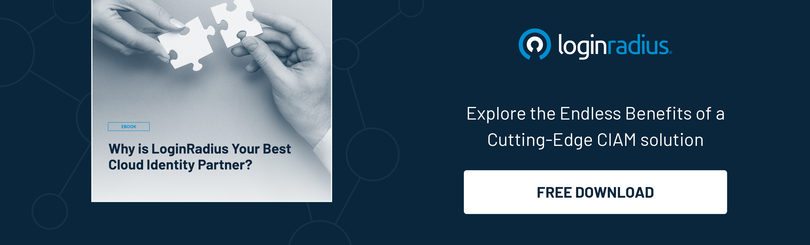

## Introduction

Admit it, you’ve heard the term “cloud computing” numerous times, and most of us aren’t sure about it. 

Cloud computing can be defined as the availability of several on-demand computing resources, including servers, data storage devices, computing devices, networking, etc., over the internet that helps businesses reinforce innovation without any hassle. 

The concept of cloud computing has offered endless possibilities to businesses since enterprises can avoid several upfront costs, [security challenges](https://www.loginradius.com/blog/identity/cloud-computing-security-challenges/) and can quickly rent access to any application or storage from a cloud provider.  

Let’s dig deeper into this and understand the role of cloud computing in shaping the future of a digitally-advanced modern world. 

## How Does Cloud Computing Work? 

The concept of cloud computing is simple - you only need to rent and pay for the services you need to run your platform, application, software, or program. 

Gone are the days when enterprises invested heavily in building infrastructure, and they had to spend vast sums of money on maintaining those infrastructures. Businesses now prefer renting storage or systems rather than owning them in-house. 

Also, cloud providers offer different services that meet the demands of businesses of every size. For instance, an enterprise can choose a storage capacity per their requirements or a computational capacity depending on their computing needs. 

An enterprise need not invest in infrastructure; they just need to finalize a cloud vendor and deploy their applications or software programs on the cloud. 

## Why is Cloud Computing Swiftly Becoming the Absolute Necessity for Businesses? 

In an era where rich consumer experiences backed with robust security are all that a user needs, delivering these kinds of up-to-snuff experiences becomes an uphill battle for businesses. 

High maintenance costs of in-house infrastructures and changing demands of services have also contributed to the need for a better flexible way to leverage resources. 

Hence, cloud computing seems to be the best option for businesses embarking on a [digital transformation journey](https://www.loginradius.com/blog/identity/digital-transformation-consumer-iam/) by renting essential services from cloud vendors that save money and resources and help strengthen overall security. 

As a result, more and more businesses are deploying their services and platforms on the cloud as it offers stringent data security and ensures a great user experience at minimum costs compared to in-house deployments.

## Types of Cloud Architectures 

When we talk about cloud computing architectures, there are mainly four types:

### Public Cloud

Public clouds are the cloud environments created from information technology infrastructure and not owned by the users. This model offers on-demand infrastructure and computing services managed by a third-party vendor and shared with multiple enterprises. Amazon Web Services (AWS), IBM Cloud, Google Cloud, Microsoft Azure, etc., are some examples of public clouds. 

### Private Cloud

The cloud environments are dedicated to only a single end-user group or a user offered over the internet or an [internal private network](https://www.loginradius.com/private-cloud/) for selected users instead of the public. 

### Multi-Cloud 

Multi-cloud can be referred to as using multiple cloud services from various vendors within a single architecture that eventually improves cloud infrastructure capabilities. It can be defined as the distribution of various cloud assets, including software, programs, applications, etc., across various cloud environments. 

### Hybrid Cloud

A hybrid cloud is the cloud architecture in which applications or programs run as a combination of various other environments. These environments are connected through VPNs, LANs, WANs, or APIs. 

## Types of Cloud Services

There are three main types of cloud services: 

### Platform-as-a-Service (PaaS)

Platform as a service (PaaS) describes the complete development and deployment environment in the cloud that allows businesses to deliver cloud-based services and applications. 

### Software-as-a-Service(SaaS)

Software as a service (SaaS) is the modern way of offering applications and software programs over the internet like a service. SaaS allows zero maintenance and infrastructure costs since businesses can access services via the internet without having to maintain hardware and software. 

### Infrastructure-as-a-service (IaaS)

Infrastructure-as-a-service (IaaS) can be defined as a type of cloud computing service offering on-demand computational, storage, or network services to businesses based on their diverse needs. 

Enterprises can choose any of the services mentioned above based on their unique business requirements. 

## What is Single Tenant Cloud Architecture?

A single-tenant cloud runs on a dedicated infrastructure. This means that the hardware, storage, and network are dedicated to a single client, and there are no neighbors to share hosted resources with. They may reside in a dedicated offsite data center or with a managed private cloud provider.

In a single-tenancy architecture, each tenant gets their own database. This way, data from each tenant remains separated from the other. Furthermore, the architecture is built such that only one software instance per SaaS server is allowed.

## What is Multi-Tenant Cloud Architecture? 

[Multi-tenant cloud architecture](https://www.loginradius.com/multi-tenant-cloud/) is a single cloud infrastructure built to serve multiple businesses. The entire system may cover multiple servers and data centers, incorporated into a single database.

Cloud providers offer multi-tenancy as a gateway to share the same application with multiple businesses, on the same hardware, in the same operating environment, and with the same storage mechanism.

## Is Cloud Computing Secure? 

Although relying on cloud servers and systems have its own perks; some security risks can’t be overlooked. 

Businesses need to understand the importance of incorporating a stringent security policy to ensure their sensitive business information remains safe and their crucial consumer data isn’t compromised. 

Using cloud identity management solutions like LoginRadius CIAM helps businesses stay ahead of the competition by incorporating cutting-edge technologies like multi-factor authentication (MFA), risk-based authentication (RBA), [single sign-on](https://www.loginradius.com/single-sign-on/) (SSO) and more. 

## In Conclusion 

Cloud computing has offered endless opportunities to businesses and is becoming the preferred mode of deployment for applications and software services. 

The above-mentioned aspects describe how cloud computing could be leveraged by business organizations depending on their diverse needs. 

However, when it comes to secure cloud computing, businesses shouldn’t forget to incorporate stringent security mechanisms that can handle security vulnerabilities to ensure maximum safety for businesses and end users. 

If you’re concerned about your cloud’s security, you can reach us out to find how LoginRadius’ cloud services can help you [secure your business and consumer data](https://www.loginradius.com/blog/identity/maintaining-quality-data-security-practices/). 

