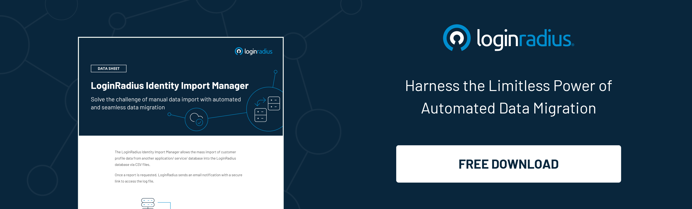

## Introduction 

Businesses are increasingly leveraging the cloud, but managing their identities in many clouds is still a major concern. 

Distributed identity management lets you leverage identity and access policies where they already exist in [multiple clouds](https://www.loginradius.com/multi-tenant-cloud/) and on-premises without hassle.

With the evolution of multi-cloud infrastructure, distributed identities are swiftly becoming the need of the hour for cloud and multi-cloud deployments. 

## What is Distributed Multi-Cloud Identity Management? 

A Distributed Multi-Cloud Identity Management (DMIM) solution is a distributed capability that lets you leverage identity and access policies where they already exist and in multiple clouds and on-premises without any hassle. 

Distributed identity management is a portal for combining cloud resources, services, and digital business applications. You can give your customers a robust customer experience by leveraging its multiple benefits. 

## Why is it Crucial for Businesses to Leverage the Cloud? 

As businesses choose multi-cloud infrastructures, managing customer identities on different clouds becomes a daunting task, especially from an information security perspective. 

Additionally, supporting manual identity and access management in a multi-cloud environment is quite costly, prone to human errors, and eventually slow.

And while these systems utilize a specific integrated identity management system in their environment, the risk of identity silos increases. Hence, the number of identity providers increases since organizations offering IaaS or PaaS usually have two or more identity providers. 

This results in complex migration from the legacy system to the newly-adopted cloud systems as the organization has to manage a challenging transition to ensure the sustainability of the existing infrastructure without any hassle. 

Apart from this, the overall investments in legacy systems don’t necessarily mean a seamless and secure transition to a multi-cloud environment. 

And here’s where the need for distributed multi-cloud identity management comes into play! 

Let’s figure out how businesses can successfully, seamlessly, and securely transit to a distributed multi-cloud infrastructure. 

### Step 1: Choosing a reliable identity orchestration platform

The pain of legacy IAM providers can be eliminated by choosing a reliable [identity orchestration platform](https://www.loginradius.com/identity-orchestration/). This platform will help your business seamlessly navigate to a distributed identity management system. 

### Step 2: Leaving your legacy infrastructure

The next big step is to modernize your infrastructure and leave your legacy system. Using identity management as Identity as a Service (IaaS), you can eventually:

* Terminate old dormant identities
* Reactivate approved accounts securely
* Review and alter access levels
* Update and implement access policies, 
* Identify and contain a breach or a security vulnerability, including compromised credentials.

### Step 3: Integrating old with new standards

Leveraging standards like [SAML](https://blog.loginradius.com/identity/saml-sso/), SCIM, and OIDS can help minimize the cost and pain of manual rewrites. And this means you can eventually speed up things without needing manual transition. 

## LoginRadius’ Federated Identity Management 

[Federated Identity Management](https://www.loginradius.com/federated-sso/) by LoginRadius helps businesses and applications use a single identity data set. Consumers need not create multiple accounts for multiple organizations to access their web applications. 

These applications do not communicate with each other directly, and standard SSO protocols like JWT, SAML, OAuth 2.0, OIDC, etc., are used to establish the communication.

LoginRadius designed Federated Identity Management to help your business in the following ways. For example, 

* **Gain access across multiple applications:** It allows applications to work together, so consumers can access multiple applications without requiring a new access credential.

* **Seamless consumer authentication:** It provides seamless access to applications, making the consumer experience quicker, simpler, and more convenient. 

* **Cost-effectiveness:** It lowers the administrative cost as the support for maintenance of web pages like login, register, access management, and consumer management is not required to be managed by your organization.

* **Highly secure model:** Because there is no direct communication with multiple service providers, passwords aren't exposed, leading to higher levels of security.

## Final Thoughts 

Multi-cloud identity management is the best way to help your business leverage cloud computing security, compliance, and cost reduction while ensuring robust controls on high-availability applications.

Distributed multi-cloud identity management is helping businesses in handling multiple identities on various clouds and on-premises. 

If you wish to experience the future of distributed cloud identity management, reach us to schedule a quick demo of LoginRadius’cloud-based customer identity and access management platform. 

