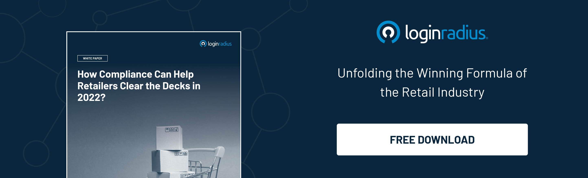

## Introduction:

Today's customers live online and don't limit their lives to a particular app or website. They want to use any device and access any resource from any place, at any time, or anywhere in the world. 

With this new, flexible digital freedom comes a whole new world of friction for businesses and enterprises — the conflict of continually entering usernames, passwords, and other credentials, even across the multiple devices customers use today.

[Authenticating users](https://www.loginradius.com/authentication/) based on how they access your applications is what we call dynamic authorization, and it's vital that you get it right. 

Dynamic authorization is a solution that allows you to strike the right balance between experience and security by unifying your customer profiles across multiple systems so that you have access to accurate information about each individual customer.

In this article, we will explain how dynamic authorization works and discuss why it's important for your organization.

## What is Dynamic Authorization and How Does it Work?

Dynamic authorization is a way to ensure that only authorized users have access to sensitive data and services. It's a process in which the application provides data to the central authorization system that identifies the nature of the request, such as a user ID and a target service or data. From there, the authorization system takes responsibility for collecting all additional data required to make the right authorization decision.

Dynamic authorization is designed to reduce security risks by providing an extra layer of protection for your most important information.  It is a method of authentication that allows mobile apps to make requests for user data without actually asking for it. You only need to define your criteria once and then let the system decide based on what happens later on in the process.

Dynamic authorizationensures that every employee has only the right amount of access to information based on their role in the company, which is critical to [preventing accidental data leaks](https://www.loginradius.com/security/) or hacking attempts. In addition to giving you complete control over who can see what data, it also allows for granular control over how data is accessed.

## Benefits of Dynamic Authorization for Enterprises

### 1. Better security for your organization

Dynamic authorization policies are the key to securing your enterprise environment. They allow you to define who can access what resources based on their role within the organization. The policies are updated in real-time as users change roles or lose access rights. This makes dynamic authorization an ideal solution for organizations that want to ensure their employees don't have inappropriate access to sensitive information or services.

### 2. Achieving seamless experiences is the key

Dynamic authorization helps you tailor logic around what your customers can see and do on your site or app, which leads to increased engagement, satisfaction, and revenue. With authorization in the background providing a more straightforward, seamless frontend experience for users - you can offer a personalized experience which keeps them coming back for more. You can also control what your customers see and do, leading to increased engagement and revenue.

### 3. Better compliance

Dynamic authorization helps you stay ahead of regulations and protect your organization from data breaches. It's a system that allows you to control which attributes can be accessed, shared, and used by different users. It also maintains privacy consent enforcement mechanisms so only those with the appropriate permissions can access or use data.

In other words, it ensures that if someone tries to access something they aren't supposed to, they won't be able to do it.

## How Can Dynamic Authorization Improve Customer Experience?

Customers should always be at the center of your business strategy. Providing security is essential but not as important as providing an experience that lets customers from coming back for more. 

As customers expect more seamless and convenient experiences, companies must provide them with the ability to quickly and easily access their accounts and services. And that's where dynamic authorization comes into play. It is maturing and gaining momentum. It offers organizations the capabilities they need to deliver the seamless and convenient experiences that today's customers expect.

All this time, we have known that understanding the identity of the person making a transaction that who they are, and what they are doing empowers companies to serve their customers better. But today, we find that dynamic authorization has a far more significant impact on businesses, their customers, and users than most people realize. It tremendously affects how companies must operate in an increasingly competitive digital world.

It gives you the opportunity to not only improve customer experiences but also increase sales, create better products and services and ultimately transform your business into a data-driven one.

## In Conclusion

Dynamic authorization can adapt quickly to changing business requirements now and in the future. It provides the flexibility you need to maintain an effective data security program while meeting your customer's expectations. 

With solutions that enable dynamic policy changes, you can easily adapt to changes in your business environment, control access to sensitive data, and minimize loss of control over that data. This allows you to confidently navigate business processes, knowing that you are fully prepared for any data security or compliance challenges.
 

