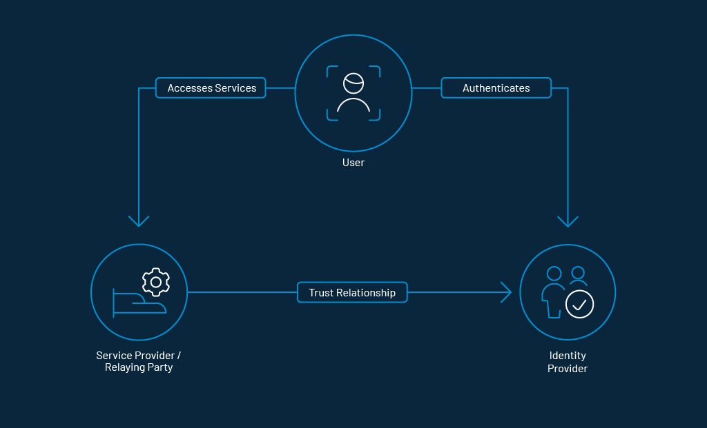

# What is Federated Identity Management

_Federated identity management was designed as a set of protocols and standards to help businesses share consumer identities._

Let's face it upfront. Password management is a painful exercise, which no one wants to deal with. While pros use password managers to create and manage passwords, the not-so-tech-savvy or, for that matter, average users adopt guessable passwords like 1234 to save themselves from the hassle of remembering complex codes. 

Though guessable passwords make password management hassle-free, it exposes users to hackers. No wonder a large chunk of consumers often falls prey to sensational data theft. 

Fortunately, _Federated Identity Management_ (FIM) has got the right answer to it, which both organizations and end users would prefer to have at the disposal - sooner than later. 

## Understanding  Federated Identity Management

Federated identity management is an arrangement that can be brought into effect between two or more trusted domains to enable users to access applications and services using the same [digital identity](https://www.loginradius.com/blog/identity/2019/10/digital-identity-management/). FIM ensures both seamless and secure access that goes a long way in enhancing the overall user-experience. 

To have a fair perspective, we will have to take an in-depth look at the whole scenario. 

Every time an enterprise introduces a new application, consumers are forced to create a password for sign-in. Already burdened by a ton of passwords, most consumers either opt for a simple code or use the same cliched ones they have been using for a while. This results in a massive pile-up of passwords that they have to remember. 

An [average person has 70-80 passwords](https://www.newswire.com/news/new-research-most-people-have-70-80-passwords-21103705), and that's a lot to remember. The entire cycle of creating passwords, forgetting, and resetting is vexing - to say the least!

While it is easier to blame end-users for being unable to manage passwords, enterprises are also indirectly responsible for the whole mess-up.

What's the point of spending millions on driving traffic if the end-users' access to your offered product is fraught with risk? 

Well, this is where federated identity management comes into the reckoning. 

## What is an Identity Provider

Another pivotal aspect of FIM is an [Identity Provider](https://www.loginradius.com/identity-providers/) that manages everything from behind the scene. In a nutshell, an identity provider (also known as IdP) has the responsibility of creating and managing consumers.

Whenever a consumer tries to sign in to the application, an IdP authenticates the login credentials. After the authentication is complete, the application lets the consumer in. 

## How Does FIM Work

Let's understand how federated identity management work with an example. Let's assume your business needs to collaborate with a third-party. In the absence of a federated identity, you will need to set up an account on their website with a username and password to access their domain. 

So, when the consumer leaves, you will have to ask them to cancel the account and remove access. 

With a federated identity management system, the consumer will need to login only once using the assigned username and password. Once they are allowed in, they only need to click on the partner company page. They will be redirected to a request page where they can authenticate their access. 

The portal will directly verify the consumer’s data through [Security Assertion Markup Language](https://www.loginradius.com/single-sign-on/) (SAML) or OpenID standards.

As soon as they are granted access, they would be redirected to the partner company's page.

So, the next time they log in to your company page, the consumer will also get access to the partner page over a quick authentication request.

## Advantages of Using Federated Identity Management

Though FIM has several advantages, we are going to highlight the most pivotal ones: 

*   **Reduces administrative overhead:** Another significant advantage of FIM is the ability to reduce administrative overhead. Thus, the administrator remains away from the complexity of creating multiple accounts and spending hours managing different ‘username’ and ‘password’ combinations.

*   **Single sign-on:** With Federated Identity, businesses can implement [single sign-on](https://www.loginradius.com/blog/identity/2019/05/what-is-single-sign-on/) using existing Active Directory credentials. This means consumers need not create new accounts for each service provider or remember multiple usernames and passwords. 

*   **Minimizes security risks**: You can keep the authentication process within your on-premises Active Directory using Federated Identity. You do not even need to synchronize password hashes on the cloud, as they are stored on-premises, behind your firewall. 

*   **Increases organizational productivity**: Due to the lack of multiple logins, there will be lesser helpdesk calls for password resets. This saves a lot of time and efficiency, which leads to a potential increase in administrative overhead. 

## Risk Management in Federated Identity Management

Risk management is a critical aspect of Federated Identity Management (FIM), ensuring that the benefits of streamlined access and improved user experience do not come at the cost of security vulnerabilities.

**1. Minimizing Password-Related Risks:** FIM reduces the need for multiple passwords, which are often weak and reused across platforms. By centralizing authentication through an Identity Provider (IdP), FIM minimizes the risk of password-related breaches.

**2. Enhancing Authentication Security:** FIM systems often employ robust authentication protocols such as Security Assertion Markup Language (SAML), OpenID Connect, and OAuth 2.0. These protocols enhance the security of authentication processes, ensuring that only authorized users gain access.

**3. Controlling Access Privileges:** With FIM, administrators can manage access privileges more efficiently. This centralized control allows for timely updates to user permissions, reducing the risk of unauthorized access due to outdated or incorrect user roles.

**4. Protecting Sensitive Data:** By keeping authentication processes within a secure, on-premises environment or a trusted cloud service, FIM ensures that sensitive data, such as password hashes, remain protected from potential breaches.

**5. Monitoring and Auditing:** FIM systems typically include comprehensive logging and monitoring capabilities. These tools allow organizations to track access attempts, detect anomalies, and quickly respond to potential security threats.

## Why Businesses Should Consider Implementing Federated Identity

Businesses should implement FIM due to its versatility. It lets users access data with utmost ease while still offering a top-notch [safeguard against data breaches](https://www.loginradius.com/blog/identity/2019/10/cybersecurity-best-practices-for-enterprises/).

Apart from boosting the user experience, it also takes control of administrative overhead. Add to that the lucrative cost-effective measure. 

## Common Challenges in Federated Identity Management

While Federated Identity Management offers numerous advantages, implementing it comes with its own set of challenges that organizations need to address.

### 1. Integration Complexity

Integrating FIM with existing systems and applications can be complex. Organizations often face difficulties in ensuring seamless interoperability between various platforms and the FIM system.

### 2. Trust Establishment

Establishing and maintaining trust between different domains is crucial for FIM. Ensuring that all parties adhere to the same security standards and protocols is essential, but can be challenging.

### 3. Identity Provider Dependence

Relying on a single IdP can create a single point of failure. If the IdP experiences downtime or a security breach, it can disrupt access to multiple services and applications.

### 4. User Privacy Concerns

Handling user identities across multiple domains raises privacy concerns. Organizations must ensure that user data is managed in compliance with relevant data protection regulations and that users' privacy is respected.

### 5. Administrative Overhead

While FIM reduces some administrative tasks, it can introduce others. Administrators need to manage the FIM infrastructure, handle federated trust relationships, and ensure ongoing compliance with security policies.

### 6. Security Risks

Despite its security benefits, FIM can introduce new risks. Misconfigurations, inadequate monitoring, and failures in protocol implementations can expose the system to security threats.

Addressing these challenges requires careful planning, robust infrastructure, and continuous monitoring to ensure that the FIM system delivers its promised benefits without compromising security or usability.

## Introduction to LoginRadius' Federated Identity Management

Equipped with custom technologies, LoginRadius' FIM takes federated identity management experience to an altogether new level. 

It simplifies the implementation of Single Sign-On (SSO) and user experience across applications. Consumers can access multiple applications without requiring a new access credential.

The key capabilities of federated identity management by LoginRadius include:

*   LoginRadius supports industry-standard SSO protocols like SAML, JWT, OAuth 2.0, OpenID Connect, and Web Services Federation.

*   The [CIAM](https://www.loginradius.com/blog/identity/2019/06/customer-identity-and-access-management/) platform offers a simple dashboard to manage all configurations required for these protocols. 

*   LoginRadius covers end-to-end API support for the SSO protocols. This makes integration and implementation relatively easy to execute. 

*   LoginRadius acts as an IdP that stores and authenticates the identities consumers use to log in to systems. 

## Conclusion

Federated identity management is increasingly becoming a must-have for more than one reason. Enterprises have realized that the huge spending on an advertisement, boosting traffic, and the endless campaign counts for nothing if the core customers aren't pleased. 

FIM enhances the overall user experience of a customer by bringing into effect the much-required ease of use and intuitive experience, which makes it a real business enabler. Putting [security threats](https://www.loginradius.com/blog/identity/2019/10/cybersecurity-attacks-business/) like hacking and sensational data theft at a fair distance goes a long way in assisting an organization win the coveted trust.

FIM is all set to go mainstream for being a relatively young technology, which speaks volumes of the rapid pace with which organizations are implementing it. 

## Frequently Asked Questions (FAQs)

**1. What is federated identity management?**

Federated Identity Management (FIM) is a system that allows users to access multiple applications across trusted domains using the same digital identity.

**2. What is an example of a federated identity?**

An example of a federated identity is using a Google account to sign in to third-party applications like YouTube, Spotify, or various online services.

**3. What are the 3 most important components of federated identity?**

The three most important components are the Identity Provider (IdP), the Service Provider (SP), and the authentication protocols like SAML, OAuth, or OpenID Connect.

**4. What is the function of a federated identity?**

A federated identity enables seamless and secure access to multiple applications and services without the need for separate login credentials.

