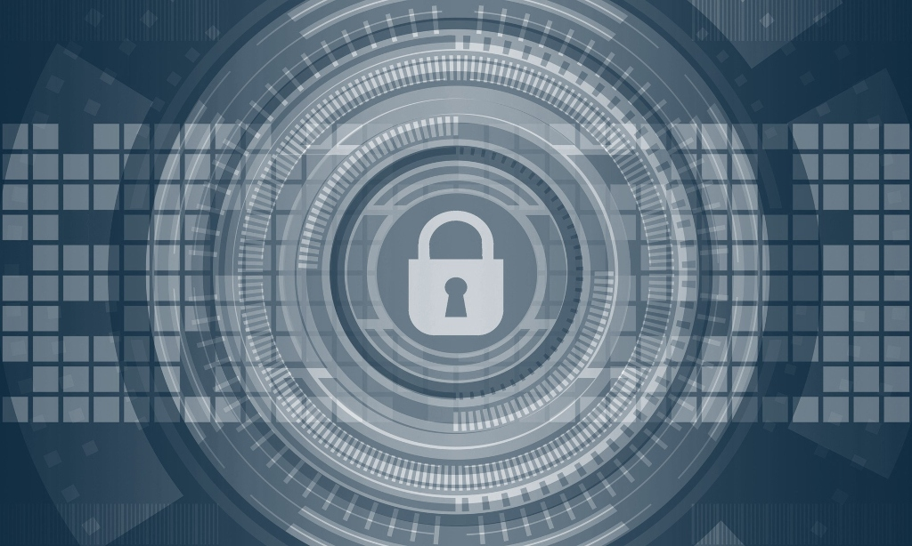
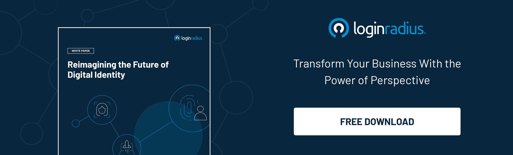
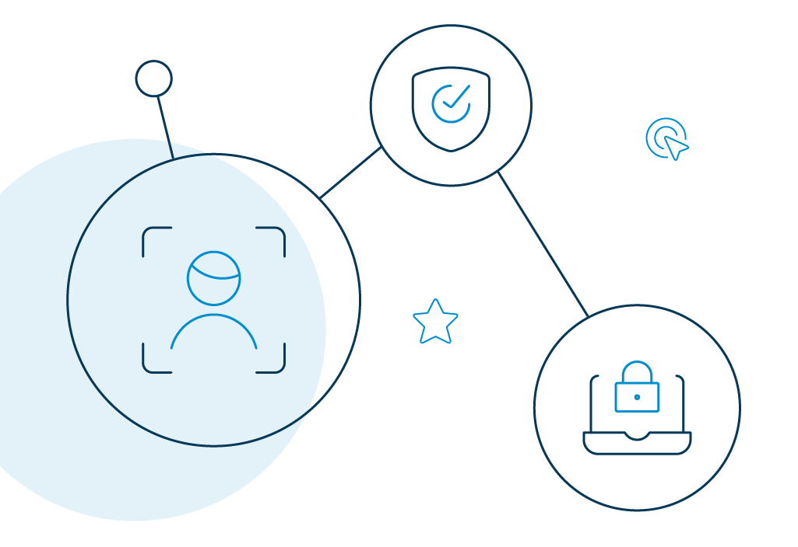

# What is IAM

Identity and Access Management (IAM) is a core discipline for any enterprise IT, as it is inseparably linked to the security and sustainability of companies. 

When more and more businesses storing their confidential data electronically, it is important to ensure that data remains secure.

"Users," "roles," "access" might be some of the terms you have heard concerning identity and access management. So, let's break it down.

*   **Identity**: Identity implies how you are represented and digitally documented online, sometimes through social login, work email address, or personal email ID. 
*   **Access**: Access refers to determining that the right user can access the right resource securely inside a network, at the right time.

This is majorly what an ideal identity and access management strive to provide. 

## What Is Identity and Access Management in Cybersecurity

Identity and Access Management in cybersecurity refers to the security framework and disciplines for managing digital identities. It regulates the responsibilities and access privileges associated with individual consumers and the conditions in which such privileges are allowed or denied.

In simpler terms, IAM encompasses:

*   The provisioning and de-provisioning of identities in the IAM system.
*   Securing and authenticating identities.
*   Authorizing access to resources or performing certain actions.
*   Incorporating the correct levels of protection and access for sensitive data. 

IAM includes tools like two-factor authentication, multi-factor authentication, single sign-on, and privileged access management. These tools can store identity and profile data safely. 

They also comply with [data governance](https://www.loginradius.com/blog/identity/2020/07/data-governance-best-practices/) functions to ensure that only appropriate and relevant information is being shared. 

Information technology (IT) administrators can restrict user access to sensitive data within their organizations by putting an IAM <a rel="nofollow" href="https://www.softwareworld.co/best-identity-management-software/"> security framework </a> in place.

### What Are the Key IAM Terms

Here are some of the key terminologies that you will encounter while processing identity and access management. 

*   **Access management**: It refers to the processes and tools used to control and monitor network access for both on-premises and cloud-based systems.
*   **Authentication**– It is the first in the login process in which users enter their credentials to verify their identity.
*   **Authorization**– After authentication, the system now determines whether the authenticated user has permission to perform the action they have requested.
*   **De-provisioning**- It is the process of removing an identity from an ID repository and terminating access privileges.
*   **Entity**- The identification that has been used to authorize an entry. Usually, this comes either from a task grouping or an individual user account.
*   **Identity Analytics** – They are repositories that capture logging activities for authentication and authorization. 
*   **Managed Policy** - It is a set of rules that an IAM system follows to track which users, organizations, and positions have access to which services.
*   **Multi-Factor Authentication** - It verifies consumer identities by adding (compulsory or optional) additional layers of security to the authentication process, usually in the form of numeric or alphanumeric codes. 
*   **Principal**: The source that demands permission to access a resource. It can be a human being or an automated system. 
*   **Privileged account management**:  It refers to managing and auditing accounts and data access based on consumers' allowed privileges. 
*   **Risk-Based Authentication** - It is an advanced authentication method that uses real-time intelligence to verify a consumer based on certain risk scores. They usually include factors like login device, consumer identity, geolocation, geo velocity, number of failed login attempts, and more. 
*   **Single Sign-On** - It allows consumers to log in to multiple independent applications with a single set of credentials, eliminating the need for multiple usernames and passwords.
*   **User Provisioning** – It is the process of creating new enterprise accounts for users and assigning them [access privileges](https://www.loginradius.com/provisioning/).

## How IAM Works

Identity and access management systems perform three main tasks viz. identification, authentication, and authorization. In other words, IAM functions to provide the right people access to devices, hardware, software applications, or any IT tool to perform a specific task. 

All IAM includes the following core components:

*   A database that includes the identities and access rights of users.
*   IAM tools to provision, monitor, change and remove access privileges.
*   A framework for auditing login and access history.

The list of access rights must be up-to-date all the time with the entry of new users or the change of roles of current users. In an enterprise, the responsibilities of identity and access management typically come under IT or departments that handle data processing and cybersecurity.

### The key functionalities of an IAM 

*   **It manages identities**: IAM creates, modifies, and deletes users. It also integrates with one or more other directories and synchronizes with them.
*   **It provisions/provisions users**: Once a user seeks permission to enter a system, IAM specifies which resource the user has access to and what level of access (like editor or viewer) based on their roles in the organization. On the contrary, when a user leaves the organization, IAM deprovisions from all the systems they have access to. After all, an ex-employee still having access to an organization's resources can have serious security implications. 
*   **It authenticates users**: IAM authenticates users using tools like multi-factor authentication and adaptive authentication when they request access.
*   **It authorizes users**: After authenticating, IAM authorizes access to specific apps and resources based on predefined provisioning.
*   **It provides report**: IAM provides reports to help organizations identify possible cybersecurity threats, and strengthen their safety processes under global compliances. 
*   **It offers single sign-on**: IAM allows consumers to access any connected web properties with a single identity. SSO adds security to the process of authentication and makes it even easier and faster to access resources. 

## Designing a Modern IAM Program for Your Enterprise

Here are the best practices to enable a smooth and seamless integration of a modern IAM program. 

### Define your IAM vision

Your IAM should be a combination of modern technologies and business processes. You need to understand your current IT and network infrastructure and build your future capabilities around it. 

Later, incorporate authorization, privileges, policies, and other constraints to ensure secure access into your web properties. 

### A strong foundation is a must.

This includes a thorough assessment of the capabilities of the IAM product and its sync with organizational IT. An efficient risk evaluation should ideally cover:

*   An understanding of what third-party apps are currently in use.
*   What are your technological forte and limitations?
*   Should you build or buy your IAM solution? 

### Stage-wise implementation.

An IAM program is usually implemented based on the two practices mentioned above. However, to avoid any complications, most IAM experts recommend a stage-wise implementation process.

### Conduct a stakeholder awareness program.

Your stakeholder awareness program should cover detailed training about your product abilities, scalability standards, and what technologies you are using. However, more than anyone, train your IT teams as they should most definitely know about your IAM's core capabilities.

### Identity should be your core security parameter.

Organizations should move from the conventional focus of securing a network to securing identity. Centralize security controls around the identities of users and facilities.

### Enable multi-factor authentication (MFA).

[MFA](https://www.loginradius.com/blog/identity/2019/06/what-is-multi-factor-authentication/#:~:text=10%20min%20read,And%20that's%20the%20catch!) is a crucial part of identity and access management. After all, it adds multiple security layers to user identities before allowing access to an application or database. Therefore, ensure that you have enabled MFA for all users and consumers, including IT admins and C-suite executives. 

### Implement Single Sign-On (SSO).

Establish SSO for all your web properties (devices, apps, and services) so consumers can use the same set of credentials to access multiple resources. 

### Enforce a zero-trust policy.

Zero Trust is a holistic approach to network security where consumer identities are strictly verified, regardless of whether they are located inside or outside the network perimeter. However, it is only effective when you track and verify the access rights and privileges of consumers on an ongoing basis. 

### Implement a strong password policy.

Enforce a strong password policy for both employees and your consumers. Make sure they are updating passwords regularly and aren't using sequential and repetitive characters.

### Secure all privileged accounts.

A good way to protect your critical business asset is to secure all privileged accounts. For starters, limit the number of users who have access to those accounts.

### Conduct access audits from time to time.

Regularly conduct access audits to ensure that whatever access you have granted is still required. You can offer additional access or revoke consumer access based on your audit report.

### Favor passwordless login.

[Passwordless login](https://www.loginradius.com/blog/identity/2019/10/passwordless-authentication-the-future-of-identity-and-security/) simplifies and streamlines the authentication process by swapping traditional passwords with more secure factors. These extra-security methods may include a magic link, fingerprint, PIN, or a secret token delivered via email or text message. 

## Benefits of Identity and Access Management

### It reduces security risk.

Organizations can use identity and access management solutions to detect unauthorized access privileges, validations, or policy violations under a single system. You can also ensure that your organization meets necessary regulatory and audit requirements.

### It is easy to use.

With IAM, it is easier to provision and manage access to end-users and system administrators. It also simplifies and secures the process of [registration and authentication](https://www.loginradius.com/authentication/). 

### It reduces IT costs.

Using IAM can lower operation costs to quite an extent. For example, with federated identity, organizations can integrate third-party services into their system. Similarly, with cloud IAM organizations need not buy or maintain on-premise infrastructure.

### It improves user experience.

SSO removes the need for users to recall and enter multiple passwords. Gone are the days of trying to remember dozens of password variations. With SSO, every time consumers switch to a new connected device, they can enjoy automatic logins.

### It enhances security profiles.

Modern IAM systems use [SSO](https://www.loginradius.com/single-sign-on/) with additional levels of protection. A majority of these systems use Security Assertion Markup Language (SAML) 2.0 that can authenticate and authorize users based on the access level indicated in their directory profiles. 

A few other benefits of identity and access management system include:

*   It enables secure, low-friction access through seamless authentication to different web properties. 
*   It demonstrates an extreme degree of scalability by anticipating potential surges and dips in consumer registrations and activities. 
*   It provides a unified experience by utilizing consolidated reports and analytics of user demographics, social registration and login data, revenue activities, and more. 
*   It adheres to privacy regulations for protecting data in transit and at rest.
*   It keeps user data protected at all times by developing flexible schemas to get the most out of a system. 

## How IAM and Compliance Are Related to Each Other

Consumer data centricity is crucial to the success of any business today. Organizations should securely collect, manage, analyze, and protect their data. However, the method of capturing and safely storing user data can be difficult. 

Many companies keep hundreds of separate data silos to get the job done. Fortunately, an identity and access management solution can help organizations break down these silos and store data into a unified database that provides a consistent view of the client across the business ecosystem. 

Consumers want more control over their data at the same time. They want the nod on how brands use their data, they also wish to know precisely what they agreed to while using the product or service. An IAM solution offers trust and transparency to consumers by helping organizations ensure compliance with local and global regulations. 

Speaking of regulations, many are industry-specific, such as the Health Insurance Portability and Accountability Act (HIPAA) for healthcare organizations. Others apply more broadly, such as the Payment Card Industry Data Security Standard (PCI DSS) that must be adopted by any organization that collects debit and credit card information.

The most disruptive regulations in recent years are the ones related to ensuring consumer privacy, such as the General Data Protection Regulation (GDPR) and the California Consumer Privacy Act (CCPA). 

The following are a few of the [major security assurance programs](https://www.loginradius.com/blog/identity/2020/03/how-loginradius-helps-enterprises-stay-ccpa-compliant-in-2020/) identity solutions adhere to: 

*   OpenID - End-user identity verification supported by OAuth 2.0 protocol
*   PCI DSS - Administered standard for payment transactions
*   ISO 27001:2013 - Information security management system
*   ISO 27017:2015 - Information security for cloud services
*   AICPA SOC 2 (Type II) - System-level controls for Trust Services Criteria - security, availability, process integrity, confidentiality, and privacy 
*   ISAE 3000 - International attestation standard for assurance over non-financial information 
*   NIST Cybersecurity Framework - Standardized security framework to manage and reduce cybersecurity risk.  
*   CSA CCM Level 1, Level 2 - STAR Self-Assessment, STAR Certification, STAR Attestation, and C-STAR Assessment.
*   CIS Critical Security Controls Global standards for internet security
*   US Privacy Shield Complaint resolution for EEA citizens
*   ISO/IEC 27018:2019 - PII Protection

## The Future of IAM in the Post-COVID Digital Era

We live in the age of ever-growing cybersecurity threats. Organizations cannot afford to undermine the value of managing identities inside or across their systems. An IAM solution ensures that all identities are tracked, updated, and maintained throughout the users' lifecycle. 

Although 2020 has been a year-long roller coaster with the pandemic hitting hard, there's one thing that happened for sure. Digital transformation has progressed at an unparalleled pace, and identity and access management (IAM) is a major part of that evolution. 

Let's look at some of the most changing developments in the IAM market anticipated in 2021.

### User managed access (UMA) will reign supreme in 2021.

With more and more services migrating to the digital front, users are expecting amazing experiences online. To keep up with these demands, as more organisations continue to adopt the delegation model, digital interactions will need to include more than one identity. 

In 2021, conventional authentication and MFA controls will take over solutions that include a central management framework for organizing digital resources that reside in many places. 

### 2021 will be the year of zero login methods.

Now that passwordless authentication (such as biometrics)  has witnessed abundant adoption, we can see a shift to a "zero login" mechanism that reduces user friction. 

Since, there will be no credentials to remember, MFA will take the backseat. Zero login will allow consumers to use variables such as fingerprints, keyboard typing habits, the way the phone/device is kept, and other markers to verify identification in the background while the user enjoys a frictionless experience. 

### IT will infuse access governance to protect workforce cybersecurity.

The threat landscape is rapidly changing, courtesy, the increasing pressure on conventional identity governance and administration (IGA) solutions. In addition to rising compliance risks, business IT environments are becoming more complex every year. 

In 2020, we will witness AI being increasingly employed to enable an autonomous approach to identity. AI-infused authentication and authorization solutions will be integrated with existing IGA solutions. 

And when that happens, it will be easier for enterprises to capture and analyze all identity data and provide insight into various risk levels. 

## How LoginRadius IAM Solution Can Accommodate Your Enterprise Requirements 

With the [right IAM provider](https://www.loginradius.com/), organizations can enjoy enormous time-saving, efficiency-building, and security-boosting benefits, irrespective of where they operate. 

LoginRadius' extensive experience in the identity and access management market will help you build the right process for your enterprise. 

LoginRadius offers you the following tools to help you build secure, seamless experiences for your consumers and workforce.

*   **Single Sign-On**: LoginRadius SSO provides your users with a single identity to access all of your web assets, mobile applications, and third-party systems. 

    As your users navigate from one property to the next, you can recognize who they are, and document and access their activities in a central profile.

*   **Multi-factor authentication**: MFA verifies identities by adding additional layers of security to the authentication process. By requiring at least an extra step to verify identities, MFA ensures that the right consumer has the right access to your network. 

    It lifts off the burden of stolen or lost passwords on consumers and makes it harder for criminals to get into their accounts. 

    Additional forms of MFA by LoginRadius include security questions, biometric verification, automated phone calls, Google Authenticator, and social login. 

*   **Federated SSO**: [Federated SSO](https://www.loginradius.com/federated-sso/) allows users to gain access to multiple organizations' web applications using one digital identity. 

    LoginRadius supports standard SSO protocols like SAML, JWT, OAuth 2.0, OpenID Connect (OIDC), and Web Services Federation. The IAM platform offers a simple dashboard to manage all configurations required for these protocols.

*   **User management**: LoginRadius offers complete user management features, including: 
*   Authorization: To validate the access rights of users.
*   Provisioning: To create user accounts.
*   Deprovisioning: To block, or delete user accounts.
*   Account Management: To disable user accounts, and grant, or restrict access.
*   Password Management: To trigger the password reset option for user accounts.
*   **Compliance with privacy regulations**: The LoginRadius Identity Platform handles consent management by ensuring continued compliance with all major privacy regulations, including the GDPR of the EU and the CCPA of California. 

## Conclusion 

Powerful identity and access management solutions offer the right tools to ensure users can engage with enterprises at any time, from any device, securely. Organizations will need to rethink their business and operating models. 

There is a huge demand to invest in new digital methods of communication.  And prioritizing [digital security](https://www.loginradius.com/blog/identity/2020/06/consumer-data-privacy-security/) will go a long way. 

