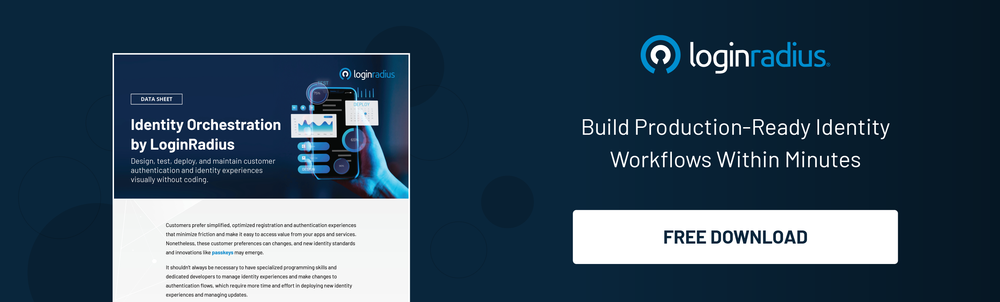
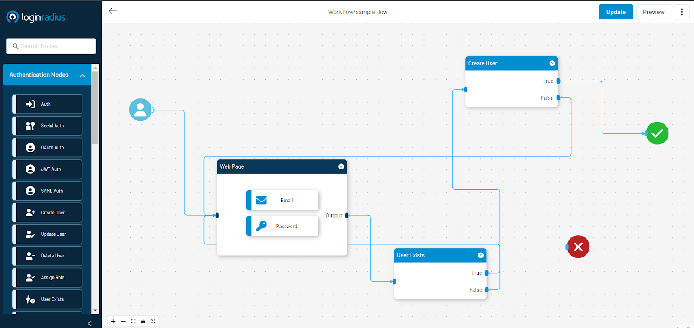

# Introduction

The average person uses between 6 and 7 social media accounts, and about [28% of people](https://www.statista.com/statistics/1291843/number-of-email-addresses-people-have-us/) in the US manage more than four email addresses. Now, throw in the corporate environment, where employees access sensitive information across a growing number of software platforms. It is clear that traditional identity management approaches are struggling to keep up.

  

**Why are Traditional Authentication Methods Falling Short?**

  

Think about it—when you’re managing many passwords, logins, and access points, it’s easy to feel overwhelmed. [Traditional identity management](https://www.loginradius.com/blog/growth/5-signs-ciam-over-traditional-iam/) systems often rely on outdated methods, like static passwords and isolated access controls. These approaches simply can’t keep pace with the dynamic, interconnected nature of modern tech environments. The result? Security gaps, password fatigue, and a general sense of chaos.

  

This is where Identity Orchestration comes in. At its core, orchestration is about integrating and coordinating different identity management solutions into a single, seamless system. This approach not only streamlines authentication and authorization processes but also enhances security by ensuring consistent identity governance across diverse ecosystems.

  

This blog will explain what identity orchestration is, what its key components are, its key functions, how it works, and the benefits for its adopters.

# What is Identity Orchestration?

Identity orchestration is a suite of technologies designed to help organizations automate and manage their authentication and authorization workflows across disparate identity ecosystems. With its low-code interface, it simplifies identity management for IT teams by unifying processes like user registration, login, [multi-factor authentication](https://www.loginradius.com/multi-factor-authentication/) (MFA), and integration with CRMs and external user databases.

  

For example, an organization can streamline its operations by removing labor-intensive administrative tasks and speed up user onboarding and change management—all without needing to write custom code or scripts.

# Key Components of Identity Orchestration

## Identity Integration

Identity Orchestration seamlessly integrates various [identity providers](https://www.loginradius.com/identity-providers/) (IdPs) and services, including Single Sign-On (SSO), Multi-Factor Authentication (MFA), and directory services. This integration allows users to access multiple applications and services using a single set of credentials, simplifying the login process and enhancing security.

## Policy Management

Centralized policy management is a crucial aspect of identity orchestration. It allows organizations to define and enforce authentication and authorization policies consistently across all connected services, ensuring compliance and security.

## Workflow Automation

Identity orchestration automates the workflows involved in user authentication and authorization. This automation reduces manual intervention, minimizes errors, and accelerates the process of granting access to users.

## Contextual Authentication

With identity orchestration, organizations can implement contextual authentication, which considers factors such as user behavior, location, and device to determine the level of authentication required. This adds an additional layer of security by making it more difficult for unauthorized users to gain access, even if they have valid credentials.

# How Does Identity Orchestration Work?

Identity Orchestration serves as a layer that abstracts, integrates, and orchestrates identity data and makes it easily accessible through a uniform set of APIs and interfaces. This means that tasks that were traditionally considered complex for IAM practitioners, such as automating policy enforcement, configurations, and managing identities across different systems can be streamlined with an orchestration software.

For example:

When a user logs in to a banking app, they can view their account balances and perform internal account transfers without requiring additional authentication.

However, when the user attempts to transfer money to an external account, the identity orchestration system triggers a step-up authentication process, prompting the user to provide an additional authentication factor such as a [one-time password](https://www.loginradius.com/blog/identity/one-time-passwords-security-benefits/) (OTP) sent to their registered mobile number or email. This dynamic adjustment in the authentication process based on the specific transaction type enhances security and ensures that more sensitive actions undergo additional verification, aligning with the organization's risk management policies.

That’s how Identity Orchestration works.

# Features and Capabilities of Identity Orchestration

-   **Automation of Workflows:**
    -   Streamlines user provisioning and deprovisioning, access requests, and approvals.
    -   Reduces manual effort and errors, ensuring accurate access controls.
    -   Enhances operational productivity and security through efficient process management.
    
-   **Multi-cloud and Hybrid Cloud Support:**
    -   Manages identities across public, private, and hybrid [cloud environments](https://www.loginradius.com/multi-tenant-cloud/).
    -   Provides seamless integration and consistent identity management across different cloud platforms.
    -   Facilitates secure and unified access in diverse IT environments.
    
-   **Integration with Various Identity Providers (IDPs):**
    -   Connects and manages user identities from multiple IDPs like Google, Microsoft Azure AD.
    -   Centralizes identity management processes and streamlines user authentication.
    -   Supports identity federation for secure and seamless access across systems and applications.
    
-   **Policy Enforcement and Lifecycle Management:**
    -   Defines and enforces access policies based on user roles and attributes.
    -   Manages the entire user lifecycle, from account creation to retirement.
    -   Maintains accurate user information, enforces security policies, and ensures [regulatory compliance](https://www.loginradius.com/compliances/).
    

# Benefits of Identity Orchestration

## Centralized policy enforcement across clouds

By centralizing policy enforcement through an integrated identity fabric, identity orchestration ensures consistent policy implementation across all identity systems, regardless of the cloud environment. This enhances security, reliability, and overall governance.

## No-code migration to the cloud

Transitioning from legacy identity systems to cloud-based solutions often involves migrating multiple applications from old to new infrastructure, typically requiring extensive re-coding for each individual application. This process can be overwhelming when dealing with a large number of applications. Identity orchestration provides a no-code approach to modernizing apps and facilitating the retirement of outdated identity infrastructure. By leveraging orchestration, organizations can achieve cost savings, streamline the migration process, and accelerate app modernization within minutes, rather than months.

## Increased developer productivity

Identity orchestration systems make it easier for IT teams to handle user access and permissions without having to write custom code. This means developers can focus on creating new features for the product, and IT teams don't have to deal with as many problems related to user authentication or complicated setup processes.

## Improved Security and Compliance

Identity orchestration systems are designed to analyze login attempts in real-time and adapt user pathways based on the perceived level of risk. Through bi-directional integrations with external fraud detection services, they can leverage additional signals to detect and prevent unauthorized access. Additionally, orchestration supports compliance efforts by maintaining access controls and identity governance.

## Increased Scalability

Identity orchestration offers a scalable solution by seamlessly integrating with current systems and facilitating the effortless onboarding of new applications. This capability empowers organizations to swiftly adjust to evolving business demands without compromising security or user experience.

# Getting Started With LoginRadius’ No Code Identity Orchestration

LoginRadius Identity Orchestration makes it easy for developers to create and customize identity workflows using a simple drag-and-drop interface. This feature allows teams with limited technical knowledge to quickly manage authentication processes, helping them adapt to changing customer needs and regulations.

With LoginRadius Identity Orchestration, you can seamlessly integrate with your existing CIAM systems. Whether you use single sign-on, multi-factor authentication, or passwordless login, LoginRadius ensures these elements work together smoothly. This integration doesn't just streamline identity management; it also boosts security and compliance.

By using automation, the platform eliminates the need for manual tasks, enabling developers to implement complex identity workflows more efficiently. Other key functions include:

  - A user-friendly drag-and-drop interface    
  - Pre-built templates for CIAM use cases    
  - Flexible workflow creation    
  - Customizable identity experiences    
  - Dynamic workflows based on real-time events
    

For businesses managing complex CIAM use cases, LoginRadius offers the tools to unify, automate, and optimize identity processes across all platforms. Explore [LoginRadius Identity Orchestration](https://www.loginradius.com/identity-orchestration/) to discover more use cases.

# Frequently Asked Questions (FAQs)

**1. What is Identity Orchestration?**

Identity Orchestration is designing, managing, and automating identity-related workflows across various platforms and applications. It enables businesses to unify identity management processes, such as authentication, authorization, and user provisioning, into a cohesive system.

**2. What is an example of Identity Orchestration?**

A user logs into a website, and the system simultaneously verifies their identity through multi-factor authentication, such as a one-time password sent to their mobile device. This seamless coordination of various identity verification methods and processes to ensure secure and efficient user access represents identity orchestration in action.

**3. What are the benefits of Identity Orchestration?**

Identity Orchestration offers several key benefits, including centralized policy enforcement, no-code migration to the cloud, increased developer productivity, improved security and compliance, and increased scalability.

**4. How can Identity Orchestration improve security and compliance?**

Identity Orchestration enhances security by centralizing identity management, making it easier to monitor and enforce security policies across all systems. In terms of compliance, it ensures that access controls and identity governance are consistently applied, helping organizations meet the requirements of regulations like GDPR, HIPAA, and others.

**5. What are the prerequisites for implementing Identity Orchestration?**

Organizations should have a clear understanding of their existing identity management processes, integration capabilities, automation readiness, and scalable infrastructure.