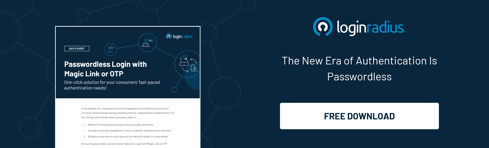

## Introduction

In this technology-driven modern world, authentication plays a crucial role, and login authentication is perhaps the most common scenario when we’re asked to authenticate ourselves. 

Login authentication, in the most simple words, is the way of confirming the identity of a user while they access their profile on a particular platform.  

Admit it; we all have been using passwords for years to prove our identity on various platforms to access specific resources or information. 

However, things have been rapidly transposing since the introduction of hassle-free authentication mechanisms. 

For instance, can you relate to a situation where you were too lazy to sign in using your password and id and used your [social login](https://www.loginradius.com/blog/identity/what-is-social-login/) instead while purchasing from an e-commerce store?

Or you preferred to set your fingerprint on your smartphone to authenticate payments and purchases instead of re-entering 4-digit passwords? 

Undoubtedly, the answer to these questions is yes! So what’s the biggest lesson that we’ve learned so far? 

We all prefer more convenient ways to authenticate ourselves, and the conventional authentication modes won’t work in this era! 

And for businesses to ensure they deliver the most pleasing experience to their customers, they have to incorporate the best login mechanism. 

Let’s look at some aspects and challenges of implementing a seamless authentication mechanism and learn how businesses can deliver a seamless user experience. 

## How is Login Authentication Works?

When we talk about login authentication, it’s divided into two major categories:

1. Human to machine login authentication
2. Machine to machine login authentication

There is a requirement for specific credentials in any of the above types of authentication. In human verification, we have a user ID and password set by the consumer, while for machines, we have certificates and IP addresses, along with other information.

Generally, a consumer has to select or create a User ID and corresponding password for that unique ID that the system will use to verify user credibility. 

Many businesses use authentication to verify the users who try to log in to their digital platforms. But if consumers' data falls into cybercriminals' hands, it can cause severe problems. Hence, businesses must use high-level security measures, which involve using another advanced authentication level such as [multi-factor authentication](https://www.loginradius.com/blog/identity/what-is-multi-factor-authentication/).

## How Does Poor Authentication Experience Affect Overall Business Growth?  

When a user lands on your website or web application for the first time, they aren’t ready to fill out lengthy registration forms while you’re registering them on your platform. They’re already leveraging quick authentication on their smartphones, and they expect the same level of usability. 

The same goes for your registered users. They want frictionless authentication when they revisit your platform and are strictly against entering usernames and passwords again and again. 

Hence, businesses that aren’t using seamless user authentication mechanisms are behind their competitors since a bit of friction in the aforementioned processes may force a user to switch. 

So, what can be the ideal solution for businesses to improve conversions and sales? 

Well, a consumer identity and access management (CIAM) solution could be the best solution to help businesses overcome the challenges of poor authentication.

## CIAM — The One-Stop Solution for Seamless Login Authentication, Security, and Compliance

The [customer identity and access management](https://www.loginradius.com/blog/identity/customer-identity-and-access-management/) (CIAM) solution takes over the customer login experience. There’s more at stake than just registration and authentication.

CIAM simplifies every business task that deals with your customers individually, including those that haven’t registered on your site yet. CIAM seamlessly links authentication, customer management, sales, marketing, business intelligence, and services with a single data hub for all identities.

In the most simple terms, customer identity and access management is a digital identity management software solution for businesses that combines login verification with customer data storage. CIAM aims to improve the customer's sign-up and login experience while securely managing customer identities.

CIAM offers the luxury of a centralized customer database that links all other apps and services to provide a secure and seamless customer experience.

## How LoginRadius CIAM Paves the Path for Business Growth?

[LoginRadius’ cutting-edge CIAM](https://www.loginradius.com/) helps businesses scale and stay ahead of their curve. Let’s understand why you need to leverage LoginRadius’ world-class cloud-based CIAM for your business. 

* **Simplified and seamless registration with social login**

Let your users register and authenticate in seconds with LoginRadius’ social login. LoginRadius has combined the APIs of over 40 social networks to create a unified social API fully equipped to handle the features of these providers.

* **Frictionless authentication with passwordless login**

With LoginRadius’ Passwordless Login, you can create a completely frictionless registration and authentication process for your customers, freeing them from the hassle of remembering yet another password.

* **Phone authentication and registration**

With LoginRadius, your customers can use their phone numbers to log in to your websites and apps. [LoginRadius Phone Login](https://www.loginradius.com/resource/loginradius-ciam-phone-authentication/) works seamlessly with mobile apps and automatically detects and fills in the verification SMS code to deliver a frictionless experience for your customers.

* **Valuable customer insights**

With LoginRadius CIAM, you can successfully target your customer base with data collected and organized in the Admin Console. The LoginRadius Identity Platform makes complex customer analytics easy to understand via detailed graphs and customer insights.

## Why Do Developers Love LoginRadius for Login Authentication? 

* **80% Faster time-to-value**

The LoginRadius Identity Platform can be deployed in weeks, providing value 80% faster than our closest competitor. 

* **Flexible and customizable**

From JavaScripts to SDKs and hosted solutions to turnkey plugins, LoginRadius provides various deployment methodologies. These methods can be used interchangeably depending on your desired login and registration workflow. 

* **Saves on resources and time**

Cut down the lines of code required with one of the LoginRadius SDKs. LoginRadius takes care of the error and exception handling and security updates and patches, so you don’t have to. Build your login and registration forms with LoginRadius JS widgets and UI/UX tools—simply copy the customized code from the LoginRadius Admin Console and paste it to your website. 

* **API driven with out-of-the-box solutions**

LoginRadius is a fully API-driven platform that can be deployed on any system. With hosted solutions such as the Identity Experience Framework, extensive SDK and JS libraries, and several CMS plugins, LoginRadius offers a range of out-of-the-box deployments for an easy, efficient, and fully customizable implementation.

## Ready to Deliver the Next Level of Frictionless Login Authentication to Your Users? 

Delivering a rich login authentication experience to your consumers is paramount for your business success, and a new-age CIAM is undoubtedly the key to delivering a flawless user experience. 

LoginRadius CIAM platform is designed to help businesses reach their targeted goals by enhancing the consumer experience, improving overall data security, and meeting regulatory compliances. 

If you wish to experience how LoginRadius works for your business, reach us today to schedule a free personalized demo. 

Our product experts will show you the power of the LoginRadius Identity Platform, discuss your use cases, and explain how our cloud-based identity management solution drives [ROI for your business](https://www.loginradius.com/blog/identity/loginradius-roi-enterprises-infographic/).

