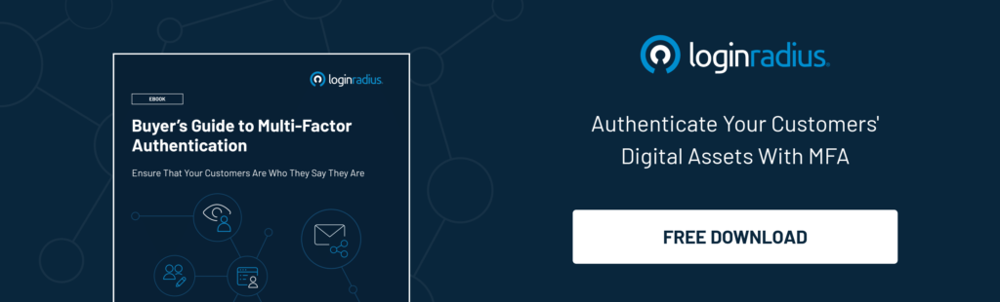

## What is Multi Factor Authentication (MFA)?

Multi Factor Authentication (MFA) is a security process that requires users to verify their identity using two or more authentication factors before accessing an account, application, or system.

Unlike traditional password-based logins, MFA adds an extra layer of security by demanding additional verification, reducing the risk of unauthorized access. For instance, a user must complete a second verification process after providing their username and password to access certain platforms or resources.

MFA is widely used in various industries, including e-commerce, media & communication, healthcare, and finance, to protect user accounts from cyber threats. Hundreds of organizations have benefited by integrating MFA. See how to [integrate MFA into security policies](https://www.loginradius.com/docs/security/customer-security/multi-factor-authentication/overview/#integration-guide) to mitigate risks associated with credential theft and data breaches.

## Why is MFA Important?

Cybercriminals are constantly exploiting weak credentials and gaining access to sensitive systems. Here’s where we get an answer to the question- Why is MFA important?

-  **Enhanced Security**: Even if a password is stolen, unauthorized access is blocked by requiring an additional authentication factor.
    
-  **Prevention of Phishing Attacks**: Since MFA requires multiple authentication steps, it significantly reduces the effectiveness of phishing attempts.
    
-  **Regulatory Compliance**: Many industries mandate MFA implementation to comply with security regulations such as GDPR, HIPAA, and PCI DSS.
    
-  **Reduced Risk of Account Takeover**: Cybercriminals find it harder to breach accounts that require multiple authentication steps.
    
-  **Business Continuity**: Companies using MFA can prevent operational disruptions caused by unauthorized access and cyber threats.
    
-  **Cost Savings and Avoiding Liability Issues**: Implementing MFA reduces the financial impact of security breaches, lowering potential fines, recovery costs, and helping organizations avoid legal liabilities related to data breaches.
    

  

## How Does MFA Work?

Since we’ve learned what MFA is and why it’s important, let’s understand how it works. The MFA process is straightforward yet highly effective. Here’s how it works:

1.  **User Enters Credentials**: The user inputs their username and password.
    
2.  **MFA Triggered**: The system asks for an additional authentication factor if the credentials are correct.
    
3.  **Verification Step**: The user provides the second factor (e.g., OTP, biometric scan, hardware token, or passkey).
    
4.  **Access Granted or Denied**: Access is granted if the second factor is valid; otherwise, the login attempt is blocked.
    

Understanding how MFA works is crucial for organizations implementing strong security policies.

MFA can be implemented in various ways, and organizations can choose the most suitable method based on their security needs and user convenience.

![A visual representation of a multi-factor authentication (MFA) login process. The image features a step-by-step authentication flow on a dark, grid-like background. The first step shows a login screen where a user enters their email (johnsmith9@mail.com) and password. The next step depicts an MFA trigger, indicating a security check prompting additional verification. The process then moves to user authentication, where the user completes verification using options like OTP, biometrics, or a security key. Finally, access is either granted or denied, represented by an icon with a green checkmark for success or a security alert for failure.](./how-does-mfa-work.png)

## Types of Multi-Factor Authentication

Different MFA methods provide varying levels of security and convenience. Here are the most commonly used types of multi-factor authentication:

### Time-Based One-Time Password (TOTP)

A TOTP is a temporary passcode generated by an authentication app (e.g., Google Authenticator or Microsoft Authenticator). The code expires shortly, reducing the risk of unauthorized access.

### Push Notifications

Push notification MFA is one of the convenient MFA factors that allows seamless authentication. It involves sending a push notification to a registered mobile device and asking the user to approve or deny the login attempt.

### SMS-Based Verification

An SMS-based MFA solution sends a one-time passcode (OTP) to a user’s mobile phone via text message. The user must enter the OTP to complete authentication.

### Hardware Token

A hardware token is a physical device that generates OTPs or connects via USB/NFC to authenticate the user.

### Biometric Authentication

This method uses inherent factors like fingerprint scans, facial recognition, or iris scans for verification.

Biometric authentication is gaining popularity because of its ease of use and strong security. Many modern devices, including smartphones and laptops, integrate biometric authentication as an additional layer of security.

## What are the Different Types of Authentication Factors?

Authentication factors are categorized into different types based on what the user knows, has, or is. These MFA factors play a key role in strengthening security.

### Knowledge Factors: Something the User Knows

Examples include passwords, PINs, or security questions.

### Possession Factors: Something the User Has

Examples include smartphones, security keys, and smart cards.

### Inherent Factors: Something Unique to the User

These involve biometric authentication methods such as fingerprints, voice recognition, or facial scans.

### Behavioral Factors: Something the User Does

These include behavioral patterns like keystroke dynamics and mouse movement patterns.

Behavioral authentication is an emerging MFA technology that continuously analyzes user behavior to detect anomalies and prevent unauthorized access.

## Multi-Factor Authentication vs. Two-Factor Authentication

Many people confuse both terms and are unable to [decide between 2FA and MFA](https://www.loginradius.com/blog/identity/2fa-mfa-key-differences/). When it comes to 2FA vs MFA, the difference is quite simple:

-   Two-factor authentication (2FA) requires exactly two authentication factors.
    
-   Multi-factor authentication (MFA) requires two or more authentication factors.
    

MFA is more secure than 2FA since it provides additional layers of protection. Organizations handling sensitive data or focusing on enterprise security often prefer MFA over 2FA to ensure stronger security.

## What is Adaptive Multi-Factor Authentication?

When we talk about an advanced security measure, [Adaptive MFA](https://www.loginradius.com/products/adaptive-mfa) is undoubtedly a game-changer that analyzes user behavior and risk levels to determine when to prompt for authentication.

If a login attempt appears risky (e.g., new device, unusual location), the system triggers additional authentication steps.

Adaptive MFA helps balance security and user convenience by requiring additional verification only when necessary.

## Examples of Multi-Factor Authentication Methods

Here are some MFA examples used by businesses and individuals:

-  **Online Banking**: Banks use MFA for account access and high-value transactions.
    
-  **Cloud Applications**: Google, Microsoft, and AWS enforce MFA to secure user accounts.
    
-  **Corporate Networks**: Businesses implement MFA for employee access to sensitive data.
    
-  **Healthcare Systems**: Medical organizations use MFA to protect patient records and comply with regulations.
    
-  **E-commerce Platforms**: Online retailers leverage MFA to prevent fraudulent transactions.
    

## Benefits of Multi-Factor Authentication

When it comes to the benefits of MFA, the list is endless; here’s a list of a few benefits that you get:

### Improving Security

MFA protects against unauthorized access by adding extra layers of verification beyond passwords. It significantly reduces the risk of credential-based attacks and data breaches.

### Enabling Digital Initiatives

Businesses can implement MFA solutions to secure digital transactions, remote work setups, and cloud applications. This allows organizations to safely expand their digital services without compromising security.

### Reducing Fraud Risks

MFA helps businesses prevent fraudulent transactions and unauthorized account access. It is especially crucial for industries like banking and e-commerce, where financial fraud is a major concern.

### Increasing User Confidence & Trust

Customers feel more confident using services that implement strong authentication measures. A well-implemented MFA system reassures users that their sensitive information is protected, leading to improved customer retention and brand reputation.

### Boosting Regulatory Compliance

Many industries, such as healthcare and finance, require MFA to comply with strict data protection regulations. Implementing MFA ensures that businesses meet compliance standards like GDPR, HIPAA, and PCI DSS.

See how one of our clients- SafeBridge, leveled up security with [LoginRadius MFA.](https://www.loginradius.com/resource/case-study-page-safebridge/)

## Top MFA Providers

### LoginRadius

[LoginRadius Multi-Factor Authentication](https://www.loginradius.com/platforms/multi-factor-authentication) makes security effortless. With flexible options like OTPs, biometrics, and authenticator apps, you can add an extra layer of protection without disrupting the user experience.

  

Moreover, LoginRadius’ adaptive MFA intelligently detects risk—only stepping in when needed, like an unusual login attempt. Best of all, you can integrate LoginRadius MFA into your app or website within minutes, with developer-friendly APIs and seamless workflows. Strong security, easy implementation, and a frictionless login experience—all in one solution.

### Google Authenticator

Google Authenticator is a mobile app that generates time-based one-time passwords (TOTP) for multi-factor authentication (MFA).

  

It provides an additional layer of security by requiring users to enter a unique 6-digit code, which refreshes every 30 seconds, along with their password during login. This method helps protect accounts from unauthorized access and is widely used across various platforms for secure authentication.

### Yubico

Yubico provides hardware-based multi-factor authentication (MFA) solutions through its YubiKey devices. YubiKeys enhances security by requiring physical authentication in addition to a password, protecting accounts from phishing and unauthorized access.

  

They support multiple authentication methods, including FIDO2, U2F, OTP, and Smart Card authentication, making them compatible with a wide range of platforms. Unlike SMS-based MFA, YubiKeys does not rely on network connectivity and provides strong, passwordless authentication options for improved security and ease of use.

## Conclusion

Multi-Factor Authentication is a critical component of modern cybersecurity. By requiring multiple verification steps, MFA enhances security, prevents data breaches, and provides an added layer of protection against cyber threats.

Businesses should implement MFA by choosing the right multi-factor authentication provider to safeguard sensitive information, reduce fraud risks, and comply with security regulations.

## **Frequently Asked Questions (FAQs)**

**1. Why is MFA important to security?**

MFA is crucial to security because it adds an extra layer of protection by requiring multiple forms of verification, reducing the risk of unauthorized access.

**2. What are the benefits of MFA security?**

MFA security offers enhanced protection against cyber threats, mitigates the risk of stolen or weak passwords, and improves overall account security.

**3. What is multi-factor authentication and why is it important to help prevent identity theft?**

Multi-factor authentication (MFA) verifies user identity with multiple factors like passwords, tokens, or biometrics, reducing the risk of identity theft by ensuring only authorized users gain access.

**4. What are the benefits of having an MFA?**

Having MFA provides improved security, reduced vulnerability to password-related attacks, increased trust with consumers, and compliance with security standards.
