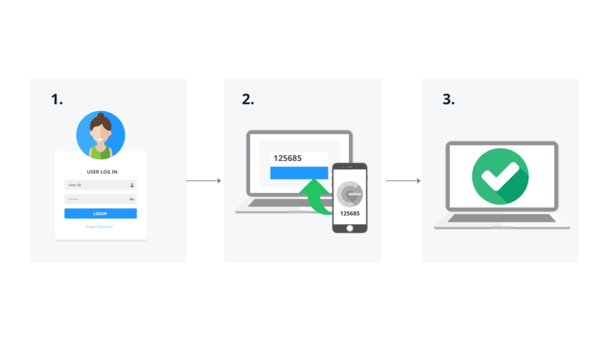
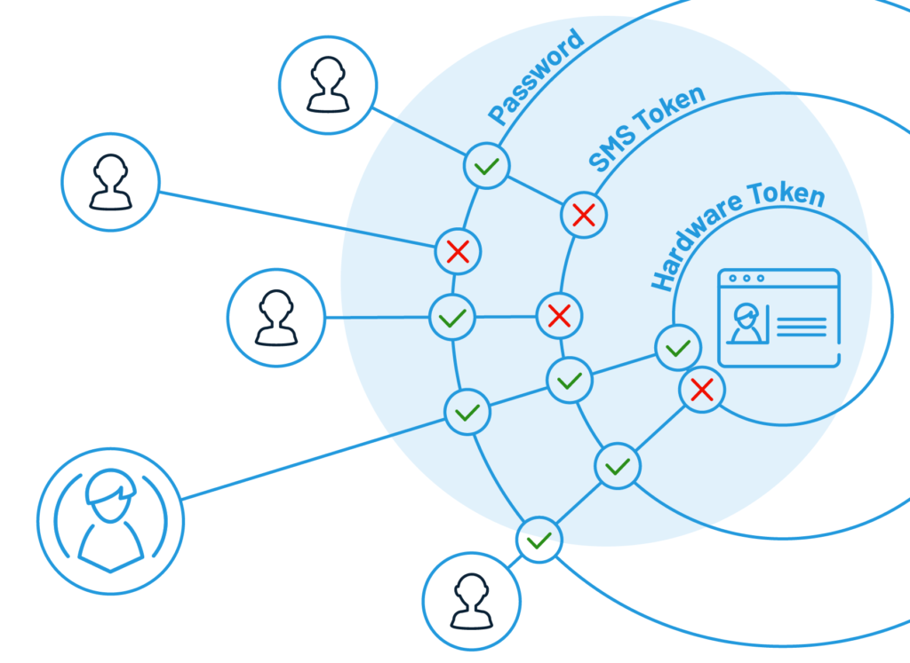
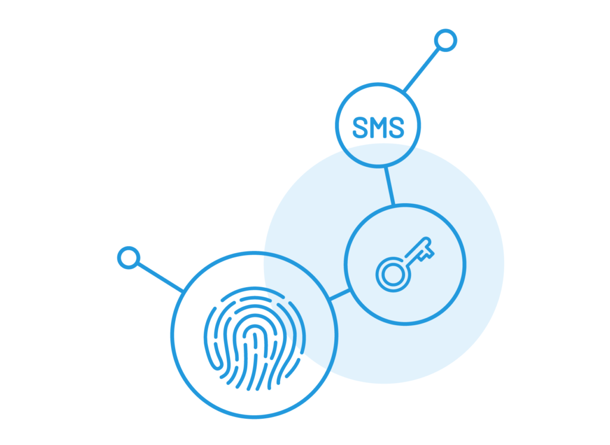
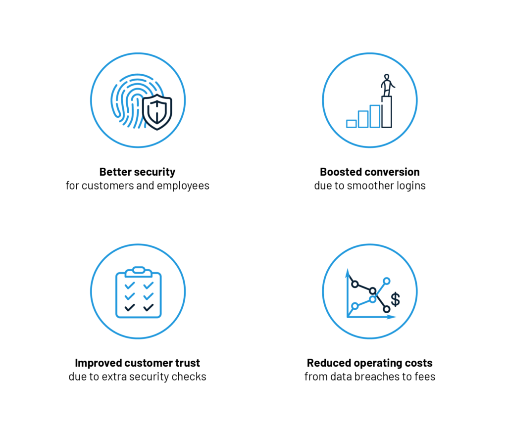
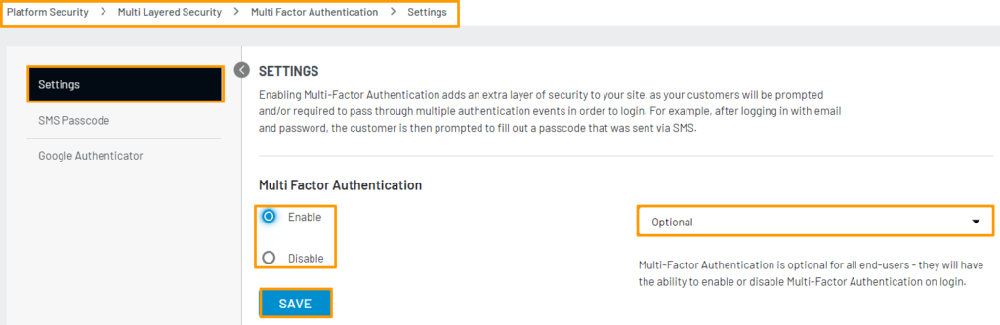
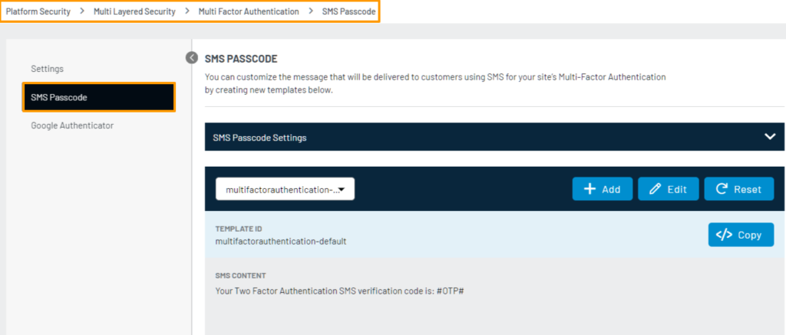
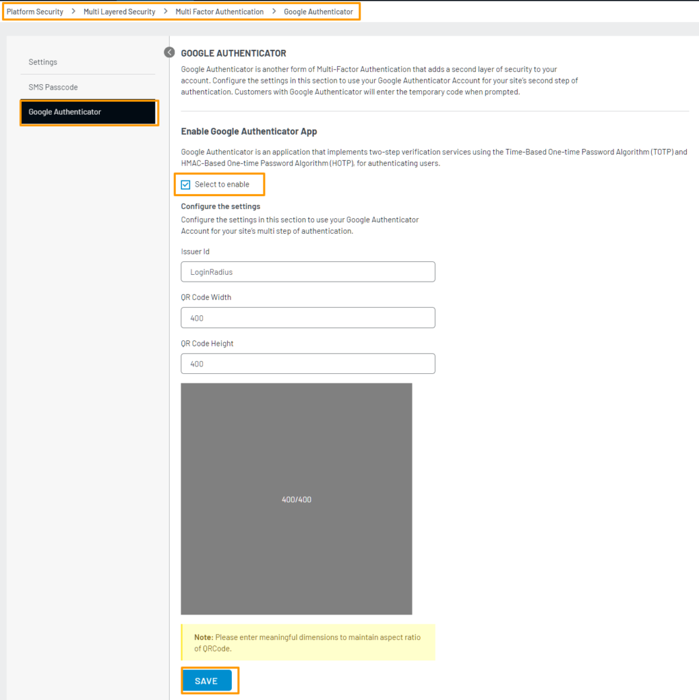

## Introduction

Multi-factor authentication (or MFA)  is a multi-layered security system that verifies the identity of users for login or other transactions.

By leveraging multiple authentication layers, even if one element is damaged or disabled, the user account will remain secure. And that's the catch!

Codes generated by smartphone apps, answers to personal security questions, codes sent to an email address, fingerprints, etc. are a few examples of multi-factor authentication implemented in day-to-day scenarios.

MFA, also known as two-factor authentication (2FA), is an [extra authentication method](https://www.loginradius.com/multi-factor-authentication/) that’s becoming increasingly common.

The only difference between the two is that 2FA only uses two of the available additional checks to verify consumer identity, whereas MFA may use two or more than two checks. Simple password-based solutions were once used to secure data, however this method can only provide you with <a rel="nofollow" href="https://windowsreport.com/multi-factor-authentication-software/"> basic security </a>.

## Why Multi-Factor Authentication is Important?

Multi-Factor Authentication (MFA) plays a crucial role in enhancing the security of online accounts and systems. It adds an extra layer of protection by requiring users to provide multiple forms of verification before gaining access. 

MFA mitigates the risk of unauthorized access resulting from stolen or weak passwords. By combining different factors, such as something you know (password), something you have (a physical token or smartphone), or something you are (biometric data), MFA significantly reduces the chances of unauthorized individuals gaining access to sensitive information.

Implementing MFA is particularly important for businesses and organizations that handle confidential data, financial transactions, or personal user information.

## Why Should Businesses Use MFA to Protect Consumers?

Traditional usernames and passwords can be easily compromised. In fact, they are highly vulnerable to cybercriminal attacks like brute force and [account takeovers](https://www.loginradius.com/blog/2020/04/corporate-account-takeover-attacks/).

Multi-factor authentication, on the other hand, is considered one of the most efficient ways of providing improved security in recent times. The multiple layers ensure that users demanding access are who they claim to be. Even if cybercriminals steal one credential, they'll be forced to verify identities in another way. 

With the world heads towards more criminal sensitivities, using multi-factor authentication as part of your [consumer identity and access management (CIAM) platform](https://www.loginradius.com/blog/2019/06/customer-identity-and-access-management/) helps you build and maintain solid consumer trust.

## Types of Authentication Factors

MFA generally refers to five types of authentication factors which are expressed as:

1. **Knowledge**: Something the user knows, like username, password, or a PIN.
2. **Possession**: Something the user has, like a safety token.
3. **Heritage**: Something the user is, which can be demonstrated with fingerprint, retina verification, or voice recognition.
4. **Place**: Based on the user's physical position.
5. **Time**: A time-based window of opportunity to authenticate like OTP.

When choosing which checks to use, take into account things like the level of security needed, the types of technology most often used by your customers to access your assets, and, to some extent, cost.

## Types of Multi-Factor Authentication

There are a number of different checks you can use to implement MFA— and the list is always growing. We have picked the common ones here: 

### SMS Token Authentication

A relatively straightforward measure to implement, especially for consumers and the general public, this check most often consists of a text message containing a [PIN number](https://www.loginradius.com/blog/2020/04/loginradius-pin-based-authentication/). This PIN is then used as a one-time password (OTP), usually in addition to traditional username-and-password verification. 

If your customers frequently access [your services from mobile devices](https://www.loginradius.com/blog/2018/12/use-multi-factor-authentication-dont-cell-phone-access/), it’s wise to offer them this or another mobile-device-based authentication method to help smooth the consumer journey.

### Email Token Authentication

This method is Identical to SMS tokens, but the code is sent via email. Since not everyone has their phone with them all the time, it’s a good idea to offer this option. It can act as a backup method if your customer has had their [mobile device lost or stolen](https://www.loginradius.com/blog/2018/12/use-multi-factor-authentication-dont-cell-phone-access/). It’s also a convenient way to access an OTP from any platform that can receive email.

### Hardware Token Authentication

Using a separate hardware token is considered one of the most secure authentication methods available, as long as the key remains in the consumer’s possession. This method is more expensive, although it can be cost-effective to provide your high-value consumers with dongles for free. 

Business customers tend to be more willing to go the extra mile to use a hardware token, and adoption of [hardware tokens is increasing](https://www.theverge.com/2019/2/22/18235173/the-best-hardware-security-keys-yubico-titan-key-u2f). But it’s still not a good idea to make them compulsory for anyone but the most high-value, at-risk customers such as banking, insurance, and investment clients.

Users just need to insert the hardware token into their device to use it. If they use a mobile device for access, they may need another dongle to add a USB or USB-C port to their smart device. 

### Software Token Authentication

By using an authentication application on a mobile device, you can get almost the same level of security as with a hardware token. Essentially, the smart device becomes the token. This can be tied in with services like Google Authenticator.

Getting customers to use a third-party solution can help encourage them to use MFA for more of their services outside of your business, thus increasing their overall security. It also makes a great alternative to carrying an additional dongle to attach a hardware token to a smart device.

### Phone Authentication

Randomly generated one-time password (OTP) sent by SMS is one of the most common ways to [authenticate users via phone](https://www.loginradius.com/docs/platform-features-overview/registration-services/phone-authentication-feature/). Another way is via automated phone calls.

### Biometric verification

People with a smart device or computer with biometric authentication (such as fingerprint ID or facial recognition) can use this check to confirm their identity as part of MFA. [Biometric ID verification](https://searchsecurity.techtarget.com/definition/biometric-verification) tends to be less hassle than typing in an OTP, so customers find it less aggravating to use it frequently. The lower friction makes it an ideal option when extra checks are unavoidable.

## Additional Forms of Multi-Factor Authentication

There are a few other digital verification methods available to your customers. 

### Social Login

[Social login](https://www.loginradius.com/blog/2018/11/reconsidering-social-login-security-privacy-angle/), also called social identity verification, is something many users find convenient since they’re usually already logged in to the relevant accounts. Bear in mind though that social media platforms are high-value targets for hackers, so social ID verification shouldn’t be the only method used on top of username/password in most cases.

### Security Questions

[Security questions](https://www.loginradius.com/blog/2019/01/best-practices-choosing-good-security-questions/) are a type of knowledge-based authentication (KBA) where the questions and answers are static. The questions could be defined by the business or the customer, and the customer provides the answers that are later verified. Dynamic KBA, which is more secure than static KBA, uses questions that are generated in real-time based on data records such as credit history or transactions. 

### Risk-Based Authentication 

Risk-based authentication (RBA) can also be used in conjunction with MFA. By monitoring things like location, device, and even user keystrokes, you can tailor the frequency of MFA checks to the security situation. RBA helps avoid asking customers for extra verification repeatedly when they’re signing in from their “home” machine and location.

### Time-based One-Time Passcode Authentication

A time-based one-time password (TOTP) is a passcode generated for a user in the current time, and it is valid for a set timeframe. Using this authentication method, you are basically creating a one-time password on the user side with the help of a smartphone. Because TOTP has nothing much to do with the server-side, it means the user will always have access to their one-time password on their smartphone.

### How Secure Is Multi-Factor Authentication?

The security of your MFA solution depends on a few different things. First of all, you need to be engaged, willing customers to apply the above solutions. As mentioned earlier, hardware keys offer greater security than social verification, but they cost money and effort to use.

It’s also important to make sure your MFA set up follows a few basic security steps:

- Make sure that new users can’t set up MFA the first time they log in. An attacker with a valid password could steal the account and set up MFA with their choice of phone number.
- Make sure automated phone calls use clear messages that let the user know someone is trying to log in.
- Educate your users about their chosen MFA methods; make sure they know what to do and who to contact if there is an issue.
- Don’t allow high-value, high-risk clients to authenticate with less secure MFA methods like social verification.
- Make sure you use multi-factor authentication rather than two-factor authentication. 2FA with SMS and username/password for the two factors is increasingly vulnerable to [SIM swapping](https://krebsonsecurity.com/2019/03/why-phone-numbers-stink-as-identity-proof/).

## How Does Multi-Factor Authentication Work?

Multi-factor authentication classified into two categories: 

- **MFA for devices**: A two-factor authentication process that verifies a user at the point of login.
- **MFA for applications**: A two-factor authentication process that verifies a user to allow access to one or more applications.

However for both MFA functions in the same way. Here's how the process is usually carried out. 

- Multi-factor authentication is introduced in the user account, and the system is connected to an app or program from MFA.
- The user is asked to enter the token associated with the account. It can be in the form of a random number created by an MFA app like the Google Authenticator.

The hacker will need to have access to the token in order to break into your account. That's why MFA is such an asset in boosting your IT security.

## Examples of Multi-Factor Authentication

There are various methods used for implementing Multi-Factor Authentication. One common example is the use of One-Time Passwords (OTPs), which are typically sent to a user's mobile device via SMS, email, or generated through a mobile app. 

Another example is the use of biometric authentication, such as fingerprint or facial recognition, which relies on unique physical characteristics of an individual. Additionally, hardware tokens or smart cards that generate time-based or event-based codes can be used as a second factor. 

Push notifications to mobile devices, voice recognition, and knowledge-based authentication questions are also utilized as additional factors for MFA.

## Best Practices For Implementing Multi-Factor Authentication

Implementing Multi-Factor Authentication effectively requires certain best practices. Firstly, it is essential to choose a reliable and secure MFA solution that aligns with your specific needs. 

Regularly updating and patching the MFA software or system is crucial to ensure any potential vulnerabilities are addressed promptly. Educating users about the importance of MFA, how to set it up, and how to use it correctly is vital for successful implementation. 

Additionally, organizations should consider providing backup or alternative authentication methods to account for situations where a primary method may not be available. Monitoring and analyzing MFA logs and user access patterns can help identify any suspicious activities or potential security breaches.

## The Benefits of Multi-Factor Authentication

The benefits of multi-factor authentication form part of the experience that modern consumers expect from any well-managed organization today. MFA is rapidly becoming a standard offering from the biggest tech companies that we deal with today.

Failing to meet these consumer expectations leaves you at risk of losing clientele to companies that are using CIAM and MFA to keep their data from harm.

Here’s what MFA gives you and your consumers:

- **Better security**: It provides additional protection for consumers and employees in multiple security layers. 
- **Boosted conversion**: A streamlined authentication process keeps productivity high, leading to increased conversions. 
- **Improved customer trust**: Due to extra security checks, consumers and employees are rest assured about the data. 
- **Reduced operating costs**: The more the layers, the more is the risk of intruders from data breaches is reduced, leading to reduced investment. 
- **Achieve complianc**e: Specific to your organization to mitigate audit findings and avoid potential fines.
- **Increase flexibility and productivity**: The ability to remove the [burden of passwords](https://www.loginradius.com/blog/2018/12/infographic-the-death-of-passwords/) leads to better productivity.

This list is, of course, not exhaustive. There are also plenty of secondary benefits that may vary from industry to industry.

## Introduction of Adaptive Multi-Factor Authentication

Adaptive MFA is a method that your CIAM provider uses to apply the right level of authentication security depending on the risk profile of the actions currently being attempted by the consumer.

Adaptive MFA goes beyond a static list of rules and adapts to ask consumers for the types of verification that best suit a user session. 

LoginRadius incorporates the following additional factors to its adaptive MFA solutions:

- The device you are using: smartphone, or laptop.
- The kind of network are you accessing: private, or public.
- The time when you are trying to access: workday, or at night. 
- The place from where you are trying to access: home, or cafe. 

By adding risk-based authentication as a final security layer on top of your other MFA layers, adaptive MFA avoids annoying your consumers, while [keeping their data safe from attacks](https://www.loginradius.com/blog/2019/12/digital-privacy-best-practices/). 

By using LoginRadius’ adaptive multi-factor authentication, you can relax with the assurance that your consumers are happy and safe when they’re using your online services and products.

## How to Set up Multi-Factor Authentication With LoginRadius?

If you want to get the most out of the LoginRadius Identity platform, you need to enable MFA. This process is relatively easy. 

Currently, LoginRadius supports SMS Workflow and Google Authenticator Workflow as authentication methods. Here’s how you can set up.

### For SMS Workflow

There are just a few steps in the LoginRadius Admin Console to enable SMS verification, with options to choose your own SMS template and SMS provider. 

Next, you will have a choice of options to use as the first verification factor: standard email and password login, username and password, access token, or automated phone call. The second factor is, of course, a one-time password/code sent by SMS.

### For Google Authenticator Workflow 

To enable Google Authenticator, you’ll need to set up your ID in the Admin Console for Google to identify your website or app on Authenticator. You can then set up your QR code specifications and whether you want MFA to be mandatory. 

Like you did for SMS workflow, here too, you can choose from standard email and password login, username and password, access token, or automated phone call for the first verification factor. 
Google Authenticator supports FIDO 2UF hardware tokens and app-based software tokens on smart devices, so if you want to enable these methods, you need to use Authenticator.

## What's the Difference between MFA and Two-Factor Authentication (2FA)?

Multi-Factor Authentication (MFA) and Two-Factor Authentication (2FA) are terms often used interchangeably, but there is a subtle difference between them. MFA refers to the use of two or more factors to authenticate a user's identity, while 2FA specifically refers to the use of two factors. 

Essentially, 2FA is a subset of MFA. MFA encompasses a broader range of authentication methods, such as biometrics, hardware tokens, or smart cards, in addition to the more commonly used factors like passwords and SMS-based OTPs. 

2FA, on the other hand, typically involves using a combination of a password and a second factor, such as an OTP or a push notification. Therefore, while 2FA is a type of MFA, MFA itself offers more flexibility and options for enhancing security beyond just two factors.

## Conclusion

Multi-factor authentication gives you a flexible way to balance customer experience with today’s security requirements. Not only is it one of the best ways to secure your login process, but it also shows your customers that you care about their security and take it seriously.

