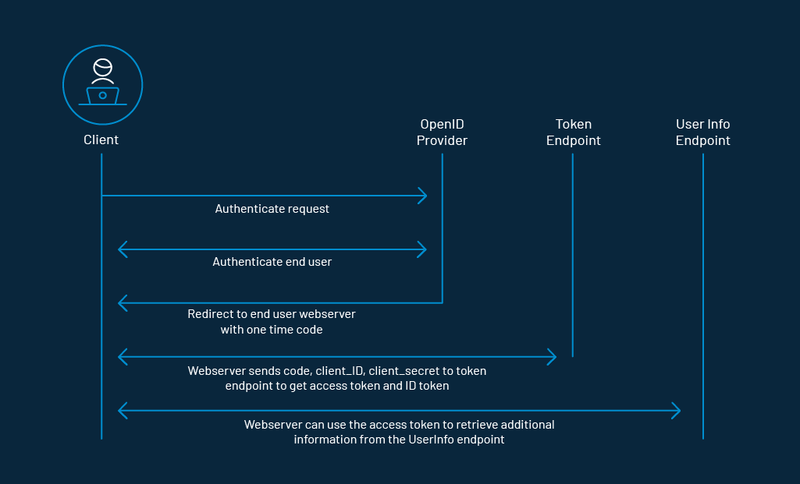
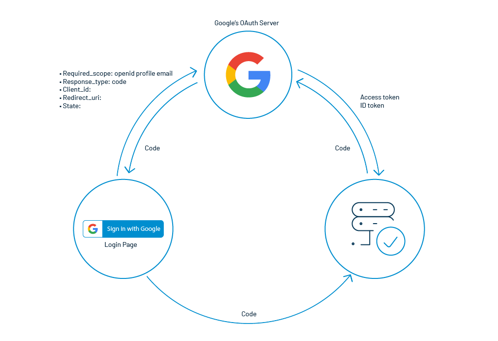

OpenID Connect has brought a revolution in the authentication process and ascended by leaps and bounds. It is primarily used in the [single sign-on](https://www.loginradius.com/blog/start-with-identity/what-is-single-sign-on/) (SSO) and identity provision on the web. The main reason behind its success is the JSON-based ID tokens (JWT) delivered via the OAuth 2.0 process flow.

Firstly, let’s have a quick look at OAuth 2.0. 

Often referred to as authorization or delegation protocol, it is a security standard where you authorize an application to access your data, or use features in another application on your behalf, without giving them your password. 

In simple terms, it provides applications the ability to “secure designated access.” OAuth never shares password data but instead uses authorization tokens to prove an identity between consumers and service providers. OAuth is an authentication protocol that allows you to approve one application interacting with another on your behalf without giving away your password.

## What is OpenID Connect (OIDC)

Now, let us learn about OpenID Connect. It is an OpenID Foundation (OIDF) standard that leverage OAuth 2.0 process flow to add an identity layer in order to obtain basic profile information about the End-User in an interoperable and REST-like manner or verify the identity of the End-User on the basis of the authentication done by an Authorization Server or Identity Provider (IDP). 

OpenID Connect supports clients of all types, including web-based, mobile, and JavaScript clients, to request and receive information about authenticated sessions and end-users. By implementing OpenID Connect, leveraging OAuth 2.0 fabricates a unified framework that promises mobile native applications, secure APIs, and browser applications in a single, cohesive architecture.

## What OpenID Connect Solves

It is a very common practice to deploy the same password across multiple applications and websites. Since the traditional credentials are not centrally administered, if the security of any website that you use is compromised, a hacker could gain access to your password across multiple sites. 

Here comes OpenID connect in the picture as it never shares a password with any website. Even then, if a compromise does occur, you can immediately prevent any malicious access to your accounts at any website by simply changing the password for your OpenID Connect.

**Also Read: [Add Authentication to Play Framework With OIDC and LoginRadius](https://www.loginradius.com/blog/engineering/guest-post/add-authentication-to-play-framework-with-oidc-and-loginradius/)**

## How OpenID Connect Works

Before proceeding further, let’s have a look at some of the terminologies:

1. **Client:** The client is the application that’s trying to access the user’s account. It needs to get permission from the user before accessing the account. For example, a client application can present the user with the login page to get an access token for access to a particular resource.
2. **Authorization Server:** The authorization server validates the user credentials and redirects the user back to the client with an authorization code. The client communicates with the authorization server to confirm its identity and exchanges the code for an access token.
3. **Scope:** It specifies the level of access that the application is requesting from the client.
4. **Claims:** It constitutes the payload part of a JSON web token and represents a set of information exchanged between two parties.

The application begins with an OAuth 2.0 flow that asks the user to authorize a request. As part of the flow, the client will include the OpenID Connect scope with scopes for any additional information it wants about the user. As the request is processed, the client receives an access token and an ID token issued by the authorization server. The ID token contains claims that have information about the user. 

The SSO is implemented by delivering ID tokens from the authorization server to the client. The client then contacts a dedicated endpoint on the authorization server known as the UserInfo endpoint to receive the remaining claims about the user using the access token. 

It is this ID token which is also known as the J[SON Web Token (JWT)](https://www.loginradius.com/blog/engineering/jwt/), which contains claims, which are nothing but statements (like an email address or name) about an entity (the user) and some additional metadata. 

The OpenID Connect specification has a defined set of standard claims. The set of standard claims include name, email, gender, birth date, and so on. However, if you want to capture information about a user and there currently isn’t a standard claim that best reflects this piece of information, you can create custom claims and add them to your tokens.

For instance, let us say you want to use OpenID Connect to authenticate the user for your own application using Google’s OAuth URL.

**Step 1:** On clicking the sign-in button, you are required to pass a few parameters like **scope, **which is a space-delimited list of scopes, **response_type** having the value code, **client_id** having the client identifier, **redirect_uri** having the client redirect URI, and **state** having a random string. 

**Step 2:** The OpenID provider authenticates users for a particular application instance.

**Step 3:** A one-time-use code is passed back to the client using a predefined Redirect URI.

**Step 4:** The user interface can then share this temporary code with the server

**Step 5:** The server can exchange this code in order to get access to the user’s profile. 

Here, technically speaking, you are not only getting the user profile but an Access Token and an ID Token having all the details of the user’s profile.

## OpenID Connect vs OpenID 2.0

OpenID Connect performs various tasks similar to OpenID 2.0, but it does so in such a way that it is API-friendly and usable by mobile and native applications. OpenID Connect defines optional mechanisms for encryption and robust signing. In OpenID Connect, OAuth 2.0 capabilities are integrated with the protocol itself, whereas the integration of OAuth 1.0a and OpenID 2.0 requires an extension.

OpenID Connect and OpenID 2.0 have many architectural similarities. Furthermore, a very similar set of problems are solved by the protocols. However, OpenID 2.0 uses XML and a custom message signature scheme. Their implementations would sometimes abnormally refrain from interoperating. OAuth 2.0, leveraged by OpenID Connect, outsources the required encryption to the web’s built-in TLS (also called SSL or HTTPS) infrastructure, which is implemented on both client and server platforms universally. When signatures are required, OpenID Connect uses standard JSON Web Token (JWT) data structures. For this reason, OpenID Connect is easier for developers to implement, and when implemented, it results in much better interoperability.

The story of OpenID Connect interoperability has been proven in practice when an extended series of interoperability trials were conducted by members of the OpenID Connect Working Group and the developers behind numerous OpenID Connect implementations.

## Conclusion

OpenID Connect, its predecessors, and other [public-key-encryption-based authentication](https://www.loginradius.com/blog/engineering/encryption-and-hashing/) frameworks guarantee the security of the complete internet by having the responsibility for user identity verification in the hands of the most trusted and reliable service providers. If compared with the one which is available earlier, OpenID Connect is a way easier approach to implement and integrate and is expected to achieve a much-outspread acceptance.

Cheers!

