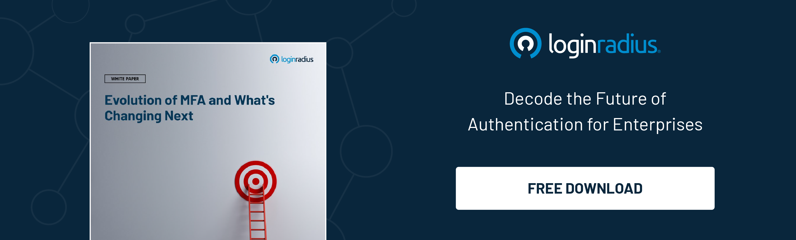

## Introduction

In a world where data breaches are becoming the new normal, businesses are exploring new ways to protect customer identities. At the same time, cybercriminals are finding new ways to sneak into a business network. 

Although identity theft isn’t a new challenge that businesses face every day, the outburst of COVID-19 has increased the number of attacks that can’t be overlooked. 

Hence, [securing customer information](https://www.loginradius.com/blog/growth/how-businesses-approach-customer-security/) is becoming more challenging, especially in a remote-first working environment with a poor line of defense. 

However, multi-factor authentication (MFA) and two-factor authentication have been safeguarding customer identities and sensitive information for a long time. And now it’s time for businesses to think about out-of-band-authentication (OOBA) to reinforce security. 

OOB authentication is used as a part of multi-factor authentication (MFA) or 2FA that verifies the identity of a user from two different communications channels, ensuring robust security. 

Let’s look at some aspects of OOBA and why businesses should put their best foot forward in adopting a stringent identity security mechanism in 2022 and beyond. 

## What is Out-of-Band Authentication? Why is it's Becoming the Need of the Hour? 

Out-of-band authentication refers to multi-factor authentication requiring a secondary verification mechanism through a different communication channel along with the conventional id and password. 

Cybersecurity experts recommend OOB authentication for high-security requirements where enterprises can’t compromise on consumer identity security and [account takeover](https://www.loginradius.com/blog/identity/corporate-account-takeover-attacks/) risks. 

Generally, OOB authentication is a part of MFA, requiring users to verify their identity through two communication channels. The goal is to offer maximum security for customers and businesses in high-risk scenarios.

Now let’s understand why OOB authentication is swiftly becoming the need for enterprises. 

Since the COVID-19 pandemic has changed how organizations operate and offer access to their critical resources, cyber threats have substantially increased. 

Whether we talk about loopholes in access management or frail lines of defense, businesses have faced losses worth millions in the past couple of years. 

Hence, a robust authentication mechanism is what every business organization needs. And OOB authentication fulfills their security requirements since it works on a dual means of verifying identity through different communication mechanisms. 

## How Does OOB Authentication Work? 

OOB authentication works on the principle of multi-factor authentication and ensures that business data and user information remains secure even if one line of defense is compromised. 

Let’s learn this through a real-life example. Suppose you’re about to purchase your favorite stuff online and need to pay through internet banking. 

You’ve entered your user id and password for completing the transaction, and now the bank sends a one-time password (OTP) to your phone to complete the transaction. Once you provide the right combination of user id, password, and OTP, your order gets completed. 

However, the essential thing you need to understand is that even if a cybercriminal has access to your user id or password, it cannot complete the transaction without the OTP, which is either sent to your smartphone or through email. 

Hence, the risks for account takeover and fraud are minimized up to a great extent with OOB as attackers couldn’t bypass multiple layers of authentication. 

Some great examples of out-of-band (OOB) authentication include:

* QR codes with encrypted data
* Phone calls for voice authentication
* One-time passwords
* Biometrics, including Face ID and Touch ID

## Advantages of Out-of-Band Authentication

Out-of-Band Authentication (OOBA) offers several advantages that make it a popular choice for enhancing security in various applications. Firstly, OOBA adds an extra layer of protection by leveraging different communication channels for authentication. 

By utilizing separate channels, such as SMS, email, or phone calls, to verify user identity, it becomes significantly more challenging for attackers to compromise both the primary channel and the out-of-band channel simultaneously.

Another advantage of OOBA is its ability to detect and prevent various forms of attacks, including phishing, man-in-the-middle attacks, and account takeover attempts.

By leveraging a secondary channel, users receive authentication codes or confirmations that are distinct from the primary communication channel. This separation reduces the risk of malicious interception and ensures the integrity of the authentication process.

Furthermore, OOBA enhances user experience by minimizing the need for complex and hard-to-remember passwords. With OOBA, users can rely on simpler passwords and receive secure, one-time authentication codes or prompts through a separate device or communication channel. 

This approach not only increases convenience for users but also mitigates the risk of password-related vulnerabilities, such as weak passwords or password reuse.

## Challenges and Limitations of Out-of-Band Authentication

While Out-of-Band Authentication offers numerous benefits, it is not without its challenges and limitations. One primary challenge is the dependence on reliable communication channels. 

Since OOBA relies on secondary channels, such as SMS or email, the availability and speed of these channels can affect the user experience. Delays in receiving authentication codes or messages can frustrate users and potentially hinder the authentication process.

Additionally, OOBA can introduce complexities for users who may be less tech-savvy or have limited access to secondary devices or communication channels. This can be especially true for certain demographics, such as elderly users or individuals in remote areas with limited internet connectivity. 

In such cases, alternative authentication methods or additional support may be necessary.

Another limitation is the potential vulnerability of the out-of-band channel itself. While using a separate communication channel provides an extra layer of security, it also introduces a new attack surface. 

Attackers may exploit vulnerabilities in the secondary channel, such as intercepting SMS messages or compromising email accounts. Implementers of OOBA must ensure the security and integrity of both the primary and out-of-band channels to mitigate these risks effectively.

## Examples of Out-of-Band Authentication:

Out-of-Band Authentication is widely implemented across various industries and applications. One common example is the two-factor authentication (2FA) process used by many online platforms.

In this scenario, after entering their username and password, users receive a one-time authentication code via SMS or email. By requiring users to provide this secondary code, the platform ensures an additional layer of verification and minimizes the risk of unauthorized access.

Another example is the use of out-of-band channels for transaction verification in financial services. When users perform certain high-value transactions, they may receive a phone call to confirm the transaction details or receive a unique authorization code through a separate communication channel.

This ensures that the user authorizes the transaction securely and protects against fraudulent activities.

## Use Cases for Out-of-Band Authentication

Out-of-Band Authentication finds applications in a wide range of use cases where enhanced security and identity verification are crucial. One prominent use case is in online banking and financial services. 

By implementing OOBA, banks can protect customer accounts from unauthorized access and fraudulent transactions. Users may receive authentication codes or transaction confirmations via SMS or email, providing an additional layer of security for sensitive financial activities.

Another use case is in e-commerce platforms and online marketplaces. OOBA can be employed during the checkout process to authenticate users and prevent fraudulent purchases. 

By requiring users to confirm their transactions through an out-of-band channel, such as SMS or email, the platform can verify the legitimacy of the purchase and protect against unauthorized credit card use or account takeover.

Additionally, OOBA is valuable in remote access scenarios, such as virtual private networks (VPNs) or remote desktop services. Users connecting to corporate networks from outside the office may be required to provide authentication codes received through a separate communication channel, ensuring secure access and preventing unauthorized entry to sensitive systems.

## Best Practices for Implementing Out-of-Band Authentication:

To ensure the effective implementation of Out-of-Band Authentication, several best practices should be followed. Firstly, organizations should carefully select and secure the out-of-band channel. 

This involves encrypting communication, monitoring for potential attacks or anomalies, and keeping software and systems up to date to prevent vulnerabilities.

Furthermore, it is crucial to provide clear instructions and guidance to users regarding the OOBA process. User education plays a vital role in ensuring smooth authentication and minimizing user confusion or frustration. 

Organizations should communicate the purpose of OOBA, explain the steps involved, and offer support channels for users who may encounter difficulties.

Regular monitoring and analysis of authentication logs can help detect and respond to suspicious activities promptly. Organizations should establish comprehensive logging mechanisms to capture authentication events, monitor for anomalies or potential breaches, and implement protocols for incident response.

Lastly, organizations should consider implementing multi-factor authentication (MFA) in conjunction with OOBA. MFA combines multiple authentication factors, such as passwords, biometrics, and out-of-band codes, to provide an even higher level of security. By incorporating MFA, organizations can bolster their security posture and protect against various types of attacks.

## In Conclusion

Adding multiple authentication layers is now becoming the need of the hour, especially in the most unpredictable times when [hackers find new ways to sneak into a business network](https://www.loginradius.com/blog/identity/cybersecurity-attacks-business/). 

With out-of-band authentication, businesses can ensure robust security for their customers and their sensitive information, which is always at risk if multiple authentication factors aren’t incorporated. 

## Frequently Asked Questions (FAQs)

**1. What is the difference between in-bound and out-bound authentication?**

In-bound authentication verifies within the primary channel, while out-bound authentication uses a separate channel for verification.

**2. Is out-of-band secure?**

Yes, out-of-band authentication is secure due to the added layer of protection using a separate communication channel.

**3. Why do you need out-of-band authentication?**

Out-of-band authentication enhances security and protects against attacks by leveraging a secondary channel for verification.

