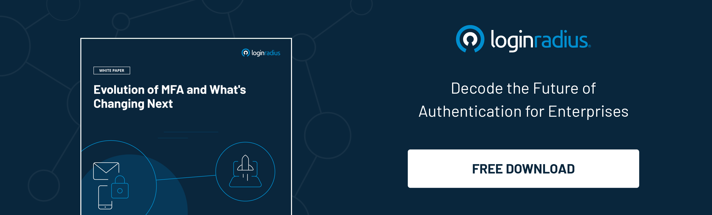

## Introduction

In a world where data breaches are becoming the new normal, businesses are exploring new ways to protect customer identities. At the same time, cybercriminals are finding new ways to sneak into a business network. 

Although identity theft isn’t a new challenge that businesses face every day, the outburst of COVID-19 has increased the number of attacks that can’t be overlooked. 

Hence, [securing customer information](https://www.loginradius.com/blog/growth/how-businesses-approach-customer-security/) is becoming more challenging, especially in a remote-first working environment with a poor line of defense. 

However, multi-factor authentication (MFA) and two-factor authentication have been safeguarding customer identities and sensitive information for a long time. And now it’s time for businesses to think about out-of-band-authentication (OOBA) to reinforce security. 

OOB authentication is used as a part of multi-factor authentication (MFA) or 2FA that verifies the identity of a user from two different communications channels, ensuring robust security. 

Let’s look at some aspects of OOBA and why businesses should put their best foot forward in adopting a stringent identity security mechanism in 2022 and beyond. 

## What is Out-of-Band Authentication? Why is it's Becoming the Need of the Hour? 

Out-of-band authentication refers to multi-factor authentication requiring a secondary verification mechanism through a different communication channel along with the conventional id and password. 

Cybersecurity experts recommend OOB authentication for high-security requirements where enterprises can’t compromise on consumer identity security and [account takeover](https://www.loginradius.com/blog/identity/corporate-account-takeover-attacks/) risks. 

Generally, OOB authentication is a part of MFA, requiring users to verify their identity through two communication channels. The goal is to offer maximum security for customers and businesses in high-risk scenarios.

Now let’s understand why OOB authentication is swiftly becoming the need for enterprises. 

Since the COVID-19 pandemic has changed how organizations operate and offer access to their critical resources, cyber threats have substantially increased. 

Whether we talk about loopholes in access management or frail lines of defense, businesses have faced losses worth millions in the past couple of years. 

Hence, a robust authentication mechanism is what every business organization needs. And OOB authentication fulfills their security requirements since it works on a dual means of verifying identity through different communication mechanisms. 

## How Does OOB Authentication Work? 

OOB authentication works on the principle of multi-factor authentication and ensures that business data and user information remains secure even if one line of defense is compromised. 

Let’s learn this through a real-life example. Suppose you’re about to purchase your favorite stuff online and need to pay through internet banking. 

You’ve entered your user id and password for completing the transaction, and now the bank sends a one-time password (OTP) to your phone to complete the transaction. Once you provide the right combination of user id, password, and OTP, your order gets completed. 

However, the essential thing you need to understand is that even if a cybercriminal has access to your user id or password, it cannot complete the transaction without the OTP, which is either sent to your smartphone or through email. 

Hence, the risks for account takeover and fraud are minimized up to a great extent with OOB as attackers couldn’t bypass multiple layers of authentication. 

Some great examples of out-of-band (OOB) authentication include:

* QR codes with encrypted data
* Phone calls for voice authentication
* One-time passwords
* Biometrics, including Face ID and Touch ID

## In Conclusion

Adding multiple authentication layers is now becoming the need of the hour, especially in the most unpredictable times when [hackers find new ways to sneak into a business network](https://www.loginradius.com/blog/identity/cybersecurity-attacks-business/). 

With out-of-band authentication, businesses can ensure robust security for their customers and their sensitive information, which is always at risk if multiple authentication factors aren’t incorporated. 

