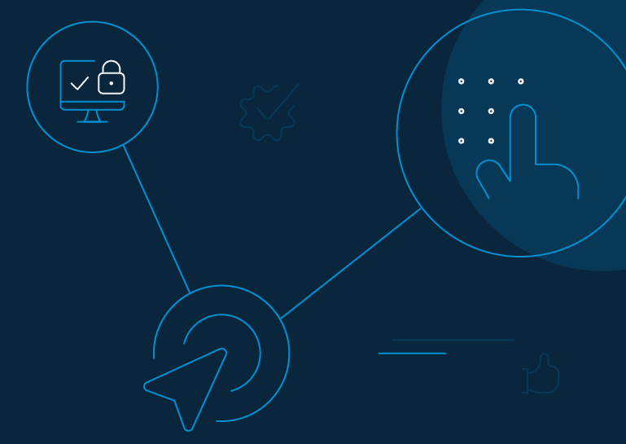
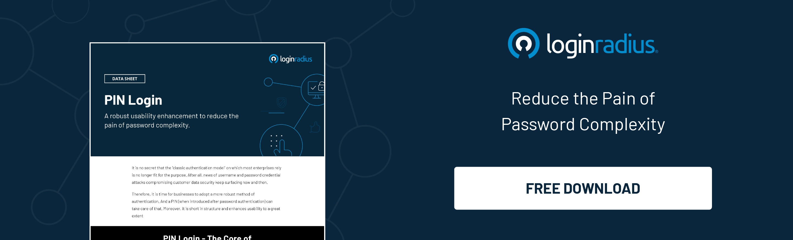

# What is PIN Authentication

Pin Authentication is yet another popular method of authenticating consumer identity more efficiently. 

Logging in through PIN is in popular culture nowadays. This feature allows the consumer to set a PIN in addition to the password during registration or login. Later, during the subsequent logins for authentication, the application requests the same PIN to authenticate. 

This means PIN verification is not a stand-alone authentication feature, i.e., it will always require the first level authentication feature in place to work with it.

[PIN based authentication](https://www.loginradius.com/resource/loginradius-and-pin-auth) generally works on a two-level authentication model. Let’s try to understand it with the help of an example:

Let’s say there is an application that supports PIN based authentication. Whenever a new user accesses the application, they’re prompted to enter the email/username and password combination, which can be considered a level 1 of this authentication model. 

Now there comes PIN, where the user gets an option to first set up one, either at registration or login. Whenever the same user reaccesses the application, they are prompted to enter a PIN instead of the email/username and password combination, which is considered level 2 of this authentication model.

Some other aspects which prove PIN authentication a robust and a secured model:

1. It is not permanent. The sign in PIN will only be asked until the corresponding PIN system access token is valid.

2. It is device-specific and will ask to set up a new one whenever it detects a new device.

3. It can also be used as a Re-Authentication model.

## What is 3D Secure Authentication PIN 

3D Secure Authentication is a security protocol used in online transactions to prevent fraud. 

When making a purchase, the cardholder is prompted to verify their identity, often by entering a one-time PIN sent to their mobile device or through another method, such as biometric authentication. 

This additional step helps ensure that the person making the transaction is the legitimate cardholder, providing an extra layer of security.

## Advantages of PIN Authentication

PIN authentication offers several benefits that make it an attractive option for businesses seeking enhanced security measures:

* **Two-Level Authentication**: PIN authentication operates on a two-level authentication model, requiring both a password and a PIN for access. This dual-layered approach significantly strengthens security compared to traditional single-factor authentication methods.

* **Efficiency**: The use of PINs streamlines the authentication process, reducing the time and effort required for users to access their accounts. This efficiency is particularly valuable in environments where quick and secure access is essential, such as online banking or e-commerce platforms.

* **Device-Specific Security**: PIN authentication is device-specific, meaning that each device requires its own unique PIN. This adds an extra layer of security by preventing unauthorized access from unrecognized devices, thus safeguarding user accounts against potential breaches.

* **Dynamic Authentication**: PINs are not permanent and are only valid for the duration of the corresponding session or token. This dynamic nature enhances security by reducing the risk of PIN theft or compromise over time.

* **Re-Authentication Capabilities**: PIN authentication can also serve as a re-authentication model, allowing users to verify their identity at various access points within an application. This flexibility enables businesses to implement additional security measures without compromising user experience.

## PIN Authentication vs. Other Authentication Methods

PIN authentication offers distinct advantages over alternative authentication methods:

* **Versus Password-Only Authentication**: Unlike traditional password-only authentication, which relies solely on a single-factor authentication model, PIN authentication enhances security by incorporating an additional layer of verification. This makes it more resistant to common security threats such as brute force attacks and password guessing.

* **Versus Biometric Authentication**: While biometric authentication methods, such as fingerprint or facial recognition, offer convenience and unique identifiers, they are not immune to vulnerabilities such as spoofing or replication. PIN authentication provides an alternative that complements biometric solutions, offering added security without solely relying on biometric data.

* **Versus Two-Factor Authentication (2FA)**: While both PIN authentication and 2FA involve multiple layers of verification, PIN authentication simplifies the process by combining two factors—password and PIN—into a single step. This streamlined approach reduces user friction without compromising security, making it a preferred option for businesses seeking efficient authentication methods.

## **Why Should Businesses Use PIN Authentication?**

PIN Authentication flow reduces the efforts as well as time in the [complete authentication process](https://www.loginradius.com/blog/identity/2020/04/loginradius-pin-based-authentication/). As it is a two-level authentication model, the session is considered more secure as compared to a simple traditional login method because the PIN’s session depends on two different tokens to be a valid one. 
How Useful is PIN Authentication for Businesses

As we’ve already discussed the multiple advantages of using a PIN in an authentication process, apart from its usability alongside the authentication processes, PIN can also be used as an additional feature where the use cases of Re-Authentication arise. 

You can simply leverage this feature within your application to authenticate at different levels of granting access to the application.

## Security Measures to Enhance PIN Authentication

To further enhance the security of PIN authentication, businesses can implement the following measures:

* **Token Validity Period**: Limit the validity period of tokens associated with PIN authentication to minimize the risk of unauthorized access. By expiring tokens after a predefined timeframe, businesses can reduce the window of opportunity for potential attacks.

* **Multi-Factor Authentication (MFA)**: Supplement PIN authentication with additional factors such as biometric authentication or one-time passcodes (OTP) to create a multi-layered security approach. MFA strengthens authentication by requiring multiple forms of verification, making it more difficult for attackers to compromise accounts.

* **User Education and Awareness**: Educate users about the importance of selecting strong PINs and practicing good security hygiene. Encourage users to choose unique PINs that are not easily guessable and to avoid sharing them with others.

* **Monitoring and Logging**: Implement robust monitoring and logging mechanisms to track authentication attempts and detect suspicious activities. By continuously monitoring for anomalous behavior, businesses can identify and respond to potential security threats in real-time.

* **Regular Security Audits**: Conduct regular security audits and assessments to evaluate the effectiveness of PIN authentication measures and identify areas for improvement. This proactive approach helps businesses stay ahead of emerging threats and maintain a strong security posture.

By implementing these security measures, businesses can strengthen the integrity of PIN authentication and mitigate the risk of unauthorized access and data breaches.

## **How to Implement PIN Authentication?**

To implement this feature, you will be required to have an instance of LoginRadius Admin Console, which can be used further to enable and enforce PIN authentication.

Now once you have your own instance of LoginRadius Admin Console, you can refer to this [document](https://www.loginradius.com/docs/api/v2/customer-identity-api/pin-authentication/overview/) for gaining detailed information on the implementation of the PIN Authentication feature.

For PIN Re-Authentication, you can have a reference through this [document](https://www.loginradius.com/docs/api/v2/customer-identity-api/re-authentication/pin/overview/).

## Conclusion 

In this blog, we’ve conveyed all the relevant information about what exactly a PIN authentication means along with it’s workflow and how you can use the same to implement along with web applications, so that it can fulfill your business requirements. I hope this will help you understand the feature accordingly as per your use cases.

Cheers!

## Frequently Asked Questions (FAQs)

**1.  How does PIN-based authentication work?**

PIN-based authentication involves users setting a personal identification number (PIN) alongside their password, requiring both for subsequent logins, and adding an extra layer of security.

**2. What is the difference between PIN and OTP?**

A PIN is a fixed, user-selected code used for authentication, while an OTP (One-Time Passcode) is a dynamically generated code valid for a single login session, enhancing security through temporary access.

**3. What are the types of authentication?**

Authentication methods include single-factor (e.g., passwords), two-factor (e.g., PIN and biometrics), and multi-factor (e.g., PIN, biometrics, and OTP) authentication, offering varying levels of security.

**4. What is PIN verification data?**

PIN verification data refers to information associated with a user's PIN, including its validity period, device-specificity, and dynamic nature, enhancing security and access control measures.

