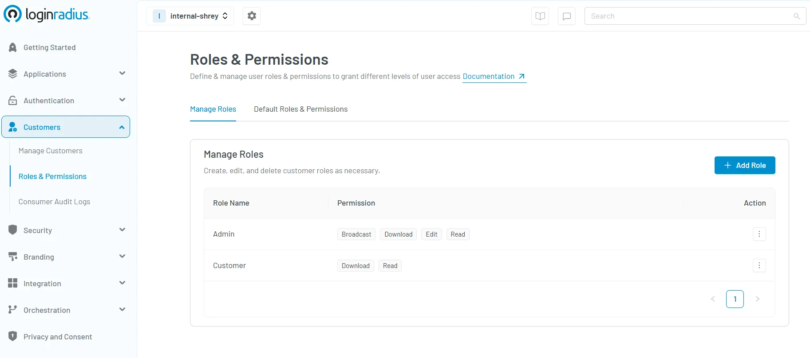
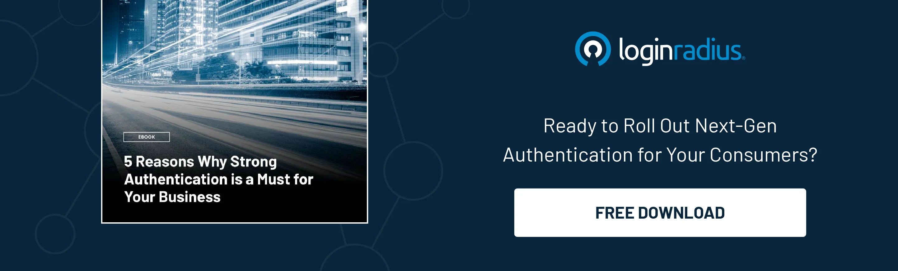
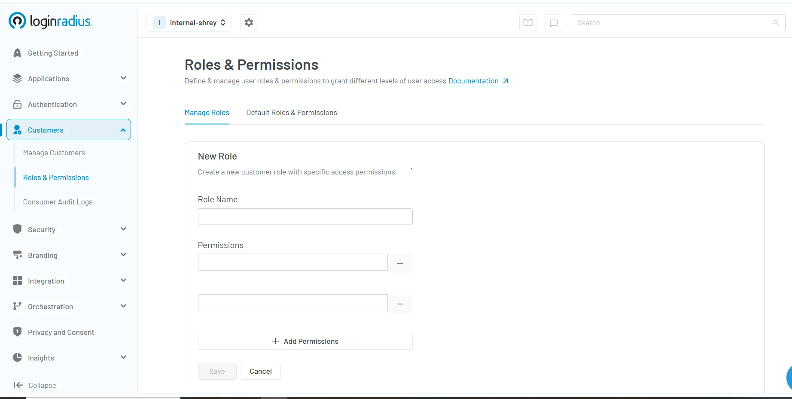

## Introduction

Role-Based Access Control (RBAC) is a security paradigm that assigns system access and permissions based on predefined roles within an organization. 

Instead of granting permissions to individual users, RBAC associates permissions with roles, and users are then assigned to these roles, streamlining access management and enhancing security. 

This approach is a key component of [user management](https://www.loginradius.com/platforms/user-management), helping an organization maintain structured and secure access controls while it seamlessly manages roles.

In this blog, we’ll understand what role-based access control is, how it works, and everything associated with RBAC.

## What is RBAC?

Role-Based Access Control (RBAC) is a method of managing user access based on their role within a platform or service.

Instead of assigning permissions to each user individually, RBAC simplifies the process by grouping users into predefined roles that determine what they can access. Imagine a streaming service where a child profile can access kids' content, and not any of the mature shows—ensuring the right content is available to the right user.

For example, in a family subscription, the primary account holder can update payment details, while other members can only stream content—ensuring security, personalized experiences, and controlled access. RBAC helps platforms protect user data and create a more tailored, secure user experience.

## How RBAC Works

In an RBAC system, roles are created to align with specific job functions or responsibilities within an organization or customer-facing applications. Each role encompasses a set of permissions that dictate the actions users in that role can perform. 

For instance, an "Admin" role might have permissions to broadcast, download, edit, or read  essential resources, while a "Customer" role might only allow for downloading and viewing certain information as shown in the below[ LoginRadius CIAM console](https://accounts.loginradius.com/auth.aspx?return_url=https://console.loginradius.com/login&action=register). 

By assigning users to these roles, organizations ensure that individuals have access only to the information and functions necessary for their duties/roles, adhering to the principle of least privilege. 

## Why Your Business Needs RBAC

In today's digital landscape, protecting sensitive data is paramount. Implementing RBAC ensures that employees/customers access only the information pertinent to their roles, minimizing potential security breaches. 

For businesses handling large volumes of data or operating in regulated industries, a robust role-based access control implementation is crucial to maintain trust and compliance.

## Benefits of RBAC

Implementing a role-based access control system offers several advantages:

* **Enhanced Security**: By limiting access based on roles, organizations reduce the risk of unauthorized access to sensitive information, thereby strengthening role-based security measures.

* **Operational Efficiency**: Managing permissions becomes more straightforward, as administrators can modify role permissions without the need to adjust individual user settings, streamlining role based authorization processes.

* **Regulatory Compliance**: RBAC helps organizations meet compliance requirements by ensuring that access controls are consistently applied and documented, facilitating audits and reporting.

* **Reduced Administrative Workload**: With a structured role based authentication framework, onboarding new employees or changing roles becomes more efficient, as permissions are inherently tied to roles rather than individuals.

## **Examples of Role-Based Access Control Across Industries**

RBAC is widely used across various industries to enhance role based security and streamline operations. Here are some industry-specific examples:

* **Healthcare**: In a hospital setting, doctors, nurses, and administrative staff have distinct roles with specific access permissions. Doctors can access and modify patient records, nurses can update patient vitals, and administrative staff can handle billing information. This segregation ensures that sensitive medical data is accessed appropriately.

* **Retail**: In an e-commerce platform, customer service representatives can view and manage orders, warehouse staff can update inventory, and finance personnel can access payment details. This prevents unauthorized access to customer financial information.

* **Digital Media Platforms:** Large-scale digital content companies need structured access control to manage vast content libraries and user interactions securely. With Role-Based Access Control (RBAC), teams can efficiently handle content distribution, platform management, and security enforcement while preventing unauthorized access. See how one of our clients, [A+E Networks, optimized access management ](https://www.loginradius.com/resource/a-plus-e-networks/)across its digital ecosystem by partnering with LoginRadius.

* **Banking, Finance, and Insurance**: In a bank, tellers can process transactions but cannot access customer loan details, while loan officers can view and approve applications but do not have permissions for daily banking transactions. This ensures compliance with financial regulations.

* **Travel and Hospitality**: Hotel management systems use RBAC to allow front-desk employees to handle check-ins and reservations, housekeeping staff to update room statuses, and finance teams to process billing.

* **E-Learning:** In an online education platform, instructors manage courses and grade assignments, students access learning materials and submit work, while admins handle user roles and platform settings. This structured access ensures security and efficiency. See how one of our clients, SafeBridge, a renowned e-learning and certification platform, implemented RBAC effectively in our[ case study](https://www.loginradius.com/resource/case-study-page-safebridge/).

* **B2B Service & Partnerships**: In a B2B SaaS company, customer success managers have access to client accounts, developers can modify application features, and legal teams can review contracts, maintaining data security and workflow efficiency.

## **RBAC vs. ABAC**

While Role-Based Access Control (RBAC) assigns permissions based on predefined roles, Attribute-Based Access Control (ABAC) takes a more dynamic approach by granting access based on attributes. 

These attributes can include user characteristics (e.g., department, job title), environmental conditions (e.g., location, time of access), or resource properties (e.g., sensitivity level of data).

## Key Differences Between RBAC and ABAC

* **Access Control Model**: RBAC relies on fixed roles, while ABAC allows for more flexible policies based on attributes.

* **Granularity**: ABAC provides finer-grained control, considering multiple attributes rather than just a role.

* **Scalability**: RBAC is easier to implement in structured environments, whereas ABAC is better suited for complex scenarios where access conditions frequently change.

* **Security and Compliance**: ABAC enables contextual security controls, which can be useful for compliance with stringent regulations.

<table>
  <tr>
   <td>
<strong>Feature</strong>
   </td>
   <td><strong>RBAC (Role-Based Access Control)</strong>
   </td>
   <td><strong>ABAC (Attribute-Based Access Control)</strong>
   </td>
  </tr>
  <tr>
   <td><strong>Access Control Model</strong>
   </td>
   <td>Permissions are based on predefined roles.
   </td>
   <td>Access is determined by dynamic attributes.
   </td>
  </tr>
  <tr>
   <td><strong>Granularity</strong>
   </td>
   <td>Coarse-grained, as access is limited to roles.
   </td>
   <td>Fine-grained, as multiple attributes define access.
   </td>
  </tr>
  <tr>
   <td><strong>Scalability</strong>
   </td>
   <td>Suitable for organizations with static roles.
   </td>
   <td>More adaptable for complex, changing environments.
   </td>
  </tr>
  <tr>
   <td><strong>Security & Compliance</strong>
   </td>
   <td>Easier to implement and audit.
   </td>
   <td>Provides enhanced security through contextual policies.
   </td>
  </tr>
  <tr>
   <td><strong>Use Case</strong>
   </td>
   <td>Best for structured organizations with clear roles.
   </td>
   <td>Ideal for organizations needing dynamic and flexible access control.
   </td>
  </tr>
</table>

## When to Use RBAC vs. ABAC

* **Use RBAC** when access control needs are straightforward, with well-defined roles and responsibilities.

* **Use ABAC** when finer control is required, such as limiting access based on multiple conditions like user location, time, or specific project involvement.

* **Hybrid Approach**: Many organizations implement a combination of RBAC and ABAC to maximize security while maintaining operational efficiency.

## How to Implement RBAC Using LoginRadius CIAM

RBAC implementation is a breeze with the LoginRadius Customer Identity and Access Management (CIAM) platform. Our platform offers a comprehensive solution for RBAC implementation that enhances role-based security for both B2B and B2C businesses. Here's how you can leverage LoginRadius for role-based access control implementation:

1. **Define Roles and Permissions**:

    * Navigate to the LoginRadius[ Admin Console](https://accounts.loginradius.com/auth.aspx?return_url=https://console.loginradius.com/login&action=register).

    * Click on “Customers”.

    * Under the "Roles & Permissions" section, create roles that align with your organizational structure, such as "Admin," "Editor," or "Viewer."

    * Assign specific permissions to each role, determining the actions users in those roles can perform.

2. **Assign Roles to Users**:

    * Within the Admin Console, assign the appropriate roles to users based on their job functions.

    * This assignment ensures that users inherit the permissions associated with their roles, maintaining a consistent role-based access control system.

3. **Manage and Audit Roles**:

    * Regularly review and update roles and permissions to adapt to organizational changes.

    * Utilize LoginRadius's auditing features to monitor role assignments and access patterns, ensuring adherence to role-based access control best practices.

4. **Integrate with Existing Systems**:

    * Leverage LoginRadius's APIs and SDKs to integrate the RBAC system into your existing applications, ensuring seamless role based security, authentication, and authorization across platforms.

By utilizing LoginRadius's robust CIAM platform, businesses can effectively implement and manage a role-based access control system, enhancing security and operational efficiency. Read the complete [RBAC implementation docs](https://www.loginradius.com/docs/user-management/roles-and-permissions/?q=rbac+). 

## **Conclusion**

Understanding what RBAC is and implementing a role-based access control system is essential for modern organizations aiming to protect sensitive information and maintain operational efficiency.

By aligning access permissions with user roles, businesses can enhance security, ensure compliance, and streamline administrative processes. 

Leveraging platforms like LoginRadius further simplifies the implementation and management of RBAC, providing a scalable solution for role-based security needs. Reach us today [to book a live demo](https://www.loginradius.com/book-a-demo). 

## FAQs

**Q:** **What is an example of role-based authentication?** 

 **A:** An example includes granting 'admin' users access to sensitive settings, while limiting 'guest' users to viewing content only.

**Q:** **What is role authentication?**

 **A:** Role authentication assigns permissions based on users' roles within an organization, restricting or allowing actions accordingly.

**Q:** **What are the benefits of RBAC?**

 **A:** RBAC enhances security, simplifies permission management, reduces errors, and ensures efficient access control aligned with user responsibilities.

**Q:** **What is the difference between RBAC and IAM?** 

 **A:** RBAC manages access based solely on user roles, whereas IAM (Identity and Access Management) comprehensively manages users' identities, roles, policies, and access privileges.

