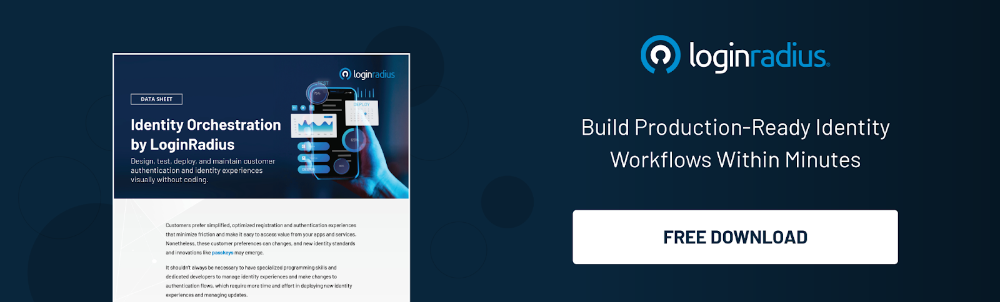

In today’s interconnected world, managing user identities efficiently across various systems is a crucial challenge. System for Cross-domain Identity Management (SCIM) has emerged as the go-to standard for simplifying this process.

Designed to enable developers to streamline identity management, SCIM reduces the complexity of provisioning and de-provisioning user accounts across multiple applications. This article will explain what is SCIM, how it works, and why it matters to developers.

## What is SCIM?

SCIM, short for System for Cross-Domain Identity Management, is an open standard protocol used for automating the exchange of user identity information between identity providers and service providers. By offering a unified way to handle user provisioning, SCIM ensures consistency and reduces the manual effort required to manage users across multiple domains and applications.

At its core, SCIM simplifies the tedious process of creating, updating, and deleting user accounts in external systems. For example, when a new employee joins a company, SCIM automates account provisioning in applications like email, collaboration tools, and SaaS platforms—eliminating the need for manual intervention.

The protocol’s efficiency and scalability make it a favorite among developers working on [identity management systems.](http://loginradius.com)

SCIM is part of a broader system for cross-domain identity management, which provides standardization and interoperability across diverse applications and platforms.

## How Does SCIM Work?

SCIM works by standardizing how identity information is communicated between systems, using a RESTful architecture that simplifies integration and ensures compatibility across various platforms. Here is a detailed look at the components and workflow:
1.  SCIM Service Provider: The application or system that receives and processes identity data, such as a SaaS platform, acts as the SCIM service provider. It is responsible for hosting SCIM endpoints and managing operations like creating or updating user accounts.    
2.  SCIM Client: The identity provider (IdP) or central system that manages and sends identity data is the SCIM client. It triggers requests to create, update, or delete user accounts on the service provider’s platform.    
3.  RESTful Endpoints: SCIM uses [RESTful APIs](https://www.loginradius.com/docs/authentication/quick-start/standard-login/) to enable communication between the SCIM client and service provider. These APIs are designed for performing CRUD (Create, Read, Update, Delete) operations on user and group resources.    
4.  Data Exchange Format: SCIM exchanges data using JSON, ensuring lightweight and human-readable payloads that are easy to debug and extend.    
5.  SCIM Authentication: Secure communication is ensured through protocols like OAuth 2.0. This safeguards sensitive identity data during transmission and prevents unauthorized access.
    
6.  Provisioning Workflow: When a provisioning event (e.g., adding a new user) occurs:
  -   The SCIM client sends an HTTP POST request with user details to the SCIM service provider.
  -   The service provider processes the request and creates the user in its system.
  -   Similar workflows handle updates (PUT), deletions (DELETE), and data retrieval (GET).
8.  Real-time Synchronization: SCIM ensures that identity changes are synchronized in real time. For instance, if a user’s role changes, the SCIM client sends an update to the service provider, ensuring consistent access permissions across all connected systems.
    

With LoginRadius, SCIM can be seamlessly integrated with identity management solutions to enable automated user provisioning for SaaS applications, streamlining operations and reducing administrative overhead.

## SCIM Integration: Simplifying Identity Management

Integrating SCIM into your application enables seamless identity management and significantly reduces the burden of manual provisioning. If you're wondering what is SCIM, it stands for System for Cross-domain Identity Management, a standardized protocol designed to streamline identity data exchange between applications and identity providers.

Whether you’re building a SaaS platform or developing an internal tool, SCIM integration provides a standardized framework to connect your system with identity providers.

Here are the steps to integrate SCIM into your application:

 1.  Implement the SCIM API: Develop RESTful endpoints in your application to handle user and group CRUD operations. The endpoints must adhere to the SCIM protocol specifications to ensure  compatibility with identity providers.    
 2.  Authentication Setup: Configure secure authentication mechanisms, such as OAuth 2.0, for communication between your system and the SCIM client.    
 3.  Test for Compatibility: Verify your implementation with various identity providers to ensure seamless integration and functionality.    
 4.  Enable User Synchronization: Allow the identity provider to synchronize user data with your application by mapping attributes like name, email, and roles.    
 5.  Monitor and Debug: Continuously monitor API requests and responses for errors, and debug issues promptly to maintain a reliable integration.
    

By understanding what is SCIM and leveraging it effectively, developers can focus on enhancing application functionality while relying on the protocol to handle complex identity management workflows.

By leveraging the system for cross-domain identity management, organizations can ensure a more consistent and streamlined approach to handling identity data across multiple platforms.

## SCIM Security: Protecting Identity Data

When working with SCIM, ensuring the security of identity data is paramount. Since SCIM involves exchanging sensitive information such as user details and group memberships, implementing robust security measures is essential.

 1.  Secure Authentication: [Use OAuth 2.0](https://www.loginradius.com/blog/engineering/oauth2/) or similar authentication protocols to authorize requests between the SCIM client and service  provider.
 2.  Data Encryption: Encrypt data in transit using HTTPS to prevent unauthorized access.  
 3.  Access Control: [Implement role-based access control (RBAC)](https://www.loginradius.com/blog/identity/securing-gen-ai-rbac-implementation/) to limit which users or systems can perform  specific SCIM operations.    
 4.  Audit Logging: Maintain logs of all SCIM operations to monitor activity and detect any unauthorized changes.
    

By prioritizing SCIM security, developers can build trust and ensure compliance with industry standards.

## SCIM User Provisioning: Automating Account Management

One of the standout features of SCIM is its ability to automate [user provisioning](https://www.loginradius.com/provisioning/). Manual account management is not only time-consuming but also prone to errors. SCIM user provisioning eliminates these challenges by automating key processes, including:

 -   Onboarding: Automatically create user accounts in connected applications when a new employee joins the organization.
 -   Updates: Synchronize changes to user attributes, such as roles or departments, across all systems.
 -   Offboarding: Deactivate or delete accounts when a user leaves, ensuring access is revoked promptly.
    

This level of automation saves time, reduces administrative overhead, and enhances security by ensuring accurate and up-to-date user data.

## Why You Should Embrace SCIM

SCIM is more than just a protocol; it’s a developer’s ally in building scalable, secure, and efficient identity management systems. Here’s why SCIM is worth your attention:

 -   Ease of Integration: With its RESTful design and JSON format, SCIM is easy to implement and integrate into existing applications.
 -   Standardization: SCIM offers a consistent approach to identity management, eliminating the need to create custom provisioning solutions.
 -   Efficiency: Automating provisioning and de-provisioning reduces manual effort, allowing developers to focus on core application development.
 -   Interoperability: SCIM’s compatibility with major identity providers ensures seamless platform communication.
    

## Conclusion

SCIM is revolutionizing the way we manage identities across systems. By automating user provisioning, enhancing security, and simplifying integration, SCIM empowers developers to build robust identity management solutions.

Whether you’re working on a SaaS platform, enterprise software, or internal tools, implementing SCIM ensures scalability, efficiency, and compliance.