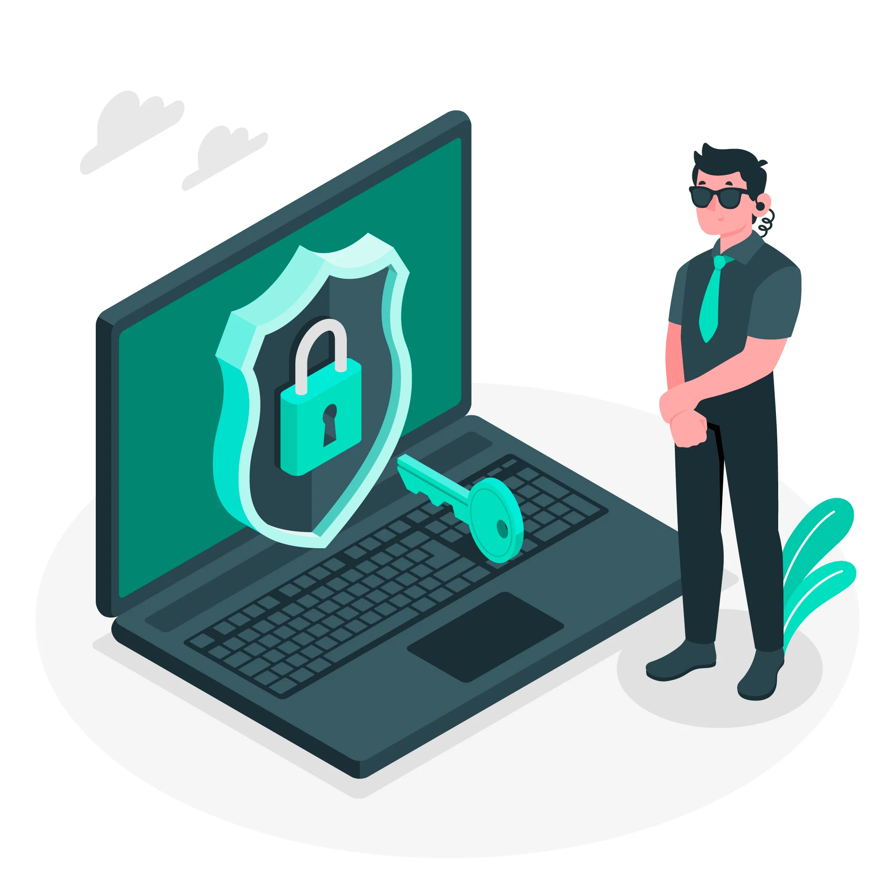
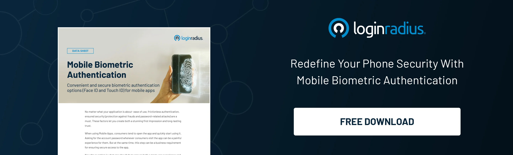
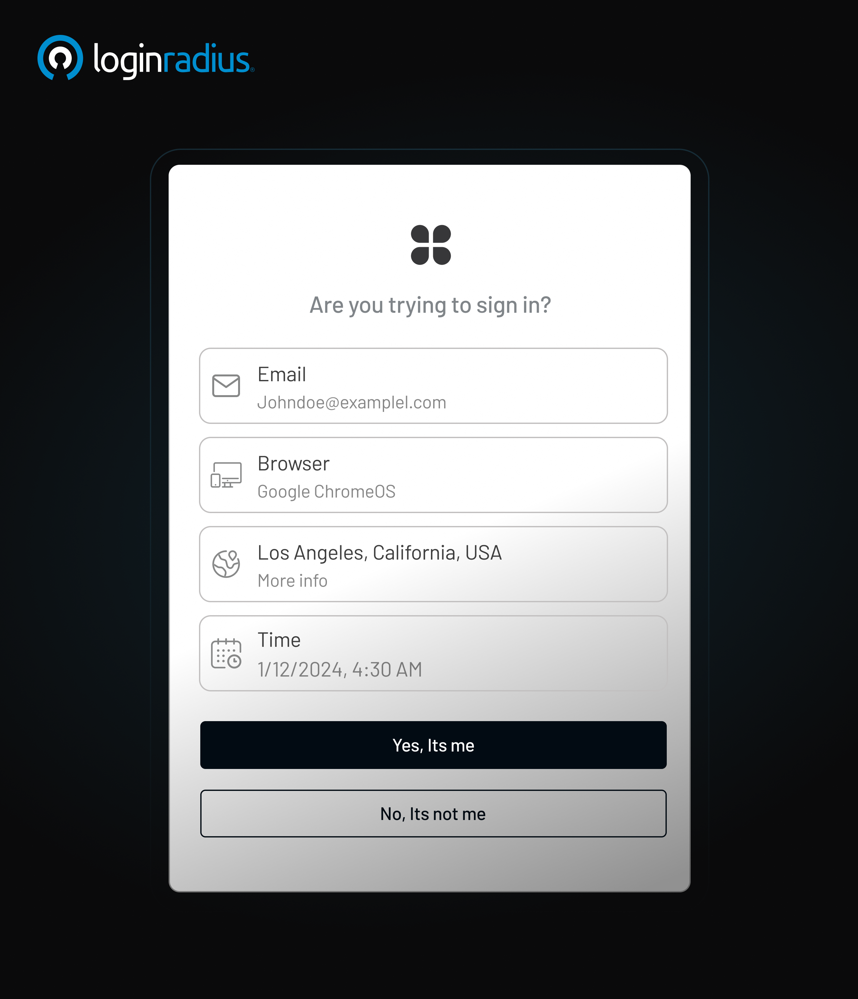
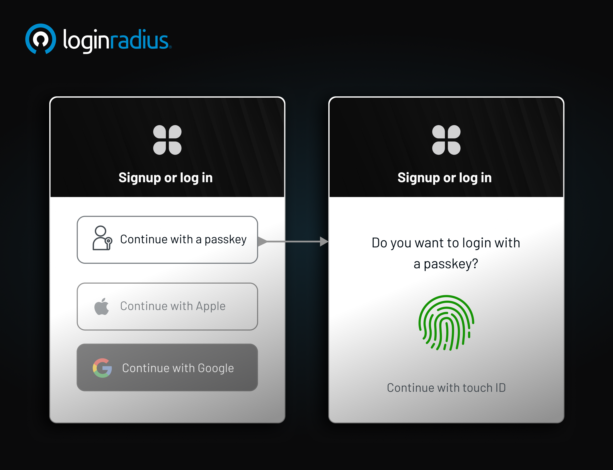

## Introduction

Imagine logging into your bank account, your favorite online store, or even your company dashboard—and all it takes is a password. Convenient? Yes. Safe? Not anymore!

In a world where cyberattacks are no longer just occasional headlines but daily realities, relying on a password alone is like locking your front door but leaving the key under the mat. That’s where strong authentication steps in—and it’s fast becoming the gold standard for authentication in cyber security.

Let’s understand in detail the aspects associated with strong authentication. 

## What is Strong Authentication?

First, you learn about [what authentication really means](https://www.loginradius.com/blog/identity/what-is-authentication/) — it's the process of verifying that someone is who they say they are in the digital world. Once you understand that foundation, you’ll see why simply entering a username and password just doesn’t cut it anymore.

Strong authentication is more than just a buzzword. It’s a robust, layered approach to verifying a user’s identity by requiring two or more *independent* credentials from different categories:

* **Something you know** (like a password or PIN)
* **Something you have** (like a smartphone or a security key)
* **Something you are** (like your fingerprint or face)

It’s designed so that if one factor is compromised, the others are still standing strong—blocking unauthorized access. So yes, strong authentication is required if you’re serious about protecting digital identities.

Now, you might be wondering—isn't that just multi-factor authentication? Great question. Let's dive in.

## Is Strong Authentication the Same as Multi-Factor Authentication?

Not quite, though they’re often used interchangeably.

[Multi-factor awuthentication (MFA)](https://www.loginradius.com/blog/identity/what-is-multi-factor-authentication/) means using more than one method of verification. But not all MFAs are strong. If you use a password and then get a code via SMS, that’s technically MFA—but SMS can be intercepted, spoofed, or stolen. 

To be considered strong authentication, each factor should be:

* **Independent** (not reliant on another)
* **Difficult to forge or intercept**
* **Resistant to common attacks** like phishing or man-in-the-middle attacks

So, strong authentication raises the bar, ensuring that security authentication methods are truly airtight.

## Why Strong Authentication Matters in Cybersecurity

We’re not just talking about better security. We’re talking about preventing breaches that could cost millions and damage your brand forever.

Here’s why strong authentication in cybersecurity is critical:

* **Stops credential-based attacks**: Brute force attacks, phishing, credential stuffing—strong authentication renders them mostly ineffective.

* **Earns customer trust**: Consumers are more aware than ever. They demand strong customer authentication to feel safe when sharing sensitive information.

* **Meets compliance standards**: Laws like GDPR and PSD2 make strong customer authentication solutions a requirement, especially in finance and healthcare.

* **Reduces human error**: Even if a user’s password is weak or reused, a second strong factor can still stop attackers.

Let’s be honest—authentication in cyber security isn’t just IT’s problem anymore. It’s a brand issue, a revenue issue, and a customer trust issue.

## Examples of Strong Authentication

Let’s look at strong authentication examples you probably use (or should be using):

* **Banking apps**: You log in with a password, but can’t complete a transaction without face recognition or fingerprint confirmation.

* **Corporate VPN access**: Employees must plug in a smart card and enter a biometric scan to access internal systems.

* **E-commerce purchases**: The checkout process includes a password and an encrypted app notification to approve the transaction.

In each case, the authentication methods are diverse, secure, and difficult to fake.

## Types of Strong Authentication

Different businesses need different security authentication methods, depending on their risk profile, industry regulations, and user experience goals. Here are the most common types of strong authentication:

### 1. Biometric Authentication

Where it uses your unique physical traits—like a fingerprint, retina scan, or face—to verify identity. It’s widely adopted due to convenience and difficulty to replicate.

### 2. Hardware Tokens and Smart Cards

These are physical objects like USB keys or access cards that generate time-based codes or store secure certificates. Ideal for high-security industries.

### 3. Mobile Push Notifications MFA

Think of getting a pop-up on your phone asking if it's really you logging in. Just add push notification MFA to your apps and you’ve got a double layer of assurance. Here’s how it looks like with the LoginRadius push notification MFA:  

You just need to [sign up for LogiRadius](https://accounts.loginradius.com/auth.aspx?return_url=https://console.loginradius.com/login&action=register)to add push notification MFA into your applications/ website. 

### 4. Public Key Infrastructure (PKI)

A bit more technical, PKI uses encrypted keys and digital certificates. Common in email encryption, internal systems, and enterprise-level authentication management.

### 5. Passkeys

[Passkeys](https://www.loginradius.com/blog/identity/what-is-passkey-authentication/) are a modern passwordless method that uses cryptographic key pairs, stored securely on your device, for seamless yet strong authentication. They're phishing-resistant and incredibly user-friendly.

### 6. Passwordless Authentication

This removes passwords altogether and uses other factors like biometrics, device recognition, or one-time login links. It's gaining popularity for reducing password fatigue and eliminating common password-related risks. Want to learn more about passwordless authentication? Check out this [insightful blog](https://www.loginradius.com/blog/identity/passwordless-login-future-authentication/).

### 7. One-Time Passwords (OTP)

[OTP authentication](https://www.loginradius.com/blog/identity/what-is-otp-authentication/) generates codes for one-time use, often sent via SMS or app. While convenient, OTPs are more secure when combined with stronger, independent authentication factors.

### Bonus: Adaptive Authentication

Want to make strong authentication even smarter? Enter adaptive authentication. This approach adjusts the verification level based on user behavior, device, location, and time. 

For instance, if you always log in from New York, but suddenly there’s a login attempt from Moscow, the system will demand extra verification. It’s like your digital bouncer. 

To quickly add adaptive authentication, you can register on the [LoginRadius platform](https://console.loginradius.com/security/risk-based-authentication) in a couple of minutes. It’s quick, easy, and works flawlessly. 

## Why Businesses Can’t Afford to Ignore Strong Authentication

Still on the fence? Let’s put it this way—cybersecurity is no longer a "nice-to-have." It’s mission-critical. And when it comes to protecting your systems, customers, and reputation, strong authentication isn’t just a tool—it’s your first and most powerful line of defense.

Here’s what’s at stake:

* **Financial Loss**: The average cost of a data breach is $4.45 million globally. For small and medium-sized businesses, one breach can be financially devastating.

* **Reputation Damage**: Trust is hard to earn and easy to lose. A single breach can erode years of customer confidence and brand equity.

* **Legal Trouble**: Non-compliance with regulations like GDPR, CCPA, or PSD2 can lead to hefty fines and even lawsuits.

* **Lost Opportunities**: Enterprises without robust security lose deals, especially when B2B clients evaluate vendors based on risk exposure.

* **Customer Churn**: A lack of visible security measures—like strong customer authentication—can drive customers toward more security-conscious competitors.

Strong authentication also future-proofs your business. As cyber threats evolve, a flexible, multi-layered authentication approach allows you to stay one step ahead. Plus, implementing it now positions your business as a leader in authentication cyber security, showing customers and stakeholders you take privacy and protection seriously.

Strong authentication isn’t just an IT upgrade—it’s your brand’s safety net, competitive edge, and trust engine all rolled into one.

Strong authentication is a modern security essential that combines two or more independent verification methods—such as biometrics, one-time passwords, or hardware tokens—to verify user identity. 

In a time when passwords alone are no longer enough, this layered approach plays a crucial role in blocking unauthorized access, preventing fraud, and building user trust.

Whether you're safeguarding financial transactions, securing enterprise systems, or simply aiming for better compliance, strong authentication ensures your digital assets stay protected.

Want to understand the basics first? Start with [what strong authentication means in cybersecurity](https://www.loginradius.com/resource/ebook/strong-authentication-business-success).

Ready to explore the types of layered protection? Here are the [types of multi-factor authentication methods](https://www.loginradius.com/blog/identity/types-of-mfa/) you can choose from.

## Summary 

To sum it up, what is strong authentication? It’s a must-have security layer that combines multiple independent, verifiable methods to ensure users are exactly who they say they are.

Whether you're handling payments, protecting sensitive data, or simply trying to avoid the next big breach—strong authentication is required. Period.

At LoginRadius, we help businesses implement secure, scalable, strong customer authentication solutions that meet today’s threats without sacrificing user experience. Reach us to know more about our authentication platform.

Want to learn how you can modernize your authentication management? [Explore our Authentication Solutions](https://www.loginradius.com/authentication/)

## FAQs

### 1. What is a strong customer authentication method?

**A.** It’s a method that uses two or more independent factors—like a biometric scan and a secure app—to verify identity. These are often required in financial regulations to reduce fraud.

### 2. What is strong identification?

**A.** This is the process of confirming a person’s identity using unique, hard-to-replicate credentials like fingerprints, digital certificates, or smart cards.

### 3. How to handle user authentication and authorization securely?

**A.** Adopt **strong authentication**, limit user privileges, and monitor all access points. Encrypt all data in transit and at rest. Also, update your **authentication management** regularly.

### 4. Why is multi-factor authentication crucial in cyber security?

**A.** Because passwords alone aren’t enough. The [benefits of multi factor authentication](www.loginradius.com/blog/identity/benefits-of-mfa/ ) include reduced risk, compliance with laws, and enhanced user trust.

