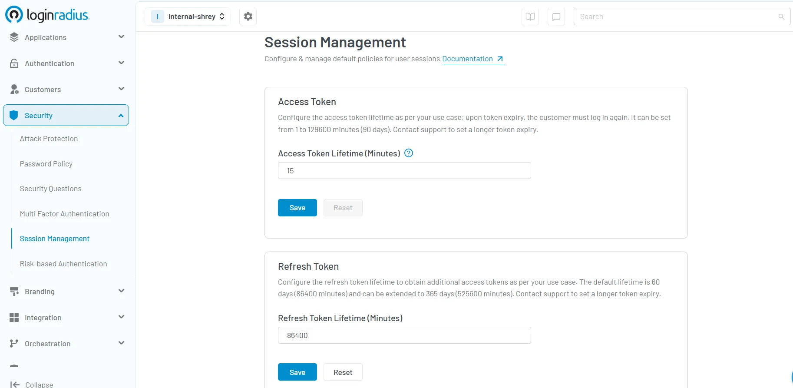

## Introduction

In the age of digital transformation and distributed systems, securing user identities and data access is critical. As organizations move toward API-first architectures and microservices, traditional access methods fall short—this is where token authentication steps in.

Designed for speed, scale, and security, token authentication has become a go-to method for enabling robust, flexible, and scalable access control—especially in environments driven by APIs and cloud-native technologies.

In fact, token-based authentication rose to prominence following the 2012 release of OAuth 2.0 by the IETF, which introduced standardized token usage for secure, delegated access—quickly becoming the industry norm for modern web and mobile applications.

In this blog, we’ll walk you through what token-based authentication is, how it works, the different types of tokens you’ll encounter, and why it plays a vital role in safeguarding today’s digital ecosystems.

## What is Token-Based Authentication?

Token-based authentication is a method of validating a user’s identity by exchanging a digital token rather than using traditional username and password combinations for every request. Once a user logs in and is authenticated, a security token is generated and sent to the client, which is then used to access protected resources.

For example, in API token authentication scenarios, once the server issues a token to a user, that token must be included in every subsequent token auth request. This ensures that only authenticated users can interact with protected endpoints.

Tokens are most commonly implemented in [RESTful APIs](https://www.loginradius.com/blog/engineering/best-practice-guide-for-rest-api-security/) and mobile or single-page applications. Common standards include JWT tokens (JSON Web Tokens), often viewed on platforms like JWT IO, and OAuth2 access tokens.

## History of Authentication Tokens

Before token-based authentication came into play, the dominant method was basic authentication—where user credentials (typically a username and password) were sent with every request, often encoded in base64. This method posed significant security risks, especially over unencrypted connections, and lacked session management, making it unsuitable for modern web applications.

To improve security, session-based authentication emerged, where a server would store a user session after login and issue a session ID stored in a cookie. While this approach worked for traditional websites, it didn’t scale well with the rise of mobile apps, APIs, and single-page applications (SPAs) that demanded stateless and scalable architectures.

This limitation paved the way for token-based authentication, which gained momentum in the early 2010s with the adoption of OAuth 2.0 and JSON Web Tokens (JWTs). These protocols enabled secure, stateless authentication by allowing tokens to carry claims and permissions—freeing the server from maintaining session state. Today, token-based methods have become the backbone of authentication in web, mobile, and cloud-native applications.

## How Does Token-Based Authentication Work?

Here’s how you can visualize token authentication in four straightforward steps:

1. **Authentication**: A user logs in using their credentials.

2. **Receive Token**: The server sends back a signed JWT token.

3. **Send Token**: The client includes the token in each token auth request.

4. **Access Granted**: The server validates the token and processes the request.

Token authentication follows a streamlined process that minimizes the need to transmit or store passwords. Here’s a typical flow: 

1. **User Login**: The user provides credentials (username/password) to the authentication server.

2. **Token Issuance**: If the credentials are valid, the server responds with a security token authentication object (often a JWT token).

3. **Token Storage**: The client (e.g., a browser or mobile app) stores the token locally, typically in memory or local storage.

4. **Authenticated Requests:** For each request to a protected resource, the client includes the token in the Authorization header.

5. **Token Validation**: The server verifies the token’s validity (signature, expiry, claims) before allowing access.

This web token authentication process ensures each interaction is verified without re-authenticating with credentials repeatedly.

## What is JWT (JSON Web Token)?

A JWT (JSON Web Token) is a compact, URL-safe token format that securely transmits information between parties as a JSON object. It is widely used in token-based authentication to verify user identities and manage session data without maintaining server-side state. 

JWTs are digitally signed—using HMAC or RSA—which ensures integrity and authenticity. If you're looking to implement secure JWT-based flows using OAuth2.0, check out this[ LoginRadius guide on the Resource Owner Password Credentials flow](https://www.loginradius.com/docs/single-sign-on/federated-sso/oauth-2.0/resource-owner-password-credentials-flow/?q=how+to+use+oauth2.0+with+jwt) to see how JWTs can be seamlessly integrated into your CIAM architecture.

[Read more about JWT here. ](https://www.loginradius.com/blog/engineering/jwt/)

## Types of Authentication Tokens

There are several types of tokens used in modern systems:

### 1. Bearer Tokens

These are the most common, often seen in OAuth2 access token flows. Whoever possesses the token can access the resource.

### 2. JWT Tokens

JWT tokens (JSON Web Tokens) include claims in a signed, base64-encoded format. They’re compact, URL-safe, and ideal for stateless applications. JWTs are commonly analyzed using platforms like JWT IO.

### 3. Refresh Tokens

Used to obtain new access tokens after the current one expires. Often seen in OAuth2 implementations. The image below show how easy it is to configure and set refresh tokens using LoginRadius dashboard. 

### 4. HMAC Tokens

Use a[ hash-based message authentication code](https://www.loginradius.com/blog/engineering/encryption-and-hashing) to validate integrity and authenticity.

### 5. API Keys

Though not technically tokens, API keys are widely used for API token authentication, especially in less complex systems.

### 6. Hardware Tokens 

Hardware tokens are physical devices used in [multi-factor authentication (MFA) ](https://www.loginradius.com/blog/identity/what-is-multi-factor-authentication/)to generate time-sensitive codes or cryptographic keys. They provide an added layer of security by requiring users to verify their identity with something they physically possess.

## Benefits of Authentication Tokens

Implementing token-based authentication offers multiple advantages:

### 1. Scalability

Tokens support stateless authentication, making it easier to scale across distributed systems and microservices.

### 2. Improved Security

Security token authentication minimizes exposure to sensitive data like passwords. Tokens can also include [expiration and audience fields ](https://www.loginradius.com/docs/security/customer-security/session-management/?q=token+expiration)to reduce misuse.

### 3. Cross-Platform Access

Tokens work across web, mobile, and desktop clients, making them ideal for modern multi-platform environments.

### 4. Flexibility

Tokens can carry custom claims, allowing developers to manage user roles, permissions, and session expiry within the token itself.

### 5. Reduced Server Load

Unlike sessions, tokens do not need to be stored on the server, reducing the infrastructure overhead.

## Is Token-Based Authentication Secure?

Yes—token-based authentication is highly secure when implemented correctly. JWT tokens are digitally signed (using HMAC or RSA), making them tamper-evident. Features like expiration (exp), issuer (iss), and audience (aud) help protect against replay attacks.

However, poor implementation can introduce vulnerabilities. Tokens should be:

* Transmitted over HTTPS only
* Stored securely (avoid local storage for sensitive data)
* Expired appropriately

For APIs, token authentication should always include rate limiting, IP whitelisting, and monitoring to detect anomalies.

Need a complete guide to secure token authentication implementation? Read our[ developer docs. ](https://www.loginradius.com/docs/user-management/data-management/about-loginradius-tokens/)

## How to Use OAuth2.0 with JWT

Implementing OAuth2.0 with JWT is one of the most effective ways to enable secure and scalable authentication across distributed systems. 

In this approach, after verifying user credentials through OAuth2.0's Resource Owner Password Credentials grant type, the system issues a JWT token that contains essential claims, including user identity, expiration, and access scopes. The token is then used to authorize requests to various services without needing to authenticate the user repeatedly.

This method simplifies token-based authentication by reducing the need for session management and offering better scalability for APIs and mobile applications. To learn how to use OAuth2.0 with JWT effectively, refer to this[ detailed LoginRadius documentation](https://www.loginradius.com/docs/single-sign-on/federated-sso/oauth-2.0/resource-owner-password-credentials-flow/?q=how+to+use+oauth2.0+with+jwt), which provides step-by-step instructions and implementation best practices.

## Pros and Cons of Software-Based Tokens

### Pros:

* **Easy to Deploy**: No hardware required.

* **Cost-Effective**: Ideal for startups or lightweight applications.

* **Integrates with OAuth2.0 and JWT**: Most modern CIAM systems support token-based flows.

### Cons:

* **Client-Side Vulnerabilities**: Tokens stored on the client can be susceptible to XSS attacks.

* **Token Theft Risks**: If compromised, a token can be reused unless additional safeguards (e.g., device binding) are in place.

* **Complex Revocation**: Token invalidation isn’t as simple as session destruction; often needs extra logic like blacklisting.

## Conclusion

Token authentication has become the backbone of modern access control in cloud-native, API-driven environments. Its stateless nature, scalability, and security make it a preferred solution for businesses aiming to deliver seamless digital experiences while maintaining robust protection.

By using standards like JWT and OAuth2.0, organizations can simplify identity verification, reduce infrastructure overhead, and provide consistent authentication across platforms.

Ready to implement token-based authentication with a powerful CIAM solution?[ Book a free trial ](https://accounts.loginradius.com/auth.aspx?return_url=https://console.loginradius.com/login&action=register)of LoginRadius and explore how our platform can help you streamline user identity, secure your APIs, and grow your business with confidence.

## FAQs

### **1. How is the OAuth token validated?**

**A.** OAuth tokens are typically validated by decoding and verifying the token signature using a shared secret or public/private key. JWTs are often used in this process.

### **2. What is web server authentication?**

**A.** Web server authentication refers to the method by which a server verifies a user's identity, typically through credentials, and grants access to resources. It may include session or token-based authentication.

### **3. What is an access token type?**

**A.** Access token types specify how the token is used. Common types include Bearer Tokens and JWT tokens, used in OAuth2 access token frameworks.

### **4. What is an Authentication Key?**

**A.** An authentication key is a digital credential (often a token or API key) used to verify identity and authorize actions in a system.

### **5. What is the difference between token-based auth and JWT?**

**A.** JWT is a specific type of token used in token-based authentication. While all JWTs are tokens, not all tokens are JWTs. JWTs contain payloads, are signed, and often used in OAuth2 systems.

