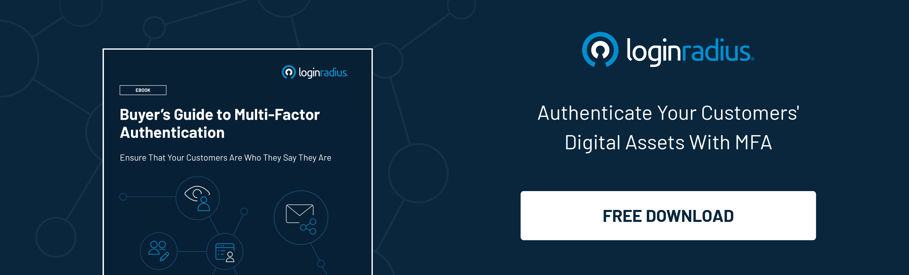

Emails hacked are the golden words for a hacker to access your personal information and get access to all your accounts. Recovery from a hack is exceptionally time-sensitive because we connect everything from online banking to other online portals with our emails. If you want to mitigate the harm to your identity, finances and protect those around you, you'll have to act quickly and carefully.

You're probably wondering, "my account is hacked. How do I repair it?" If you're a little luckier, you may not be entirely sure that you were hacked. But before (or after) you start to panic, calm down, and go through the article to prevent further damage.

## How Did My Email Get Hacked

One of these four instances could be the reason your inbox was most likely compromised:

1. You do not have up-to-date software installed for security.
2. Your passwords are weak.
3. In an email or social networking site, or website, you have clicked on a malicious link.
4. You have downloaded a malicious script or file attached to a game, video, song, or attachment.
5. You have clicked on a suspicious advertisement link while browsing.

**You've been hacked when:**

*   Your contacts receive messages that you have not sent.
*   Slow and inconsistent performance of computers.
*   When your online password stops working.
*   The missing money is your online account.
*   You received a ransomware message.
*   You received a bogus antivirus alert.
*   You have unwanted toolbars in your browser. 
*   You observe unusual patterns of network traffic.

Here is an article which talks about what to do when your [email is compromised during a data breach](https://www.loginradius.com/blog/start-with-identity/2019/01/how-do-i-know-if-my-email-has-been-leaked-in-a-data-breach/).

## What to Do After Your Email Account Is Hacked?

If your email address has been hacked, what should you do? It's not good enough to get your password changed. And you'll want to make sure the hacker hasn't set up your account to let him get back in or to keep spamming after he's locked out. To get things back in order and keep hackers out of your account for good, follow these seven steps to fix it and prevent any future incident.

## 1. Check for malware and viruses on your computer

Have a malware scan run daily. If your account is compromised, search for malware or traces of malware that could be running on your device immediately. Most hackers gather passwords using malware that has been mounted on your gadget (or mobile phone if you have a smartphone). Be sure that your antivirus and anti-malware programs are up to date, no matter which operating system you use. 

Choose a setting that will update your device automatically when there are new security patches available. Conduct an end-to-end scan of your computer if you're not using an antivirus program.

## 2. Adjust and improve your password

It's time to update your password until your device is free from malware. You will need to directly contact the email provider, verify who you are, and ask for a password reset if you have lost access to your account.

Please choose a unique password that varies markedly from your old one and make sure that it does not contain repetitive character strings or numbers. Keep away from passwords with obvious links to your name, your birthday, or similar personal information. 

This knowledge can be quickly identified by hackers and also used in their first attempts at brute force to access your account. Here is a list of the [worst passwords in 2019](https://www.loginradius.com/blog/start-with-identity/2019/12/worst-passwords-list-2019/) to understand how to create a strong password.

## 3. Notify people around you

You are more likely to open it and click on links inside it when an email comes from someone you know - even if the topic is strange. Help stop the malware from spreading by warning those on your contact list to be careful not to click on the links and to be cautious about any email sent by you that does not seem right. 

Let the people in your contact list know that your email has been compromised and that any suspicious emails should not be opened or connected to any emails you have recently got.

## 4. Change your security question

If your email account has been compromised from a computer or location that does not fit your usual use habits, the cybercriminal may need to address a security question correctly. And if the items are general, such as (Q: what's the name of your brother? A: John), that may not be that difficult to guess. Here is a quick guide to [choosing a good security question](https://www.loginradius.com/blog/start-with-identity/2019/01/best-practices-choosing-good-security-questions/) to help you further.

## 5. Modify any other accounts that have the same password

This is time-consuming but an effort worth making. Make sure you change all other accounts that use the same username and password as your compromised email. For multiple accounts, hackers love it when we use the same logins.

## 6. Consider options for your ID defense

If you've been hacked, an ID authentication program is another idea worth considering. Usually, these platforms provide email and online account tracking in real-time. In the case of identity fraud, they also typically offer credit score reporting and personal assistance.

Be sure to look for businesses with a good track record, as this form of security is often associated with high costs.

## 7. Enable multi-factor authentication (MFA)

In addition to your password, set your email account to require a [second form of authentication](https://www.loginradius.com/blog/start-with-identity/2019/06/what-is-multi-factor-authentication/) if you log into your email account from a new computer. When signing in, you will also need to enter a special one-time use code that the platform will text to your phone or generate via an app.

As an additional security measure, several email providers provide two-factor authentication (2FA). To access an account, this approach requires both a password and some other form of identification.

