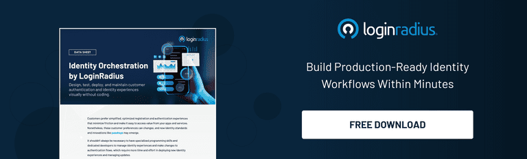

As 2024 comes to a close, we are excited to reflect on our key CIAM innovations, product updates, and advancements. Each launch this year has been thoughtfully designed to empower developers, enhance customer identity experiences, and ensure robust security at scale.

From simplifying complex workflows to introducing tools that redefine flexibility and customization, our focus has remained on delivering solutions that address the evolving needs of modern enterprises.

## Key CIAM Innovations and Product Highlights

Here’s a look back at our journey and the tools we’ve delivered to simplify your workflows.

### 1. Identity Orchestration for Customizable User Journeys

Early this year, we introduced [Identity Orchestration](https://www.loginradius.com/platforms/identity-and-orchestration), a game-changing feature enabling developers to build and manage dynamic user journey flows without writing extensive code. This feature allows seamless configuration of workflows for diverse customer touchpoints, combining flexibility and simplicity.

Key Highlights:

-   Drag-and-Drop Interface: Simplifies complex journey designs with a visual, intuitive interface that reduces the need for manual coding.
    
-   Extensive Pre-Built Templates: Kickstart your setup with ready-to-use flows, enabling faster deployment for common use cases.
    
-   Real-Time Adjustments: Modify and test workflows on the fly, ensuring agility in meeting evolving user needs.
    
-   Advanced Analytics: Gain actionable insights into journey performance and optimize based on real-time data.

### 2. Multi-Brand Configuration: Tailored Experiences for Every Brand

Managing multiple brands under a single enterprise? The multi-brand configuration feature is one of our standout CIAM innovations, ensuring every brand has a unique yet unified identity experience. Developers can customize login pages, themes, and identity configurations for each brand while maintaining operational efficiency.

Why It Matters:

-   Individualized Branding: Align identity experiences with brand-specific aesthetics, delivering a consistent user experience that resonates with each brand’s identity.
    
-   Centralized Management: Streamline the control of multiple configurations from a single admin panel, saving time and reducing complexity.
    
-   Scalability: Perfect for enterprises operating across diverse industries, allowing seamless integration of new brands as your business grows.
    
-   Localization Support: Easily tailor experiences for different regions and languages, enhancing global reach.
    

[Explore Documentation](https://www.loginradius.com/docs/libraries/identity-experience-framework/multi-branding-configuration/)

### 3. Passkeys: A Passwordless Future

This year, we took a giant leap in digital identity transformation towards a passwordless future with the launch of Passkeys. Designed to enhance security and simplify authentication, passkeys allow developers to integrate FIDO2-compliant [passwordless authentication](https://www.loginradius.com/products/passwordless) into their applications effortlessly.

Features:

-   Cross-Platform Compatibility: Support for desktop and mobile devices, ensuring seamless authentication across environments.
    
-   Enhanced CIAM Security: Eliminates password-based vulnerabilities such as phishing and credential stuffing attacks.
    
-   User-Friendly: A seamless experience for your end-users, with quick setup and intuitive usage.
    
-   Biometric Integration: Leverages device biometrics like fingerprint or facial recognition for an added layer of security.
    

[Learn More](https://www.loginradius.com/products/passkeys)

### 4. Duo Security MFA Integration: Advanced Multi-Factor Authentication

To enhance enterprise-grade security, we introduced our CIAM integration with Duo Security for MFA, marking another key milestone in our CIAM innovations. Developers can now easily add Duo’s trusted authentication services to their applications, providing robust protection against unauthorized access.

Core Benefits:

-   Comprehensive Security: Industry-leading MFA solution with strong encryption and multiple authentication methods.
    
-   Developer-Friendly Integration: Simplified implementation process with detailed documentation and API support.
    
-   Enhanced Flexibility: Supports re-authentication for sensitive operations, reducing the risk of session hijacking.
    
-   User-Centric Design: Provides a frictionless experience while maintaining high-security standards.
    

[Get Started](https://www.loginradius.com/docs/api/v2/customer-identity-api/multi-factor-authentication/duo-security-authenticator/mfa-re-authentication-by-duo-security-authenticator/)

### 5. MFA Push Notifications: Frictionless Authentication

Our MFA Push Notification feature delivers a seamless, one-tap authentication experience directly to users’ mobile devices. This enhancement offers a secure and convenient alternative to traditional MFA methods, ensuring minimal disruption to user journeys.

Key Features:

-   One-Tap Verification: Simplifies the authentication process with a single tap, making it easy for users to log in securely.
    
-   Enhanced User Experience: Minimal input required from users, significantly reducing drop-offs during authentication.
    
-   Real-Time Alerts: Adds an additional layer of proactive security by notifying users of login attempts instantly.
    
-   Flexible Implementation: Easy to integrate with existing workflows and supports multiple notification methods.
    

[Download our Datasheet](https://www.loginradius.com/resource/datasheet/push-notification-mfa)

### 6. New Admin Console: Simplifying Identity Management

To improve usability and advance our CIAM innovations, we rolled out a New Admin Console packed with improved features and a modern interface. Designed with developers and admins in mind, this console delivers greater visibility and control over identity management processes.

What’s New:

-   Streamlined Navigation: Access tools and data effortlessly with an intuitive layout that reduces learning curves.
    
-   Enhanced Reporting: Gain insights with advanced analytics, visual dashboards, and exportable reports to track performance.
    
-   Customizable Dashboards: Tailor the console to your needs, allowing admins to prioritize the tools and metrics they use most frequently.
    
-   Robust Role Management: Assign granular permissions to team members for secure and efficient collaboration.
    

[Explore the Console](https://www.loginradius.com/updates/2024/01/05/admin-console-release-25-11-5/)

## Looking Ahead

As we close 2024, we remain committed to empowering developers and businesses with tools that simplify identity management and enhance security. We’re excited about what’s to come in 2025 and look forward to continuing this journey with you.

Stay tuned for more updates and CIAM innovations as we redefine the customer identity space together.