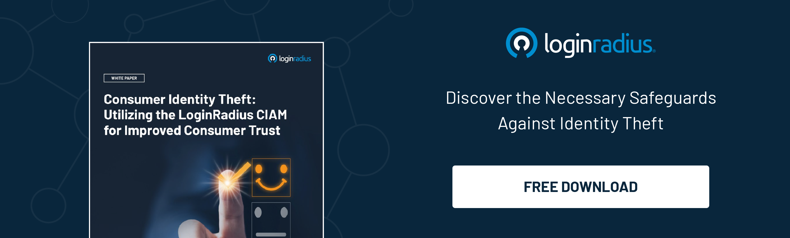

## Introduction 

Today, we're diving deep into the fascinating world of personalization and how it's being reshaped by a game-changer: Zero-Party Data. Now, what on earth is Zero-Party Data, and why should we care? Well, buckle up because we're about to embark on a journey to revolutionize how you see your online experiences.

Picture this: you're scrolling through your favorite online store, and voila! Suddenly, the website seems to understand your preferences magically. It recommends products that align perfectly with your taste. How does it do that? Enter Zero-Party Data, the secret sauce behind this seamless, personalized experience.

Let’s explore what Zero-Party Data is and how it helps businesses enhance overall growth by improving lead generation and conversion rates. 

### What Exactly is Zero-Party Data?

Zero-Party Data is like a breath of fresh air in [digital marketing](https://www.loginradius.com/blog/growth/how-to-make-personalized-marketing-effective-with-consumer-identity/). Unlike First-Party Data (data you willingly share with a company) or Third-Party Data (gathered from various sources without your direct involvement), Zero-Party Data is willingly shared directly by you. It's the information you intentionally provide, such as preferences, interests, and feedback.

This information could be anything except your personal information. For instance, you can ask your customers what interests them, their expectations, and more. 

### The Power of Zero-Party Data in Action

Imagine you're a fitness enthusiast visiting a sports apparel website. With Zero-Party Data, you might willingly share that you prefer sustainable, moisture-wicking fabrics, love running, and prefer vibrant colors. 

Armed with this information, the website can curate a personalized shopping experience just for you. You won't waste time scrolling through irrelevant products; instead, you'll discover items tailored to your interests.

### The Era of Empowered Consumers

In the information age, consumers are more aware than ever about the value of their data. Zero-Party Data aligns perfectly with this growing consciousness. It signifies a shift from mere transactions to meaningful interactions. 

When you willingly share your preferences, you tell businesses what matters. This insight is invaluable because it allows companies to understand your needs deeply. It's like having a personal shopper who knows your style, size, and favorite colors, ensuring that every recommendation feels like it was handpicked just for you.

### Personalization Beyond Products

Zero-Party Data isn't limited to product recommendations; it's transforming how content is delivered to you. 

[Streaming platforms](https://www.loginradius.com/blog/identity/media-entertainment-use-loginradius-platform/), for instance, leverage your watch history and genre preferences to suggest movies and TV shows you're likely to enjoy. Imagine a Friday night where you don't waste hours scrolling but instead dive into a film that suits your mood perfectly. It’s all made possible by the information you willingly share, creating an entertainment experience tailored to your tastes.

### Building Trust Through Transparency

One of the most remarkable aspects of Zero-Party Data is the trust it builds between businesses and consumers. When companies respect your data privacy and use the information you provide responsibly, it fosters a sense of loyalty.

Imagine receiving a survey from your favorite streaming service asking about your favorite genres. You willingly share your preferences; in return, they recommend movies and shows tailored to your taste. It's a win-win situation that leaves everyone smiling.

### Zero-Party Data Beyond Shopping

The influence of Zero-Party Data isn't limited to the world of e-commerce. Think about personalized content on streaming platforms, customized workout routines on fitness apps, or even tailored travel recommendations. The possibilities are endless, thanks to the magic of the data you willingly share.

### Embracing the Future

As we venture into the digital age, embracing Zero-Party Data is the way forward. It's a paradigm shift that puts the power back into your hands, giving you control over your online experiences. So, the next time a website politely asks for your preferences, don't hesitate to share. You're not just helping them personalize your experience; you're shaping the future of online interactions.

In a nutshell, Zero-Party Data is revolutionizing personalization, making your online adventures more enjoyable and meaningful. So, go ahead, share your preferences, and get ready to be amazed by the tailored experiences that await you.

