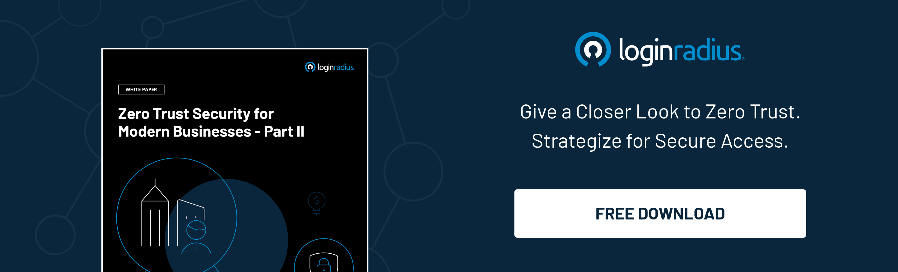

## Introduction

With the growing number of cyberattacks and data breaches, businesses are swiftly inching towards more robust security mechanisms. And zero trust architecture is one of them. 

Though zero trust may be potent for reinforcing overall security, chances of sneaking and [security breaches](https://www.loginradius.com/blog/identity/how-to-handle-data-breaches/) aren’t always zero. However, if not implemented correctly, it could lead to various security and user experience issues and hampers overall business growth. 

Let’s understand the aspects of implementing zero trust architecture and how businesses can reap maximum security and user experience benefits. 

## What is Zero Trust Security? Why it Matters Now More than Ever? 

[Zero trust](https://www.loginradius.com/blog/identity/beginners-guide-zero-trust-security/) can be defined as the security concept based on a belief that enterprises shouldn’t automatically trust any device or individual, whether inside or outside its perimeters, and should strictly verify everything before granting access.

In a nutshell, zero trust relies on the principle of “don’t trust anyone.” This architecture cuts all access points until proper verification and trust are established. No access is provided until the system verifies the individual or device demanding n access to the IP address, instrument, or storage.

This strategic initiative helps prevent data breaches as the concept of trusting anyone is eliminated, even if the access request is from within the network. Hence, implementing zero trust architecture ensures the highest level of security and mitigates the risk of a data breach or unauthorized access.

Implementing a zero-trust architecture in today’s era is crucial since cybercriminals are exploring new ways of breaching organizations' security. Moreover, in a post-covid world, where remote working is swiftly becoming the new routine, identity thefts and unauthorized access are creating big hurdles for enterprises. 

Hence, it’s crucial for organizations to think outside the box and not just rely on conventional security mechanisms, including [multi-factor authentication](https://www.loginradius.com/multi-factor-authentication/). Zero trust architecture has become the new normal. 

## Consequences of Poor Implementation of Zero Trust Architecture

As discussed above, zero trust architecture helps improve overall security and enhances user experience. Hence, a little loophole in implementation could cause financial and reputational losses. 

On the other hand, the lack of a multi-phased approach and transparency while implementing zero trust could further increase the risks since employees aren’t aware of certain aspects of data security. In a nutshell, transparency while implementing zero trust architecture is crucial. 

## How Businesses Can Ensure Complete Transparency While Implementing Zero Trust Architecture?

### #1. Prioritizing employee education 

Educating your employees is perhaps the most crucial aspect of maintaining transparency since it clarifies the zero trust architecture and how it works. 

Organizing training sessions could help them better understand everything related to security-related issues and how zero trust could help overcome the same. 

Apart from this, employees can easily support the overall access requirements for vendors, employees, and customers while mergers and acquisitions (M&A). 

### #2. Promoting cross-department collaboration

Managing access across diverse departments is conventionally handled by integrated employee-centric access management solutions. And this could be a risky thing. 

Implementing zero trust through an identity management platform for seamless access management for cross-department collaboration helps ensure complete transparency throughout the organization. 

A [CIAM solution](https://www.loginradius.com/blog/identity/customer-identity-and-access-management/) helps manage things seamlessly and offers complete transparency regarding access management within employees to employees, machines, and machine-to-machine communications. 

## Final Thoughts

Zero trust architecture is undeniably helping brands reinforce their overall security infrastructure, but consequences related to bad implementation shouldn’t be ignored. 

A reliable customer identity and access management (CIAM) could help businesses integrate zero trust architecture across their platform seamlessly. It offers complete transparency reinforced with stringent security and a great user experience.  

