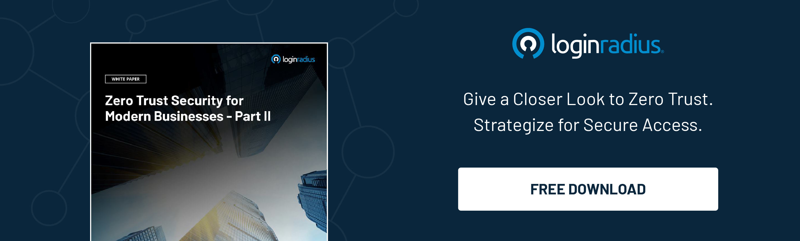

## Introduction

In an era when cyber threats are becoming more frequent and sophisticated, traditional cybersecurity measures are proving insufficient both in the private and government sectors. 

Undoubtedly, organizations must immediately work on reinforcing cybersecurity for their users since neglecting modern threat vectors could lead to severe financial and reputational losses. 

Things aren't different in the government sector. Most citizens who use online services may be at risk when they share their personal information on various interconnected government platforms. 

The rise of [Zero-Trust](https://www.loginradius.com/blog/identity/beginners-guide-zero-trust-security/) adoption across government sectors marks a significant shift in how sensitive information and critical infrastructure are protected. 

This blog explores the principles of Zero-Trust architecture, its benefits, and how it is transforming government cybersecurity.

## Understanding Zero-Trust Architecture

Zero-Trust is a cybersecurity paradigm that operates on the principle of "never trust, always verify." 

Unlike traditional security models that rely on perimeter defenses, Zero-Trust assumes that threats can originate from both outside and inside the network. Therefore, every user, device, and application attempting to access resources must undergo continuous verification.

Key principles of Zero-Trust include:

* **Micro-Segmentation**: Dividing networks into smaller, isolated segments to contain breaches and limit the lateral movement of attackers.

* **Least Privilege Access**: Granting users and devices the minimal access necessary to perform their functions.

* **Continuous Monitoring and Validation**: Implementing real-time monitoring and continuous authentication to promptly detect and respond to suspicious activities.

## The Need for Zero-Trust in Government Sector

Government agencies manage a vast amount of sensitive data, from personal citizen information to national security details.

The consequences of a cyber breach can be catastrophic, impacting public trust, national security, and the economy. Traditional security measures, such as firewalls and VPNs, have proven inadequate in the face of advanced persistent threats (APTs) and insider threats.

Adopting a Zero-Trust approach addresses several critical challenges:

* **Evolving Threat Landscape**: Cyber adversaries are constantly developing new tactics to bypass conventional defenses. Zero-Trust ensures a more resilient security posture.

* **Remote Work and BYOD**: The rise of remote work and the use of personal devices in government operations necessitate a [security model ](https://www.loginradius.com/security/)that can handle diverse and dispersed environments.

* **Compliance and Regulations**: Governments must comply with stringent data protection regulations. Zero-Trust helps ensure adherence to these standards by providing robust security controls and detailed audit trails.

## Benefits of Zero-Trust Adoption

Implementing Zero-Trust architecture in government sectors offers numerous benefits:

* **Enhanced Security Posture**: Zero-Trust minimizes the risk of unauthorized access and data breaches by continuously verifying all access requests.

* **Improved Visibility**: Zero-Trust provides comprehensive visibility into network traffic, user activity, and device behavior, enabling faster detection and response to threats.

* **Reduced Attack Surface**: Micro-segmentation and least privilege access reduce the potential impact of a breach by limiting the reach of attackers within the network.

* **Scalability and Flexibility**: Zero-Trust architecture can be adapted to various environments, including on-premises, [cloud, and hybrid infrastructures](https://www.loginradius.com/blog/identity/what-is-cloud-computing/), making it a versatile solution for modern government IT landscapes.

## Challenges and Considerations

While the benefits are clear, adopting Zero-Trust is not without challenges:

* **Cultural Shift**: Transitioning to a Zero-Trust model requires a cultural shift within government agencies, emphasizing the importance of continuous security over traditional perimeter-based defenses.

* **Resource Intensive**: Implementing Zero-Trust involves significant investments in technology, training, and ongoing management.

* **Integration with Legacy Systems**: Governments often rely on legacy systems that may not be compatible with modern Zero-Trust solutions. Ensuring seamless integration can be complex and time-consuming.

## How LoginRadius' Zero Trust Architecture Reinforces Cybersecurity

[LoginRadius](loginradius.com), a leader in cloud-based customer identity and access management, provides a robust Zero-Trust architecture that significantly enhances cybersecurity for government agencies. 

By leveraging advanced authentication mechanisms, such as multi-factor authentication (MFA) and [risk-based adaptive authentication](https://www.loginradius.com/resource/guide/enterprise-risk-based-authentication/), LoginRadius ensures that only verified users can access sensitive resources. 

The platform also includes comprehensive user behavior analytics, which continuously monitors and evaluates user activities to detect anomalies and potential threats in real time. Additionally, LoginRadius supports seamless integration with existing government IT infrastructures, including legacy systems, ensuring a smooth transition to a Zero-Trust model. 

This approach strengthens security and ensures compliance with stringent regulatory requirements, ultimately reinforcing the government's overall cybersecurity posture.

## Conclusion

Zero-Trust architecture is revolutionizing cybersecurity in government sectors, providing a robust framework to counteract the evolving threat landscape. As cyber adversaries become more sophisticated, the need for a comprehensive, resilient, and adaptive security model has never been more critical. 

By embracing Zero-Trust, government agencies can better protect sensitive data, ensure compliance with regulations, and maintain the public's trust they serve.

Zero trust is not just a trend but a necessary evolution in the ongoing battle against cyber threats. The journey towards full Zero-Trust implementation may be challenging, but the benefits far outweigh the obstacles, paving the way for a more secure and resilient government infrastructure.

