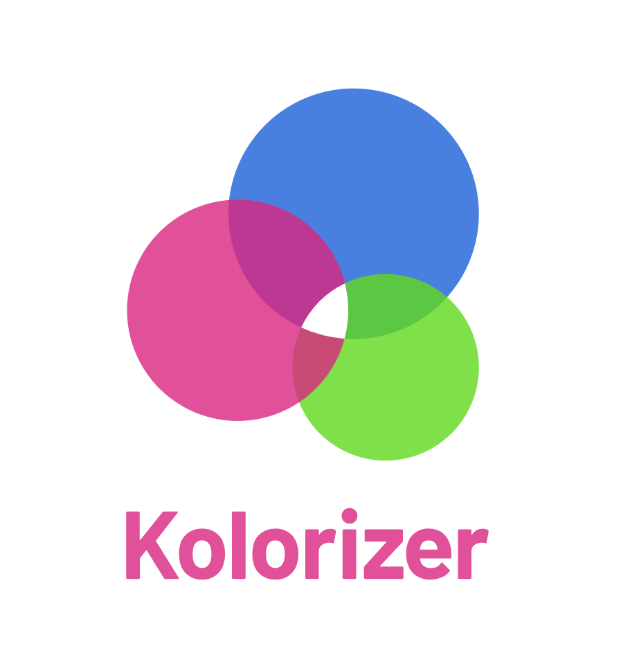
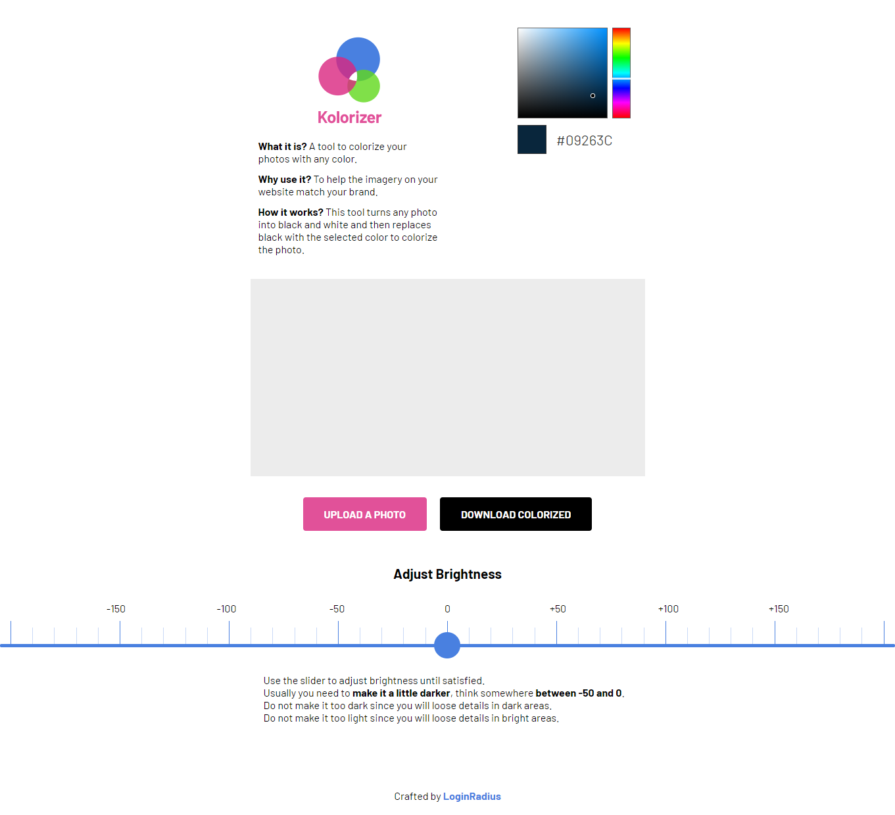

		

Many developers overlook imagery on the websites they develop. The website design starts with image placeholders instead of images. They spend weeks creating it's structure and features. Then they spend some time on the content, and after that, the images come as the last step right before launching the website with the words “Let's just put a random image of whatever, as long as it makes sense.”
		

When this approach works for many websites since imagery is secondary content, in many cases, you need to involve the work of a designer or a photographer to get something unique to use free of copyright. When custom work is always encouraged, there is a space for the first approach. Whether you do not have a designer to rely on, or you want to ease the load off your design team, you can find copyright-free images on the web and use them in your projects.
		

## The problem

All seems fair until you realize that your website is starting to look like a circus. With every image and photo having different colors, the website is like an intersection without any traffic lights - everybody is doing whatever they want. There is no uniformity or harmony between all of the imagery. This might seem like a small problem initially, but it hurts your business in the long run. 

As your business struggles to create a consistent unified brand, people do not sense the authority and quality of your product and in the end, they go to someone else that seems to know what they are doing. And if you think, “Not everybody is a designer, and most people would not notice this,” while it is true, some people would not care, but in most cases, people would start noticing this. All this will be happening subconsciously. They will not tell you precisely what is wrong, but they would feel less connection with your brand, which could make them leave in the long run if they find something that feels more right.
		

If your product is selling car insurance, you want people to identify you as the leader, the main place to get everything you need for car insurance. To accomplish that, you need to build a strong brand around your product.

You might be thinking right now: “Sounds like I need an expensive designer to figure all of that out!”. When a great designer could take your brand to the next level, you can do something that will not cost you a dime. A great start to building a brand is making all the colors on the website as consistent as possible. I am sure you know how to make that in CSS with the headings, paragraphs, link colors, etc., it is a little more complicated for the images.
		

## The solution

This is where our little tool comes in - [Kolorizer](https://kolorizer.com/). This incredibly simple online tool will have a huge impact on your brand, whether you are kicking it off or simplifying and growing an existing one.
		

The task is simple - to make colors in all the imagery on your website match your brand's colors. There are mostly two different ways of doing this in the design world: **"The overlay" method** and **“The changing of the base color” method**.

In the **“The overlay” method**, the color overlay is simply applied on top of the image. While it is the easiest and quickest way of adding some brand colors to the images, it comes with some downsides. The image becomes darker and some other colors might still peek through, which is not great.

*Image created using “The overlay” method*
		

The second, **“The changing of the base color” method**, is less common because it requires a few more steps. First, the image is converted to black and white, making every pixel in the image based on black color. So every single pixel is a percentage of black color. Now we can replace that black color with any of the dark colors you have in your brand, like dark blue or dark orange. And voila! Every pixel in our image is now based on that color, without any overlay that darkens the image and without any other colors peeking through the overlay. This does create a little problem: since we are basing our image on a dark color that is not black, the image is lighter and we have to adjust the brightness of the image a little bit to compensate for this. The amount depends on the image itself - some would be good right after the conversion, some would need to be darkened or lightened.

*Image created using “The changing of the base color” method*

Kolorizer is built using the second method, and most of the steps are done automatically.

After you upload the image, it is converted to your selected brand color right away. Adjust the color if you need to. Maybe try a different dark color out of your brand colors. Then adjust the brightness of the image if needed and download the finished colorized image. That is it!

Now in just seconds, you can have a stock image that matches your brand color and helps you build a brand vs hurting it in the long run.

### A Tip

Use this tool for all of the imagery in your brand materials: slideshows, handouts, posters, documents, etc., to have a consistent and recognizable brand across the board.
