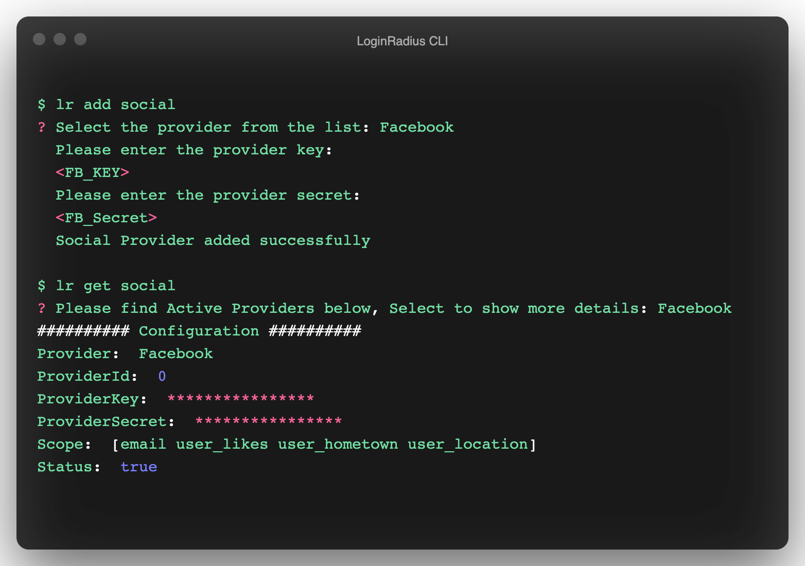
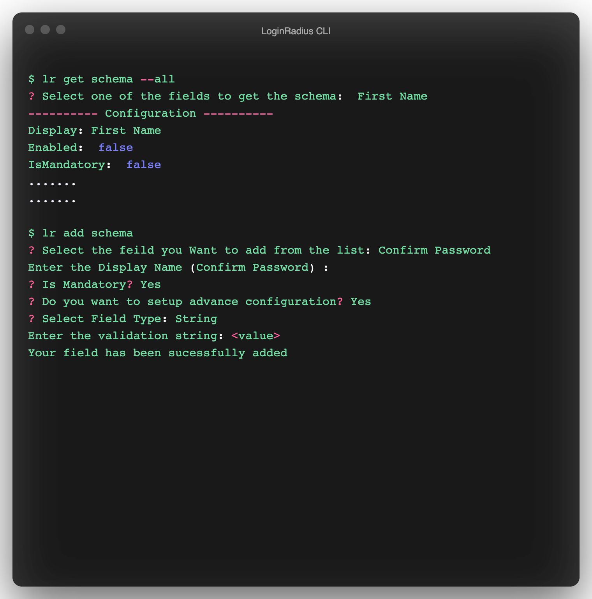

Hey Everyone !!! This blog will walk you through the steps necessary to quickly implement authentication mechanisms for your React application by leveraging [LoginRadius](https://accounts.loginradius.com/auth.aspx?return_url=https://dashboard.loginradius.com/login) and the [LoginRadius CLI](https://github.com/LoginRadius/lr-cli) with the help of examples. 

Using the LoginRadius CLI, you can perform basic actions of your LoginRadius Dashboard through the command line. The actions include login, register, logout, social configuration, domain whitelisting, site management, etc. Once the actions are performed, changes will be reflected in your application. 


## Configuring LoginRadius

Please follow the steps below to install the LoginRadius CLI on your system. Once completed, use the CLI to finish registration on the LoginRadius portal and create your application. 

### LoginRadius CLI Setup

#### Mac or Linux

- Install the tap using:

    ```sh
    $ brew tap loginradius/tap
    ```
- Then, you can install LR CLI via:

    ```sh
    $ brew install lr
    ```

#### Other Platforms

- Packaged binaries are available on the [release page](https://github.com/loginradius/lr-cli/releases/latest).

Once you have the CLI installed, the following command can be used to complete the registration process via the LoginRadius portal. 

```sh
$ lr register
```
This command will open the Portal in the browser, where you can register yourself and create the app.


If you already have a LoginRadius account, use the command below to directly login :

```sh
$ lr login
```

Once you successfully register or login, the below message will be visible in a new tab on the browser. Close the tab and return to the CLI. 

```
You are Successfully Authenticated, Kindly Close this browser window and go back to CLI.
```

### Fetching Application API Credentials

Once the **login/register** process has been completed, run the `lr get config` command to fetch your **API Key/Secret** as shown below. 

 

### Configuring Callback URLs

Here, a callback URL refers to a URL in your application that LoginRadius would redirect a user to after they have been authenticated.  These URLs must be added to your Application Configuration. If not set, users will be unable to login into the application and receive an error. 

 

For security reasons, LoginRadius only processes API calls that are received from the whitelisted domains. To get the list of whitelisted domains, run `lr get domain` command from the CLI. Similarly, to add a domain, use the `lr add domain` command.

> For the purposes of this tutorial, make sure that you set http://localhost as a whitelisted domain. 

 

## Setup React JS application

This tutorial uses a [demo app](https://github.com/LoginRadius/engineering-blog-samples/tree/master/React/react_auth_demo) based on the Create React App (CRA) boilerplate. For instructions on how to create a React App, refer to the following [docs](https://reactjs.org/docs/create-a-new-react-app.html).

The React Demo Application mentioned here will display the User Profile data if the login process is completed successfully.

After setting up the boilerplate:

- From the project root, install `react-router-dom`.
  
  `npm install react-router-dom`

- Create `src/config.js` and add the application details in the code as shown below.

```js

const config = {
    APP_NAME: '<<App Name>>',
    API_KEY: '<<API Key>>',
  };
  export default config;

```  

> This tutorial uses LoginRadius Auth Page(IDX) for authentication, where Registration and Login functionality is already implemented. For example, you can navigate your Register buttons to `https://<LoginRadius APP Name>.hub.loginradius.com/auth.aspx?action=register&return_url=<Return URL>`. 

## Add Code to your Application

- For this demo, we will start by populating the `App.js` file as shown below. Notice that the `/login` route has been added to the App component in which the `Login` and `Logout` components are rendered. They will be used to get the user profile data and handle user logout, respectively. The `/` route will load the `LandingPage` component. If you already have an existing React application, you can specify the route for these components as per your requirements. 

```js

import { BrowserRouter as Router, Route, Switch } from "react-router-dom";
import "./App.css";
import LandingPage from "./components/LandingPage";
import Login from "./components/Login";
import Logout from "./components/Logout";

function App() {
  return (
    <Router>
      <div className="App">
        <Switch>
          <Route exact path="/">
            <LandingPage />
          </Route>
          <Route path="/login">
            <div style={{ display: "flex", padding: "1em" }}>
              <Login />
              <Logout />
            </div>
          </Route>
        </Switch>
      </div>
    </Router>
  );
}

export default App;

```
### Add Landing Page

In your `components` folder under the `src` folder, create a `src/components/LandingPage.js` file and add the following code to navigate your Register/Login buttons to the following URL's as shown below.

```js
import React from "react";
import config from "../config.js";
const LandingPage = () => {
  return (
    <div>
      <h1> React Demo App </h1>

      <a
        href={`https://${config.APP_NAME}.hub.loginradius.com/auth.aspx?action=register&return_url=${window.location.origin}/login`}
      >
        <button>Register</button>
      </a>

      <a
        href={`https://${config.APP_NAME}.hub.loginradius.com/auth.aspx?action=login&return_url=${window.location.origin}/login`}
      >
        <button>Login</button>
      </a>
    </div>
  );
};
export default LandingPage;
```
    

By doing this, we are redirecting our application to the **LoginRadius Auth Page** and are passing the `return_url` as the current origin. After successful login, the **Login** component fetches the user profile data as shown in the following step. However, `return_url` can also be your website, backend server, etc., where you can handle the access token to perform different actions. 

### Add Login Component

In your `components` folder, create a `src/components/Login.js` file and add the following code to retrieve **User Profile Data**. 

```js
import React from "react";
import { withRouter } from "react-router-dom";
import config from "../config";

class Login extends React.Component {
  constructor(props) {
    super(props);
    this.state = {
      userProfileResponse: null,
    };
  }

  componentDidMount() {
    const token = new URLSearchParams(this.props.location.search).get("token");
    if (token) {
      fetch(
        "https://api.loginradius.com/identity/v2/auth/account?apikey=" +
          config.API_KEY,
        {
          method: "GET",
          headers: {
            Authorization: "Bearer " + token,
          },
        }
      )
        .then((res) => res.json())
        .then((res) => {
          this.setState({ userProfileResponse: res });
        })
        .catch((e) => {
          console.log(e);
        });
    } else {
      window.location.assign(
        `https://${config.APP_NAME}.hub.loginradius.com/auth.aspx?action=login&return_url=${window.location.origin}/login`
      );
    }
  }

  render() {
    const { userProfileResponse } = this.state;

    return (
      <div>
        <span style={{ whiteSpace: "pre-wrap", textAlign: "left" }}>
          {JSON.stringify(userProfileResponse, null, 4)}
        </span>
      </div>
    );
  }
}

export default withRouter(Login);

```
The Login component will call the LoginRadius API to fetch the user data by making use of the `token` obtained upon logging in via the **LoginRadius Auth Page**. 

### Add Logout component

In your `components` folder, create a `src/components/Logout.js` file and add the code as shown below.

```js
import React from "react";
import config from "../config.js";

const Logout = () => {
  localStorage.removeItem("token");

  return (
    <div class="container">
      <a
        href={`https://${config.APP_NAME}.hub.loginradius.com/auth.aspx?action=logout&return_url=http://localhost:3000/`}
      >
        <button>Logout</button>
      </a>
    </div>
  );
};
export default Logout;
```

This component contains logout functionality. Here, `action=logout` is passed to the **LoginRadius Auth Page**, which will log the user out and return them to the Landing Page specified in the `return_url`. 

> Full code of the demo can be found on [github](https://github.com/LoginRadius/engineering-blog-samples/tree/master/React/react_auth_demo).

### Testing the application

Run the React Application from the command line using `npm start`. You will be able to see the output on `localhost:3000`. You can also directly open the IDX page on `https://<LoginRadius APP Name>.hub.loginradius.com/auth.aspx?action=register&return_url=http://localhost:3000/login`.

Congratulations! You have set up a React Application configured with LoginRadius using LoginRadius CLI. Continue reading to check out some cool and advanced features of the LoginRadius CLI that will help you manipulate and configure the LoginRadius Auth Page for your application through the CLI. 

## Advanced LoginRadius CLI features

This section explains the use of the LoginRadius CLI in enabling users to quickly and efficiently make changes to the **LoginRadius Auth Page** configured for their application. 

### Adding Social Login Methods

We can add social login methods like Google, Facebook, etc., to the LoginRadius Auth Page using the CLI. Use the `lr add social` command to add a Login method and the `lr get social` command to view the current active social login methods. Check the image below for a visual representation. 

 

After adding the new login method (in this example, it is Facebook), navigate to the LoginRadius Auth Page by using the `lr demo` command.

 

### Updating the theme

We can update the **theme** of the LoginRadius Auth Page using the `lr set theme` command. You can use the `lr get theme` command to get a list of all available themes and the currently active theme. See the image below for visual representation. 

 

After changing the theme, navigate to the LoginRadius Auth Page using `lr demo` command to view the changes. 

 


### Adding to the Registration schema

> This functionality is only available for paid **Developer Plans and above** (not available for LoginRadius Free plan). 

We can also update the Registration Page schema using the `lr add schema` command. Use the `lr get schema` command to get the current Registration fields and view all available fields with their schemas. The numbers corresponding to the fields must be passed as the `--field` flag to add them to the registration schema.  
See the image below for a visual representation of the command flow. 

 

In the below image 2 fields have been added to the registration schema, `Confirm Password` and `Gender`. To view the changes, navigate to the LoginRadius Auth Page using `lr demo`command.

 

> Instead of using the `lr demo` command, you can also view the **LoginRadius Auth Page** by visiting [locahost:3000](http://locahost:3000) and following the same workflow as explained earlier.


The entire description for these commands can be found in the [LoginRadius CLI Manual](https://www.loginradius.com/open-source/cli/manual).

## Contributing to LoginRadius CLI

The [LoginRadius CLI](https://github.com/LoginRadius/lr-cli/) is open-sourced under [LoginRadius Organization](https://github.com/LoginRadius). You are welcome to contribute to it, suggest improvements, or report bugs by following the contributing guidelines. You can also checkout our [open source page](https://www.loginradius.com/open-source/) if you wish to contribute to other opensource projects by LoginRadius.

## Your Take 

Using the LoginRadius CLI, you can easily setup authentication for your React applications. You can also perform certain LoginRadius functionalities and processes efficiently through the CLI, which saves a bunch of time. LoginRadius will handle all the authentication-related mechanisms so that you can solely concentrate on your application development.

I hope you enjoyed this tutorial and found it to be useful. You can provide feedback or suggestions in the comment section below. 

Cheers!!!
