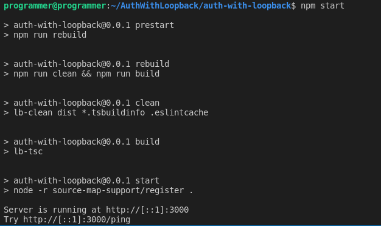

Authentication and authorization are critical components of every software application since they ensure the security of the user's data. However, it is not always easy to get them implemented. However, LoopBack 4 has an authentication package **@loopback/authentication** that lets you protect your application's API endpoints with custom authentication strategies and a **@authenticate** decorator that requires minimal boilerplate code.


## What is Loopback

According to the documentation, LoopBack is an award-winning, highly flexible, open-source Node.js and TypeScript framework built on Express, that allows you to easily develop APIs and microservices built of backend systems such as databases and SOAP or REST services.
Loopback provides several features that allow you to build your application with less boilerplate code, which are not restricted to.

- Define your API endpoints and schemas using the [OpenAPI](https://www.openapis.org/) standard.
- Write your endpoints in modern JavaScript using ES2017, async / await, modules.
- Use your defined endpoints and schemas as the source of truth without generating code.
- Review changes to API endpoints without digging through JavaScript.
- Maintain consistency by automating the validation of your endpoints and schemas.
- First-class support for [TypeScript](https://www.typescriptlang.org/) (strongly typed JavaScript).
- Use LoopBack as a starting point for your framework or platform.
- Build libraries of reusable components in a standardized way.
- Integrate with databases, web services, and other platforms using connectors.

- Using the standard [OpenAPI](https://www.openapis.org/) to create any API endpoints and schemas.
- Creating contemporary JavaScript endpoints using ES2017, async / await, and modules.
- Rather than generating boilerplate code, use your established endpoints and schemas as the source of truth.
- Examining the change made to API endpoints without having to crawl through JavaScript.
- Maintaining consistency through automated endpoint and schema validation.
- Implemented to fully support TypeScript.
- Creating a standardized libraries of reusable components.
- Allow you to connect to databases, online services, and other platforms using built-in connectors.

## What is JSON Web Token (JWT)

JSON Web Token (JWT) is an open standard (RFC 7519) that offers a compact and self-contained method for securely communicating information as a JSON object between parties. Because it is digitally signed, this information can be checked and trusted. JWTs can be signed with either a secret (using the HMAC technique) or a public/private key pair (using RSA or ECDSA). It is used for authentication and secure information sharing. A JWT token is made up of three components that are separated by three dots:

- Header: The header is made up of two parts: the kind of token, which is JWT, and the signature technique used, which is either HMAC SHA256 or RSA.
- Payload: The payload is the token, which includes the claims. Claims are assertions about an entity that provides extra information.
- Signature: The encoded header, encoded payload, a secret, and the algorithm provided in the header comprise the signature.


## Prerequisites

This tutorial is a hands-on demonstration. To follow along, be sure you have the following in place:

- A Linux machine – This tutorial will use Ubuntu 20.04, which works well on other Linux distributions and operating systems.
- [**NodeJS**](https://nodejs.org/) – JavaScript runtime built on Chrome's V8 JavaScript engine.
- [**MongoDB**](https://www.googleadservices.com/pagead/aclk?sa=L&ai=DChcSEwiiqMOcgOT0AhW9E9QBHX_NBkwYABAAGgJvYQ&ae=2&ohost=www.google.com&cid=CAESQOD2-dSvIZjrPJ6ygmiUs_a0EdOfNl4UZ08K2P8CBdRlG8XM7z1URxeAPsMds5XnNZzxbl6wm8XmIxQ2YIdzJP8&sig=AOD64_1wDL4266dBtlF-1EjB6lfvSLjIvw&q&adurl&ved=2ahUKEwiNn7icgOT0AhW0nGoFHUPjDGgQ0Qx6BAgDEAE) - Document-oriented database program.


## Install Loopback CLI

To start building our Loopback REST API, we must first install the Loopback CLI, which provides the quickest method to get started with a LoopBack 4 project that follows best practices.
Use the command below to install the Loopback CLI globally:

```bash
    npm i -g @loopback/cli
```

You can grab a cup of coffee while you wait for the installation to complete. Then open your command line, create an *AuthWithLooback folder*, and change directory to the *AuthWithLooback* folder with commands below:

```bash
    mkdir AuthWithLooback
    cd AuthWithLooback
```

## Scaffold Loopback Project

Now that you've installed the Loopback CLI and created the project directory. Let's get started by running the following command to create a Loopback project:

```bash
    lb4 app
```

Select the following options in the screenshot below to complete the prompts.


After completing the prompts, Loopback will configure the TypeScript compiler, and install all the required dependencies. Change directory into the *auth-with-loopback* folder.

```bash
    cd auth-with-loopback
```

## Create Model

We have successfully created our Loopback application. Now let’s create a Model to store the news details with the command below:

```bash
    lb4 model
```

Select the following options in the screenshot below to complete the prompts.


After the date_created property definition, press the enter key to exit the prompt.
Loopback will create a **NewsModel** file in the `src/models` ****folder where the **NewsModel** will be defined.

Next, You need to create a data source to enable us to connect to our preferred database. For the demonstrations in this tutorial, we will connect to a MongoDB database.
Run the command below on your terminal to create a data source:

```bash
    lb4 datasource
```

Select the following options in the screenshot below to complete the prompts.


After completing the prompts, Loopback will create **News** file in the `src/datasource` ****folder.

Then, create a [Repository](https://loopback.io/doc/en/lb4/Repository.html) for our CRUD operations of our NewModel with the command below:
After completing the prompts, Loopback will create **NewsModelRepository** file in the `src/repository` folder.

```bash
    lb4 repository
```

Select **NewsDatasource** as the data source, **NewsModel** as the to generate repository for, and **DefaultCrudRepository** as the base repository class.
Your selection for the prompts should look like the screenshot below.


After completing the prompts, Loopback will create **NewsModelRepository** file in the `src/repository` folder.

Lastly, create a controller for the **NewsModel** you created with the command below:

```bash
    lb4 controller
```

Your selection for the prompts should look like the screenshot below.


After completing the prompts, Loopback will create **NewsController** file in the **src/controller** folder. So far your project structure omitting the **node_modules** folder should look like this.

📦auth-with-loopback
 ┣ 📂public
 ┃ ┗ 📜index.html
 ┣ 📂src
 ┃ ┣ 📂__tests__
 ┃ ┃ ┣ 📂acceptance
 ┃ ┃ ┃ ┣ 📜home-page.acceptance.ts
 ┃ ┃ ┃ ┣ 📜ping.controller.acceptance.ts
 ┃ ┃ ┃ ┗ 📜test-helper.ts
 ┃ ┃ ┗ 📜README.md
 ┃ ┣ 📂controllers
 ┃ ┃ ┣ 📜README.md
 ┃ ┃ ┣ 📜index.ts
 ┃ ┃ ┣ 📜news-controller.controller.ts
 ┃ ┃ ┗ 📜ping.controller.ts
 ┃ ┣ 📂datasources
 ┃ ┃ ┣ 📜README.md
 ┃ ┃ ┣ 📜index.ts
 ┃ ┃ ┗ 📜news.datasource.ts
 ┃ ┣ 📂models
 ┃ ┃ ┣ 📜README.md
 ┃ ┃ ┣ 📜index.ts
 ┃ ┃ ┗ 📜news-model.model.ts
 ┃ ┣ 📂repositories
 ┃ ┃ ┣ 📜README.md
 ┃ ┃ ┣ 📜index.ts
 ┃ ┃ ┗ 📜news-model.repository.ts
 ┃ ┣ 📜application.ts
 ┃ ┣ 📜index.ts
 ┃ ┣ 📜migrate.ts
 ┃ ┣ 📜openapi-spec.ts
 ┃ ┗ 📜sequence.ts
 ┣ 📜.dockerignore
 ┣ 📜.eslintignore
 ┣ 📜.eslintrc.js
 ┣ 📜.gitignore
 ┣ 📜.mocharc.json
 ┣ 📜.prettierignore
 ┣ 📜.prettierrc
 ┣ 📜.yo-rc.json
 ┣ 📜DEVELOPING.md
 ┣ 📜Dockerfile
 ┣ 📜README.md
 ┣ 📜package-lock.json
 ┣ 📜package.json
 ┗ 📜tsconfig.json

## Add Custom Data

Now that you have the Model setup, run the sever, and add some custom data to the News collection in MongoDB.

```bash
    #start the server
    npm run start
```

The above command will start the Typescript compiler, which will build the project and check for possible errors. If everything goes well with the code, you should see the output like the one on the screenshot below on the terminal




Next, open your favorite browser and navigate to [localhost:3000](http://localhost:3000). You should see a similar output to like the one on the screenshot below on your browser.


Now, click on the explorer link, where you can make requests our LoopBack application. On the explorer page, locate the post endpoint and add some custom data to the News collection by clicking the **try it out** button with the data below on the request body.

```json
    {
      "title": "Upgrade to Loopback V4",
      "body": "The developers of Loopback urges the V3 users to upgrade to            V4 as soon as possible",
      "date_created": "2021-12-14T00:57:43.197Z"
    }
```

Then, click the **excute** button, to run the query. 


You can add as many records as you like to experiment with the endpoints. The important thing to note here is that the endpoints are not protected. Anyone may create, read, update, and delete records. In a moment, we will secure the endpoints so that only logged-in users may access them. To begin we have to install 
Loopback **authentication** and **authentication-jwt** with the command below:

```bash
    npm i --save @loopback/authentication @loopback/authentication-jwt
``` 

## Setup Authentication Components

To protect the application, you'll implement user authentication and authorization, which implies that only logged-in users will be able to access our APIs. We’ll create two endpoints in User controller; 

- `/Signup` endpoint: To handle user’s sign up.
- `/Login` endpoint: To handle user’s login.

## Create Signup Endpoint

We’ll start with the sign up controller to enable user’s create an account. Create an empty controller with command below:

```bash
    lb4 controller
```

Your selection for the prompts should look like the screen shot below.


Then, open the `src/controllers/user.controller.ts` file, and import the required modules with the code snippet below :

```javascript
    import { authenticate, TokenService } from '@loopback/authentication';
    import {
      Credentials,
      MyUserService,
      TokenServiceBindings,
      User,
      UserRepository,
      UserServiceBindings,
    } from '@loopback/authentication-jwt';
    import { inject } from '@loopback/core';
    import { model, property, repository } from '@loopback/repository';
    import {
      get,
      getModelSchemaRef,
      post,
      requestBody,
      SchemaObject,
    } from '@loopback/rest';
    import { SecurityBindings, securityId, UserProfile } from '@loopback/security';
    import { genSalt, hash } from 'bcryptjs';
    import _ from 'lodash';
    ........
```

Next, we set up our user credential objects, and verify the user credentials using the `UserService`, injecting `MyUserService` into the `authentication-jwt` extension.

```javascript
    @model()
    export class CreateUser extends User {
      @property({
        type: 'string',
        required: true,
      })
      password: string;
    }

    const UserSchema: SchemaObject = {
      type: 'object',
      required: ['email', 'password'],
      properties: {
        email: {
          type: 'string',
          format: 'email',
        },
        password: {
          type: 'string',
          minLength: 6,
        },
      },
    };

    export const RequestBody = {
      description: 'The input of login function',
      required: true,
      content: {
        'application/json': { schema: UserSchema },
      },
    };

    export class UserController {
      constructor(
        @inject(TokenServiceBindings.TOKEN_SERVICE)
        public jwtService: TokenService,
        @inject(UserServiceBindings.USER_SERVICE)
        public userService: MyUserService,
        @inject(SecurityBindings.USER, { optional: true })
        public user: UserProfile,
        @repository(UserRepository) protected userRepository: UserRepository,
      ) { }
    ..........
```

Finally, we'll build our signup endpoint, which will listen to a POST requests. We save the hashed version of the user's password in the database to keep it safe.

```javascript
     @post('/signup', {
      responses: {
        '200': {
          description: 'User',
          content: {
            'application/json': {
              schema: {
                'x-ts-type': User,
              },
            },
          },
        },
      },
    })
    async signUp(
      @requestBody({
        content: {
          'application/json': {
            schema: getModelSchemaRef(CreateUser, {
              title: 'NewUser',
            }),
          },
        },
      })
      newUserRequest: CreateUser,
    ): Promise<User> {
      const password = await hash(newUserRequest.password, await genSalt());
      const savedUser = await this.userRepository.create(
        _.omit(newUserRequest, 'password'),
      );

      await this.userRepository.userCredentials(savedUser.id).create({ password });

      return savedUser;
    }
    .........
```

## Create Login Controller

Now that we've set up the signup endpoint, let's create the login endpoint so that registered users may log in to the API. Set up the login route in the `src/controllers/user.controller.ts` file using the code snippet below. In the event of a successful login, we send the user a token.

```javascript
      @post('/signin', {
      responses: {
        '200': {
          description: 'Token',
          content: {
            'application/json': {
              schema: {
                type: 'object',
                properties: {
                  token: {
                    type: 'string',
                  },
                },
              },
            },
          },
        },
      },
    })
    async signIn(
      @requestBody(RequestBody) credentials: Credentials,
    ): Promise<{ token: string }> {
      const user = await this.userService.verifyCredentials(credentials);
      const userProfile = this.userService.convertToUserProfile(user);
      const token = await this.jwtService.generateToken(userProfile);
      return { token };
    }
```

Perhaps, you can show the currently logged-in user by adding a `/whoami` endpoint. In the `src/controllers/user.controller.ts` file get the details of the currently logged-in user using the code snippet below. We want the users to access this endpoint only when they are logged in.

```javascript
      @authenticate('jwt')
      @get('/whoami', {
        responses: {
          '200': {
            description: 'Return current user',
            content: {
              'application/json': {
                schema: {
                  type: 'string',
                },
              },
            },
          },
        },
      })
      async whoAmI(
        @inject(SecurityBindings.USER)
        loggedInUserProfile: UserProfile,
      ): Promise<string> {
        return loggedInUserProfile[securityId];
      }
```

Now open the `src/application.ts`, and bind the authentication components to your application class. First, we need to import Loopback `AuthenticationComponent` , `JWTAuthenticationComponent`, and `NewsDataSource`  from our **datasources** with code snippet below:

```javascript
    //...
    import { AuthenticationComponent } from '@loopback/authentication'
    import { JWTAuthenticationComponent, UserServiceBindings } from "@loopback/authentication-jwt"
    import { NewsDataSource } from "./datasources"
    //...
```

Then we mount the jwt authentication system and bind our **NewsDataSource** to the **UserService** data source.

```javascript
     //...
        // ------ ADD SNIPPET INSIDE THE CONTRUCTOR BLOCK ---------
        this.component(AuthenticationComponent);
        this.component(JWTAuthenticationComponent);
        this.dataSource(NewsDataSource, UserServiceBindings.DATASOURCE_NAME);
    //...
```

Finally, we will add the authenticate action in the Sequence. We’ll also modify the error when authentication fails to return status code of 401 (Unauthorized). Open the `src/sequence.ts` file and add the code snippet below:

```javascript
    import { FindRoute, InvokeMethod, MiddlewareSequence, ParseParams, Reject, RequestContext, Send, SequenceActions, SequenceHandler } from '@loopback/rest';
    import {
        AuthenticateFn,
        AuthenticationBindings,
        AUTHENTICATION_STRATEGY_NOT_FOUND,
        USER_PROFILE_NOT_FOUND,
    } from '@loopback/authentication';
    import { inject } from "@loopback/core"
    export class MySequence implements SequenceHandler {
        constructor(
            @inject(SequenceActions.FIND_ROUTE) protected findRoute: FindRoute,
            @inject(SequenceActions.PARSE_PARAMS)
            protected parseParams: ParseParams,
            @inject(SequenceActions.INVOKE_METHOD) protected invoke: InvokeMethod,
            @inject(SequenceActions.SEND) protected send: Send,
            @inject(SequenceActions.REJECT) protected reject: Reject,
            @inject(AuthenticationBindings.AUTH_ACTION)
            protected authenticateRequest: AuthenticateFn,
        ) { }
        async handle(context: RequestContext) {
            try {
                const { request, response } = context;
                const route = this.findRoute(request);
                //call authentication action
                await this.authenticateRequest(request);
                // Authentication successful, proceed to invoke controller
                const args = await this.parseParams(request, route);
                const result = await this.invoke(route, args);
                this.send(response, result);
            } catch (error) {
                if (
                    error.code === AUTHENTICATION_STRATEGY_NOT_FOUND ||
                    error.code === USER_PROFILE_NOT_FOUND
                ) {
                    Object.assign(error, { statusCode: 401/* Unauthorized */ });
                }
                this.reject(context, error);
                return;
            }
        }
    }
```

## Protect News Endpoints

So far, we have implemented user authentication for our API. Let’s protect our News endpoints so that only authenticated users can access those routes.
Open the `src/controllers/news.controller.ts` file and import **authenticate** from jwt authentication.

```javascript
    import { authenticate } from '@loopback/authentication';
```

Then on each of the endpoints in our news controller add  `@authenticate('jwt')` before the `NewsController` class which will protect all the routes in `NewsController`. 

```javascript
    //...
    @authenticate('jwt')
    export class NewsController {
    //...
```

Perhaps, you may not want to protect all the routes, simply add the  `@authenticate('jwt')` method before the route you wish to protect.You can Protect the POST route like this.

```javascript
    @authenticate('jwt')
    @post('/news-models')
      @response(200, {
        description: 'NewsModel model instance',
        content: { 'application/json': { schema: getModelSchemaRef(NewsModel) } },
      })
      async create(
        @requestBody({
          content: {
            'application/json': {
              schema: getModelSchemaRef(NewsModel, {
                title: 'NewNewsModel',
                exclude: ['id'],
              }),
            },
          },
        })
        newsModel: Omit<NewsModel, 'id'>,
      ): Promise<NewsModel> {
        return this.newsModelRepository.create(newsModel);
      }
```

## Test our Application 

We implemented user authentication in our REST API and secured our routes against unauthorized users. Let's put our application to the test. Press `CTRL-C` to exit the server, and restart it with the command below:

```bash
    npm start
```

Now if you open the explorer page, you should see the **UserController** endpoints.


And if you try to execute any query on the **NewsController**, you get a 404 (Unauthorized) error. So signup and by clicking the `/signup` endpoint, and log in from the `/users/login` endpoint. On successful login, copy the token, scroll to the top, click on the **Authorize** button, and paste the token.


Now you can execute queries on the **NewController** endpoints.


## User Authentication with Loginradius

LoginRadius is a platform for managing customer identities and access.
What does this mean for developers? LoginRadius enables developers to simply integrate user login and signup, as well as safeguard their APIs. It frees you up to focus on building key features that are essential to their apps, while LoginRadius considerably assists with user management and user authentication.
Loginradius includes a plethora of enticing features such as passwordless authentication and social SSO (Twitter, Facebook, etc based single sign-on).
Implementing user authentication with LoginRadius is a simple procedure. First, sign up for a Developer Pro trial or simply sign up for a permanently free account [here](https://accounts.loginradius.com/auth.aspx?action=register), and you can explore what LoginRadius performs in a NodeJS application hands-on from the [documentation](https://www.loginradius.com/docs/developer/tutorial/node-js/).

## Conclusion

In this article, we looked at how to create user authentication in a Loopback FastAPI REST API by creating a small news database application.
You can use the steps outlined in this guide to create any type of Loopback REST API that requires user authentication and authorisation. I hope you enjoyed this tutorial! Feel free to contact me on [Twitter](https://twitter.com/EkekentaZion).

