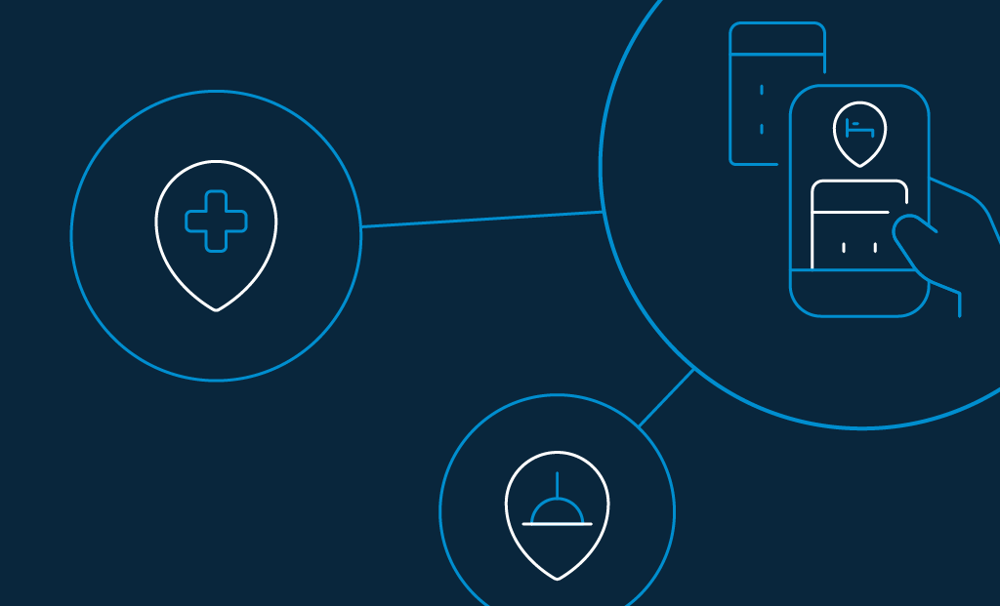

The hospitality industry has always been about luxury, pleasure, and excellent customer services. Modern guests travel for both business and pleasure. Therefore, they expect business owners to interact better and understand them well. 

They love it when hotel owners engage and empower them. They want to be delighted by personalized experiences, and when that happens, they are likely to come back for more stays. 

If your company isn’t doing it yet, you are already behind. Your competitors may have reinvented their [digital transformation plan](https://www.loginradius.com/blog/2018/11/enterprise-needs-digital-business-transformation-strategy/) and offering customer-centric hospitality experience with comfort features and better customer service. 

So, how do you catch up with the latest trends? Here are a few of the latest customer-centric innovations in the hospitality industry. 

## 2020’s Top 5 Trends in the Hospitality Industry

### 1\. Artificial intelligence will eliminate human error.

AI has been a game-changer for the hospitality industry. One of the most popular reasons behind its popularity is its ability to work like humans (minus the error). 

Compared to the traditional setup, AI treats businesses with a host of advantages including:

- Eliminating human errors.
- Providing personalized services.
- Offering tailored recommendations.
- Automating techniques for customer advocacies. 
- Assisting data analysis and data collection.
- Adapting to customer interactions.

Moving on, let’s find out how deep is the impact of AI in the hospitality industry. Here are a few:

- **Brand monitoring** \- Travelers love to post reviews after their vacation. And speaking of reviews, negative comments have the potential to influence more people.  
    With AI, hotel owners can keep a check on what messaging people are exchanging about their property, amenities, services, and stays.  

- **Competitive analysis** - When it comes to reviewing customer feedback, competitive analysis plays an important role. The advantages are three-fold. It helps hotel owners understand their guests, figure out their expectations, and what they liked or disliked about their stay.   
      
    AI can capture such information with 100% accuracy – something human eyes aren’t capable of analyzing. 

**Frictionless authentication** - Facial recognition is one of the most delightful [self-servicing technology](https://www.hotelmanagement.net/tech/facial-recognition-tech-creates-service-security-options) that delights guests in the hospitality industry. Everybody would love the opportunity to skip queues at the front desk while checking-in. Well, AI-infused facial recognition is your solution.

### 2\. IoT will offer “smart” customized solutions

IoT solutions for hotels will add extra oomph to customer experience in 2020. 

At the core of the hospitality industry lies the ultimate guest experience. People love to feel special – a reason why the concept of customization went mainstream. Blending hospitality with IoT will do [wonders for hotel operators](https://www.ezeeabsolute.com/blog/iot-in-hospitality-industry/).

Wondering how? Let’s find out.

- Businesses can save a lot on operational costs (human resources management, housekeeping, front desk).
- With more customer engagement, businesses can enjoy increased revenue generation. 
- With progressive profiling, businesses can better understand the likes, dislikes, and preferences of their guests.
- There will be no more standing in long queues for check-in and check-out. 
- For hotels that offer in-house navigation, it will be easier for guests to find all the amenities inside the property.
- Thanks to [progressive profiling](https://www.loginradius.com/progressive-profiling/), hotels can understand their guests and offer them customized choices to order from. For example, they can customize their room temperature based on their guests’ sleep preferences or give them a personalized breakfast menu.

What more?

The hospitality industry can also automate room services. Hotels can ask guests to fill out their preferences through a centralized app and customize their stays accordingly. 

For example, they can install motion sensors to switch on the lights when they wake up with the coffee machine brewing their favorite cup of coffee. 

They can install sensors to detect occupancy and switch off lights automatically as the guests leave. 

They can install sensors to detect faulty appliances (like leaky taps, broken AC, heater, geyser, etc.) inside the hotel room and notify the maintenance team before check-in.

### 3\. Virtual Reality (VR) will be a key differentiator.

Another example of creating personalized experiences in the hospitality industry is virtual reality. VR offers the ability to transport a person from one space to another within the digital ecosystem. 

In the hotel business, VR can allow guests to enjoy a 360-degree view of the hotel and find out what their rooms will look like booking the property. 

On a different note, VR’s virtually simulated environment can be used as a source of entertainment too, by offering their guests a tour of the local attractions right from the hotel premises.

### 4\. Augmented Reality (AR) will rule the hospitality industry.

Augmented Reality, on the other hand, simulates real-world surroundings with digitally enhanced overlays. The concept is almost similar to VR, where the entire surrounding is changed.

The hospitality industry can use it to its [advantage in a number of ways](https://www.revfine.com/augmented-reality-hospitality-industry/). Imagine the walls of your room are infused with AR-powered technology. At the tap of a button, it can transform into any surrounding (beach, forest, cloud, city heights) you like and let you enjoy the experience without actually being physically present.

### 5\. Digital registration forms will replace the use of pen and paper

The hospitality and tourism industry is largely responsible for the emission of CO2 in the atmosphere. 2020 will be the year of sustainability. Hotel owners will limit the use of traditional forms by introducing digital check-in and check-out processes. 

Guests can use a check-in terminal or conduct advanced check-in through an app to make the process as seamless as possible. 

Also, hospitality companies witness a huge influx of data every day. In the quest to offer personalized services with unique experiences, they need to understand customer behavior.

[Data can make or break a business](https://www.business2community.com/cybersecurity/5-data-security-errors-that-can-break-your-business-02290681). Some of the popular data metrics include name, length of stay, number of guests, property type (urban, suburban), geographics (region, country, city), reservation source (travel agent, corporate online site, direct call, meeting), number of repeat stays, etc.

No wonder the hospitality industry requires a reliable identity management platform that prioritizes data security from unauthorized access, being tampered or destroyed.

## The Role of LoginRadius Identity Platform in the Hospitality Industry

Simply put, data security is a crucial metric for hotel owners. Guests should never feel insecure about their data, and that’s rule 1. 

Henceforth, advanced identity management policies, coupled with frictionless verification should make security seem effortless. 

When your business revolves around accommodating customer preferences, the need for identity verification becomes crucial. LoginRadius is a [customer identity and access management](https://www.loginradius.com/blog/2019/06/customer-identity-and-access-management/) (CIAM) platform that helps hotel owners to roll out strict security policies while offering excellent customer experiences. 

With LoginRadius, here’s what you can offer your customers:

### Seamless verification with biometrics authentication

The hospitality industry is a booming market at the moment. With intense competition happening at the backdrop, taking charge of internal processes and increasing security within the hotel staff has become more crucial than ever.

Looking ahead, LoginRadius’ biometric technology will help you: 

- Monitor the attendance of your staff in real-time. 
- Schedule shifts and manage them efficiently.
- Review staff holidays, late coming, etc. in real-time. 
- Improve staff productivity. 
- No tailgating with accurate identification.
- On-time salary and payroll.

### Strict adherence to global regulatory compliances

The hospitality industry runs a [high risk of data theft](https://www.hospitalitynet.org/news/4094427.html), and when that happens, it leads to severe repercussions, extending far beyond reputations damage.

Therefore, you need to understand the nature of the data you collect from your guests to protect it. Generally, it falls under three categories.

- **Personal data** - includes name, date of birth, and contact information, i.e., basic information.
- **Preference data** - includes room type, special check-in/ check-out requests, i.e., information tracked by hotels to understand the likes and dislikes of their guests.
- **Transaction data** - include bank numbers, credit card information, i.e., information related to payment and reservation services.

[Cybercriminals are mostly fond](https://www.zdnet.com/article/hotel-front-desks-are-now-a-hot-target-for-hackers/) of personal and transaction data. A lot of such data is collected, stored, and processed daily. As hotel operators, it is your responsibility to ensure that all data remains protected. 

LoginRadius abides by industry-approved security compliances like EU’s [GDPR and California’s CCPA](https://www.loginradius.com/blog/2019/09/ccpa-vs-gdpr-the-compliance-war/) to keep guests’ data safe and protected at all times.

## Conclusion

Most businesses in the hospitality sector offer complex ownership structures. Hence, it is only feasible to shift your data protection responsibilities to an ideal customer identity and access management platform that commits to securely managing your guests’ data. 

After all, the hospitality industry is all about customer experiences and keeping up with their changing expectations.

