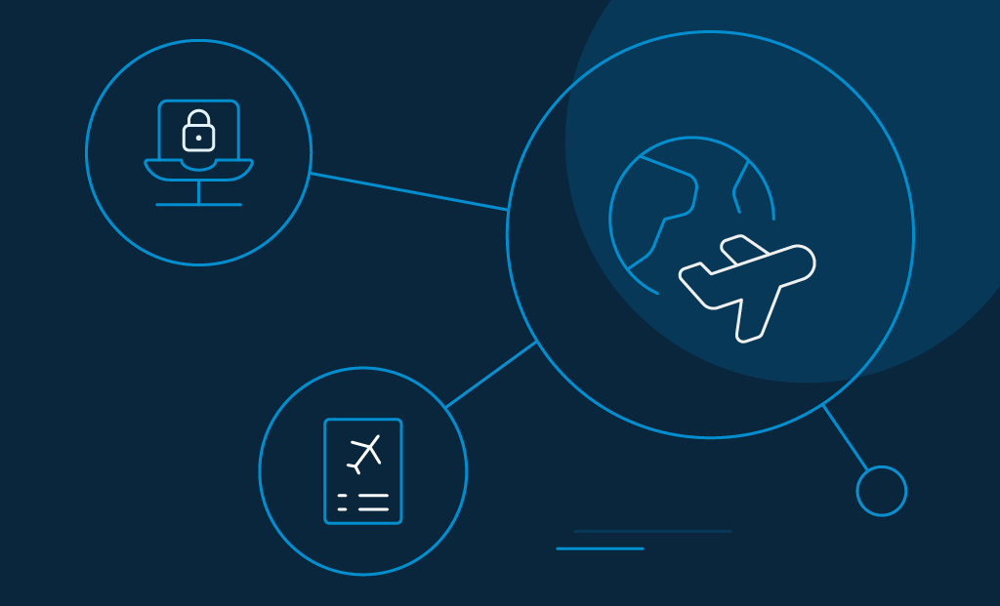

The evolution of the aviation industry has been nothing but phenomenal. As airlines seek to amplify their relationship-building efforts in the new decade—_the good, bad, and the ugly_ customer experience, now decides how the game changes. 

Here’s an eye-opener though. According to a survey published on 247 WallSt, the seventh most used airport in the US is the [worst-ranked for customer experience](https://247wallst.com/transportation/2017/09/22/the-best-and-worst-customer-service-in-the-airline-industry/).

See the gap? Yes, that's what _needs to be filled_.

Customer experience in the airline industry cannot be undermined. So, what is it? Well, customer experience or CX is often defined as what the customer perceives and [experiences while traveling](https://www.loginradius.com/blog/2018/10/improving-customer-experience-travel-hospitality-industry/) through the different departure stages and arrival in an airport.

Evaluations are conducted via interactions in-person, self-service booths, online, or any other choice of channel.

So, does it mean you need to pull all your cards at once? Not necessarily. There's a noticeable difference in wanting to provide excellent customer experience and providing the "right" experience.

Mapping the customers' journey can go a long way. Here are a few examples. 

- **Before take-off**: Customers are more inclined to taking surveys during their waiting time than post-travel. Consider cost-effective research solutions like circulating feedback forms at every stage of travel. Mobile technology can help.
- **Mid-air**: It is the best time to engage with passengers and understand their in-flight expectations. Start with the basics like seating comfort and crew etiquette.
- **Post landing**: Inspect through passengers' eyes and listen to their opinion. That's a great way to enhance your online reputation, post-flight.

## COVID-19 Impact on Airlines

The [impact of the COVID-19 crises](https://www.loginradius.com/blog/2020/05/cyber-threats-business-risk-covid-19/) on the airline industry has been dramatic, with a steep drop in the number of passengers flying in domestic and international flights in the first half of 2020.

The [International Civil Aviation Organization](https://www.icao.int/sustainability/Documents/COVID-19/ICAO_Coronavirus_Econ_Impact.pdf) (ICAO) who has been actively monitoring the COVID situation and its impact on the airline sector has published an adjusted forecast highlighting the scheduled passenger traffic in the corona infected-world. The prediction narrates:

**For the year 2020 (Jan – Dec)**

- The reduction in the number of occupied seats may go from 43% to 51%.
- The decrease in the number of passengers may go from 2,433 to 2,924 million.
- The expected loss in revenue may range between $324 to 387 billion USD.

The following graph indicates the current global-level analysis of the impact on international and domestic airline traffic.

## Impact on international airline traffic

Image source: [www.icao.int](https://www.icao.int/sustainability/Pages/Economic-Impacts-of-COVID-19.aspx)

## Impact on domestic airline traffic

Image source: [www.icao.int](https://www.icao.int/sustainability/Pages/Economic-Impacts-of-COVID-19.aspx)

**Please note**: The actual numbers will depend on a variety of factors like the duration and magnitude of the containment measures, degree of customer experience, their confidence in flying, the economic conditions of the passengers, and the likes. 

## Key Challenges the Airlines Industry Face Nowadays

What are some of the key challenges that the aviation sector come across today? Let's explore. 

### Low site conversion

With the mounting options in-flight deals, airlines worldwide are finding it challenging to attract and convert visitors to their sites. In fact, according to Firstresearch.com, the [average conversion rate for travel websites](http://www.firstresearch.com/Industry-Research/Airlines.html) is only 4%.

This means, in the aviation industry that produces $760 billion in revenue annually, even a modest increase in site conversion can generate a substantial amount of profit.

### The ongoing digital transformation

The world is going through a rapid digital transformation at the moment—jumping to social media to connect with travelers is transformation, and so is taking the agile-driven approach to personalize passengers' journeys.

All the talks and call-to-actions about big data, predictive analytics, channels, machine learning, and AI are creating a complex environment for airline vendors.

Will it do any good? Most certainly.

Airlines need technology to bind personalization with [customer experience to deliver brand loyalty](https://www.loginradius.com/blog/2020/03/improve-customer-experience-hospitality-industry/).

### The increasing expectation of travelers

One of the worst mistakes airlines often make is not to invest more in customer experience research. You must keep passengers at the core of your business strategy. Every decision that you make cannot be about revenue growth. You need to upgrade your CX strategies as well.

Triggering them emotionally can impact their buying decisions. For example, if your airline is sensitive to infants and goes out of the way to assist new parents, there is a good chance that they will prefer to travel with your airline every time, irrespective of your price.

### New travel restrictions

As a result of the pandemic, countries across the world have imposed travel restrictions with no certainty over when those restrictions will be lifted.

Now, here's the catch. For airlines to sustain, they need to fill as many seats as possible on each flight. For budget airlines, which usually travel with more than 90 percent of the seats filled, "load factors" are of particular significance. According to the new COVID measures, if middle seats should be left unoccupied, aircraft will have to fly with 35% fewer passengers.

This could be reasonable for a brief period. But if the situation persists, it will change how the entire industry operates.

### Risk of security 

Cybercriminals are hammering at the gates of the airline industry. To begin with, [cyberattacks](https://www.loginradius.com/blog/2019/10/cybersecurity-attacks-business/) can rob you of millions of pounds, and at the worst, criminals can devise terrorist activities without even boarding the flight.

The last few years saw an increase in the number of attacks. For example, the Israeli Airport Authority alone reported recording and fending off [three million cyber attacks daily](https://www.timesofisrael.com/israeli-airports-fend-off-3-million-attempted-attacks-a-day-cyber-head-says/) in 2019.

Cybersecurity, therefore, has to be taken seriously. Start at the executive level. Train your employees to follow the best cybersecurity practices and introduce those into your strategies as well. 

At best, hire a [customer identity and access management](https://www.loginradius.com/blog/2019/06/customer-identity-and-access-management/) (CIAM) platform to manage your passengers' data. 

The question remains, what should the airlines do?

## 5 Ways Airlines Firms Can Enhance Customer Experience

Airlines have a variety of ways to enhance customer experience. The following are a few strategies on how to respond, recover, and prepare your airlines to succeed in the new normal.

### 1\. Put people first.

In an industry where most companies appear to be leveraging their monopolistic status at the cost of consumer needs, stand out of the queue by offering concrete examples of consumer support and customer advocacy. For example, you can:

- Adopt the transfarency approach to eliminate baggage and ticket change charges. 
- Allow families to share their mileage points so they can enjoy frequent award trips.
- Offer a quick-time baggage delivery guarantee and back it by compensating the passenger in miles or money. 

Infusing humanity and hospitality with the "we've got your back" approach does wonders for any airline. It's an experience that, very literally, has been helping widely respected airlines to consistently hit new heights.

### 2\. Take responsibility for cybersecurity.

Your cyber defense strategy should include both organizational and technical viewpoints. Remember that internal employees can easily compromise even the best defenses. Every time you share a password with your team, it acts as a key to unlock your internal IT system. 

It is, therefore, your responsibility to keep [those passwords secure](https://www.loginradius.com/authentication/). If anyone in your team refuses to acknowledge their control of information security strategies, they become a threat.

Therefore, cybersecurity is an integral part of your airline's threat landscape. Get an all-encompassing CIAM platform to take care of your identity requirements. The [multi-factor authentication](https://www.loginradius.com/blog/2019/06/what-is-multi-factor-authentication/) strategy is an excellent example of sound security practice.

### 3\. Automated agents to handle customer grievances.

Automation is the need of the hour. Today, virtual email agents can read emails, identify the course of action from similar situations in the past, and create an appropriate response without the need for human intervention.

These automated virtual email agents learn from past experiences and continue to get smarter and more accurate. Ideally, they can reduce the [customer grievance](https://www.peoriamagazines.com/ibi/2012/jul/10-tips-effectively-handling-customer-complaints) response time from five to six minutes to less than one minute.

### 4\. Be hyper-relevant.

Instead of worrying about the company's bottom line, think about your passengers, and the rest will follow. Airlines have the ability to provide the best deal at the right time, based on a customer's awareness. Scrutinize every customer and their end needs, and start working from there.

Find out how a [CIAM platform](https://www.loginradius.com/blog/2019/06/perfect-ciam-platform/) can help you achieve exactly what your travelers need.

You can begin by providing reliable, contextualized digital experiences to connected passengers in real-time. Offer up-to-the-minute flight info, unique deals, exclusive offers, and access to the internet. You can also use technology to guide passengers to their exact locations at the airport.

### 5\. Conduct security awareness training.

Being aware of possible security threats in and around high-risk areas is necessary to recognize and designate potential security threats at the airport and be vigilant. No wonder aviation security authorities and regulators are mandating safety awareness training as part of the orientation curriculum. Others include:

- Gathering knowledge, strategies, and skills to recognize and avoid security hazards.
- Introduction of methods to profile and track passengers.
- Cost-effective solutions to boost protection without increasing airlines cost.

Security awareness training is usually designed for new employees, government representatives, airline security management team, aviation security executives, etc.

## How LoginRadius Helps Airlines Industry Offloading the Customer Data Security Challenges

Frictionless travel is key to the airline sector. LoginRadius not only keeps [customer and crewmember data safe](https://www.loginradius.com/security/), but it also simplifies the experience as they navigate the digital ecosystem. 

LoginRadius is a cloud-based customer identity and access management platform that creates personal, helpful, and simple customer experiences. It's multi-layered customer, partner, and crewmember ecosystem ensures that the right people always have secure but effortless access to the right information.

**_Here's how LoginRadius uses technology to humanize air travel for flight passengers._** 

**Robust data compliance measures**: As already mentioned, investing in [consumer data privacy and compliance](https://www.loginradius.com/blog/2020/06/consumer-data-privacy-security/) is an un-denying priority for the aviation industry. The LoginRadius identity management system helps airline companies understand the value of data. It supports global regulatory compliance like the [GDPR and CCPA](https://www.loginradius.com/blog/2019/09/ccpa-vs-gdpr-the-compliance-war/) to fight data breaches. 

Other security certifications include ISO 27001:2013, ISO 27017:2015, ISO/IEC 27018:2019, US Privacy Shield, NIST Cybersecurity Framework, ISAE 3000, and AICPA SOC 2 (Type II). 

**New-age registration and login options**: Passengers can register using various options like smart login to log into a device that is neither a website nor a mobile device. Another option is the one-touch login where passengers can log in via a magic link or OTP sent to their phone or email id. One-touch login [eliminates the use of passwords](https://www.loginradius.com/blog/2019/10/passwordless-authentication-the-future-of-identity-and-security/).

**Build rich customer profiles**: LoginRadius offers [customer profiling](https://www.loginradius.com/customer-profiling/)—a feature that collects information about customers throughout their interaction with your brand. Also, it provides an end-to-end solution for customer management and helps in monitoring login activities.

**Simplify the registration process**: LoginRadius simplifies the registration process with social sign-in and [single sign-on](https://www.loginradius.com/blog/2019/05/what-is-single-sign-on/) features. While social sign-in is a one-click authentication feature conducted via social media, single sign-on offers access to multiple accounts with a single set of credentials. Both reduce the hassles of the registration process and minimize the risk of cyber threats due to poor password habits.

**Multi-factor Authentication (MFA)**: MFA allows passengers to pass through several authentication layers when logging in. To configure the authentication function, [LoginRadius supports the SMS passcode and Google authenticator](https://www.loginradius.com/blog/2018/12/use-multi-factor-authentication-dont-cell-phone-access/).

## Conclusion 

When was the last time an airline offered you with just the right blend of customer experience you have always wanted? Would you put a price on that?

It certainly does not take magic to make a mark in the aviation industry. Focus on keeping your passengers happy while ensuring their data security—that should do the trick.

