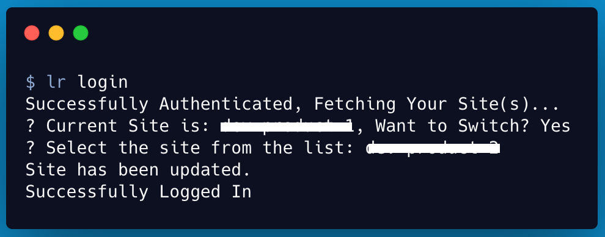
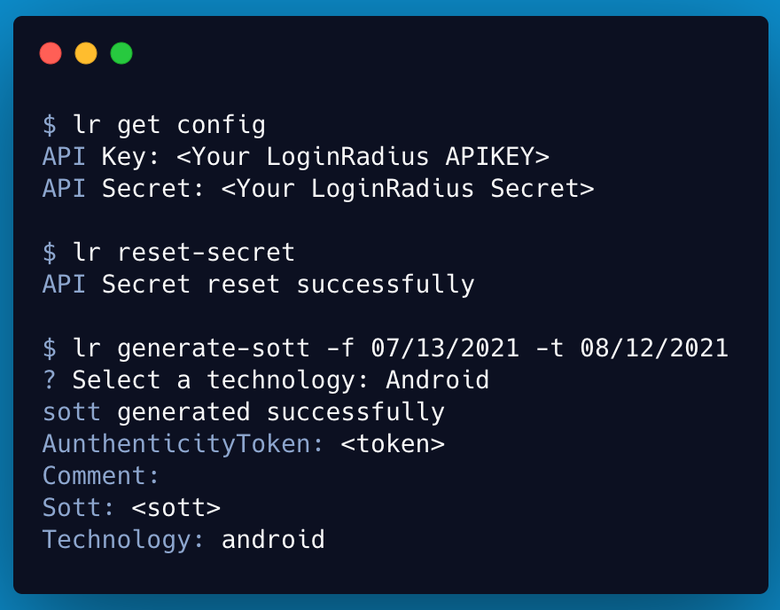
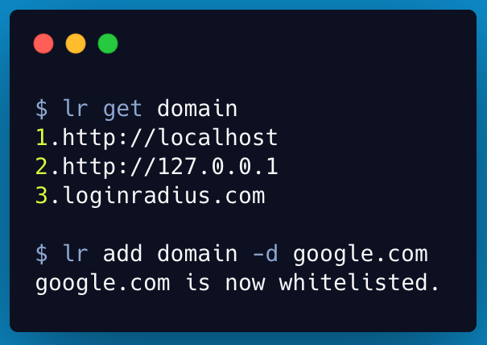
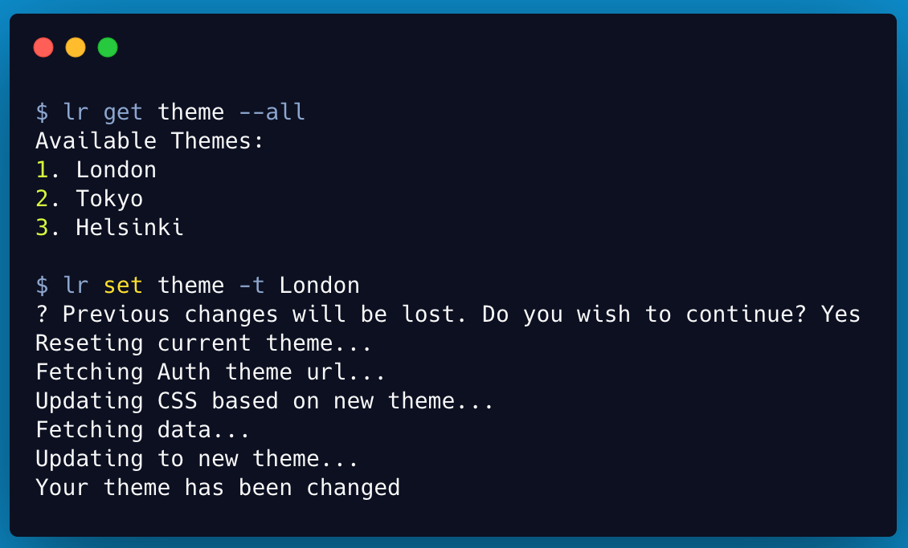
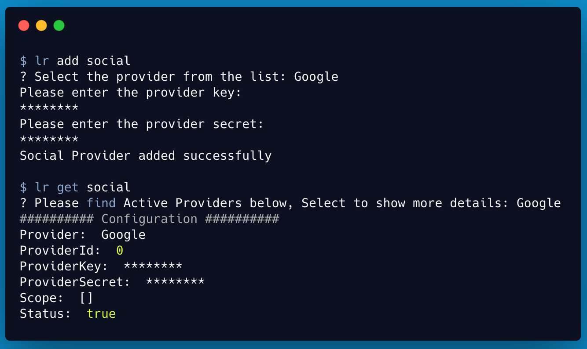

Hi Everyone 👋 !!! Today we are announcing the beta release of [LoginRadius CLI](https://github.com/LoginRadius/lr-cli#readme). I am very much excited about it.

## Why LoginRadius CLI?

Developer Experience plays a crucial role for us. We always think about the ways we can minimize the juggling between a quickstart tutorial, dashboard, and terminal. 
The LoginRadius CLI will simplify your flow by just using some simple commands to **register, login, add site, add social, etc.**, and enables you to get the job done in very little time without leaving the terminal. 

## How can you use LoginRadius CLI

Check out a few examples of how LoginRadius CLI can help manage your [Loginradius Dashboard](https://dashboard.loginradius.com/).

### Login/Register to your LoginRadius Dashboard

This command will help you to log in to the CLI. Once you logged in to the CLI, you can configure all your LoginRadius Applications through CLI. 

### Manage your App Credentials

Get your API Credentials in a single command. You can also reset your secret and generate sott using the LoginRadius CLI.

### Domain Whitelisting

Manage your white-listed domain for your application with simple commands.

### Theme Management

You can update the LoginRadius IDX Page theme from the predefined themes available through LoginRadius CLI. 

> You can check out the [Theme Customization]() section in the LoginRadius Dashboard for all the available customization options.

### Add Social Logins

With the help of LoginRadius CLI, you can add social logins to your LoginRadius IDX Page.

### Learn More about the LoginRadius  CLI

Run `lr --help` to get the list of all available commands. Also you can checkout the [manual for all the commands supported](https://www.loginradius.com/open-source/cli/manual).

## Try LoginRadius CLI
The LoginRadius CLI is available for Windows, macOS, and Linux. [Check out the installation on our README](https://github.com/LoginRadius/lr-cli/tree/main#readme).

## Help us to improve

We hope you’ll love the LoginRadius CLI. And we’re even more excited about the future as we explore what it looks like to build a truly delightful experience with LoginRadius on the command line. 

We can’t wait to hear about your experience with LoginRadius CLI, and we’d love your feedback. Please create an issue in our [open source repository](https://github.com/LoginRadius/lr-cli/issues) or discuss what more commands you feel should be there on our [community page](https://community.loginradius.com/).

[Checkout for more details](https://www.loginradius.com/open-source/cli)

