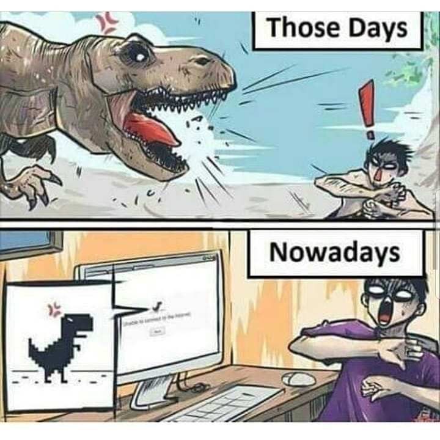
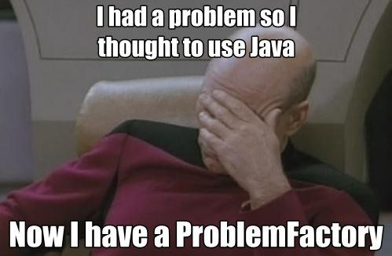

Programming is an excellent exercise for your brain as programmers deal with never-ending situations like bugs, compiler, issues, deadlines, languages, etc. During all these times, other than the phenomenal codes, we produce MEMEs and a hell lot of MEMEs

MEMEs can light the environment for every programmer in the world. On that note, there is a famous saying-

**“If debugging is the process of removing software bugs, then programming must be the process of putting them in – Edsger Dijkstra”**

## Here is our developer picked list of 21 complied MEME for you:

### 1. Always ready for new!!! - [Kunal](/blog/author/kunal/) 

 

### 2. Nothing Changes With Time - [Tanvi Jain](/blog/author/tanvi-jain/)

### 3. Heaviest Object In The Universe - [Nitesh Jain](/blog/author/nitesh-jain/)

### 4. Perception!! - [Vikram Jain](/blog/author/vikram-jain/)

### 5. Maths Always A hurdle !! - [Mohammed Modi](/blog/author/mohammed-modi/)

### 6. I had a problem so I thought to use Java - [Indrasen Kumar](/blog/author/indrasen-kumar/)

### 7. Avoid Handshakes. - [Piyush Kumar](/blog/author/piyush-kumar/)

### 8. I’m Really Unsure About My Own Creation - [Kheenvraj Lomror](/blog/author/kheenvraj-lomror/)   

### 9.  That Missing Fact - [Priyadarshan Mohanty](/blog/author/priyadarshan-mohanty/)

### 10. Every IT Administrator. - [Narendra Pareek](/blog/author/narendra-pareek/)

### 11. Imma Genius! - [Abhimanyu Singh Rathore](/blog/author/abhimanyu-singh-rathore/)

### 12. My Logical Thinking as Programmer​​​. - [Ankit Singh](/blog/author/ankit-singh/)

### 13. HTML is a Programming Language - [Hitesh Kumawat](/blog/author/hitesh-kumawat/)

### 14. Programmers while Sleeping​. - [Versha Gupta](/blog/author/versha-gupta/)

### 15. Programmer Swag!! - [Gaurav Bewal](/blog/author/gaurav-bewal/)

### 16. QA Life!! - [Rakesh Pareek](/blog/author/rakesh-pareek/)

### 17. Infinite... - [Hridayesh Sharma](/blog/author/hridayesh-sharma/)

### 18. Python Lover!! - [Aman Agrawal](/blog/author/aman-agrawal/)

### 19. What's your address? - [Vijay Singh Shekhawat](/blog/author/vijay-singh-shekhawat/)

### 20. Gamer and Programmer - [Chinmaya Pati](/blog/author/chinmaya-pati/)

### 21. Semicolon; - [Govind Malviya](/blog/author/govind-malviya/)

If you have better ones, reply in the comments below and we’ll include them.
