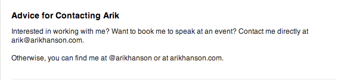

LinkedIn is not mere a platform for recruiters or job seekers. More and more businesses are trying to sell their products or services through LinkedIn due to large crowd of quality business professionals (which mean more clients). As LinkedIn is a great professional communication platform, you can foster your business through genuine efforts. And when I speak of genuinity, it starts with your profile. 

People can see your profile and judge whether a you are genuine or a faker. So, how do you think you can create a profile which is genuine? Just show what you are! But do you think you can be genuine and interesting at the same time to your audience?

Yes, **You Can** and I can help you on that.

In this article, I am going to explain you the best way to build a genuine but an intriguing LinkedIn profile which will subconsciously trigger your prospect’s mind to choose you over others in your niche. Read on!

### **Headline Matters!**

First step:- Work on Your Headlines (very important)

- It should be catchy
- It should give people something surprising rather than providing them what they expect
- It should give away the details about “who you are” and “not what you do”

When you explain your audience the question- “Who are You?” instead of describing what you do, you establish yourself in the beginning.

- **Use Statistics in Your Headline**Tell your audience if you are the number one marketing expert in your country or you have helped your company to increase their leads by 30% in 48 hours. The statistics will look tangible to your audience and they will reach you

 

- **Use primary problems of your Audience.
    
    **Relate your headlines to your audience. For example, your audience are chief marketing officers or finance officers and their problem is determining ROI from their efforts in social media, you can put a headline like “generating 230% ROI from social media strategies for chief financial officers”.
- You can try something unusual and creative in your headlines. You can introduce contradictory statements- “I asked my entrepreneur clients to not to stay positive” Wondering Why did I say that? Read On”. This will look like a beginning of an article, yet it’s eye-catching and it works.

The sole purpose of constructing these kinds of headlines is to make your profile visible (searchable) to your audience.

### **Focus on Your Profile Picture (Highly Recommended)**

It is one of the most important elements that can help you create a good first impression on your visitors. Hence, earnestly focus on your profile picture. Now, you should look professionally personable yet not too informal in our profile picture. Also, do not put a profile picture like cropping your face from a group picture or uploading some random image from your computer just for the sake adding a profile picture. Get a decent click that will present yourself as an outsider yet a viable person. The image should accentuate your character and should describe that you have an interesting life.

_**Note**:- Pasting an image related to your product or service on your personal LinkedIn profile is a strict NO!_

### **Focus on Your Summary**

The primary intent of writing an eye-catching summary is to subconsciously align the immediate needs and wants of your prospects. And there are certain ways to do that.

- **Take Advantage of Their Needs
    
    **Hit your prospects between their eyes while creating a summary. Here’s an example
    
    

**[Source](https://www.linkedinsights.com/3-stunningly-good-linkedin-profile-summaries/)**

- **Some points to note:-**
- Sell yourself with statistics and number and create a rapport with your potential customers
- Introduce a funny quotient in your summary. Tickling the funny bone will make your summary a pleasurable read for your prospects.
- Don’t treat summary section like a resume. Your visitors are here to interact with you and to know you better. Do not shoo them away with a lifeless piece of information. Always remember that people love to work with them who have an interesting persona.
- Include a **call to action** in your summary. For example, you can say that “Let’s talk and I will provide you the best sales score you ever had. If not, I will give away my best selling- Sales Bible for FREE”! This will trigger their action and increase the chances to end up with you.

You can also induce their your current experience in your summary and provide them a new perspective that they can believe. Make them believe that they don’t have a problem, they have a result for their actions, thus giving them a new perspective.

- You can add keywords while writing about Specialties in your summary. For example, if you are a marketing analyst, you can add B2B marketing or strategy lead nurturing in Specialties. This will show your profile in the search results when people are searching with the same keywords. Again, think of some special keywords that your wannabe customers may search. For example, instead of adding the keyword “lead generation”, add “lead generation in software industry”. This will flush out the competition to some extent and push your profile to a better level to get noticed.
- Also, get some idea from people who are already in your realm.
- Do not intend of bombarding your profile with keywords to improve its visibility or LinkedIn algorithms may trace your profile and suspend it. 

### **How to Write The Experience section**

Before we move into the Experience section, you should keep in mind that everything you write in your profile will exhibit your persona. Hence, creating a magnetic profile is all about building a persona and not about some hacks and tips that can enhance your LinkedIn profile. As it was already discussed that people can identify between fake and genuine ideas, you require to work out a genuine effect to improve your leads. There are no shortcuts when it comes to long lasting results in LinkedIn.

Now, while writing content for the Experience section, you need to include your benefits rather than adding your features. Hence, it is not about showing what you do for your customers but showing things which mean a lot to your customers.

- Try to make your headings more eye-catching. For example, instead of writing ‘CEO’ say that you are the Creator at XYZ foundation.
- Display benefits in bullet points as they acquire more attention from your visitors.
- While introducing each point, analyze what does that mean to your potential customers.
- Work on all of your job titles (especially if they are pulls back the attention of  your audience from your current job profile). For example, you can write “Director, XYZ corporation” instead of “Director of Sales & Marketing, XYZ Corporation”. Moreover, people don’t care much about your previous job roles that you had 20 years ago unless you founded the organization. So don’t add them.
- Ensure that your experience is connected to the right company. Your visitors should be able to understand clearly which company you work or worked for. There should not be the minutest confusion about the companies you are associated with.
- Never encourage lame testimonials or recommendations on your profile. It will sabotage your audience’s interest in your profile and will make you look like a fake person. People will choose you on the basis of your relatable experience, credibility, and immediacy of need. Hence, make sure that the testimonials are specific enough. Here’s an example of a good recommendation:-
    
    

[**Source**](https://business.linkedin.com/talent-solutions/blog/linkedin-best-practices/2016/what-we-can-learn-from-the-recruiter-with-77-linkedIn-recommendations)

### **Share an Update**

Share some pieces of information related to your niche. You can even mention the name of a connection who you think can be a prospect. Thus, the person you have mentioned will receive a message saying you have mentioned him on your update.

Example:- You can share an update like - “Mary Abigail check out ten ways to improve your sales”. It may sound like a sales letter but it is more effective.

### **Launch a Video about Yourself**

I personally feel that videos are the best ways to communicate with your audience as they are multi-dimensional. You can influence them with your words, your sound tones and your content. More importantly, the features of your video content should be brevity and wow content. Your video should not go more than 120 seconds (your visitors will not invest much time) and choosing a video over a presentation is a much wiser step for your personal branding. Discuss their fears and needs and apply yourself to them. However, infographics, if well built, can also help you convey your information to your clients in terms of your presence in their business.

### **How To Write a Skills and Endorsements Section**

“Skills and endorsements” section is only used to make your profile visible to more viable potential customers. The skills which you have listed in your profile will count in when people search for these terms on LinkedIn. And now, when talking about endorsements, once you get a message like this- “X has endorsed you for Z”, you have to ask yourself whether the endorsement popularizes you the way you want to be. If it does not, just delete it because eventually, you will get some endorsements which you may not like to be associated with. You may also ask your colleagues or friends to endorse yourself for a specific skill as it will bump up your numbers on LinkedIn.

### **Work On your Contact Section**

[**Source**](http://www.arikhanson.com/2014/01/14/how-to-optimize-your-linkedin-profile-using-some-new-linkedin-features/)

Here’s an example that can inspire yourself to not sound needy to your potential clients. Try to stay aloof and cool in front of your audience. It will create interest about you in your audience’s mind.

Hence, here are the best and most efficient changes you can apply to your profile to acquire more notice from your clients and get enduring results. There are many more things that can be done for your business via LinkedIn but rejuvenating your own profile is the foremost thing to do. Stay tuned for the next article about LinkedIn affecting businesses in the series. Until then, enhance your profile and share your experience or doubts in the comments below.
