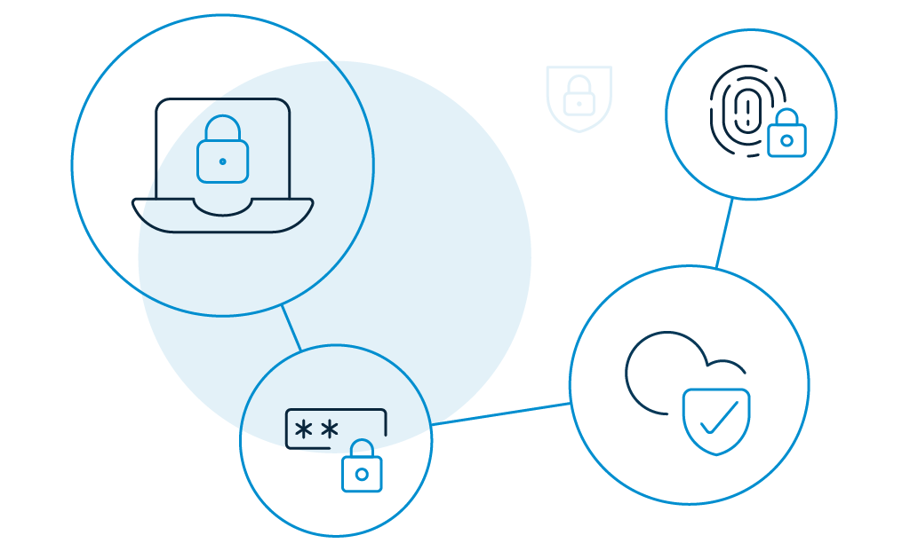

For many businesses, login security is still an unexplored corner that does not get much attention. 

In reality, there are so many mistakes that can leave your account vulnerable to cyber threats. Hackers can read your email, transfer money out of your bank account, sell your data in the dark web, expose your session to a CSRF attack, hijacked sessions, etc. 

No wonder security executives and flag bearers emphasize the advantages of a secure and optimized login process—not just from the consumer's perspective but also from ensuring business credibility. 

## 5 Most Common Login Security Vulnerabilities

It's hard out there to secure login. If a hacker gets hold of your account, they can do anything with it (it can get as worse as leaving the account owner bankrupt). 

So when you ask how bad can it get, you are actually asking about the common login security vulnerabilities. And that means you need to be on the lookout for the following flaws:  

*   **User-generated credentials**: When consumers create their own passwords, there is always a possibility that they will come up with credentials that are weak and easily vulnerable to cyber attacks. Because consumers are more inclined to have something that's easy to remember, they may subconsciously skip [password security best practices](https://www.loginradius.com/blog/async/password-security-best-practices-compliance/). As a result, hackers can adjust their brute-force systems and crack open passwords in no time. 
*   **Brute-force attacks**: When hackers use a method of trial and error to guess correct passwords, that's a [brute-force attack](https://www.infosecurity-magazine.com/opinions/ogin-brute-force-attacks/). Usually, these attacks are automated using a list of frequently used usernames and passwords. Hackers use dedicated tools to make vast numbers of login attempts at high speed. 
*   **Lack of password complexity**: It's one thing to educate your consumers about password complexity; for example, they should use upper case letters, numbers, and special characters. But it is an entirely different story when you take the initiative to implement it. Ensure that for every account, a consumer's password is unique. That means no repeats!
*   **Unpatched security vulnerabilities**: While thousands of threats are discovered daily, one of the greatest risks an organization may take is failing to repair or "patch" certain vulnerabilities once they are found. It is quite common for consumers to dismiss the "update available" alerts that show up in some programs because they do not want to waste a few minutes of their time. They aren't aware of the fact that updating patches can save them from ruthless cyberattacks. 
*   **Social engineering attacks**: It happens when hackers psychologically manipulate consumers into giving up their login credentials. Some common warning signs of [social engineering attacks](https://www.loginradius.com/blog/start-with-identity/2020/10/social-engineering-attacks/) include asking for immediate assistance, luring with too good to be true offers, and threatening reprimands if their requests are ignored. 

## 7 Best Login Security Practices That Enterprises Should Follow

Each risk has individual implications. Therefore, to keep your consumer's login secure, you need to prevent as many vulnerabilities as possible. Here are a few best login security practices that every organization should follow. 

### Password hashing is a must.

Handle consumers' login credentials with care. Never store them as plaintext passwords. Instead, go for [cryptographically strong password](https://www.loginradius.com/docs/infrastructure-and-security/cryptographic-hashing-algorithms/) hashes that can not be reversed. You can create those with PBKDF2, Argon2, Scrypt, or Bcrypt. 

It is important to salt the hash with a value special to that particular login credential. Do not use obsolete hashing technologies such as MD5, SHA1, and you should not use reversible encryption in any condition or attempt to develop your own hashing algorithm.

### Biometric authentication to your rescue.

Biometric authentication is a strong authentication and identity solution that relies on an individual's specific biological features like fingerprint, retina, face recognition, or voice to verify the individual's authenticity. 

The greatest advantage of biometrics is that in order to gather the information needed to circumvent the login, a hacker must be in the individual's physical vicinity. And that's not always possible!

### Multi-factor authentication never fails to defend. 

[Multi-factor authentication](https://www.loginradius.com/blog/start-with-identity/2019/06/what-is-multi-factor-authentication/) or MFA is adding multiple layers to the login process. If a hacker has compromised one of the factors, the chances of another factor still being compromised are low, so having multiple authentication factors offers a greater degree of certainty about the login security of consumers. 

However, note that each security layer should be guarded by a different category: something your consumers know, something they have, or something they are. For example, if your consumer has associated their phone number as the second layer of authentication, a one-time passcode (OTP) will be sent to the phone. So, if hackers do not have the phone, they cannot get the code, meaning they cannot log in. 

### Password hygiene is a necessity. 

Force your consumers to choose a strong password. Here are a few tips that will ensure that their login security is as strong as possible.

*   Do not allow your consumers to use personal information like names of family members, pets, phone numbers, birthdays, or any data that is publicly available. 
*   Do not allow dictionary words, proper nouns, or letter and number combinations like abc123. Instead, use special characters such as "&" or "$."
*   Set the minimum limit to 10 characters.
*   Encourage passphrase like a general statement and then pick the first letter from each word. For example, "i love watching the big bang theory at 10 pm" could become "ilYtbbt@10p."
*   Force consumers to change computer login passwords at least once every month or two. 
*   Do not allow them to use the same passwords for different accounts. 

### Limit login and password reset attempts.

Suppose you allow consumers to enter their login credentials or reset their passwords as many times they want. In that case, hackers may indulge in brute-force attempts by entering different combinations until the [account is cracked](https://www.loginradius.com/blog/2019/09/prevent-credential-stuffing-attacks/). 

Therefore, it is a good practice to limit the number of failed login attempts per user or block the user based on the IP. You can also add a captcha, say, after the fifth attempt. But don't add the captcha after the first attempt, it does not sound right from the consumer experience. 

### Limit session length.

Session length is a frequently neglected component of security and authentication. You may have a good justification to keep a session open indefinitely. But from a login security point of view, you need to set thresholds for active sessions, after which you should ask for passwords, a [second factor of authentication](https://www.loginradius.com/single-sign-on/), or other methods of verification to allow re-entry. 

Consider how long a user should be allowed to remain inactive before you prompt them to re-authenticate. That's up to you. Also, prompt the user to re-verify in all active sessions after changing the password. 

### Building a secure auth with CIAM

If you are using a consumer identity and access management service like LoginRadius, a lot of login security issues are addressed for you automatically. Some of the common activities include:

*   Implementation of password reset options. 
*   Limitation of login attempts.
*   Details of login activities.
*   Locking out accounts after too many unsuccessful login attempts.
*   Two-factor authentication or MFA for unrecognized devices, locations, or accounts.

These are possible improvements, basic for any enterprise. Engineering them properly into your consumer accounts can prevent login security abuse to a great extent. 

## Conclusion

Authenticating consumers is tricky and cumbersome. Taken together, a [CIAM solution](https://www.loginradius.com/) can help a great deal in offering login security. It incorporates the above techniques and all best practices to filter authorized access and prevent common attack scenarios. 

