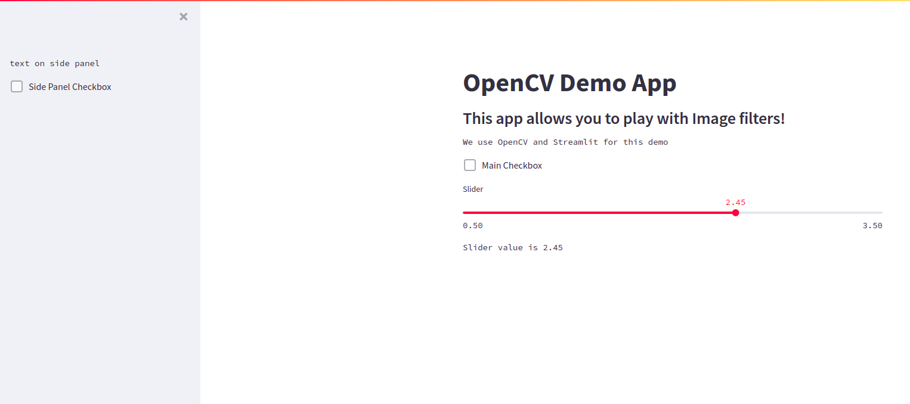
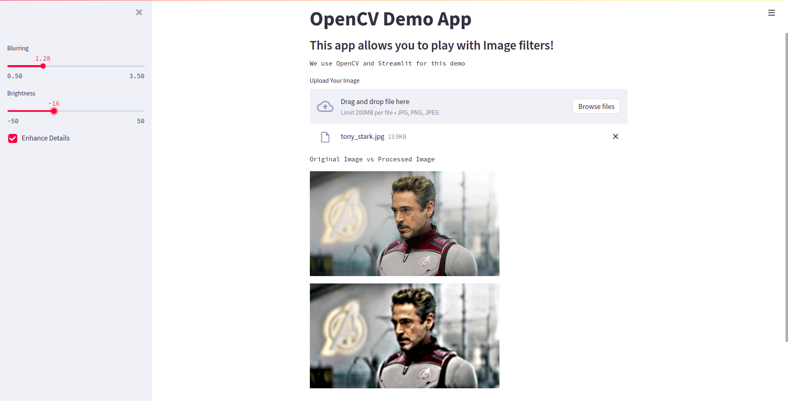

In this blog, we are gonna see how easy it is to convert an OpenCV project into a webapp that you can showcase it to the public. We are gonna use a library called streamlit. Using streamlit we can easily build a web user interface using the beautiful language called python. Yes, you heard it right, no html, css, javascript required. Just pure python!.

## Before You Get Started
This tutorial assumes you have:

*   Basic knowlege of what OpenCV is.
*   Basic knowledge about python. 

So lets get started. 
### Step 1: Install necessary packages

Lets install OpenCV and stremlit using pip. We would also need Pillow, another image libary.

```py
pip install opencv-python streamlit Pillow
```

### Step 2: Lets review a small OpenCV project

```py
import cv2

def brighten_image(image, amount):
    img_bright = cv2.convertScaleAbs(image, beta=amount)
    return img_bright

def blur_image(image, amount):
    img = cv2.cvtColor(image, 1)
    blur_img = cv2.GaussianBlur(img, (11, 11), amount)
    return blur_img

def enhance_details(img):
    hdr = cv2.detailEnhance(img, sigma_s=12, sigma_r=0.15)
    return hdr

img = cv2.imread(filename='tony_stark.jpg')

# do some cool image processing stuffs
img = enhance_details(img)
img = brighten_image(img, amount=25)
img = blur_image(img, amount=0.2)

cv2.imshow('Tony Stark', img)
cv2.waitKey(0)
cv2.destroyAllWindows()
```

Here we have 3 image processing funtions that accept an image, do some processing on it and return the processed image. 
1. `brighten_image` - increases the brightness of the image.
2. `blur_image` - applies a blur effect on the image.
3. `enhance_details` - apply an effect to enhance the details of the image.

These functions make use of the OpenCV fuctions to do the actual processing. (for eg : cv2.GaussianBlur etc). I am not explaning in depth about them and various parameters that they accept, since this tutorial is more focused on the integration of OpenCV with Streamlit. However feel free to jump to the OpenCV documentation or google them to know more details about them. 

This program reads the image from the filepath using cv2.imread(), after that it passes the image to these funtions that do the processing, finally the image is displayed using cv2.imshow(). cv2.waitKey(0) is to wait till the user presses any key after which the program is exited. 


### Step 3: Streamlit Basics

Streamlit offers several components that we can place in the webpage. It also offers a sidepanel and we can place components there as well. 

Lets see some code to understand better.

Open an editor and copy paste this to demo-app.py
```py
import streamlit as st

st.title("OpenCV Demo App")
st.subheader("This app allows you to play with Image filters!")
st.text("We use OpenCV and Streamlit for this demo")
if st.checkbox("Main Checkbox"):
    st.text("Check Box Active")

slider_value = st.slider("Slider", min_value=0.5, max_value=3.5)
st.text(f"Slider value is {slider_value}")

st.sidebar.text("text on side panel")
st.sidebar.checkbox("Side Panel Checkbox")
```
To start a streamlit app, simply run the command `streamlit run` with the filename, for eg.
`streamlit run demo-app.py`

You should see something like this as output. 
```
  You can now view your Streamlit app in your browser.

  Local URL: http://localhost:8501
  Network URL: http://192.168.1.8:8501
```
Click on this link to open the streamlit app in your browser. you will see something like this. 



So if you see the code, its very straightforward. We import streamlit as st. The default is a simple linear layout where we can place components on the webpage in a linear manner. 
For `st.title() , st.checkbox(), st.slider()` places the these components on the main page. 

Now streamlit pages also have a side panel. In order to place components in the sidepanel, we can do it like this. 
`st.sidebar.title() , st.sidebar.checkbox(), st.sidebar.slider()`

There are other components also apart from these, you can explore more in the [docs](https://docs.streamlit.io/library/get-started).

### Step 4: Streamlit and OpenCV integration

Now lets integrate our OpenCV program to Streamlit. 

```py
import cv2
import streamlit as st
import numpy as np
from PIL import Image


def brighten_image(image, amount):
    img_bright = cv2.convertScaleAbs(image, beta=amount)
    return img_bright


def blur_image(image, amount):
    blur_img = cv2.GaussianBlur(image, (11, 11), amount)
    return blur_img


def enhance_details(img):
    hdr = cv2.detailEnhance(img, sigma_s=12, sigma_r=0.15)
    return hdr


def main_loop():
    st.title("OpenCV Demo App")
    st.subheader("This app allows you to play with Image filters!")
    st.text("We use OpenCV and Streamlit for this demo")

    blur_rate = st.sidebar.slider("Blurring", min_value=0.5, max_value=3.5)
    brightness_amount = st.sidebar.slider("Brightness", min_value=-50, max_value=50, value=0)
    apply_enhancement_filter = st.sidebar.checkbox('Enhance Details')

    image_file = st.file_uploader("Upload Your Image", type=['jpg', 'png', 'jpeg'])
    if not image_file:
        return None

    original_image = Image.open(image_file)
    original_image = np.array(original_image)

    processed_image = blur_image(original_image, blur_rate)
    processed_image = brighten_image(processed_image, brightness_amount)

    if apply_enhancement_filter:
        processed_image = enhance_details(processed_image)

    st.text("Original Image vs Processed Image")
    st.image([original_image, processed_image])


if __name__ == '__main__':
    main_loop()
```

Apart from the image processing funtions, we also added a main_loop funtion to have all our streamlit component design.

One important thing to keep in mind is Streamlit reruns the python script everytime there is a user interaction on the components.

`st.title(), st.subheader(), st.text()` is straightforward, they just print some text in different sizes.

Next we have two sliders to get the amount of filter effects that we want to apply for blur and brightness filters.

Note that `st.sidebar` places these components in the sidebar. 
`slider()` takes in some arguments viz name of the slider, min value, max value and the default value of the slider. Also this returns the current value of the slider.

Next we have added a checkbox component.
`checkbox()` returns True if the checkbox is checked else it would return False.

Next we place a file_uploader component, through which users can upload files specified by the `type` parameter. 

Initially when there are no files selected, this component returns None. This is why we have a if check on the return value of this component. If there are no files selected, we can skip the rest of the program.

When a file is uploaded from the UI, this component returns the path of the file. 

We use `Pillow.Image()` to open this file, then we convert it to a numpy array using `np.array()` so that OpenCV can process it.

Now we pass it to the different processing funtions along with the amount parameter. 

Finally we display the original imange and processed image using the `st.image()` component.

Our webapp is ready! Now we can play with the filters. Ofcourse these are some basic filters, but we can definitely use this framework to build advanced features like adding more interesting filters like cartoonify etc using the rich features of OpenCV.


