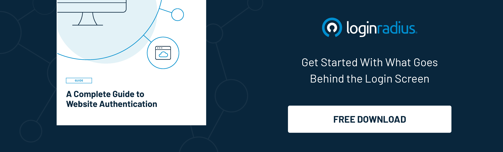

The paradigm shift that the world has witnessed amid the global pandemic has altered the way broadcasters distribute content.

With the significant [increase in the over-the-top (OTT) audience](https://pages.conviva.com/rs/138-XJA-134/images/RPT_Conviva_State_of_Streaming_Q1_2021.pdf) in the last year, the media industry has undoubtedly changed everyone’s leisure time.

However, the sudden increase in OTT users has also increased the security challenges, and many OTT platforms witnessed massive identity thefts.

Since the world isn’t going to shift back to conventional entertainment any soon (or maybe never), delivering rich omnichannel experiences backed with robust security becomes the need of the hour for the media industry.

Enterprises need to put their best foot forward to securely authenticate and authorize users to avoid any chance of sneak into the network that may lead to financial losses or brand reputation tarnishing.

In this post, we’ll understand the importance of secure authentication through a consumer identity and access management (CIAM) solution and how it paves the path for securing consumer identities on different devices for OTT platforms.

## Why CIAM Solution for OTT Platforms?

Amid the global pandemic, when everyone was locked inside their homes, and the internet became their second home, OTT platforms witnessed record subscriptions.

This means every platform had to cater to a vast number of individuals and manage heaps of identities.

However, most of the platforms weren’t relying on a secure mechanism to handle such a huge number of identities, which led to compromised identities causing losses worth millions of dollars.

Moreover, delivering a rich omnichannel experience for users accessing the network from different devices becomes challenging for vendors.

Here’s where a [consumer identity and access management](https://www.loginradius.com/blog/start-with-identity/customer-identity-and-access-management/) (CIAM) solution comes into play.

With a CIAM solution in place, any OTT platform can securely handle billions of identities without hampering user experience on any device.

Moreover, a robust CIAM like LoginRadius can help OTT platforms to autoscale their servers whenever the demand increases exponentially.

Let’s understand how a CIAM solution can help OTT platforms simplify authentication on different devices.

## Benefits of Identity Management through a CIAM

When it comes to the advantages of a leading CIAM like LoginRadius, the list is endless. Here we’ve clubbed some of the benefits of a CIAM for OTT platforms. Let’s have a look:

### Single Sign-On (SSO)

Honestly, nobody likes to remember long credentials, especially if they can utilize the true potential of frictionless login across all the applications and connected devices.

While SSO is on the verge of becoming an industry standard for authentication, OTT platforms need to quickly gear up for enhancing the user experience through SSO and Federated SSO.

OTT users perceive your enterprise as a single entity, and they expect you to treat them like a single customer.

If you have multiple websites and mobile apps under the same company umbrella, there’s no reason you can’t meet this expectation.

[Web SSO](https://www.loginradius.com/web-and-mobile-sso/) authentication from LoginRadius brings everything together.

Each customer has one account. One set of credentials that they can use anywhere they interact with your brand.

Since the market is flooded with plenty of OTT platforms and publication websites, the ones offering a seamless experience to the users would surely get more signups and subscriptions.

**Also read:** [How Media and Publication Companies Use the LoginRadius Identity Platform](https://www.loginradius.com/resource/how-media-and-publication-companies-use-loginradius-identity-platform/)

### Access Management - For Restricting Content

With the increasing access to media over OTT platforms, the entertainment industry’s biggest challenge is setting age restrictions for specific content.

While most media platforms aren’t focusing on creating sub-profiles, the competitors are already leveraging access management for a single identity used by multiple users.

Whether we talk about a particular category of content for premium users or setting age restrictions, access management plays a crucial role in enhancing the user experience for every business.

Access management through a CIAM solution like LoginRadius helps improve user experience and eventually plays a crucial role in enhancing overall data and privacy security.

LoginRadius’ cloud-based CIAM solution helps businesses seamlessly manage access without hampering the overall user experience. This allows OTT platforms to gain more signups, increase retention rates, and scale business growth.

### Progressive Profiling

Media businesses need to understand that registration fatigue could be why they lose a potential subscriber.

Admit it; nobody wants to share heaps of personal details in a single go, especially during the sign-up process. Keeping the subscription form compact is the best way to ensure a quick sign-up from the users’ end.

[Progressive profiling](https://www.loginradius.com/blog/start-with-identity/presenting-progressive-profiling-loginradius/) lets you gather important details about a subscriber over time and not everything in a single go. This not only improves user experience but eventually helps to build credibility in the long run.

LoginRadius enables you to gather consumer data through various stages of the consumer's journey to share their information as they interact with your business.

### Multi-Factor Authentication - For Enhanced Layers of Security

While the number of media platform subscriptions surged amid the global pandemic, the fact that cyber-attacks on diverse platforms increased exponentially can’t be overlooked.

With millions of data breaches and identity thefts in the media industry alone, a CIAM solution with multi-factor authentication can be the ultimate solution.

LoginRadius’[ Multi-factor authentication](https://www.loginradius.com/blog/start-with-identity/2019/06/what-is-multi-factor-authentication/) coupled with risk-based authentication helps businesses in creating a secure login experience for subscribers.

## Final Thoughts

With the increasing number of data breaches and compromised identities worldwide, OTT platforms should consider getting a robust CIAM solution in place.

Whether it’s delivering a seamless omnichannel experience across multiple devices or managing billions of identities, a CIAM solution is becoming the need of the hour.

Enterprises can [leverage LoginRadius CIAM](https://www.loginradius.com/contact-sales/) that helps to scale business growth through a state-of-the-art omnichannel experience reinforced by stringent security.

