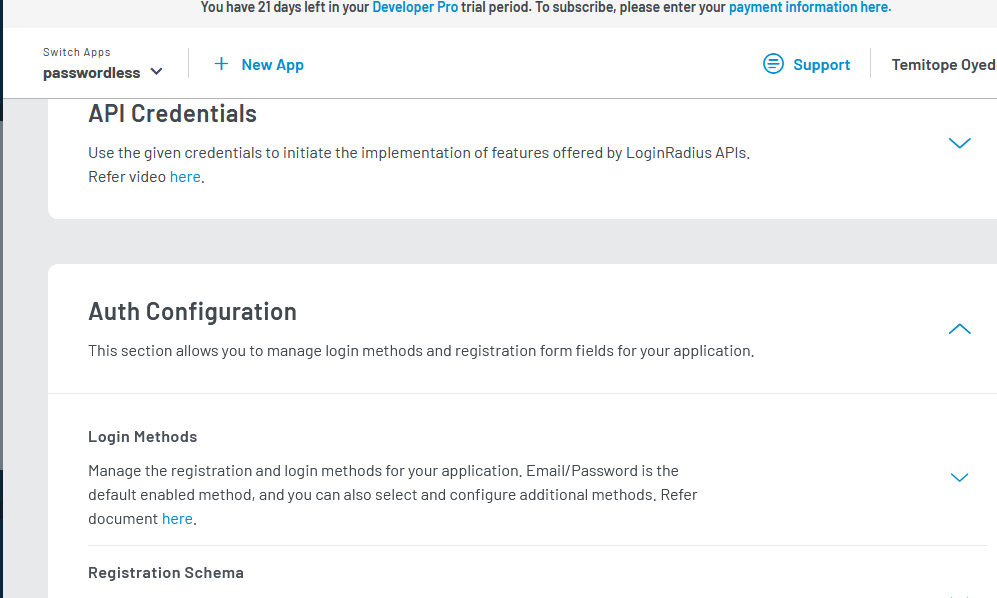
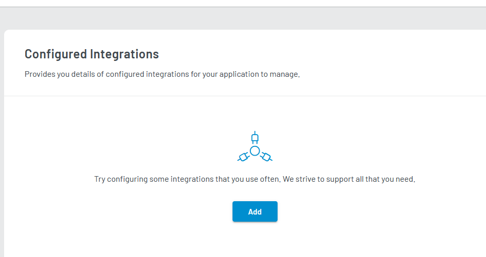
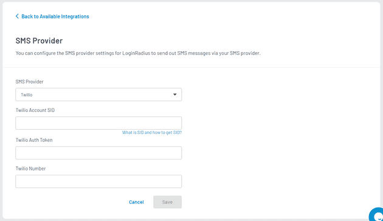
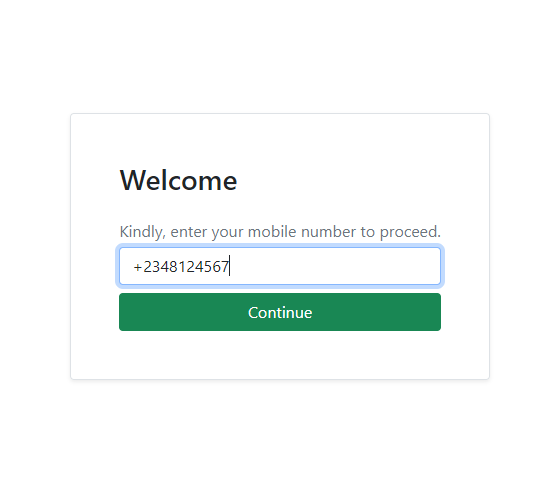
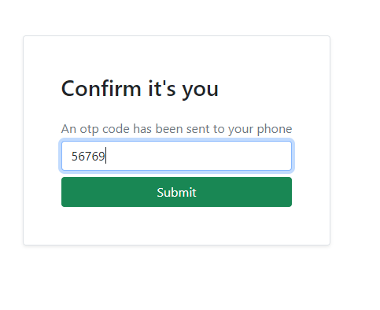

---

Passowordless authentication is the process of validating a software user's identification without using a password. Instead of passwords, identity can be validated using a `possession factor`, which is a unique identifier for the person. This authentication method authorizes users through various methods that include:

- **Biometrics:** Biometric authentication relies on distinct physical characteristics to determine whether or not a person is who they claim to be without requiring a password.
- **Magic Links:** In this method, passwordless authentication requires the user to input their email address. Then an email is then sent with a unique link (also know as Magic Link) that allows them to log in. This procedure is carried out each time the user wants to sign in.
- **One-Time Passwords/Codes:**  A one-time password (OTP) or dynamic password is only valud for single use, whether for sign in or any other type of transaction. OTPs are similar to magic links; instead of merely clicking a link, users must enter a code that you deliver to them (by email or SMS to their mobile device). This procedure is carried out each time a user signs in.
- **Push Notifications:**  Users receive a push notification on their mobile devices from a specific authenticator app (such as Google Authenticator) and confirm the push notification to verify their identity.

In this tutorial, you'll discover how the infrastructure supporting passwordless authentication works, and you'll learn how to implement passworsless authentication using LoginRadius.

## How Does Passwordless Authentication Work?

For OTP authentication (which this tutorial demonstrates), the user is prompted to input a valid phone number. Then the authentication system generates a unique one-time code and sends it to the phone number. When a user inputs this code into your application, the app confirms that the code is valid and that the phone number exists and belongs to a user, initiates a session, and logs the user in.

Passwordless authentication is a security investment that will result in significant cost reductions over time. The cost of deployment varies as per the size of your organization's existing user directory and authentication systems. The technology required to implement a passwordless authentication approach may already be in use at your business, or it may necessitate procuring new equipment. This is where LoginRadius comes in.

The LoginRadius Identity Platform helps companies securely manage customer identities and data to deliver a unified customer experience. It can cut the time it takes to create passwordless authentication for millions of users to months in some circumstances and helps offload many of the future maintenance costs.

## Passwordless Authentication — Benefits

- **Better Security:** User-controlled passwords pose a significant risk as users the same or simple iterations of the same passwords repeatedly as well as may share passwords with others.
  
Passwords are the most common attack vector as users may not peopely use tool such as password generators and password managers. And compromised passwords facilitate attacks such as credential stuffing, account takeover, password spraying, and brute-force attacks.

Passwordless authentication helps prevent these issues.
- **Improved User Experience:** Passwordless authentication eliminates the need for remembering passwords, simplifying the authentication process.
- **IT Gains Control and Visibility:** When relying on passwords, phishing, reuse, and sharing will become challenging to ensure security. With passwordless authentication, the IT team reclaims its mission of having comprehensive insight over identity and access management.

## Passwordless Authentication — Limitations

  It requires a verification channel (email, push notification, or text message). If the user loses access to any of these mediums, they cannot authenticate themselves.

Now that you have a fundamental grasp of how passwordless authentication works, let's build a sample application to demonstrate it. To implement this, you'll use Loginradius.

## Prerequisites

- Basic understanding of PHP
- XAMPP installed
- PHP 7.4 or higher with the MySQLi extension installed
- A LoginRadius Developer Pro account. You can [sign up for a 21-day free trial here](https://accounts.loginradius.com/auth.aspx?plan=pro&action=register)
- A Twilio account. You can [register here](https://www.twilio.com/try-twilio)

 **NOTE:** To help developers of all level understanding this tutorial, I've written the code in the most basic way possible.

## An Overiw of Your Sample PHP Project

To help you easily understand, I've divided the process into four sections:

- Setting up LoginRadius
- Installing LoginRadius PHP SDK
- Registering a user on the platform
- Passwordless login authentication process
  
### Set Up LoginRadius

Here, you'll set up evrything you'll need to do berfore proceeding the with code. Login to your LoginRadius account. Head over to the `configuration` section. Click on `Auth Configuration`.



click on `Login Methods`. You'll be add two methods: Passwordless Login and Phone Login. Add both of these from the `Add a Login Method` dropdown. Once you're done with that, you need congigure your SMS provider.

Navigate to the `integration` section.


 Click the `Add` button. And the Available Integrations screen will appear. Either search for SMS in the search bar or go to the Select Category dropdown and select Communication category. Locate SMS Provider. Click the `Let’s Configure` option, the following screen will appear:


Now, configure your SMS provider settings. You'll use Twilio as stated earlier. To [get a Twilio account and also buy a number, use this link](https://www.twilio.com/try-twilio). Once you've done that, let's configure the settings in this format:

- SMS Provider: Select Twilio as SMS Provider
- Twilio Account SID: Enter the Twilio Account SID
- Twilio Auth Token: Enter the Twilio Auth Token
- Twilio Number: Enter the Twilio registered number

You also need to copy out your API key, API Secret, and SOTT from the LoginRadius dashboard. You'll use them in the code. Navigate to `configurations`. click on `API credentials` and click on `API Key And Secret`. Here, you'll see your API key and secret API.

For the `SOTT`, under the `API crendentials`, click on `Secure Moblile OTP token`. 

Now, you've successfuly set up your LoginRadius account.

### Installing loginradius PHP SDK

For this process, you can follow the already written [documentation of the PHP SDK installation here](https://www.loginradius.com/docs/developer/references/sdk/php-sdk/). Or, you can follow my guide.

To install the LoginRadius PHP SDK, you need to run the composer command:
 
```bash
 composer require loginradius/php-sdk:10.0.0
```

After that, create a folder where you want to place you project files:

 ```bash
 mkdir php_demo
 ```

This will create a folder for the project files. Then, create a file named `config.php` and paste this:

```php

define('LR_API_KEY', 'LOGINRADIUS_API_KEY_HERE'); // Replace LOGINRADIUS_API_KEY_HERE with your site API key that provide in LoginRadius account.
define('LR_API_SECRET', 'LOGINRADIUS_API_SECRET_HERE');  // Replace LOGINRADIUS_API_SECRET_HERE with your site Secret key that provide in LoginRadius account.

require_once "./src/LoginRadiusSDK/Utility/Functions.php";
require_once "./src/LoginRadiusSDK/LoginRadiusException.php";
require_once "./src/LoginRadiusSDK/Clients/IHttpClientInterface.php";
require_once "./src/LoginRadiusSDK/Clients/DefaultHttpClient.php";
require_once "./src/LoginRadiusSDK/CustomerRegistration/Authentication/AuthenticationAPI.php";
require_once "./src/LoginRadiusSDK/CustomerRegistration/Authentication/OneTouchLoginAPI.php";
require_once "./src/LoginRadiusSDK/CustomerRegistration/Authentication/PasswordLessLoginAPI.php";
require_once "./src/LoginRadiusSDK/CustomerRegistration/Authentication/PhoneAuthenticationAPI.php";
require_once "./src/LoginRadiusSDK/CustomerRegistration/Authentication/RiskBasedAuthenticationAPI.php";
require_once "./src/LoginRadiusSDK/CustomerRegistration/Authentication/RiskBasedAuthenticationAPI.php";
require_once "./src/LoginRadiusSDK/CustomerRegistration/Authentication/SmartLoginAPI.php";

require_once "./src/LoginRadiusSDK/CustomerRegistration/Account/AccountAPI.php";
require_once "./src/LoginRadiusSDK/CustomerRegistration/Account/RoleAPI.php";
require_once "./src/LoginRadiusSDK/CustomerRegistration/Account/SottAPI.php";

require_once "./src/LoginRadiusSDK/CustomerRegistration/Advanced/ConfigurationAPI.php";
require_once "./src/LoginRadiusSDK/CustomerRegistration/Advanced/CustomObjectAPI.php";
require_once "./src/LoginRadiusSDK/CustomerRegistration/Advanced/CustomRegistrationDataAPI.php";
require_once "./src/LoginRadiusSDK/CustomerRegistration/Advanced/MultiFactorAuthenticationAPI.php";
require_once "./src/LoginRadiusSDK/CustomerRegistration/Advanced/CustomRegistrationDataAPI.php";
require_once "./src/LoginRadiusSDK/CustomerRegistration/Social/NativeSocialAPI.php";
require_once "./src/LoginRadiusSDK/CustomerRegistration/Social/SocialAPI.php";


?>
```

Let's not forget to replace with our site API key and our API Secret.

Now, login to your LoginRadius account and make a few changes before proceeding further.

### Registering A User On Login Radius Platform

- `register.php` (contains basic html code for registering) 
- `verify.php` 

For `register.php`, let's paste in the following codes:

```html
<!DOCTYPE html>
<html lang="en">
   <head>
      <title>Registration Page</title>
      <link
         href="https://cdn.jsdelivr.net/npm/bootstrap@5.1.3/dist/css/bootstrap.min.css"
         rel="stylesheet"
         />
   </head>
   <body>
      <div class="d-flex min-vh-100 justify-content-center align-items-center">
         <div class="shadow-sm mx-2 border rounded p-5">
            <h3>Welcome</h3>
            <form action="verify.php" method="POST">
               <div class="form-group">
                  <label  class="mt-3 mb-1 text-muted">
                  Firstname
                  </label>
                  <input  type="text" name="firstname" class="form-control" />
                  <label  class="mt-3 mb-1 text-muted">
                  Lastname
                  </label>
                  <input  type="text" name="lastname" class="form-control" />
                  <label  class="mt-3 mb-1 text-muted">
                  Email
                  </label>
                  <input  type="email" name="email" class="form-control" />
                  <label  class="mt-3 mb-1 text-muted">
                  Password
                  </label>
                  <input  type="text" name="password" class="form-control" />
                  <label  class="mt-3 mb-1 text-muted">
                  <label  class="mt-3 mb-1 text-muted">
                  Phone
                  </label>
                  <input type="text" name="phone" class="form-control" />
                  <button name="submit" type="submit" class="btn btn-success mt-2 w-100" >
                  Continue
                  </button>  
               </div>
            </form>
         </div>
      </div>
   </body>
</html>
```

For `verify.php`, add the code as follows:

```php
require_once 'config.php';
require_once 'connection.php';
use \LoginRadiusSDK\CustomerRegistration\Authentication\PhoneAuthenticationAPI;
use \LoginRadiusSDK\CustomerRegistration\Account\SottAPI;
if (isset($_POST['submit']))
{

    $phoneAuthenticationAPI = new PhoneAuthenticationAPI();
    $firstname = $_POST['firstname'];
    $lastname = $_POST['lastname'];
    $email = $_POST['email'];
    $password = $_POST['password'];
    $phoneid = $_POST['phone'];
    $token = 'YOUR TOKEN '; // put in your SOTT here

    $payload = array(
        "firstName" => $firstname,
        "lastName" => $lastname,
        "password" => $password,
        "phoneId" => $phoneid,
        "Email" => array(
            array(
                "Type" => "Primary",
                "Value" => $email
            )
        )
    ); //Required
    $sott = $token; //Required
    $fields = null; //Optional
    $options = "options"; //Optional
    $smsTemplate = "smsTemplate"; //Optional
    $verificationUrl = "verificationUrl"; //Optional
    $welcomeEmailTemplate = "welcomeEmailTemplate"; //Optional
    $result = $phoneAuthenticationAPI->userRegistrationByPhone($payload, $sott, $fields, $options, $smsTemplate, $verificationUrl, $welcomeEmailTemplate);
    if ($result)
    {

        echo '<script>alert("registration succesful")</script>';

        exit();
    }
    else
    {
        echo 'Unable to send verification code';
    }
}

```

The verify.php contains codes for registring into login radius cloud. It also consist of our SOTT code which we copied from our dashboard earlier. If all our parameters are correct then we should get an alert that our registration was successful.

 **NOTE:** Don't forget to insert your generated SOTT code!

Let's start your XAMPP or server, and run your app.

### Passwordless Verification Process

In this process, you'll create:

- `login.php`
- `process.php`
- `otp.php`
- `otp_verify.php`
- `homepage.php`

Inside your `login.php`, paste the following code:

```html
<!DOCTYPE html>
<html lang="en">
  <head>
    <title>Login Page</title>
    <link
      href="https://cdn.jsdelivr.net/npm/bootstrap@5.1.3/dist/css/bootstrap.min.css"
      rel="stylesheet"
    />
  </head>

  <body>
    <div class="d-flex min-vh-100 justify-content-center align-items-center">
      <div class="shadow-sm mx-2 border rounded p-5">
        <h3>Login</h3>
        <form action="login.php" method="POST">
          <div class="form-group">
            <label for="uinput" class="mt-3 mb-1 text-muted">
              Kindly, enter your mobile number to proceed.
            </label>
            <input id="uinput" type="text" name="phone" class="form-control" />
            <button name="submit" type="submit" class="btn btn-success mt-2 w-100" >
              Continue
            </button>
          </div>
        </form>
      </div>
    </div>
  </body>
</html>
```

Also add this on top of it:

```php
<?php
  require ('process.php');
?>
```

For `process.php`, let's paste in this:

```php
<?php
// registring on login radius cloud
      session_start();
      require_once 'config.php';
      use \LoginRadiusSDK\CustomerRegistration\Authentication\PasswordLessLoginAPI;
      
      
      if (isset($_POST['submit'])) {
      $passwordLessLoginAPI = new PasswordLessLoginAPI();
       $phone_number = $_POST['phone'];
       $phone = $phone_number; //Required 
       $smsTemplate = "smsTemplate"; //Optional
       
       $result = $passwordLessLoginAPI->passwordlessLoginByPhone($phone,$smsTemplate);
          if($result){       // if result is successful send the verification code
            $_SESSION['phone'] = $phone_number;
            header("location:otp.php");
            exit();
    } else {
        echo 'Unable to send verification code';
    }
          }
?>
```

The `process.php` contains the code associated with our login.php. It works by confirming if the number is actually registered in LoginRadius platform. If it is, then an otp will be sent to that number else, it echos back 'unable to send verification code'.

For `otp.php`, add the code as follows:

```html
<!DOCTYPE html>
<html lang="en">
  <head>
    <title> Veification Page</title>
    <link
      href="https://cdn.jsdelivr.net/npm/bootstrap@5.1.3/dist/css/bootstrap.min.css"
      rel="stylesheet"
    />
  </head>

  <body>
    <div class="d-flex min-vh-100 justify-content-center align-items-center">
      <div class="shadow-sm mx-2 border rounded p-5">
        <h3>Confirm it's you</h3>
        <form action="otp.php" method="POST">
          <div class="form-group">
            <label for="uinput" class="mt-3 mb-1 text-muted">
              An otp code has been sent to your phone
            </label>
            <input id="uinput" type="text" name="otp" class="form-control" />
            <button name="submit" type="submit" class="btn btn-success mt-2 w-100" >
              Submit
            </button>
          </div>
        </form>
      </div>
    </div>
  </body>
</html>
```

For `otp_verify.php`, add the code as follows:

```php
<?php
// verifying our otp and confirming the user's number
   session_start();
   require_once 'config.php';
   use \LoginRadiusSDK\CustomerRegistration\Authentication\PasswordLessLoginAPI;
  if (isset($_POST['submit'])) {
    $passwordLessLoginAPI = new PasswordLessLoginAPI();
  $otp= $_POST['otp'];
  $phoneid = $_SESSION['phone']; 
  $payload = array(
    "otp"  => $otp,
    "phone" => $phoneid,
); //Required 
    $fields = null; //Optional 
    $smsTemplate = "smsTemplate"; //Optional
    
    $result = $passwordLessLoginAPI->passwordlessLoginPhoneVerification($payload,$fields,$smsTemplate);
    if($result){
      //to view the json response you can echo the result
      $res = json_decode($result);
      $phoneVerified = $res["Profile"]["PhoneIdVerified"];
      if($phoneVerified){
        header("location:homepage.php");
    }else{
        echo '<script>alert("incorrect otp")</script>';
    }
}
?>
```

The `otp_verify.php` will help us verify if the otp which the user inputs is actually genuine. It will also confirm that the code is valid and that the phone number exists and belongs to that user, when it does it initiates a session and redirects the user to homepage

Almost done! Just create a homepage that says welcome back user. Create a file called `homepage.php` and add the code as follows:

```php
<!DOCTYPE html>
<html lang="en">
<head>
    <meta charset="UTF-8">
    <meta http-equiv="X-UA-Compatible" content="IE=edge">
    <meta name="viewport" content="width=device-width, initial-scale=1.0">
    <title>Document</title>
</head>
<body>
    <h1>welcome back user</h1>
</body>
</html>
```
You can now run application and test it. That's how you can implement passwordless authentication using LoginRadius for your PHP project.




### Conclusion
You learned what passwordless authentication is and how it helps imrove user expereince and security. You've also built a sample PHP app that makes use of passworless authentication method using LoginRadius.

Please feel to share this tutorial if you found it helpful :):)
