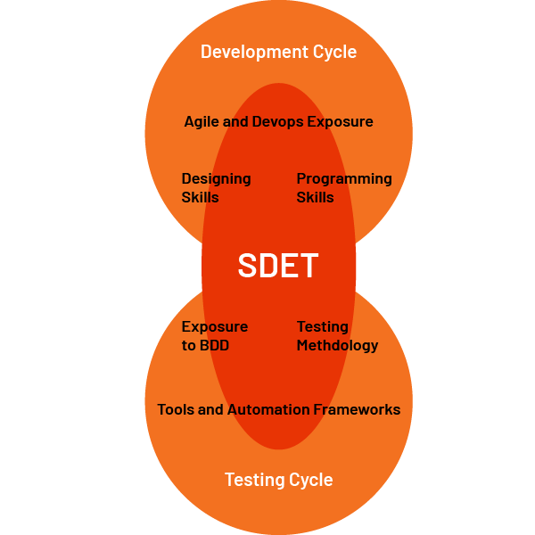

**SDET**  stands for Software Development Engineer in Test, QA Engineer or Testers on the other hand can be a manual tester or Automation Engineer who does not participate in software development. SDET is often involved in developing testing-friendly, code that is useful in the scripting of test cases or designing the automation framework which can be used as a testing tool. SDET also reviews the design and processes of the software product.

> Presently several organizations are demanding such SDET professionals who can participate in the development of the software and also in the testing of the software developed.

  

## What is the Difference Between SDET and Automation Engineer?

- Although the SDETs and QA Automation Engineers, required the same expertise in terms of languages and tools like Selenium, Java, and Cucumber, but still there are certain differences between the two roles.

- An SDET, is a developer-cum-tester who works with the development team as part of the test team. SDETs are responsible not only for testing the application but are required to participate in the code as well. SDETs are responsible to write the test cases as well fix the written code. In Agile lifecycle model. SDETs are professionals who should have very strong technical, analytical, and problem–solving skills. On the other hand, Automation Engineers should have knowledge of any automation Testing Framework with moderate programming experience as they usually are not exposed to the code.

- SDET is a highly skilled resource from the development as well as testing point of view on the other hand Automation Engineers is involved in preparing, scripting, and executing the test cases by automation.

- Automation Engineers are skilled resources with programming skills and they are much focused on the black box or functional testing whereas SDETs are responsible to perform both black-box and white-box testing as well.

> Tester or Quality Analyst who have good programming experience and developed the test automation framework can be promoted to a new role as SDET and can participate in the review of design of software application or other test automation framework.

- Automation Engineers or Quality Analyst are expected for more duties over a general testing role like performance testing, security testing, automated generation of test data, test environment setup, developing test automation tool, etc. whereas SDET is expected to have domain knowledge so that they can participate in designing the test cases. 

## SDETs: The need

Software Testing is an important phase in the development cycle and it takes lots of time and effort. So there are lots of other factors that are helpful to reduce the efforts and timeline as well and this can be achieved by doing the Code Coverage, Unit Testing, and acceptance testing before delivering software to the QA stage. That's why hiring SDET helps them as they can work for all those factors with the development team or designing the testing framework.

**Benefits of SDET Professional**:

-  SDETs play a vital role to minimize the testing cycles by Code Coverage and Unit Tests
-  SDETs can work as a standalone team, can build, deploy, run & manage the application individually
-  Programming skills enable them for code coverage through unit testing
-  SDETs can automate the acceptance test by leveraging their programming skills
-  SDETs involved in the complete software development cycle so it overall helps them to find out more use-cases and end-user scenarios

**Skill Set**:
-  Sound knowledge in Java C#,.NET or other programming languages.
-  Experience in working with Agile and DevOps process management methodology.
-  SDET should have knowledge about various testing techniques, test methods & corresponding tools like JUnit, TestNG, Selenium WebDriver, etc.
-  Should have exposure to both TDD and BDD
-  SDET should have knowledge of Test Planning, writing, and execution of the tests
-  Able to find bottlenecks and thresholds in existing code with the help of automation tools.

## Responsibilities of an SDET

-   Set-up a robust and scalable Automation Framework for functional, regression, and performance testing 
-   Maintain and operate test automation solutions.  
-   Building robust, and high–quality test automation solutions 
-   Writing unit test coverage of the code
-   Building, customizing, deploying, and managing the test environments
-   Checking for product scalability, reliability, consistency, and performance
-   Participating in design and architectural discussions
-   Performing high-level debugging
-   Prepare & manage test reports and communicate with the team.
-   Able to build different test scenarios and acceptance tests.

**Conclusion:** SDET is a tester or automation engineer with development experience who has exposure to testing techniques, automation frameworks, and software development & design techniques. SDET builds test automation tools and works with the development team and covers the code by unit tests and ultimately it results in a quality software delivery