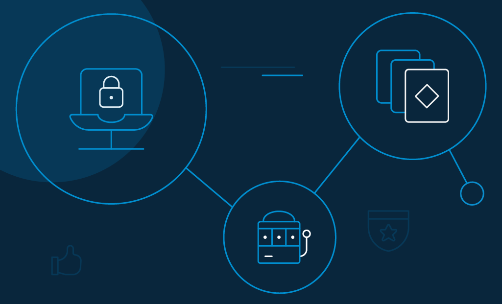

The online gambling industry is one of the potential sectors that may make it through the pandemic with the least possible damage. In fact, according to a study by the GrandViewResearch, online gambling is about to witness massive growth, and in the US alone, it will reach a value of [$102.9 billion by 2025](https://www.grandviewresearch.com/industry-analysis/online-gambling-market?utm_source=prnewswire.com&utm_medium=referral&utm_campaign=PRN_Aug27_onlinegambling_ICT_RD1&utm_content=Content).

_No wonder the online gambling ecosystem is at its finest phase!_ 

With the COVID-19 situation confining people to their homes, there's a lot more population playing on the internet. They have even outperformed their physical counterparts by massive numbers.

In an environment where gambling occurs online, thousands of billions of casino money are transacted via credit and debit cards, wire transfers, and e-wallets. It is no surprise that gambling companies are one of the most favorable targets for scammers and hackers.

[Cybercriminals target their resources](https://www.loginradius.com/blog/2019/10/cybersecurity-attacks-business/) in two major ways: one they steal the _obvious -_ money and the other they look for confidential data shared by gamblers online.

Needless-to-say, the online gambling industry, therefore, needs to take the necessary steps to build safe and secure platforms for casino operators and consumers at large.

## Online Casino, a Multi-Billion Dollar Industry- What's About to Change

The online gambling industry has undergone various changes over the past decades and is simultaneously expected to exhibit numerous transformations in the years to come. 

For example, the online gambling market is expected to grow at a compound annual growth rate (CAGR) of 11.5% from 2020 to 2027. That's huge!

Source: www.grandviewresearch.com

This also means almost every player in the industry will compete to sustain in the competition, software developers will create more innovative games, and casinos will incorporate new [ideas to improve customer experience](https://www.loginradius.com/blog/2020/01/improving-customer-experience-in-the-gaming-industry/#:~:text=Online%20Gaming%20Industry%20Growth,around%2080%25%20of%20this%20revenue.). So, what are these new ideas? 

Here are five key trends that could change the entire casino and gambling landscape.

### 1\. Rise of Cryptocurrency Transactions in Casinos

Cryptocurrencies are no longer the future. The majority of online gambling and casino operators have already switched to Bitcoin and other cryptocurrencies as their standard mode of payment. Clearly, they see many advantages. Some of which include:

- All operations are automatically recorded within the game, which is why nothing goes unnoticed. All settlement between players and casinos are entirely transparent. 
- Gamblers need not enter their data during deposits. Also, it is virtually impossible to hack blockchain systems.
- Cryptocurrency payment transaction fees are either zero or considerably smaller than in paper currency transactions.
- Replenishment of deposits and withdrawals would require comparatively lesser time than the traditional payment method.
- Players can execute all transactions anonymously by replenishing casino accounts using cryptocurrencies.

### 2\. Adoption of AR and VR in Casinos

[Virtual reality (VR) is another dimension](https://www.cnbc.com/2016/10/10/virtual-reality-gambling-expected-to-grow-800-percent-by-2021-driven-by-high-rollers.html) that has been working its way into the gaming industry - with many casinos already integrating it into their environment.

What this technology does is it designs an entirely new environment, a whole new reality. An example of this is poker, where multiple players share one environment, adding to the experience.

Similar to virtual reality, there is another technology called augmented reality (AR). Unlike VR, however, AR supplements the current environment with computer overlays. Heard of Pokémon Go? It uses AR, and now it is gearing up to enter the gambling industry.

Considering that this technology improves an already established environment, live gaming is expected to become even more captivating.

### 3\. Customer's Evolving Gambling Habits

It is no brainer that the customer's habit evolves with time. Social gambling and the rising popularity of gambling applications are some of the biggest indicators in this regard. Players can now easily compete on leaderboards and participate in social slots, whenever they want to.

[Mobile technology](https://www.casino.org/features/gambling-statistics/) has been a massive influence on people with a huge percentage of the world's population owning a smartphone. Casinos are more than ever investing in gaming applications and creating mobile-friendly games. It seems like mobile games will soon take over their desktop competition.

_Source: www.grandviewresearch.com_

### 4\. Stricter Casinos & Gambling Regulations

The world is getting pretty serious about gambling. Some countries have already legalized online gambling, while others are looking forward to making a move in 2020. 

For example, Belarus legalized online casinos in 2019, Ukraine introduced a bill to legalize gaming. Russia has simplified the identification procedure required in betting, and even the UK accepted the obligatory requirements related to customer identification. 

### 5\. Evolution of Live Casinos

Another milestone in online gambling is probably the rapid evolution of live casinos. Games are carried out by dealers with professional lighting and sound equipment from exclusive studios. 

Then, cameras are mounted at various room angles, so players can witness everything that's happening inside the studio. Going forward, the concept of a live casino will gain even more popularity.

## Why Is Online Gambling and Casino Security So Crucial

In 2020, reducing the effects of cyber attacks and online fraud is crucial to sustaining the online gambling industry. Hackers are becoming extremely advanced, using tools and implementing sophisticated techniques like signal manipulation through fake apps and app-based hacking to breach data and break down online security protocols.

Besides, Statista.com estimates that the global online gambling market will be valued at more than [$94 billion USD in 2024](https://www.statista.com/statistics/270728/market-volume-of-online-gaming-worldwide/) - meaning more the figure, more the risk of cybercrime.

Source: statista

More than ever now is the time when cyber protection will play a critical role in the continued development and success of this revolutionary online gambling industry.

## Recent Cyber Attacks in Online Gambling Sites

The primary [threat to cybersecurity](https://www.loginradius.com/blog/2020/05/cyber-threats-business-risk-covid-19/) that online casinos face is hacking. It may include targeted attacks forcing servers to get swamped with bot traffic, or it may consist of more sophisticated tactics designed to gain access to confidential customer data. 

Here are a few instances of recent breaches that will help you understand its severity in today's online gambling threat landscape. 

- A group of professional Chinese hackers has officially confirmed that they have been [hacking into gambling companies](https://www.zdnet.com/article/chinese-hackers-have-breached-online-betting-and-gambling-sites/) and online betting websites in Southeast Asia since 2019. 
- According to what is believed to be one of the biggest breaches of government data, betting companies acquired [28 million children's database](https://www.dailymail.co.uk/news/article-7904287/Betting-firms-granted-access-database-28-MILLION-children.html) in England, Wales, and Northern Ireland. The news surfaces in January 2020. 
- SBTech, a popular supplier of sports betting and iGaming platform solutions, suffered a [ransomware attack in March 2020](https://egr.global/intel/news/sbtech-partners-experience-72-hour-downtime-after-cybersecurity-attack/). Following which, it shut down its global datacentres. For more than 72 hours, clients were left without a consumer-facing website. Luckily, no data breach was recorded. 

## Types of Attacks on Online Casino, Betting and Gambling Sites 

Online gambling and casino sites face security threats from several sources. For starters, some external hackers launch attacks to commit fraud from the comfort of their home or anywhere (for that matter). Next, some insiders hold administrative positions inside the business itself and [steal customer details](https://www.loginradius.com/blog/2019/09/prevent-credential-stuffing-attacks/). 

Anyway, let's understand some of the major types of cyberattacks impacting the gambling industry. 

### Expediting 

Expediting gameplay abuse is not new to the casino and online gambling industry. It is an automated threat that utilizes bots to speed up time-consuming actions, mostly to offer unfair advantages to players by violating rules in the gameplay. 

Expediting attacks decline user appeal, result in loss of subscription revenue, and may even risk your reputation as an online game service provider.

### DDoS Attack

In Distributed Denial of Service (DDoS) attacks, hackers flood gambling sites with an unexpected surge of traffic, leading to insignificant delays in loading times or completely crashing your website. 

Most naturally, players lose interest in the gambling company and jump off to their competitors.

### Scraping 

Scraping is another automated attack where hackers use bots to steal data from APIs, websites, and databases and consequently use those to exploit gambling operations. 

Scrapers often lead to increased risk of latency on gambling sites using excessive bandwidth with their requests, making legitimate customers suffer from long load times.

### Account Takeover Attacks

[Account takeover attack](https://www.loginradius.com/blog/2020/04/corporate-account-takeover-attacks/) is a complex challenge for the online gambling industry. Hackers gain illegal access to a genuine user profile to perform payment or identity fraud. 

In the gambling space, they steal players' resources and sell them on the dark market. They lure victims into accepting malicious friend requesting or by clicking on infected links. 

### SQL Injection 

A Structured Query Language (SQL) injection attack happens when a hacker feeds infected SQL statements to take over the database server and add, modify, or delete data according to their will. 

By breaking into application security measures, hackers can easily pass through validation and approval checkpoints. This method of attack is mostly used by attackers to gain access over personal data, intellectual properties of gamblers, customer information, gaming secrets, and more.

## How LoginRadius Can Enhance the Experience of Online Gaming With Advance Security

LoginRadius is a powerful [customer identity and access management (CIAM)](https://www.loginradius.com/blog/2019/06/customer-identity-and-access-management/) platform that protects online gamblers' identity and prevents even the most sophisticated bots from infecting the gaming provider. It detects and blocks automated threats, including expediting, scraping, account takeover, DDoS, and more.

Here's how the LoginRadius platform protects the gaming industry from malicious bot attacks and significantly improving customer experience.

- **Multi-Factor Authentication**: The platform adds additional layers of protection by enabling two-factor or [multifactor authentication](https://www.loginradius.com/blog/2019/06/what-is-multi-factor-authentication/) on both player and admin accounts. It also offers real-time fraud analysis and data management features. 

- **Passwordless Login**: Eliminating the [use of passwords](https://www.loginradius.com/blog/2019/10/passwordless-authentication-the-future-of-identity-and-security/) altogether can surprisingly improve gamblers' retention and loyalty because there will be no passwords to hack in the first place. Also, there is a one-touch login feature where customers login with a magic link or OTP.
- **Security Compliance**: LoginRadius is [compliant with international regulatory standards](https://www.loginradius.com/compliances/) like COPPA, CCPA, and GDPR. The platform does not allow minor users to register.
- **360-Degree View**: Gambling service providers can enjoy a comprehensive view of their customer demographics and detect abnormal user activity. The objective is to help them understand the players' behavior and offer [them better experiences](https://www.loginradius.com/customer-experience-solutions/). 
- **Consent Management**: It is another popular addition to the LoginRadius identity platform. The feature manages the consent of gamblers about data collection, storage, and communication. If need be, they can also [change existing permissions](https://www.loginradius.com/blog/2020/05/consent-management/).  

## Conclusion

Adhering to the COVID situation and keeping social distancing in mind, more and more people are turning to the multi-billion dollar gambling industry to find solace. Protecting online casinos, betting, and gambling site from malicious bots is a big deal. 

With the ongoing pandemic situation, gambling providers should primarily focus on ensuring that gambling is fair, crime-free, and protects minors. A [CIAM platform](https://www.loginradius.com/blog/2019/06/perfect-ciam-platform/) can help you tap all these touchpoints.

