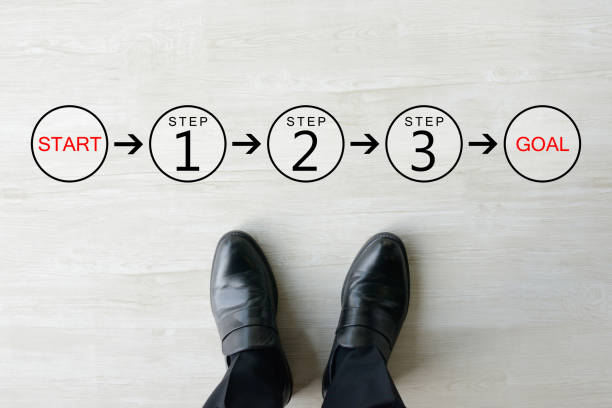

---
type: fuel
title: "The ABCs of a Successful Saas Onboarding Process"
date: "2021-08-27"
coverImage: "user-onboarding.jpg"
category: ["loginradius"]
featured: false 
author: "Navanita Devi"
description: "The onboarding process is the lifeline for your customer, and it's one of the most valuable tools that you as a company can control. Here are a few tips for a stellar SaaS company onboarding process that will greatly improve your customer retention and overall satisfaction."
metadescription: "This article  will help you structure and improve your onboarding process and make the experience of new customers as productive and enjoyable as possible."
metatitle: "Learn and Explore Steps and Checklist of Successful Saas Onboarding Process"
---

User onboarding refers to the complete process that users go through when they first become a customer of your product or service. The onboarding process can shape your customer's long-term connection with your product.

  

Learning and implementing SaaS software into a proper user management system is not more difficult than learning a new language, going to the gym, or practicing morning meditation.

  

When a user signs up for a free SaaS trial, it is your job to ensure they must regularly utilize your program. Therefore as a SaaS provider, you must assist new users as much as possible over the first few weeks.

  

Here are a few phases you should know about when it comes to [consumer onboarding](https://www.loginradius.com/blog/fuel/importance-customer-onboarding/).

### User Onboarding: Phase 1

The initial onboarding phase does not occur on your website or blog but typically occurs on social media, in a forum or remark, or on another person's blog. Your onboarding experience begins with a customer's first interaction with your brand.

### User Onboarding: Phase 2

The User Onboarding process continues on your website after that. You must now educate people about the problem you are addressing while also introducing your brand and product. People don't want to spend hours on your website, so employing tools that allow you to communicate your message as clearly and quickly as possible is the ideal approach to speed things up.

  

Also Read: [Top 27 User Onboarding Tools: Highly Recommended for Businesses](https://www.loginradius.com/blog/fuel/user-onboarding-tools/)

  

### User Onboarding: Phase 3

At this point, you must show your product in the best possible light and sell it to your potential consumers in the most efficient manner possible because a poor conversion rate implies you will not be able to cover acquisition expenses, which would almost certainly ruin your business.

### User Onboarding: Phase 4

User engagement and feature uptake are closely linked to a well-structured user onboarding process. You control what happens and lead users through a specified set of tasks via onboarding tours and walkthroughs. To increase user engagement, you must strike a balance between directing and letting them explore your product.

### User Onboarding: Phase 5

At this point, your customer should be familiar with all of your solution's procedures and advantages, and they should have been using it regularly.

### User Onboarding: Phase 6

One should consider a comprehensive customer success strategy for featuring requests and collecting customer feedback, which will help in increasing engagements resulting in direct revenue from the referrals. If something goes wrong, customer service should take over, and you'll certainly need the best tools to be able to act quickly and address the situation.

  

So, after getting acquainted with all the phases mentioned above, it might now have become clear how the entire process of onboarding customers for your SaaS Business is.

  

The onboarding process should be done properly, it can take your business to new heights, and if not, it might result in its destruction. So, always choose the process carefully.

  

Now, below we will discuss some elements that you need to keep in mind while onboarding consumers for your SaaS business.

## 4 Important SaaS Onboarding Elements

### 1. Signup process

You start setting expectations and gathering important information about user objectives and priorities during signup. [LoginRadius](https://accounts.loginradius.com/auth.aspx?action=register), for example, uses the signup process to obtain the information necessary to set up the product. Instead of forcing users to start from scratch and construct their teams and projects, they provide a list of options at signup. When a user completes registration, that information is auto-filled.

### 2. Welcome email

The welcome email is crucial since it is your customer's initial point of contact once they've registered an account. It's also the first genuine email you've sent them, so you'll want to establish communication expectations.

### 3. First login

A user's initial impression of an app is formed at the first login. Examine your first login experience if you want to decrease churn. It will either start the process or stop it in its tracks. Keep in mind that there should be no issues with [login authentication](https://www.loginradius.com/authenticate/).

### 4. Product tutorials

It's nice to get a welcome message on the initial login, but you're here to help users in the long term. Product tours and tooltips provide on-demand training on how to use your app in your community.

There are several methods to deliver product lessons for a better user experience, just as with any other onboarding component.

  

These are some of them:

  

-   To keep users on track, the UI includes a “getting started” checklist.
    
-   An in-app learning center or a tour of a popular product
    
-   Along with numerous functionalities, there are tutorial buttons.
    

  

When it comes to [SaaS onboarding](https://www.loginradius.com/blog/fuel/why-is-consumer-onboarding-critical-for-startups/), ask as many questions as you can and get as many answers as possible. Consult the statistics as well as user input. Communication across departments is crucial.

  

Start working on fixing your weak points once you've recognized them. Begin by making one adjustment at a time and seeing how it affects your cohort analysis. Your onboarding strategy won't be built in a day, and it won't be modified in a day, either.
